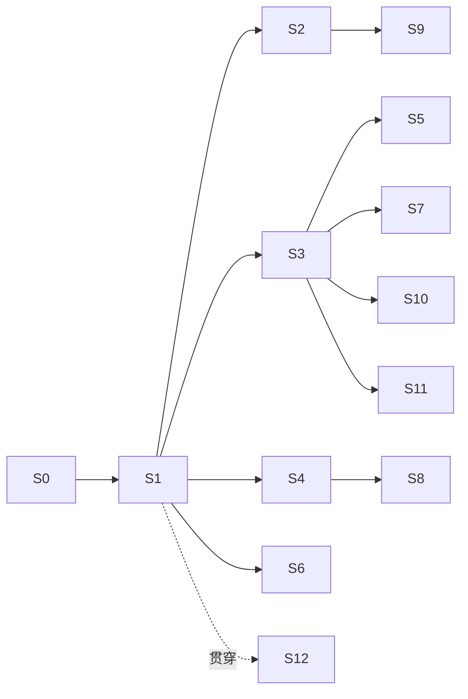

# CodeFlow 3.0 实施计划

> 状态：Active（提议，待接受）  
> 创建：2026-09-03  
> 依据：同目录下的 [2026-09-03-project-issues-deep-dive.md](2026-09-03-project-issues-deep-dive.md)（I-xx）、[codeflow-3.0-redesign.md](codeflow-3.0-redesign.md)（§x）  
> 关系：本计划接管 [2026-08-18-backend-product-hardening-plan.md](../../plans/2026-08-18-backend-product-hardening-plan.md) 中未完成的 B6–B11，将其重排进新阶段；[2026-07-11-codeflow-2.0-implementation-and-hardening-plan.md](../../plans/2026-07-11-codeflow-2.0-implementation-and-hardening-plan.md) 的 M2–M7 按本计划重新解释  
> 验收原则：**每个阶段的验收单位是"用户能完成一条旅程"**，不是"模块落地"（I-43）
> 修订：2026-09-06，v3.0-dispatch-3。本文是待实施的计划，任务均未因“计划写完”而完成。
> 调度入口：先读 §26 的复审裁定，再读 §27 的契约和 §28 的逐卡派发步骤；§29 是逐步依赖、文件锁与回收检查；§30 提供可直接填写的派发模板。§1–§12 保留阶段背景，§15 的 T 编号保持稳定。
> 基线：原始三文档备份不变；本次修订前的详细计划另存于 `docs/archive/codeflow-3.0-plan-before-dispatch-review-2026-09-06/`。本文路径均相对仓库根；标“新增”的文件尚未实现。

---

## 1. 总览

| 阶段 | 名称 | 用户能做到什么 | 依赖 |
|---|---|---|---|
| S0 | 解除阻塞 | 开发者能跑全部后端测试 | — |
| S1 | 第一条真实 Run | 在一个项目里让 Claude Code 完成一个小任务，看到过程，合入结果 | S0 |
| S2 | 双锁守卫 + 密钥库 | AI 写的东西经守卫、密钥不泄露 | S1 |
| S3 | 任务流 + 契约 + 审批 | 用任务流模板派活、审批、合入；一个项目多条并行 | S1 |
| S4 | 第二、第三执行后端 | 同一任务可选 Codex / Gemini CLI；Agent 资产绑后端 | S1 |
| S5 | 运行详情 + 首页待办 + 通知 | 看得见 AI 在干什么；批量审批 | S1, S3 |
| S6 | 记忆闭环 + MCP 服务器 | AI 主动查项目记忆；用户能管记忆 | S1 |
| S7 | 书签与分支 | 从任一书签开新路，并排比较 | S3 |
| S8 | Agent 分配与辩论 | 主脑+专家；三维推荐；服务端辩论 | S4 |
| S9 | 守卫深层 | 结构指纹、API 注册表、模型词典、项目检查 | S2 |
| S10 | 项目流 + 文档画布 | 七步长流程可用；Mermaid/Markdown | S3, S7 |
| S11 | 外部连接 | GitHub issue → 任务，提交 → PR，CI 回流 | S3 |
| S12 | 收口 | 单库、协议统一、前端服务层收口、文档同步 | 贯穿 |

依赖图：



阶段图只表示产品关系。实际派发按 §29 的逐卡依赖表；共享文件和未完成的契约会阻止并行。S1 的真实 CLI 验收先限定在合成、无凭据的临时项目；真实项目执行必须满足 S2 的执行隔离及凭据边界。

---

## 2. 冻结与删除清单（S0 期间执行）

| 对象 | 动作 | 说明 |
|---|---|---|
| `internal/blackboard`、`/api/v1/blackboard` | 冻结（路由保留，标 deprecated，不再改） | I-26 |
| `internal/isolation` 的 RBAC / 角色路由 | 冻结 | I-23；沙箱职责移交策略层 + 影子副本 |
| `/api/v1/votes`、`/api/v1/integrations` | 冻结 | 无界面 |
| `internal/mapagent` | 评估后删除或并入 memory | 需先确认无引用 |
| `internal/snapshot` 破坏性 git 恢复 | 删除 | §7 |
| `packages/core|cli|gui|ui-components|shared` | 标 legacy；从 Nx 默认目标移除 | I-41 |
| `apps/workbench/services/`（旧服务层） | 逐步迁入 `services-bridge`，S12 删除 | I-30 |
| 路线图中 M7 手机端、M6 插件市场 | 后置，移出主计划 | I-42 |

冻结 = 不再投入、不再写入对等矩阵、路由标 deprecated；删除必须先 ADR。

---

## 3. 各阶段详细

### S0 解除阻塞（1 周）

**用户结果**：无（开发者结果）。

**做什么**
- ADR 0009：SQLite 驱动决策。建议迁 `modernc.org/sqlite`（纯 Go），消除 CGO 环境依赖（I-29）。若保留 go-sqlite3，则本机安装 MSYS2 并在 CI 固定镜像。
- 跑通全部后端测试（含 SQLite 相关），把失败清零。
- 执行 §2 冻结清单第一批（标 deprecated，不删代码）。
- 更正 `DIRECTORY_STRUCTURE.md` 依赖图。

**验收**：`go test ./...` 本机与 CI 全绿；对等矩阵新增"冻结"图例。

---

### S1 第一条真实 Run（3 周）

**用户结果**：在一个已绑定的项目里，输入"给 X 函数加单元测试"，选择 Claude Code，看到实时事件，结束后看到 diff，点"合入"，文件真的变了，审计里有记录。

**做什么**
- 新包 `internal/run`：Run 模型、状态机、事件存储（追加表 + 序号）、断线回放。
- 新包 `internal/execbackend`：抽象接口；第一个实现 `claudecode`（SDK 非交互 + stream-json + 钩子配置生成与校验）。
- 新包 `internal/runworkspace`：影子副本 = git worktree（无 git 则受控目录复制）；创建、diff、合入、丢弃。保留旧 `internal/shadow` 给 T9.02 迁移索引能力。
- 任务文件生成器：阶段/任务/契约/记忆摘要/规则 → `CLAUDE.md`。
- 统一执行事件 schema（JSON Schema 入库，I-24）：使用 §27 的 `run.* / tool.* / approval.* / merge.*` 类型；状态枚举与事件类型分开。
- WS：单连接、按 `run:{id}` 与 `project:{id}` 订阅；带序号回放。
- HTTP：新接口统一在 `/api/v1/projects/:pid/` 下；Run、审批、命令对账及 `events?after=` 的准确路径见 §20、§27。旧路由逐个兼容迁移。
- 前端：Agent 伴侣的"发送"改为创建 Run；最小运行视图（事件列表 + diff + 合入/丢弃）。
- 钩子：PreToolUse 先只做审计 + 越界路径拒绝；PostToolUse 审计。

**范围**：S1 先提供现有规则守卫、身份和受控临时项目执行；S2 完成凭据隔离，S9 扩展语义规则。不可因为某能力属后续阶段而在真实项目上跳过对应边界。

**验收（E2E）**：fake backend 与真实 Claude Code 各一条；断开 WS 再连能回放；合入后 git diff 与运行详情一致；审计链验证通过。

---

### S2 双锁守卫 + 密钥库（3 周，与 S3/S4 并行）

**用户结果**：AI 试图创建 `utils_v2.go` 被拦并自动改正；`.env` 里的密钥在模型看到的任何内容里都是 `«SECRET:...»`，但测试照样跑通。

**做什么**
- 守卫接入钩子锁：PreToolUse 写文件/打补丁 → `guard.Evaluate`，拒绝时返回结构化原因。
- 守卫接入合入锁：`merge` 前逐文件 Evaluate；任一 error 阻止合入并展示。
- Vault：`internal/vault`：登记（手动 / 文件规则 / 高熵发现待确认）、替换器（出站）、还原器（入站）、进程注入、日志遮盖。
- 出站接入点：任务文件、MCP、工具结果及模型可见文件系统视图。显示层 delta 遮盖无法替代外部 CLI 的模型出站控制，能力不足时只开放无凭据环境。
- 入站接入点：受信任进程运行器的凭据引用解析。模型输出中的任意占位符不可直接触发秘密还原或 shell 拼接。
- 主密钥：Tauri 壳生成并存钥匙串；后端从壳握手获得；首启向导页面。
- 隐私服务拆分：PII 脱敏保留；密钥相关逻辑移交 Vault。

**验收**：绕过测试（shell 写文件被合入锁拦）；密钥值在 Run 事件、审计、任务文件、日志全文扫描为零；子进程环境变量拿到真值。

---

### S3 任务流 + 契约 + 审批（3 周）

**用户结果**：从"新功能"模板开一条任务流；拆解阶段产出 3 个任务；每个任务派给 Agent 后台跑；等待审批的操作在首页出现；审阅阶段看到变更集；合入。同一项目再开第二条任务流并行。

**做什么**
- floweng：Flow 加 `kind`、`worktree`；模板增加五个任务流模板；一个项目多 Flow。
- 阶段契约：`Contract` 声明 + `advance` 返回 `advanced|blocked|waiting_gate` + `missing/stale/next`（接管 B6）。
- 风险分级策略：`internal/policy` 加风险表与持续授权；PreToolUse 按风险决定放行/审批。
- Task：模型、队列（按项目并发上限）、派发为 Run、状态回写。
- 前端：流程页（阶段 + 任务列表 + 派活）；审批弹层；多流程切换。

**验收**：空流程不能合入；两条流程并行各自影子副本；持续授权后同类操作不再弹窗；审批记录进审计。

---

### S4 第二、第三执行后端（2 周）

**用户结果**：同一任务可选 Codex 或 Gemini CLI 执行；Agent 资产里能指定后端。

**做什么**
- `execbackend/codex`：app-server JSON-RPC 子进程；审批请求映射到 Run approval；事件映射。
- `execbackend/gemini`：非交互 + 钩子 + JSON 输出。
- `execbackend/custom`：约定协议。
- Agent 资产加 `backend`、`model_policy`、`purpose`、`fit`；运行时按资产版本解析（I-20）。
- 设置页：执行后端检测（已安装/版本/登录状态）。

**验收**：三后端各跑通 S1 的 E2E；缺失后端时给出可执行的安装指引。

---

### S5 运行详情 + 首页待办 + 通知（2 周）

**用户结果**：打开任一 Run 看到时间线（读了什么、调了什么、改了什么、花了多少）；首页有"等你审批 3 / 失败 1 / 完成 5"；可批量审批；可整体撤销一次 Run 的合入。

**做什么**
- 运行详情页：事件时间线、文件变更 diff、工具调用折叠、审批记录、费用；"撤销合入"= 反向应用 diff 生成新 Run。
- 首页：待办卡（审批/失败/完成）、运行中、最近项目、用量。
- 通知中心：后端事件 → 通知表 → 前端角标；桌面通知（Tauri）。
- 批量审批接口。

**验收**：撤销后工作副本恢复且审计有记录；批量审批 10 条一次通过。

---

### S6 记忆闭环 + MCP 服务器（3 周）

**用户结果**：AI 执行时会主动查"这个项目以前怎么处理过 X"；Run 结束后自动沉淀记忆并让我确认；我能在记忆页看、删、改。

**做什么**
- 记忆模型加来源 Run、置信度、类型、待确认状态。
- 记忆抽取 Agent（API 直连、便宜模型）在 Run 结束后运行；低置信度进待确认。
- MCP 服务器：`search_memory / query_graph / get_artifact / get_guard_rules / check_write`；各执行后端启动时挂载。
- 记忆预检接入"用户提交前"钩子（I-16）。
- 记忆浏览器页。

**验收**：fake backend 通过 MCP 查到记忆；抽取的记忆可被用户拒绝且不再出现；跨 Run 记忆生效的 E2E。

---

### S7 书签与分支（2 周）

**用户结果**：每个阶段完成自动打书签；从任一书签"开新路"得到一条新流程（独立 worktree）；两条路并排比较成果与 diff。

**做什么**
- `internal/bookmark`：书签模型（git ref + 对话位置 + 成果版本集）。
- 从书签创建 Flow（worktree）。
- 比较视图。
- snapshot 模块：删除破坏性恢复；conversation/vector/graph 恢复代码改为按书签时间过滤。
- ADR 0010：快照 → 书签。

**验收**：开新路不影响旧路；记忆检索按书签过滤正确。

---

### S8 Agent 分配与辩论（3 周）

**用户结果**：派任务时系统推荐 Agent 并说明理由；主脑自动拆分并召唤专家；审查关卡失败自动开一场三方辩论，结论回流成成果。

**做什么**
- 三维推荐（阶段 × 任务类型 × 项目上下文）；评分按 (project, task_type)。
- 主脑 + 专家编排：conductor Agent 通过 API 直连产出计划，编排器按计划创建子 Run。
- 辩论服务端执行（接管 B9）：每方 API 直连；仲裁/投票/终裁；结论 Artifact。
- 配置模型收口：删除三角色启动注册；三级继承退化为项目覆盖（I-18）。
- Agent 页：编辑、评分、后端与模型策略。

**验收**：fake 三方不同模型辩论 E2E；推荐依据可解释；批评者与生成者模型不同的约束被强制。

---

### S9 守卫深层（3 周）

**用户结果**：AI 把已有函数复制改名被拦；AI 新建了一个和现有接口重复的路由被拦；合入前自动跑 lint/typecheck/受影响测试。

**做什么**
- 结构指纹：函数级 AST 归一化哈希 + 编辑距离。
- API 注册表与模型词典：从旧 shadow 迁入，改为从代码索引自动构建，作为规则接入。
- 项目检查：读取项目 lint/typecheck/test 命令（可配置），合入前批量执行。
- 向量层：函数级嵌入，仅对可疑项。
- AI 复审：可选，用户开启。
- 守卫页：拦截记录、豁免申请/审批、规则开关。

**验收**：改名复制被拦；重复路由被拦；合入前检查失败阻止合入并给出定位。

---

### S10 项目流 + 文档画布（3 周）

**用户结果**：新项目走七步；想法/设计画布有 Markdown 预览与 Mermaid 渲染；编码阶段展开为多条任务流。

**做什么**
- 项目流模板（七步）与任务流嵌套。
- 想法/设计/审查画布：Markdown + Mermaid；成果版本与 stale 展示。
- 导入流：理解报告基于代码索引与记忆。

---

### S11 外部连接（2 周）

**用户结果**：从 GitHub issue 一键开任务流；合入后可建 PR；CI 状态回到审阅阶段。

**做什么**
- GitHub 适配器（issue 读取、PR 创建、检查状态读取）。
- 提交阶段：commit 分组建议 + 推送 + 建 PR。

---

### S12 收口（贯穿，最后 2 周集中）

- 单 SQLite（ADR 0011；逐域迁移，向量库独立）（I-25）。
- 协议统一：所有 WS/HTTP 事件走执行事件 schema；OpenAPI + JSON Schema 生成 TS 类型并 CI 校验（I-30）。
- 删除旧前端服务层；删除冻结清单中确认无引用的包。
- 文档：对等矩阵重排为"用户旅程"维度；相关设计文档标 Superseded。

---

## 4. 里程碑验收路径（全量 E2E）

1. 首启向导：生成主密钥、绑定目录、检测执行后端、填一个模型渠道。
2. 新建项目 → 开"Bug 修复"任务流 → 派给 Claude Code → 看事件 → 审批一次高风险操作 → 合入 → 审计验证。
3. 同项目并行开第二条任务流用 Codex → 两个影子副本互不影响 → 合入顺序处理。
4. 密钥扫描：所有 Run 事件、任务文件、日志无真值。
5. 守卫：改名复制给出证据，配置为阻塞的重复路由/堆叠命名被拦；修正后重检通过，向量/AI 复审结果及未覆盖范围明确。
6. 记忆：第二条流程通过 MCP 查到第一条沉淀的教训。
7. 书签：从阶段书签开新路，并排比较。
8. 辩论：审查关卡失败 → 三方辩论 → 结论成果。
9. 撤销：通过反向 Run 撤销一次合入，无冲突时恢复该次变更；后续用户编辑冲突时保留当前文件。
10. 重启：以上所有状态重启后仍在。

---

## 5. 风险与对策

| 风险 | 对策 |
|---|---|
| 外部 CLI 协议变动 | 锁版本；适配层隔离；每个后端有 fake 实现供测试 |
| Windows 下 Codex 沙箱弱 | 影子副本 + 合入锁兜底；高风险命令默认审批 |
| 钩子被模型/用户改掉 | 每次启动重新生成并校验哈希；合入锁兜底 |
| 单库迁移中断 | 每域冻结写入、复制校验、切换单一写入者；跨库不承诺原子双写 |
| 密钥替换漏通道 | 所有进模型的内容只允许经过一个入口函数；CI 全文扫描测试 |
| 范围再次膨胀 | 每阶段验收只认用户旅程；新需求进 backlog 不插队 |

---

## 6. 与旧计划的对照

| 旧 | 新 |
|---|---|
| B6 阶段契约 | S3 |
| B7 快照持久化 | S7（改为书签） |
| B8 真实 Agent Runtime | S1 + S4（改为外部执行后端） |
| B9 服务端辩论 | S8 |
| B10 插件生命周期 | 后置 |
| B11 全量验收 | §4 |
| M3 编码画布/守卫 | S2 + S9 |
| M4 辩论/广场 | S8 |
| M5 DeepSearch/配置中心 | S6（记忆/MCP）+ S4（后端设置） |
| M6 插件/Live Preview | 后置 |
| M7 多端 | 后置 |

---

## 7. 进度记录

| 日期 | 阶段 | 状态 | 证据 |
|---|---|---|---|
| 2026-09-03 | 问题详解 / 新设计 / 本计划 | ✅ 文档完成 | 本文与两份 design 文档 |
| 2026-09-06 | I-44–I-70 功能细化与契约整合 | ✅ 文档完成 | 三份文档已集中到 `docs/design/codeflow-3.0/`；原版备份已校验 |
| — | S0 | ⏳ | |

---

## 8. 跨阶段交付拆解（对应 I-55 至 I-70）

本节把用户旅程拆成可以独立评审的交付包。每个交付包都必须有数据库迁移、HTTP/WS 契约、后端单测、前端错误态和至少一条故障路径；只完成类型或路由不算完成。

| 交付包 | 归属阶段 | 主要产物 | 完成证据 |
|---|---|---|---|
| 领域实体与身份链 | S1 | Project/Binding/Flow/Stage/Task/Run/Attempt/Approval/Event/Artifact/Bookmark schema；ExecutionIdentity | 任一工具调用可由 audit 反查到 Run 和资产版本 |
| Run 状态机与恢复 | S1 | 状态迁移表、retry/cancel/expired、启动恢复器 | kill -9、重启、重复 cancel 后状态可解释且无永久 running |
| 事件 outbox 与游标 | S1/S12 | event 表、outbox、sequence、replay API、WS gap | 断线 10 秒后按 after 游标完整恢复，广播失败可重试 |
| API 幂等与并发 | S1/S3 | Idempotency-Key、expected_revision、统一错误 envelope | 双击/超时重试只产生一个副作用，冲突返回 409 |
| 队列预算与进程边界 | S1/S3 | scheduler、项目并发、预算、process group/job object、环形日志 | 超时和慢消费者不会拖垮其他项目，孤儿进程被清理 |
| 双锁 Guard 与 Approval | S2/S3 | PreToolUse、merge lock、风险分级、持续授权、审批记录 | shell 绕过仍在合入锁被拦，审批指纹变更后不能复用 |
| Vault gateway | S2 | 出站替换、入站还原、日志遮盖、进程注入、主密钥 | canary 真值在所有事件/审计/日志中为零，测试进程仍拿到环境变量 |
| 三方合入 | S1/S3 | base/current/result diff、临时索引、冲突 hunk、发布 journal | 预检失败不写目标，发布中断可恢复且不覆盖用户后续编辑 |
| 成果和书签血缘 | S7/S10 | immutable ArtifactVersion、Bookmark cursor、memory cutoff | 从书签分叉后旧流不变，成果可追溯到 Run/sequence |
| 前端在线语义 | S5/S12 | query freshness、命令确认态、event gap、离线只读 | 断网不误报成功，按预生成 command_id 对账 |
| 用量与保留 | S5/S12 | usage ledger、预算告警、保留策略、导出校验 | 可解释单次费用，清理不删除审计和成果必需证据 |

## 9. 统一契约实施清单

### 9.1 Schema 与迁移顺序

按以下顺序迁移，避免先改前端再猜后端语义：

1. 建立 `schema_versions`、`projects.revision`、`workspace_bindings` 和 `agent_assets` 的稳定 ID 与唯一约束。
2. S1 先建新运行域表和旧 Project/Flow 的只读引用快照；旧 Flow JSON 保持唯一写入源，禁止从两个库同时修改同一个 Flow。T12.01 再按域迁移规范表并切换写入者。
3. 建立 `events`、`outbox`、`approvals`、`artifact_versions`、`bookmarks`；状态变更和事件在同一事务提交。
4. 回填父级 ID、content hash、base commit、sequence；校验失败的记录进入迁移报告，不静默丢弃。
5. 只读接口切换到规范化表，稳定一轮后关闭 legacy JSON 写入；最后删除旧库或保留只读归档。

每个迁移脚本具备：版本号、前置检查、事务边界、重入安全、行数/哈希校验、失败恢复说明。单库迁移前保留原库只读备份；向量库可独立，但必须保存来源 Run 和 embedding model version。

### 9.2 状态和命令矩阵

| 命令 | 前置状态 | 成功状态 | 重复调用 | 不可重试错误 |
|---|---|---|---|---|
| create Run | Task ready、Binding active | queued | 返回原 Run | identity 缺失、策略拒绝 |
| start Attempt | Run queued/starting | running | 返回原 Attempt | backend 未安装、预算已耗尽 |
| approve | Approval pending | approved/rejected | 返回原 decision | fingerprint 不同、已过期 |
| cancel | queued/running/paused | cancelling/cancelled | 返回当前状态 | 已完成/已合入 |
| merge | Run completed、checks pass | MergeOperation.applied；Run 仍 completed | 返回原 operation | base 漂移、冲突、Guard error |
| retry | Run failed 且 retryable | 新 Run queued | 同 key 返回新 Run | policy denied、contract invalid |
| fork bookmark | Bookmark immutable | 新 Flow/Binding | 同 key 返回原 Flow | ref 不存在、项目 archived |

### 9.3 事件与 WS 测试要求

- 每个 scope 的 sequence 从 1 递增，事务回滚不消耗序号。
- 事件 payload 先经过 Vault gateway；测试用 canary 检查 JSON、日志、审计和导出包。
- outbox dispatcher 至少支持指数退避、最大尝试次数、dead-letter 状态和人工重放。
- WS 订阅必须校验 project/run 权限；非法 scope 不回显其他项目事件。
- 客户端收到 sequence gap 时先拉快照，快照 revision 与最后事件 sequence 一并确认后再继续订阅。

## 10. 各阶段 Definition of Done 补充

### S0

- [ ] ADR 0009 选定 SQLite 驱动并在 Windows/CI 运行含 SQLite 的完整测试。
- [ ] 冻结清单、目录结构和文档链接完成；不删除仍被引用的包。
- [ ] 建立迁移脚手架、备份/恢复演练和测试报告归档位置。

### S1

- [ ] Run/Attempt/ExecutionIdentity/Event/Outbox 表和状态机完成。
- [ ] Claude Code fake + 真后端各跑一条小任务；事件、工具、文件变更、审计可回放。
- [ ] cancel、timeout、backend exit、server restart、duplicate request 五条故障测试通过。
- [ ] shadow 合入具备 base commit、merge lock、三方 diff 和全有或全无结果。

### S2

- [ ] PreToolUse 和 merge 两道锁均调用同一 Guard Decision；shell/直接写盘绕过测试通过。
- [ ] Vault gateway 覆盖任务文件、MCP、delta、工具输出、日志、审计、子进程环境。
- [ ] 主密钥首次启动、恢复口令、钥匙串不可用时的错误态均有 E2E。

### S3

- [ ] Task 队列按项目和资源类别限流；项目并发、Run 预算、超时策略可配置且可审计。
- [ ] Gate 与 Approval 统一记录 fingerprint、scope、actor、policy version、expires_at。
- [ ] expected_revision 冲突、幂等 key 复用、两条 Flow 并行合入均有测试。

### S4

- [ ] Codex/Gemini/custom 适配器输出完全转换为统一事件；不允许后端私有事件直接进 UI。
- [ ] backend 检测显示安装、版本、登录和不可用原因；缺失后端不创建 queued Run。
- [ ] 三后端都覆盖审批、取消、超时、日志背压和孤儿回收。

### S5

- [ ] 运行详情由事件和查询聚合渲染，刷新不依赖前端内存。
- [ ] 首页待办、批量审批、通知和撤销合入均使用 command_id 对账，request_id 单独用于 HTTP trace。
- [ ] usage ledger 能解释 token、wall time、费用和预算告警来源。

### S6

- [ ] MCP 工具调用携带 ExecutionIdentity，按 project/binding/bookmark cutoff 隔离。
- [ ] 低置信度记忆进入待确认；拒绝后同一来源不会再次注入。
- [ ] 记忆、图谱和 artifact 查询均可回溯来源 Run/sequence。

### S7

- [ ] Bookmark 固定 git ref、workspace revision、event cursor、memory cutoff、artifact set。
- [ ] fork 生成独立 Flow/Binding/worktree；旧流和旧记忆只读不变。
- [ ] compare 视图能显示三方 diff 和成果版本差异，冲突路径可继续创建新 Attempt。

### S8

- [ ] 推荐结果按阶段、任务类型、项目上下文给出可解释依据和数据时间窗。
- [ ] conductor 只创建子任务/Run，不直接写工作区；批评者与生成者模型约束被强制。
- [ ] 辩论每轮服务端执行并写事件、Artifact 和审计，客户端不能伪造贡献。

### S9

- [ ] 结构指纹、API 注册表、模型词典和项目检查都输出统一 Decision。
- [ ] 向量/AI 复审只接收净化后的代码上下文并受预算限制。
- [ ] Guard 规则版本、豁免范围、过期时间和影响文件均显示在运行详情。

### S10

- [ ] 项目流与任务流共享实体和事件，不复制两套阶段状态机。
- [ ] Markdown/Mermaid 产物有版本、hash、stale 原因和审阅记录。
- [ ] 导入流生成的理解报告可以从代码索引和记忆来源逐项回溯。

### S11

- [ ] GitHub issue、PR、CI 状态均有 provider request ID、重试和限流记录。
- [ ] 外部评论进入 Artifact/Task 前经过 Vault、PII 和大小限制。
- [ ] 推送/建 PR 前必须通过本地合入锁和项目检查；CI 失败回到明确的审阅状态。

### S12

- [ ] 单库切换后跨域事务、outbox、备份、恢复、导出、保留策略通过演练。
- [ ] OpenAPI、JSON Schema、TypeScript 类型和事件文档由 CI 校验一致。
- [ ] 删除旧服务层和冻结模块前有引用扫描、迁移报告和回滚标签。
- [ ] 全量 E2E 在冷启动、重启、断网、并发、Windows 路径和无 Git 项目上通过。

## 11. 测试矩阵与证据格式

| 维度 | 最小覆盖 |
|---|---|
| 状态 | 每个状态迁移、终态拒绝、重复命令、revision 冲突 |
| 事件 | 顺序、回放、gap、重复、outbox 重试、保留下界 |
| 身份 | project/flow/task/run/attempt/agent 交叉错配均拒绝 |
| 安全 | 越界路径、shell 写盘、策略缺失、审批指纹篡改、secret canary |
| 进程 | 正常退出、非零退出、超时、取消、SIGKILL、孤儿、慢消费者 |
| 文件 | 新建/修改/删除/重命名/二进制/生成文件/用户并行修改 |
| 前端 | 首次加载、刷新、断网、恢复、event gap、未知命令结果 |
| 数据 | 迁移重入、部分失败恢复、备份恢复、导出导入、保留清理 |

每个测试记录 `request_id`、输入 fixture 版本、数据库 schema version、事件最后 sequence、审计链校验结果。E2E 失败时保留 shadow diff、事件 JSON、进程退出信息和脱敏日志；不得把真实密钥写入 fixture。

## 12. 发布闸门与回滚

发布前按顺序执行：迁移预演 → 每域冻结写入 → 复制校验 → 原子切换写入者 → 事件回放校验 → 用户旅程 E2E。旧二进制不一定支持新 schema；仅兼容矩阵允许时回退代码。新库已接受写入后，优先前向修复或反向迁移验证，不能直接恢复旧备份丢弃新数据。

每个 S 阶段的评审包必须包含：变更的契约文件、迁移说明、验收旅程录屏或日志、自动化测试结果、已知限制、后续 ADR。只有当用户结果、失败恢复和重启结果都可复现，阶段才从“实现中”改为“完成”。

---

## 13. 使用方式：把本计划交给编码子 Agent

T 卡是交付单元，§28 的 `Txx.xx.a/b/c` 才是编码子 Agent 的单次任务。每次只派一个步骤；主 Agent 校验该步骤及前置条件后，才能派下一步。共享文件由当前步骤独占，不能仅因为 T 卡不同就并行。

### 13.1 派发前固定上下文

派发者必须把以下上下文原样附在任务提示中：

```text
仓库：D:\Project\Codeflow
目标阶段：<S0-S12>
任务卡：<Txx.xx>
依赖任务：<已完成任务编号>
允许修改：<卡片列出的文件/目录>
禁止修改：与本任务无关的源码、用户已有未提交改动、docs/archive 下的原版备份
环境：派发时重新探测；已知基线 Windows、CGO_ENABLED=0；race 测试需要有 CGO/编译器的环境
完成标准：卡片中的实现步骤、测试命令、验收断言全部满足
输出：变更文件、测试命令及结果、未解决问题、后续建议
```

如果任务需要新增文件，Agent 必须先在任务结果中列出新增路径和它所属的包；如果发现卡片要求与现有代码冲突，停止扩大范围，只报告冲突和最小修正建议。

### 13.2 每张卡的固定执行顺序

1. 阅读卡片列出的现有文件和相邻测试，确认真实接口，不根据旧文档猜 API。
2. 运行任务前置测试，记录基线失败；基线失败不能被伪装成任务结果。
3. 使用已冻结契约；公共契约修改先交主 Agent 更新。对行为和数据风险写有明确输入输出的失败测试，再实现代码，禁止为凑数量写镜像测试。
4. 只修改允许路径；格式化新增代码；运行卡片规定的最小测试和 `go test -race`（适用时）。
5. 输出变更摘要、测试结果、剩余风险。未通过的测试必须给出完整失败原因和复现命令。

### 13.3 子 Agent 回收格式

```markdown
任务：Txx.xx
状态：完成 / 部分完成 / 阻塞
修改：
- <绝对路径>：<一句话>
测试：
- `<命令>`：通过 / 失败（<原因>）
契约影响：<HTTP、WS、DB、TS 类型或无>
未解决：<没有则写“无”>
下一步：<明确的任务编号，不要写泛化建议>
```

### 13.4 不允许的完成表述

- “类型已定义”不等于实体可用：必须有持久化、状态迁移和查询测试。
- “接口已注册”不等于旅程完成：必须有成功、失败、重试、重启和权限测试。
- “本地通过”不等于 Windows 可用：涉及进程、路径、SQLite、Tauri 的卡片必须说明环境限制。
- “事件已发送”不等于事件可靠：必须能用 `after` 游标回放并检测 gap。

## 14. I-01 至 I-70 逐条审查与执行映射

下表是每条问题的执行入口。审查结论描述当前代码事实，任务编号指向第 15 节的原子卡；同一问题可由多个卡片完成，但只能有一个卡片负责最终验收。

| 问题 | 当前缺口与代码证据 | 首个任务 | 最终验收断言 |
|---|---|---|---|
| I-01 | 后端没有统一聊天/执行入口；Agent 服务主要维护 trace/stop/retry | T1.01 | 创建 Run 后外部后端真实执行并产生完成事件 |
| I-02 | 适配器只有消息进出；hooks 没有工具循环调用者 | T1.06 | read/search/write/command/test 至少各有一类工具事件 |
| I-03 | workspace 仅支持文件和 dev-server，未提供受控通用命令 | T1.08 | 命令有 PTY、超时、退出码、审计和取消 |
| I-04 | Git manager 缺 worktree、基线 diff、冲突和提交分组 | T1.09 | 两个 Run 可独立 worktree，合入冲突不覆盖用户改动 |
| I-05 | 编辑器设计没有 LSP/诊断边界 | T5.06 | 文件审阅、diff、诊断显示不承担主力 IDE 写入 |
| I-06 | 内置模板偏项目级七步，无任务级短流 | T3.01 | bugfix/test/docs/refactor 模板可独立创建并结束 |
| I-07 | Flow 当前阶段 gate/成果契约不足 | T3.02 | 没有成果、测试或 guard 失败时不能 advance/merge |
| I-08 | snapshot 是恢复概念，缺书签分叉 | T7.01 | 从书签开新 Flow，历史对话/记忆保持追加不变 |
| I-09 | 项目与 Flow 关系没有并行任务流约束 | T3.03 | 同项目两个 active task flow 状态和 worktree 完全隔离 |
| I-10 | guard 主要是规则级检查，无结构/API/模型语义层 | T9.01/T9.02/T9.05/T9.04 | 结构/索引/向量/AI 证据统一呈现，T9.04 负责最终处置验收 |
| I-11 | 旧 shadow 索引能力未接主执行路径 | T9.02 | 复用索引能力；Run 工作副本另由 runworkspace 管理 |
| I-12 | shell 直写可能绕过 workspace guard | T2.01 | PreToolUse 和 merge lock 双锁均能拦截 shell 写入 |
| I-13 | 审批没有风险分级、批量和持续授权统一模型 | T3.04 | 低风险自动放行，高风险 fingerprint 变更必须重新审批 |
| I-14 | SAMG 已有 Source/Confidence；缺统一确认状态和 Run 来源链 | T6.01 | pending 不注入，拒绝候选不重复生成 |
| I-15 | 前端没有可管理记忆浏览器 | T6.05 | 用户能搜索、编辑、拒绝、删除、导出记忆 |
| I-16 | preflight 后端存在，前端提交前未接入 | T6.04 | 提交前显示相关记忆和风险，拒绝后不创建 Run |
| I-17 | Agent 推荐只按阶段和全局评分 | T8.01 | 推荐输入包含阶段、任务类型、语言/框架/规模和可解释依据 |
| I-18 | registry、runtime、角色配置覆盖关系未收口 | T4.04 | Run 锁定 Agent asset version 和最终 model policy |
| I-19 | debate 下一轮内容由客户端提交 | T8.03 | 服务端按参与方资产执行，客户端不能伪造 round output |
| I-20 | Agent 资产与运行时记录脱节 | T1.03/T4.04 | 任一审计事件可读取当时资产版本和解析配置 |
| I-21 | PII 脱敏和 secret 保护混为一体 | T2.04 | PII 有损脱敏与 secret 可逆占位符走不同 API |
| I-22 | 主密钥依赖环境变量 | T2.06 | 首启钥匙串、恢复口令、轮换和不可用错误态可演练 |
| I-23 | 单机单用户却暴露团队 RBAC 概念 | T0.04 | RBAC/隔离冻结，导出审计包成为当前团队协作边界 |
| I-24 | HTTP/WS/SSE/CLI 事件格式不统一 | T0.03/T1.05 | 所有事件符合同一 JSON Schema 和 envelope |
| I-25 | 多个 SQLite 文件跨域无事务 | T12.01 | 状态变更、事件、outbox 在单库同一事务提交 |
| I-26 | 大量模块无 UI 或调用者 | T0.05 | 冻结清单有 deprecated 标记、引用扫描和删除前 ADR |
| I-27 | 13 类 hooks 无执行触发点 | T1.07 | 每个保留 hook 有唯一触发点和失败策略 |
| I-28 | 单进程承担所有项目资源 | T3.05 | 项目并发、backend 并发和进程组资源隔离生效 |
| I-29 | go-sqlite3 在 CGO=0 不可执行；不代表所有非数据库测试无效 | T0.01 | SQLite 行为测试实际运行；race 单独在支持环境运行 |
| I-30 | 前端旧 services 与 bridge 并存、类型手写 | T12.03 | 只保留 bridge，OpenAPI/Schema 生成 TS 类型并校验 |
| I-31 | 执行状态部分留在前端 store | T1.02 | 刷新、关窗、重启后 Run 状态由后端恢复 |
| I-32 | 无队列、统一重试和离线行为 | T3.05/T5.04 | 网络、backend、策略错误按 retryable 分类处理 |
| I-33 | 无 GitHub/GitLab issue/PR/CI 回流 | T11.01 | issue→Task、merge→PR、CI→review 状态可追踪 |
| I-34 | MCP 只有规划，没有服务器/客户端连接 | T6.03 | 执行后端能调用 CodeFlow MCP 并携带 identity |
| I-35 | Task 没有领取、派发、完成闭环 | T3.03 | Task 状态由 Run 事件可靠回写，支持并行和失败重试 |
| I-36 | 无 Run 详情、工具轨迹和整体撤销 | T5.01/T5.03 | Run 页面可按 sequence 展示并生成反向 Run |
| I-37 | 上下文只能勾选文件 | T6.02 | 符号依赖、规则文件和发送前预览能解释输入集合 |
| I-38 | 全局搜索未接混合检索 | T5.07 | 代码、符号、对话、成果可搜索并返回来源 |
| I-39 | 文档画布缺 Markdown/Mermaid 预览 | T10.02 | 设计成果有双栏预览、Mermaid 错误定位和版本 hash |
| I-40 | 通知、快捷键、导出、多语言等碎片化 | T5.04/T12.04 | 只纳入与 Run 旅程直接相关的通知和导出，其余有 backlog 状态 |
| I-41 | `DIRECTORY_STRUCTURE.md` 依赖图过期 | T0.04 | 依赖图与 package.json、实际 import 一致 |
| I-42 | 手机端/插件市场抢占主路线 | T0.05 | 路线图标为后置，不进入 S0-S12 阻塞路径 |
| I-43 | 里程碑按模块，不按用户旅程 | T0.06 | 每个阶段有可复现用户旅程和失败路径 |
| I-44 | Go 发 CODEFLOW_HANDSHAKE，Rust 仍只识别 CODEFLOW_PORT | T0.07 | 壳正确解析并隐藏 token，终止后清除连接配置 |
| I-45 | 现有 token 生命周期为进程，客户端尚未消费它；短期刷新属后续增强 | T0.08 | 先完成凭据内存持有、重启失效和 WS 关闭 |
| I-46 | 后端已有 AccessTokenMatches 统一函数，前端请求未带凭据 | T0.08 | HTTP bearer 与浏览器 WS 子协议复用现有校验 |
| I-47 | 路由已有资源存在性检查和 exact allowlist；新 Run scope 尚未接入 | T1.12 | 保留旧授权回归，新订阅拒绝跨项目资源 |
| I-48 | Resolve 已解析 symlink、拒绝 irregular reparse；尚缺运行期身份稳定保证 | T1.10 | 保留已有防护，补 root 替换和竞态测试 |
| I-49 | policy compatibility mode 可能进入生产 | T0.09 | 生产执行入口无 evaluator 时必拒绝 |
| I-50 | Actor 固定写成 agent | T0.10 | user/agent/system/integration 在 policy/audit 中可区分 |
| I-51 | notifier 失败无 outbox 补偿 | T1.05 | 广播失败不丢事实，dispatcher 可重试/死信/重放 |
| I-52 | AgentAsset 已有可编辑 Version:string；缺不可变修订记录 | T1.03/T4.04 | 新 revision_id 与历史配置快照不被编辑污染 |
| I-53 | project create Saga 与资源状态可能不一致 | T0.11 | reconcile 后只返回 ready/degraded/failed，不留孤儿资源 |
| I-54 | /ready 已检查多个 HasService，未实际探测数据库或执行能力 | T0.12 | 保留组件状态，增量添加可执行性和故障探测 |
| I-55 | Flow 嵌套 JSON，缺一等 Run/Task/Approval 等实体 | T1.01/T12.01 | 领域实体可独立查询并以外键连接 |
| I-56 | Flow/Stage 状态缺 failed/cancelled/retry/expired | T1.04 | 状态图、终态不可逆、重试新 Attempt 全有测试 |
| I-57 | advance/update 无统一 revision/ETag | T1.02 | 并发写冲突返回 409，不发生 lost update |
| I-58 | workspace 只有 root，无 binding/base revision | T1.10 | Run 冻结 base commit/binding revision，合入前检查漂移 |
| I-59 | policy/trace/WS 缺 Run/Attempt/Task identity | T1.02 | 任一边界事件完整携带 ExecutionIdentity |
| I-60 | 写 API 幂等和错误 envelope 不统一 | T1.11 | 同 key 同 body 复用结果，不同 body 稳定拒绝 |
| I-61 | Hub 满队列静默丢消息、无 sequence | T1.05/T1.12 | after 游标回放无缺口；gap 被明确报告 |
| I-62 | 无队列、项目并发、token/时间/磁盘预算 | T3.05 | 超 soft/hard budget 产生告警并 pause/cancel |
| I-63 | devserver 已有 ring buffer 和 taskkill /t；缺持久 Run 归属及孤儿防误杀 | T1.08 | 复用思路，PID+启动身份匹配后才清理 |
| I-64 | PromoteAll 部分成功，无三方合入 | T1.09 | 合入全有或全无；冲突返回 hunk，不写目标树 |
| I-65 | Vault/PII/策略/日志没有强制单一入口 | T2.04/T2.05 | 所有模型输入和持久化输出经过 gateway |
| I-66 | 多库与 notifier 无事务/outbox | T12.01 | 状态和事件同事务，dispatcher 崩溃可恢复 |
| I-67 | 前端缓存无 freshness/offline/unknown 命令态 | T5.04/T12.04 | 断网不误报成功，恢复后按 command_id 对账 |
| I-68 | Gate 与操作 Approval 不互认 | T3.04 | gate/tool/merge 共用 Approval schema 和 scope |
| I-69 | Artifact/Bookmark 缺 Run/sequence/content hash 血缘 | T7.01/T7.02 | 成果和书签可追溯、不可变、可比较 |
| I-70 | usage/retention/可观测性散落 | T5.05/T12.02 | 费用可解释，清理不删除审计/成果证据 |

## 15. 原子任务卡

以下是卡片总纲，不能单独整卡派发。派发边界取本节的领域范围、§28 的具体步骤与 §29 已接受依赖，由主 Agent 按 §30 写成精确文件白名单；若总纲中的路径简写不覆盖步骤明确列出的新域，以步骤的实际所有权为准并更新白名单。测试可在所列同域新增。

### S0：基线、协议和宿主安全

#### T0.01 SQLite 驱动与全量测试基线

**目标**：解决 I-29，确定 SQLite 驱动策略并让本机和 CI 的测试结果可解释。

**允许修改**：T0.01.a 仅写决策；T0.01.b 可改 `backend/go.mod/go.sum`、新增 `backend/internal/dbx/`、由 `rg -l 'go-sqlite3|sql.Open' backend/internal` 实际列出的驱动连接文件及对应测试；T0.01.c 改 `.github/workflows/`。不得批量修改所有测试来忽略失败。

**步骤**：

1. 运行 `go env CGO_ENABLED`、`go test ./...`，保存失败包清单；不要把失败标成任务缺陷。
2. 比较 `go-sqlite3` 与 `modernc.org/sqlite` 的 driver API、事务行为、WAL、busy timeout 和 Windows 支持；在 ADR 0009 写明选择和迁移成本。
3. 默认目标为 modernc，先在不依赖业务包的 `internal/dbx` 建连接工厂，避免 storage 与其他服务形成循环依赖。逐个核对 driver name、DSN pragma、时间扫描、连接池，不能只替换空白导入；库仍是 SQLite 文件格式。
4. 为内存 DB、文件 DB、并发写、迁移失败各补测试；明确 `foreign_keys=on`、WAL 和 busy timeout 的等价配置。
5. 更新 CI 使用固定 Go 版本和 SQLite 测试命令；输出本机与 CI 的差异。

**验收命令**：在 `backend/` 执行 `go test ./...`；race 仅在 CGO 和 C 编译器可用的 CI 执行，见 §21.3。

**验收断言**：无 gcc 的 Windows 环境仍能运行 SQLite 集成测试；失败时错误指出 driver、schema 或测试原因。

#### T0.02 代码和文档基线快照

**目标**：让后续 Agent 能区分基线失败和自己的回归。

**允许修改**：基线报告写入本计划 §26 的执行记录；T0.02.b 可以新增 workbench 专用 Vitest 配置及测试依赖，T0.02.c 可以修正现有 CI 的测试发现规则。原三份主文档仍集中在当前目录。

**步骤**：先记录 dirty tree、Go/Node/pnpm/CGO、后端和前端基线。根 Vitest 当前只 include packages，必须添加 workbench 专用配置并验证它能实际发现 `.test.ts/.test.tsx`；组件测试需要独立 jsdom 环境。类型检查使用 `pnpm exec tsc -p apps/workbench/tsconfig.json --noEmit`，不能调用不存在的 workbench typecheck/test 脚本。

**验收断言**：基线文档能让另一个 Agent 在同一工作树复现相同失败集合。

#### T0.03 统一 Schema、错误和事件契约

**目标**：解决 I-24、I-46、I-60 的公共依赖，先固定机器可读契约。

**允许修改**：`backend/schemas/`（新增）、`backend/docs/openapi.yaml`、现有 `apps/workbench/generated/`、`scripts/generate-openapi-types.mjs`、`scripts/check-api-contracts.mjs` 及生成器测试。

**步骤**：

1. 新增 `execution-event.schema.json`、`execution-identity.schema.json`、`error.schema.json`、`response.schema.json`。
2. 固定 event 必填字段：`id/scope/project_id/sequence/type/schema_version/occurred_at/identity/payload`；禁止客户端自定义 sequence。
3. 固定 error code：`unauthorized/auth_expired/protocol_mismatch/forbidden/invalid_request/conflict/idempotency_key_reused/event_gap/policy_denied/backend_unavailable/base_changed/merge_conflict/budget_exceeded`。
4. 使用标准 YAML/OpenAPI 解析和生成器替换现有按行扫描逻辑，输出仍到 `apps/workbench/generated/`。必须生成真实字段而非 `Record<string, unknown>`；旧 `{success,data,error:string}` 客户端逐个迁移，不全局改响应使旧 UI 失效。
5. 扩展契约检查脚本，检查 OpenAPI schema、JSON Schema、生成 TS 类型字段一致。

**验收命令**：`node scripts/check-api-contracts.mjs`，并运行 schema 校验测试。

**验收断言**：任一新增事件或错误字段缺失会让 CI 失败，错误文本不是 UI 判断依据。

#### T0.04 宿主与路径引用收口

**目标**：解决 I-23、I-41，固定单机个人工具边界并修正文档路径。

**允许修改**：`docs/README.md`、`docs/adr/README.md`、`DIRECTORY_STRUCTURE.md`、`docs/design/codeflow-3.0/`。

**步骤**：更新目录依赖图，以实际 package import 和 package.json 为准；给 RBAC、votes、integrations、blackboard、手机端、插件市场标记冻结或后置；为三份 3.0 文档建立相对链接；不得修改 `docs/archive/`。

**验收断言**：引用扫描无旧路径；文档明确当前为单机单用户，团队协作只通过导出审计包/项目包。

#### T0.05 冻结孤儿模块并生成删除前检查表

**目标**：解决 I-26、I-42，避免 Agent 擅自删除代码。

**允许修改**：`docs/design/codeflow-3.0/`、相关模块 README 或 deprecated 注释。

**步骤**：对 `internal/blackboard`、`isolation`、`mapagent`、`snapshot`、`packages/*`、旧 services、votes/integrations 做 `rg` 引用扫描；每个模块填写调用者、路由、UI、测试、迁移风险；只有无引用且有 ADR 才允许未来删除。

**验收断言**：生成的清单可以直接判断“冻结/迁移/删除”，不以文件名猜结论。

#### T0.06 用户旅程验收骨架

**目标**：解决 I-43，建立各阶段的统一验收目录。

**允许修改**：现有 `backend/internal/api/` 内 journey helper/testdata/测试文件、`docs/design/codeflow-3.0/`；不另建平行的 internal/e2e 测试入口。

**步骤**：为首启、创建项目、创建 Task、创建 Run、审批、合入、重启、断网、记忆、书签、辩论建立 fixture 名称和测试 ID；先写 pending 测试表，不伪造通过。

**验收断言**：每个 S 阶段有成功路径和至少一条失败恢复路径。

#### T0.07 Sidecar 握手生产者和桌面消费者接通

**目标**：解决 I-44；I-54 的能力探测由 T0.12 单独实现。

**允许修改**：`backend/internal/api/router.go`、`backend/cmd/codeflow-server/main.go`、`apps/workbench/src-tauri/src/lib.rs`、`apps/workbench/api.ts`、对应 Go/Rust/TS 测试及握手 schema。

**步骤**：复用后端 `CODEFLOW_HANDSHAKE:` stdout 管道，不新增公开的取 token endpoint。Rust 有界缓冲分片，结构化解析 protocol_version/host/port/token/expires_at，补 process_start_id；握手行绝不进入普通日志。Rust 保存 child 和连接状态，受 Tauri capability 限制的 invoke 返回连接配置，进程终止时清空；前端超时不退回猜测端口。nonce 只能补充父子进程校验，不能当独立身份凭据。

**测试**：nonce 重放、版本不兼容、sidecar 重启、backend 未安装、policy/vault/outbox 未就绪。

**验收断言**：前端不会因单纯进程存活就显示可执行，错误可区分 `backend_unavailable`、`auth_expired`、`protocol_mismatch`。

#### T0.08 Token 生命周期和认证统一

**目标**：解决 I-45、I-46。

**允许修改**：`backend/internal/api/middleware/`、`backend/internal/websocket/`、`apps/workbench/src/services-bridge/`、契约和测试。

**步骤**：先接通现有进程令牌：HTTP helper 和直接 fetch 加 bearer，浏览器 WebSocket 使用 `codeflow.v1` 与 `codeflow.token.<token>` 两个子协议；浏览器不能自行设置 Authorization header。复用后端 AccessTokenMatches，只回显稳定子协议。令牌仅在当前受信任客户端内存持有，禁止 URL/localStorage/日志；重启轮换并关闭旧连接。多客户端 refresh/单客户端撤销需独立 ADR，不作为 S1 的前置重写工程。

**验收断言**：新 sidecar 拒绝旧 token；普通 HTTP 不能靠伪装 WS 子协议通过；query token 不可认证；现有认证和 Origin 回归保持通过。

#### T0.09 生产策略 fail-closed

**目标**：解决 I-49。

**允许修改**：`backend/internal/policy/`、`backend/internal/bootstrap/`、相关测试。

**步骤**：保留现有 EvaluateBoundary 的兼容行为供旧包测试，新增执行服务构造器显式注入非空 evaluator 并验证生产 enforcement；新增 Run/merge/process 入口不可隐式走未安装策略分支。PolicySession 是请求级身份加策略版本对象，不重写现有整个策略包。

**验收断言**：直接调用执行入口而不经过 bootstrap 仍无法获得放行；现有单元测试通过专用测试 helper 显式启用兼容模式。

#### T0.10 Actor 类型和审计字段

**目标**：解决 I-50。

**允许修改**：`backend/internal/audit/`、`backend/internal/policy/`、`backend/internal/api/middleware/`、测试。

**步骤**：新增 `Actor{type,id,source}`，type 固定 `user/agent/system/integration`；policy Request/Decision 增加 request_id、run_id、attempt_id、risk、approval_id、fingerprint；所有审计详情经过 secret redaction。

**验收断言**：用户审批、Agent 写入、系统恢复、GitHub webhook 在审计中可区分。

#### T0.11 Project creation reconcile

**目标**：解决 I-53。

**允许修改**：`backend/internal/project/creation.go`、`backend/internal/project/service.go`、相关测试。

**步骤**：把 create operation 拆成 project/flow/session/binding 步骤；每一步记录资源 ID、attempt、错误；重启后 reconcile 缺失资源；同 key 同 body 复用 operation，不同 body 拒绝；最终状态为 ready/degraded/failed。

**验收断言**：在每个步骤注入失败后重试不会创建重复资源或孤儿资源；API 能解释 degraded 原因。

#### T0.12 Readiness 依赖检查和启动诊断

**目标**：把 I-54 从“有 health/ready 路由”落实为可阻止错误执行的能力检查。

**允许修改**：`backend/internal/bootstrap/`、`backend/internal/api/handlers/`、`backend/internal/api/router.go`、`backend/internal/config/`、`apps/workbench/src/startup/`、契约文件和对应测试。

**步骤**：

1. 定义依赖项枚举：`database`、`migrations`、`policy`、`vault`、`event_store`、`outbox_dispatcher`、`workspace`、`exec_backend:<name>`、`frontend_protocol`。
2. 每个依赖返回 `state=ready|degraded|failed|not_configured`、版本/能力、检查时间、阻塞原因和 remediation code；检查函数必须是只读且有超时。
3. 将 `/health` 限定为进程存活，将 `/ready` 返回 `read_only`、`execution`、`merge` 三个能力集合；只有 execution 能力为 ready 时才允许 `POST /runs`。
4. 前端 StartupGate 根据能力集合显示“可浏览”“可创建 Run”“可合入”三种状态；不要把任一依赖失败统一显示为 offline。
5. 为 backend 未安装、迁移未完成、Vault locked、outbox 不可用、workspace root 不存在分别提供 remediation code；修复依赖后可重新检查，不需要重启前端。

**测试**：每个依赖单独注入失败；ready 到 degraded 的运行期变化；执行请求在 capability 不足时快速失败；read-only 页面在 execution 不可用时仍可打开。

**验收断言**：`/ready` 的 execution 能力与 Run API 行为一致；前端不会在后端未准备好时显示“运行中”或创建 queued Run。

### S1：真实 Run、事件和影子工作区

#### T1.01 Run 领域模型与数据库表

**目标**：解决 I-01、I-20、I-55。

**允许修改**：新增 `backend/internal/run/`、`backend/internal/runstore/` 迁移、schema 文件、测试；连接复用 dbx，不把业务模型塞进通用 storage。

**步骤**：只在 run 包定义 Run/Attempt，Project/Flow 继续归既有服务；S1 在新运行库建立父级只读引用快照、最小 Task 和运行表。Run 保存 input_snapshot_id、binding_id/revision、base_manifest_hash、可空 base_commit、agent_revision_id、status/revision/budget。旧库父级引用由服务验证，不能声明跨 SQLite 文件外键；完整规范化迁移留 T12.01。

**验收断言**：Run、Attempt、Event 可单独查询；错误父级 ID 不能插入；Run 终态和冻结输入不能逆转，后续只读成果/费用投影不伪装状态迁移。

#### T1.02 ExecutionIdentity、revision 和状态迁移

**目标**：解决 I-31、I-56、I-57、I-59。

**允许修改**：`backend/internal/run/`、`backend/internal/audit/record.go`、`backend/internal/policy/`、测试。

**步骤**：实现请求身份和运行状态机，准确枚举见 §21.1；Run 执行终态与 MergeOperation 分开。S1 一个 Run 一个 Attempt；用户重试创建新 Run 和新 Attempt。自动重试只限尚未被 provider 接收且未开始副作用的启动失败；中断后的真实执行不盲目重跑。expected_revision CAS 和持久事件同事务。

**验收测试**：双写冲突、重复 cancel、终态 advance、kill -9 后恢复、retry 不复制 approval。

#### T1.03 Agent asset version snapshot

**目标**：解决 I-20、I-52。

**允许修改**：`backend/internal/agent/registry_types.go`、`registry.go`、`sqlite_registry.go`、新增测试。

**步骤**：保留现有 Version:string 显示标签，增加不可变 `agent_revision_id` 及 revision_no；编辑追加修订并更新 head 引用。Run 保存修订 ID 和解析配置快照，默认参数、挂载及 prompt 都纳入 hash；停用不删除历史修订。

**验收断言**：修改 Agent 后旧 Run 读取到的 prompt/model/backend 不变；同一 Run 的 debate participant version 不变。

#### T1.04 Run command service

**目标**：为 S1 API 提供不重复副作用的命令服务。

**允许修改**：`backend/internal/run/`、`backend/internal/api/handlers/runs.go`（新增）、`router.go`、测试。

**步骤**：实现 create/start/cancel/retry/get/list commands；每个命令检查父级状态、identity、policy、expected_revision；把副作用交给 orchestrator，不在 handler 直接启动进程；所有成功和失败写事件。

**验收断言**：handler 只负责解码、鉴权、调用 service、统一响应；同一命令逻辑可被 E2E 和后台调度复用。

#### T1.05 Event store、outbox 和 replay

**目标**：解决 I-24、I-51、I-61、I-66 的运行时部分。

**允许修改**：`backend/internal/run/events.go`（新增）、`backend/internal/storage/`、`backend/internal/websocket/`、测试。

**步骤**：事件和 outbox 同事务；按 §27 的 project_seq/run_seq 分配序号，回滚时一起回滚。实现持久 after 回放、高水位快照和有界广播。投递至少一次，消费者按 event_id 幂等；dead-letter 仅针对通知/外部投递，不能把运行终态从事实流删除。

**验收测试**：事务回滚不消耗 sequence、dispatcher 重启、发送队列满、after 回放、过期游标 event_gap。

#### T1.06 ExecBackend 接口与 fake backend

**目标**：为 I-01、I-02、I-27 建立可测试执行边界。

**允许修改**：新增 `backend/internal/execbackend/`、fake 测试、契约。

**步骤**：定义 `Capabilities/Prepare/Start/Approve/Cancel/Wait/Close`，Start 返回 BackendSession 和只读 BackendObservation channel。适配器产出观察记录，服务端分配 event ID/sequence，CLI 不可伪造领域事件。工具事件不承诺每个后端能截获所有 shell 子行为；fake 注入审批、超时、重复消息、乱码及洪峰。

**验收断言**：不安装真实 CLI 也能完整测试 Run 状态、事件、审批、取消和合入前置条件。

#### T1.07 Hook adapter

**目标**：解决 I-27。

**允许修改**：`backend/internal/hooks/`、`backend/internal/execbackend/`、测试。

**步骤**：列出保留 hook 的唯一触发点；PreToolUse 在工具请求进入 Guard 前触发；PostToolUse 在结果净化后触发；失败策略按 hook 类型声明 reject/warn/retry；payload 必须包含 ExecutionIdentity 和 request fingerprint。

**验收断言**：一个事件只有一个触发记录；hook 异常不会绕过策略，也不会重复执行写操作。

#### T1.08 外部进程和命令执行器

**目标**：解决 I-03、I-28、I-32、I-63。

**允许修改**：新增 `backend/internal/process/` 与测试；只读参考 `backend/internal/workspace/devserver.go`。Claude 适配器归 T1.13，避免两个任务写同一包。

**步骤**：Windows Job Object / Unix process group；cwd 与环境白名单、软终止后强制清理；PID 必须配进程启动时间、owner instance、Run ID 防误杀。输出持续排空到有界脱敏 spool，不能因 UI 慢停止读管道导致死锁。记录截断；磁盘上限或关键协议帧无法持久化则终止执行并失败。PTY 是交互终端能力，CLI JSON 协议默认使用 pipes，不能混流。

**验收测试**：子进程树、输出背压、超时、取消、SIGKILL、后端重启、命令注入和越界 cwd。

#### T1.09 Shadow workspace、三方检查和合入日志

**目标**：解决 I-04、I-11、I-64。

**允许修改**：新增 `backend/internal/runworkspace/`、`backend/internal/merge/`，扩展 `backend/internal/git/`；旧 shadow 索引包暂不改。

**步骤**：冻结 base commit 和已跟踪/未跟踪文件清单 hash；Git worktree 不自动含 dirty 工作树，必须构建独立基线提交或清单，不操作用户 index。无 Git 使用同样 manifest。先在 candidate tree 三方应用与检查，再写持久 merge journal，按预期 hash 发布文件；失败按 journal 恢复，恢复冲突标 needs_recovery 并锁住后续合入。Git ref CAS 可以原子，普通目录多文件替换不能声称原子；外部编辑器不受应用锁控制，发布前逐文件重校验。

**验收测试**：新建/修改/删除/重命名/二进制、用户并行修改、两个 Run 顺序合入、Guard 中途失败、进程崩溃后 discard。

#### T1.10 WorkspaceBinding 与路径身份

**目标**：解决 I-48、I-58。

**允许修改**：`backend/internal/project/workspace_binding.go`、`backend/internal/workspace/`、测试。

**步骤**：新增 binding ID/revision、canonical realpath、repo ID、volume/file identity、base ref、link policy；每次高风险访问重新解析 ancestry；发现 junction/symlink/root identity 变化暂停 Run；禁止跨项目复用 active binding。

**验收断言**：路径替换、junction 指向变化、目录移动、不同项目同一 root 都能被拒绝或明确提示。

#### T1.11 通用写 API 幂等和冲突

**目标**：解决 I-57、I-60。

**允许修改**：`backend/internal/api/middleware/`、`backend/internal/run/`、`backend/internal/workspace/`、测试。

**步骤**：实现 Idempotency-Key 存储（key、body hash、route、response、expires）；所有状态 POST 接入；同 key 不同 body 返回 `idempotency_key_reused`；expected_revision 不匹配返回 409；Promote/approve/cancel 不能只靠前端去重。

**验收测试**：网络超时重试、双击、并发请求、key 过期、不同 body 复用 key。

#### T1.12 Scoped WebSocket 与统一认证

**目标**：解决 I-46、I-47、I-61。

**允许修改**：`backend/internal/websocket/hub.go`、新增 `backend/internal/websocket/replay.go`、`apps/workbench/src/services-bridge/ws.ts`、测试。

**步骤**：连接先校验 AuthContext 和 handshake；订阅使用 `resource_type/resource_id/after`，授权器返回 grant；回放与实时共用 sequence；队列满时施加背压或断开并要求回放，不得跳过；前端按 scope+sequence 去重和检测 gap。

**验收断言**：项目 A 连接无法订阅项目 B；断线期间事件全可回放；gap 明确进入快照恢复流程。

#### T1.13 Claude Code adapter

**目标**：完成第一条真实 Run。

**允许修改**：新增 `backend/internal/execbackend/claudecode/`、配置检测、fake/集成测试。

**步骤**：固定 CLI/SDK 版本和启动参数；生成临时任务文件和 hook 配置；校验配置 hash；将 stream-json 转换为统一事件；所有路径经过 Vault/Policy/Identity；退出码映射 retryable；不可用时创建 Run 前快速失败。

**验收断言**：真实 Claude Code 能在 shadow 中完成一个测试任务，事件、diff、审计、取消、重启恢复均可验证。

#### T1.14 Run 前端最小闭环

**目标**：解决 I-31、I-36 的最小可用部分。

**允许修改**：`apps/workbench/src/workbench/AgentCompanion.tsx`、新增 `src/services-bridge/runs.ts`、`src/workbench/RunPanel.tsx`、`src/stores/runs.ts`、路由和测试。

**步骤**：发送动作改为 create Run；使用规范 queued/starting/running/waiting_approval/cancelling/recovering/终态，paused 取决于能力；按 after 加载事件与 diff；merge/discard 用 command_id 对账，unknown 是命令确认态，不是 Run 状态。

**验收测试**：刷新/关闭窗口/断网/恢复/事件 gap/重复点击。

### S2：双锁 Guard、Vault 和密钥边界

#### T2.01 PreToolUse Guard 双锁接入

**目标**：解决 I-10、I-12。

**允许修改**：`backend/internal/guard/`、`backend/internal/hooks/`、`backend/internal/execbackend/`、测试。

**步骤**：工具写/补丁/命令请求统一转为 Guard Request；返回 `Decision{allowed,violations,suggestions,rule_version,fingerprint}`；拒绝事件反馈后端；merge 再次逐文件评估；不能通过修改 tool 名绕过。

**验收断言**：workspace API、shell、git apply、外部 CLI hook 四种写法都走同一拒绝逻辑。

#### T2.02 风险分类和持续授权

**目标**：解决 I-13、I-68。

**允许修改**：`backend/internal/policy/`、新增 `backend/internal/approval/`、API/测试。

**步骤**：建立 Approval 存储及一次性决策；运行已有测试/安装依赖可能执行任意脚本，按命令及信任状态定风险，不能一律低风险。fingerprint 覆盖 subject、参数规范化 hash、cwd、base tree、agent_revision_id、policy version。持续授权由 T3.04 在此基础上增加有期限/路径/操作约束。

**验收测试**：低风险不弹窗、高风险弹窗、参数变化重新审批、批量审批部分失败、过期授权拒绝。

#### T2.03 Merge lock 接入和回滚

**目标**：确保第二道锁真正覆盖主树。

**允许修改**：`backend/internal/merge/`、`backend/internal/guard/`、`backend/internal/audit/`、测试。

**步骤**：对 T1.09 的 candidate tree 调用 Guard/check，检查报告绑定 tree hash 和 policy version；检查不通过则不进入发布。发布后崩溃按 merge journal 对账，恢复成功才解锁；用户编辑冲突不覆盖。撤销合入由 T5.03 创建反向 Run。

**验收断言**：任一文件 Guard error 都不会出现部分合入；audit 能看到 lock、decision、result。

#### T2.04 Vault gateway

**目标**：解决 I-21、I-65。

**允许修改**：新增 `backend/internal/vault/`、`backend/internal/privacy/` 适配、所有模型输入输出调用点、测试。

**步骤**：拆分 SecretStore、Redactor 和 CredentialBroker。外部 CLI 必须运行在可验证的隔离视图中，既不能读主工作区/.git 历史/用户目录秘密，也不能继承项目密钥；否则只能开放合成无密钥环境，不宣称全通道保护。出站遮盖器处理跨 chunk/UTF-8/重叠真值；占位符只可由受信任执行器按授权引用解析，模型生成占位符本身不授予秘密访问。

**验收测试**：文件、用户消息、工具输出、stream delta、MCP、错误堆栈、审计、导出包全文 canary 扫描。

#### T2.05 进程注入和日志遮盖

**目标**：验证 secret 可用但不泄漏。

**允许修改**：`backend/internal/vault/`、`backend/internal/process/`、`backend/internal/workspace/devserver.go`、测试。

**步骤**：Agent CLI 进程不注入项目 secret。只给有明确凭据授权的测试/devserver 子进程注入最小环境，隔离其文件及网络副作用，输出返回 CLI 前脱敏。测试代码也可能外传凭据，不能凭“测试”标签授权。argv、URL、临时任务文件不放真值；输出被截断/转码也须标明检测限制。

**验收断言**：测试进程读取到 secret 环境变量；所有持久化输出没有真值；命令历史和审计不含 argv secret。

#### T2.06 主密钥和首启向导

**目标**：解决 I-22。

**允许修改**：`apps/workbench/src/startup/`、Tauri 壳相关目录、`backend/internal/vault/`、测试。

**步骤**：桌面壳生成 key 并写系统钥匙串；握手传递短期解锁会话，不传 master key 到 UI；提供恢复口令和轮换；钥匙串不可用时进入明确 setup/locked 状态。

**验收断言**：首次启动、重启、钥匙串缺失、恢复、轮换、错误口令均有可复现 UI 和后端状态。

### S3：任务流、契约、调度与审批

#### T3.01 两级 Flow 模型和任务模板

**目标**：解决 I-06、I-09。

**允许修改**：`backend/internal/floweng/types.go`、`templates.go`、`templates_io.go`、API、前端 Flows 页、测试。

**步骤**：Flow 增加 `kind=project|task`、template_version、binding/worktree；新增 bugfix/test/refactor/docs/feature-short 模板；一个 project 允许多个 active task flow；project flow 只控制长周期 stage。

**验收断言**：短任务不必经过全部七步；项目流与任务流事件和任务列表相互链接但不共享 active stage。

#### T3.02 Stage Contract 和 gate 聚合

**目标**：解决 I-07、I-68。

**允许修改**：`backend/internal/floweng/`、`backend/internal/approval/`、测试。

**步骤**：Contract 声明 inputs/checks/approvals/on_fail；advance 返回 `advanced/blocked/waiting_gate` 加 missing/stale/next；Gate 只聚合结果，不直接写 Artifact；阶段成果必须有 status/hash/source。

**验收测试**：空流程、stale 成果、测试失败、guard error、未决 approval、debate escalation。

#### T3.03 Task service、队列和 Run 回写

**目标**：解决 I-35。

**允许修改**：新增 `backend/internal/task/`、`backend/internal/queue/`、Run service、planner 适配、API、前端流程页、测试。

**步骤**：Task 状态 `ready/queued/running/waiting_review/completed/failed/cancelled`；成功 Run 先回写 waiting_review，合入成功或明确的无代码成果验收后才 completed。claim 带 lease epoch/fencing token，旧 worker 不能在租约转移后继续写状态或发布；未确认旧进程停止前不启动第二个写入者。

**验收断言**：重复 claim 不产生两个 active Run；失败 Task 可按 retry policy 创建新 Run；并行 Task 不共享 shadow。

#### T3.04 Approval service 和批量决策

**目标**：解决 I-13、I-68。

**允许修改**：`backend/internal/approval/`、首页待办 API、审计、前端审批组件、测试。

**步骤**：实现 list pending、decide one、decide batch；batch 逐项校验 fingerprint/scope，部分失败返回每项结果；批准只消费对应 subject，不改变其他审批；审计保存 reason。

**验收断言**：10 条同类低风险批准一次完成；其中一条 fingerprint 变化不会误批准其余项。

#### T3.05 Scheduler、预算和资源池

**目标**：解决 I-28、I-32、I-62。

**允许修改**：新增 `backend/internal/scheduler/`、`backend/internal/usage/`、配置 schema、Run/Task API、测试。

**步骤**：project 公平轮询 + 单项目 FIFO/显式优先级；原子获取全局/项目/backend 配额，不嵌套等待锁。soft limit 只告警，hard limit 请求取消；仅支持可靠 checkpoint 的后端提供暂停/恢复。token/cost 缺失记 unknown，不能记 0；外部费用上限是估计控制，硬输出/磁盘/时间限制另行执行。

**验收测试**：两个项目并发、同项目排队、预算超限、慢任务、backend 429/5xx、policy denied。

### S4：多执行后端和 Agent 资产

#### T4.01 Codex app-server adapter

**目标**：接入第二执行后端，复用 T1.06 事件契约。

**允许修改**：新增 `backend/internal/execbackend/codex/`、配置检测、测试。

**步骤**：启动受监督 JSON-RPC 子进程，映射 tool/approval/delta/exit，使用冻结身份、受控 cwd 与无项目 secret 的环境；协议错误和后端缺失返回稳定 code；支持 cancel/timeout/归属验证后的恢复。

**验收断言**：T1.13 的最小任务在 Codex 上通过，UI 不出现 Codex 私有事件类型。

#### T4.02 Gemini CLI adapter

**目标**：接入第三执行后端。

**允许修改**：新增 `backend/internal/execbackend/gemini/`、检测和测试。

**步骤**：固定非交互参数和 JSON 输出；映射事件；处理登录缺失、速率限制、非零退出；不允许把原始 stdout 直接持久化。

**验收断言**：缺失 CLI 时 Run 不进入 queued；安装后 fake/真实 smoke 通过。

#### T4.03 Custom backend protocol

**目标**：为未来执行器规定最小接入协议。

**允许修改**：`backend/internal/execbackend/custom/`、协议 schema、示例测试。

**步骤**：定义启动、事件、审批、取消、退出和能力声明；校验 schema_version、identity、sequence ownership；第三方 backend 不能写主树或伪造 audit。

**验收断言**：示例 custom backend 可运行 fake Run，并能触发所有公共失败路径。

#### T4.04 Agent 分配与配置收口

**目标**：解决 I-17、I-18、I-20。

**允许修改**：`backend/internal/agent/`、`backend/internal/config/`、scheduler、Agents UI、测试。

**步骤**：Agent asset 增加 purpose/backend/model_policy/fit/stats；项目覆盖只允许覆盖 model_policy；推荐按 stage/task_type/project context；返回 score、sample size、last updated、reason；删除三角色启动注册的隐式覆盖。

**验收断言**：推荐理由可解释；不同项目/任务类型评分隔离；Run 保存最终解析配置。

### S5：运行详情、通知、费用和前端在线语义

#### T5.01 Run detail API 和时间线聚合

**目标**：解决 I-36。

**允许修改**：`backend/internal/run/` handlers、`apps/workbench/src/workbench/RunDetail.tsx`、services、测试。

**步骤**：服务端聚合 run/attempt/event/artifact/approval/usage；分页事件按 sequence；文件变更读取 artifact/diff 引用；工具调用默认折叠；所有数据刷新可重建。

**验收断言**：刷新后时间线、费用、审批和 diff 与后端一致；不依赖前端内存。

#### T5.02 Home todo、通知和批量审批入口

**目标**：为 I-13、I-40 提供用户入口。

**允许修改**：`backend/internal/notification/`、Dashboard、通知组件、路由、测试。

**步骤**：将 approval.required/run.failed/run.completed/budget.warning 转通知表；按用户/project 去重；提供 unread、mark read、batch approval 深链；桌面通知失败不影响后端事实。

**验收断言**：重启后待办仍存在；同一 event 不生成重复通知；批量审批结果逐项可查。

#### T5.03 Undo merge as reverse Run

**目标**：解决 I-36 的撤销承诺。

**允许修改**：merge service、Run API、前端 Run detail、测试。

**步骤**：读取 merge manifest 和 pre-merge hash；创建 reverse Run；再次获取 merge lock 和 Guard；用户新改动导致冲突时只返回 conflict，不强制覆盖。

**验收断言**：撤销有完整 audit/event，原 merge 记录不变，冲突不会删除用户新改动。

#### T5.04 前端命令确认态和离线模式

**目标**：解决 I-32、I-67。

**允许修改**：`apps/workbench/src/lib/queries.ts`、`src/stores/shell.ts`、新增命令状态 store、`services-bridge/ws.ts`、测试。

**步骤**：命令状态 `draft/submitting/accepted/applied/rejected/unknown`；发送前生成 command_id 并持久化去敏对账信息；恢复先查 command，再 snapshot/replay，再 invalidate queries；认证/策略/校验错误不自动重试。

**验收断言**：断网后 UI 不显示成功；恢复后同一 request 得到最终状态；离线只读不能发起 merge/approve。

#### T5.05 Usage ledger、预算告警和保留

**目标**：解决 I-70。

**允许修改**：新增 `backend/internal/usage/`、Run detail、配置和清理任务、测试。

**步骤**：Attempt 记录 token、wall、CPU、disk、network、cost；Run 聚合不可手写覆盖；项目配置 soft/hard budget 与 retention；清理只删除可重建日志/派生索引，保留 audit/artifact/event 证据。

**验收断言**：费用能按 Attempt 汇总到 Run；预算事件可回放；清理演练不会破坏血缘查询。

#### T5.06 编辑器审阅和上下文预览

**目标**：解决 I-05、I-37。

**允许修改**：`apps/workbench/src/workbench/EditorPane.tsx`、`FileTree.tsx`、新增 context preview、backend context API、测试。

**步骤**：编辑器定位为审阅/小改；显示 LSP 诊断（只读）；支持符号选择、依赖扩展、`.codeflow/rules.md`；发送前展示文件、符号、规则、token 估算和 secret redaction 状态。

**验收断言**：用户能解释模型收到的上下文；越过项目根和未允许文件在预览阶段被拒绝。

#### T5.07 全局搜索

**目标**：解决 I-38。

**允许修改**：搜索 service bridge、CommandPalette、搜索页面、对应 API/测试。

**步骤**：统一代码全文、符号、对话、Artifact、Memory 搜索结果 envelope；每项带 project/source/id/score/snippet；按权限和当前 project 过滤；查询超时返回 partial + warning。

**验收断言**：同一关键字可定位文件、函数、Run 事件和记忆来源；结果不跨项目泄漏。

### S6：记忆和 MCP

#### T6.01 记忆来源、置信度和待确认状态

**目标**：解决 I-14。

**允许修改**：`backend/internal/memory/`、`samg/`、SQLite schema、测试。

**步骤**：记忆增加 memory_type/source_run_id/source_event_sequence/confidence/confirmation_status/project_id/bookmark_cutoff；Run 完成后抽取；低置信度 pending；拒绝记录 reason，防止同来源重复注入。

**验收断言**：记忆可反查 Run/event；拒绝后的同一候选不会再次自动注入；跨项目检索隔离。

#### T6.02 上下文构建器和渐进披露

**目标**：解决 I-16、I-37。

**允许修改**：`backend/internal/context/`、memory preflight、Run create、前端 context preview、测试。

**步骤**：Run 创建前返回候选记忆、相关成果、规则和 token 预算；分层加载摘要→符号→文件；用户可展开；所有内容先 Vault outbound；preflight refusal 阻止 Run 创建。

**验收断言**：UI 显示为何注入某条记忆/文件；超预算给出可操作缩减建议。

#### T6.03 CodeFlow MCP server/client

**目标**：解决 I-34。

**允许修改**：新增 `backend/internal/mcp/`、各 execbackend 启动配置、schema、测试。

**步骤**：实现 `search_memory/query_graph/get_artifact/get_guard_rules/check_write`；每个请求校验 identity/project/run；响应经 Vault；外部 MCP 工具作为受策略控制的 client 挂载，记录 tool source 和 approval。

**验收断言**：fake backend 能查到记忆和 artifact；跨 project/run 的 MCP 请求被拒绝；原始 secret 不出响应。

#### T6.04 提交前 memory preflight

**目标**：完成 I-16 用户路径。

**允许修改**：`backend/internal/memory/preflight_service.go`、Run handlers、前端 AgentCompanion/Run create、测试。

**步骤**：用户提交 prompt 时调用 preflight，返回冻结上下文与是否需确认；普通相关历史直接可用，真实冲突/策略要求用有期限的确认 ticket。CreateRun 服务端重验 ticket/hash，拒绝或超时不派发。

**验收断言**：需要确认的输入无有效 ticket 不发后端请求，绕过 UI 直接调 API 也被阻止；普通记忆不制造额外弹窗，决定有审计。

#### T6.05 Memory browser

**目标**：解决 I-15。

**允许修改**：memory handlers、`apps/workbench/src/shell/pages/Memory.tsx`（新增）、services/types、测试。

**步骤**：按 project/time/type/status 搜索；编辑创建新 revision；删除走 archive；导出含来源和 hash；页面显示 pending/confirmed/rejected 和注入历史。

**验收断言**：用户能定位、修正和撤回一条错误记忆；旧版本和审计仍可追溯。

### S7：书签、Artifact 血缘和分支

#### T7.01 Bookmark service

**目标**：解决 I-08、I-69。

**允许修改**：新增 `backend/internal/bookmark/`、schema、floweng/snapshot 适配、测试。

**步骤**：Bookmark 保存 project/flow/git_ref/workspace_binding_revision/event_cursor/memory_cutoff/artifact_version_ids；创建后不可修改；阶段完成可自动创建；snapshot restore 改为过滤查询，不删除历史。

**验收断言**：书签内容 hash 稳定；从书签 fork 不改旧 flow、事件和记忆。

#### T7.02 Fork/compare flow

**目标**：提供书签用户旅程。

**允许修改**：bookmark/flow/shadow/merge、API、前端 compare 页面、测试。

**步骤**：从 bookmark 创建新 Flow 和 Binding/worktree；复制任务输入快照，不复制 active Run/Approval；compare 显示三方 diff、Artifact version、memory cutoff；冲突生成新 MergeAttempt。

**验收断言**：两条路并行修改互不影响；比较结果可从 event cursor 和 content hash 重建。

### S8：分配、编排和辩论

#### T8.01 三维 Agent 推荐

**目标**：解决 I-17。

**允许修改**：`backend/internal/agent/`、`scheduler/`、API、Agents UI、测试。

**步骤**：输入 stage/task_type/project language/framework/size；评分按 `(project, task_type, agent_asset_version)`；输出依据、样本量、时间窗和失败率；没有样本时明确 cold start。

**验收断言**：推荐排序可复现；同一 Agent 在不同项目/任务类型的统计不混淆。

#### T8.02 Conductor 编排

**目标**：实现主脑+专家而不破坏身份边界。

**允许修改**：新增 `backend/internal/orchestrator/`、task/run、agent、测试。

**步骤**：conductor 只通过 API 直连生成拆分计划；计划 schema 包含子任务、依赖、agent asset version、预算；编排器验证计划后创建 Task/Run；conductor 不获得 workspace write capability。

**验收断言**：无效计划不创建部分子 Run；子 Run 继承 project/binding 但拥有独立 attempt/approval。

#### T8.03 服务端 Debate

**目标**：解决 I-19。

**允许修改**：`backend/internal/debate/`、execbackend API adapters、floweng gate escalation、测试。

**步骤**：每个 participant 固定 asset version；服务端创建 round、调用后端、净化和存储贡献；critic 与 generator 不得同模型；仲裁/投票/用户终裁写 Approval/Event/Artifact。

**验收断言**：篡改客户端 round payload 不影响服务端事实；审查 gate 失败可自动创建 debate 并回流结论。

### S9：深层守卫与项目检查

#### T9.01 AST 结构指纹

**目标**：解决 I-10。

**允许修改**：`backend/internal/ast/`、`backend/internal/guard/`、测试。

**步骤**：以真实语言解析器归一化局部绑定，保留外部调用/字面量；相似度附源码版本和定位，阈值/规则决定 warning 或阻塞。解析失败为 unknown，不能将正则符号提取当 AST 已验证。

**验收断言**：改名复制产生可解释相似证据，配置为阻塞时才 violation；格式变化不产生误报，解析失败不伪装检查通过。

#### T9.02 API 注册表和模型词典迁移

**目标**：消化旧 shadow 孤儿能力。

**允许修改**：`backend/internal/shadow/`、`guard/`、代码索引、测试。

**步骤**：从代码索引自动构建路由方法/path 注册表和 struct field 词典；增量更新；比较新增/修改项；输出建议和冲突定位；不再由 shadow 包独立维护第二份事实。

**验收断言**：重复路由和高度相似模型字段在写入/合入时被检测，注册表可从代码重建。

#### T9.03 项目 lint/typecheck/test 检查器

**目标**：解决 I-07 深层验收。

**允许修改**：新增 `backend/internal/checks/`、project config、merge、测试。

**步骤**：读取项目允许的命令白名单；计算受影响文件/包；在 shadow 中执行，记录命令 hash、退出码、日志 artifact；超时/命令未知按 policy 处理；结果进入 Contract 和 Run event。

**验收断言**：lint/typecheck/受影响测试失败阻止 merge，并给出文件/行定位。

#### T9.04 Guard UI、豁免和 AI 复审

**目标**：让守卫结果可处理。

**允许修改**：guard handlers、`apps/workbench/src/shell/pages/Guard.tsx`（新增）、Run detail、测试。

**步骤**：显示 violations/suggestions/rule version/fingerprint；豁免必须有 scope、reason、expires；AI 复审只能接收净化上下文且受预算限制；所有决定写 audit。

**验收断言**：用户能批准一次有限豁免；范围外文件仍被拦；过期豁免不自动生效。

#### T9.05 向量相似度的受控复审

**目标**：补齐设计 §8 的第四层，避免“有向量字段”被当作真实语义检索已实现；与 I-10 共用 T9.04 最终验收。

**允许修改**：`backend/internal/guard/` 的 semantic checker、现有 embedding 接口适配、配置/schema 与相邻测试；不改变普通记忆的默认检索行为。

**步骤**：仅对结构层候选调用显式配置的 embedding provider；按模型版本/维度/预处理版本保存向量与来源 hash，限制候选量、费用和超时；区分本地词频向量和语义 embedding。模型输入经 Vault，查询按 project/binding/lineage 隔离，结果是证据而非自动批准。

**验收断言**：模型或维度变化不会混查旧向量；未配置/超时给 unknown，required 规则不可默认通过；fake 和真实 embedding 能力分别记录。

### S10：项目流、文档画布和导入

#### T10.01 项目流嵌套任务流

**目标**：解决 I-06、I-09 的长短流协作。

**允许修改**：floweng、project、task、前端 Flows 页面、测试。

**步骤**：项目流编码阶段只持有任务流索引和汇总 Contract；任务流完成时提交 ArtifactVersion/summary event；项目流 stage 读取汇总而不复制 Task 状态；stale 传播有原因。

**验收断言**：一个项目流可包含多个任务流；一个任务流失败不会让其他任务流状态回退。

#### T10.02 Markdown/Mermaid 文档画布

**目标**：解决 I-39。

**允许修改**：`apps/workbench/src/stages/`、文档 artifact API、测试。

**步骤**：Markdown source 与 rendered preview 分离保存；Mermaid 渲染错误显示行号；保存生成 content hash 和 ArtifactVersion；编辑后旧版本 stale；禁止把渲染结果当 source。

**验收断言**：设计成果可预览、版本比较、定位 Mermaid 错误，并能回溯创建 Run/用户。

#### T10.03 Import comprehension flow

**目标**：让导入项目得到可验证理解报告。

**允许修改**：project import handlers、context/index、memory、floweng、测试。

**步骤**：扫描代码索引和配置，生成 comprehension Artifact；每个结论附文件/符号来源；敏感值先 Vault；用户批准后才写入项目记忆。

**验收断言**：导入报告每条结论都有来源；低置信度结论不能自动成为规则或记忆。

### S11：外部连接

#### T11.01 GitHub issue/PR/CI adapter

**目标**：解决 I-33。

**允许修改**：在现有单数目录 `backend/internal/integration/` 下新增 `github/`，加 Task/merge handlers 和测试；不另建并行的 integrations 根包。

**步骤**：读取 issue 映射 Task；保存 provider/request ID 和外部 URL；合入后按 Approval/Policy 创建 PR；轮询或 webhook 接收 CI；限流、重试、权限和 secret 经 Vault。

**验收断言**：重复 webhook 不重复建 Task/PR；CI failure 回到 review Contract；外部 token 不进入事件和日志。

#### T11.02 Commit 分组和发布检查

**目标**：完善 I-04 提交旅程。

**允许修改**：git/merge、submit stage、前端 submit 页面、测试。

**步骤**：按 Task/Artifact 建议 commit 分组；显示待提交文件和 base；push/PR 前执行 checks/Guard；失败保持 shadow 和 pending 状态，不丢变更。

**验收断言**：用户能从一次或多次 Run 生成可解释 commit/PR；冲突和 CI 失败均可继续处理。

### S12：单库、协议和服务层收口

#### T12.01 单 SQLite 多表迁移

**目标**：解决 I-25、I-66。

**允许修改**：`backend/internal/storage/`、各域 store、迁移目录、备份恢复测试、ADR 0011。

**步骤**：复用 S1 的运行库与 migration runner；每个旧域先冻结写入和读引用验证，再复制/校验/切换单一写入者。明确表名冲突和旧 JSON 转换，保留不可变旧备份。audit 文件链维持原链格式，数据库保存索引及投递状态；不能把文件审计调用伪装成 SQL 原子事务。

**验收断言**：迁移重跑不重复数据；状态+event+outbox 原子；备份恢复后所有父子关系和 sequence 保持。

#### T12.02 Retention、导出和恢复演练

**目标**：完成 I-70 的数据生命周期。

**允许修改**：storage/export、audit、event cleanup、CLI/handler、测试和文档。

**步骤**：定义项目级 retention；区分事实数据、派生数据、日志、向量；导出包含 manifest/hash/schema version；恢复先校验 manifest 再导入；删除只按策略和审计执行。

**验收断言**：导出可校验、可恢复；清理不会破坏审计链、ArtifactVersion、Bookmark 和 Run 血缘。

#### T12.03 前端 services bridge 和类型生成收口

**目标**：解决 I-30。

**允许修改**：`apps/workbench/services/`、`apps/workbench/src/services-bridge/`、现有 `apps/workbench/generated/`、OpenAPI 脚本和测试。

**步骤**：列出旧 services 调用者；逐模块迁入 bridge；所有新 API 类型从 schema 生成；删除旧服务前运行 import 扫描；保留 mock 仅在 DEV 编译路径。

**验收断言**：生产构建不包含 mock；没有重复 endpoint client；契约变化会让前端类型检查失败。

#### T12.04 最终协议、性能和全量回归

**目标**：完成 S12 和 I-43 的发布闸门。

**允许修改**：测试、CI、文档，不改变已冻结的原版备份。

**步骤**：运行冷启动、重启、断网、并发、Windows 路径、无 Git、backend 不可用、secret canary、WS gap、migration restore 全量 E2E；测事件吞吐、磁盘增长、队列延迟、merge 锁等待；更新限制和已知问题。

**验收断言**：第 4 节十条全量 E2E 均通过；失败能定位到任务卡、request ID、最后 sequence 和审计校验结果。

## 16. 任务依赖和派发顺序

本节旧的整卡箭头和并行组由 §29 取代，不再作为调度输入。原因是状态迁移依赖事件事务、命令服务依赖幂等记录，而上下文预览依赖后面的记忆构建器；按阶段数字硬排会产生未实现依赖。

调度节点为 `T阶段.序号.a/b/c`。主 Agent 先按 §29 解锁具体步骤，再检查实际文件锁；不得将“同阶段”或“都属于前端”理解成可以并行修改同一文件。

## 17. 阶段交接清单

阶段完成时，主 Agent 必须逐项填写并把结果链接到进度记录：

| 项目 | 必须提供 |
|---|---|
| 代码 | 变更文件列表、公共 API/类型变化、迁移版本 |
| 测试 | 单测、race、E2E 命令和结果；基线失败单独列出 |
| 数据 | 新旧 schema、回填行数、hash 校验、备份位置 |
| 安全 | policy decision、Approval、Vault canary、审计链结果 |
| 运行 | 进程退出、超时、取消、重启恢复和 orphan sweep 证据 |
| 前端 | 在线、断线、unknown、event gap、权限错误截图或日志 |
| 旅程 | 本阶段用户旅程成功和失败路径的 request ID/sequence |
| 风险 | 未完成项对应 I-xx、阻塞原因、下一张任务卡 |

任何一项缺失，阶段状态只能写“部分完成”，不能写“完成”。

## 18. 进度记录（详细计划版）

| 日期 | 计划版本 | 状态 | 说明 |
|---|---|---|---|
| 2026-09-06 | v3.0-detailed-1 | ✅ 已编写 | 增加 I-01–I-70 逐条执行映射与 T0.01–T12.04 原子任务卡 |
| 2026-09-06 | v3.0-dispatch-2 | 已编写计划 | 完成复审裁定、核心契约及 S0/S1 步骤；代码实施仍待派发 |
| 2026-09-06 | v3.0-dispatch-3 | 已编写计划 | 补齐 S2–S12、逐步依赖、文件锁、回收命令与派发模板；同步三文档的冲突语义 |
| — | v3.0-detailed-2 | ⏳ 待执行 | 完成 T0.01 后记录真实测试基线和 SQLite 决策 |

---

## 19. 数据库级实施契约

本节描述 T12.01 完成后的目标表，不要求 T1.01 一次重写所有领域。S1 只建新运行域、命令记录和旧资源引用快照；跨旧库父级由权威服务校验，不能声明跨文件外键。字段可空性和迁移阶段必须写进 migration；§27 的 Run/事件/合入规则为准确契约。

### 19.1 核心表

| 表 | 必填字段 | 约束与索引 | 写入者 |
|---|---|---|---|
| `projects` | `id`, `title`, `status`, `revision`, `created_at`, `updated_at` | `id` 唯一；`status` 枚举；`revision >= 1`；`status != archived` 时允许新 Flow | project service |
| `workspace_bindings` | `id`, `project_id`, `kind`, `canonical_root`, `root_identity`, `binding_revision`, `state`, `created_at`；Git 模式另存 base_ref | 每项目一个 active primary；可有多条 flow/run 派生 binding，引用 parent_binding_id；root 排他锁按真实根/仓库身份 | project/workspace |
| `flows` | `id`, `project_id`, `kind`, `template_id`, `template_version`, `status`, `revision`, `binding_id`, `created_at` | project 外键；active task flow 可多条；project flow 按 policy 最多一条 | floweng |
| `stages` | `id`, `flow_id`, `type`, `status`, `stage_order`, `contract_version`, `revision` | `(flow_id,stage_order)` 唯一；同 flow 只能一个 active/waiting stage | floweng |
| `tasks` | `id`, `project_id`, 可空 `flow_id/stage_id`, `status`, `priority`, `lease_owner`, `lease_until`, `lease_epoch`, `revision` | 同一 Task 最多一个 active Run；lease 过期须先 fence 并确认旧进程结束再重派；终态不重写输入 | task service |
| `runs` | `id`, `task_id`, `project_id`, `binding_id`, `binding_revision`, `base_manifest_hash`, `agent_revision_id`, `input_snapshot_id`, `status`, `revision`, `created_at`, `updated_at`；retry_of_run_id、base_commit 可空 | id/command_id 唯一；非 Git 依靠 manifest；终态不可逆；同库用复合外键验证 project，跨旧库只读引用快照 | run service |
| `attempts` | `id`, `run_id`, `attempt_no`, `backend`, `backend_version`, `status`, `pid`, `process_start_id`, `started_at`, `finished_at`, `exit_code`, `exit_reason` | `(run_id,attempt_no)` 唯一；一个 run 最多一个 active attempt | scheduler/backend |
| `events` | `id`, `project_id`, `project_seq`, 可空 `run_id/run_seq/attempt_id`, `type`, `schema_version`, `occurred_at`, `identity_json`, `payload_json`, `payload_hash` | `(project_id,project_seq)` 及 `(run_id,run_seq)` 唯一；序号事务分配；同一 event 可从 project/run 投影视图读取 | event store |
| `outbox` | `id`, `event_id`, `destination`, `state`, `attempt_count`, `next_attempt_at`, `last_error`, `created_at` | `(event_id,destination)` 唯一；pending 索引；dead-letter 不删除 | dispatcher |
| `approvals` | `id`, `project_id`, 可空 `run_id/attempt_id`, `subject_type`, `subject_id`, `risk`, `scope_json`, `fingerprint`, `status`, `requested_at`, `expires_at`, `policy_version`, `revision`；决策后填 decided_by/at | stage gate 可以无 Run；pending 可变成 approved/rejected/expired/invalidated；已批准历史不改，消费时重验 grant | approval service |
| `artifact_versions` | `id`, `artifact_id`, `project_id`, `version_no`, `content_hash`, `content_ref`, `created_by`, `created_at`；stage/run/attempt/parent 可空 | `(artifact_id,version_no)` 唯一；相同内容可属于不同成果，不能 content_hash 全局唯一；人工成果允许无 Run | artifact service |
| `bookmarks` | `id`, `project_id`, `flow_id`, `binding_id`, 可空 `git_ref/base_commit`, `manifest_ref`, `event_cursor`, `memory_cutoff`, `artifact_set_json`, `content_hash`, `created_at` | immutable；hash 覆盖来源/分支可见性与全部指向；引用 blob/ref 必须 pin | bookmark service |

### 19.2 支撑表

| 表 | 用途 | 最低要求 |
|---|---|---|
| `idempotency_records` | 统一 POST 幂等 | 保存 route、key、request_hash、response_json、status_code、expires_at；同 key 不同 hash 拒绝 |
| `agent_asset_versions` | Agent 资产不可变版本 | 保存 prompt hash、model policy、backend、fit、published_at；删除只撤销 active |
| `usage_ledger` | Attempt/Run 用量 | 记录 metric、value、unit、source、occurred_at；聚合不可手写覆盖 |
| `notifications` | 首页待办与桌面通知 | `(user_or_actor,event_id)` 去重；read 状态不影响事实事件 |
| `retention_jobs` | 清理任务 | 保存 policy version、范围、计划、结果、审计 ID；失败可重跑 |
| `migration_runs` | 迁移回执 | 保存 schema from/to、开始/结束、行数、hash、错误和恢复状态 |
| `merge_operations` / `merge_files` | 文件系统发布日志 | operation 状态、target root identity、fence、candidate hash；每文件 old/new hash、备份引用、发布/恢复状态 |
| `scope_counters` / `consumer_offsets` | 事件序号与幂等消费 | scope 内事务计数；consumer + event_id 唯一；回执与派生状态同事务提交 |

### 19.3 事务边界

以下操作在已迁入同库的领域必须使用同一数据库事务。迁移前的旧 Flow 在本源库保存状态+local outbox，再按源 event ID 幂等投影到运行库，不承诺跨文件事务：

1. Run 状态迁移 + 状态事件 + outbox 行。
2. Approval 决策 + approval.decided 事件 + audit outbox；实际文件审计链由幂等 dispatcher 导出并确认。
3. ArtifactVersion 写入 + stage Contract 检查结果 + artifact 事件。
4. 先提交 merge journal；文件发布在事务外逐项校验。全部发布且核对目标清单后，再在 SQL 事务中写 MergeOperation.applied + merge.completed + outbox。崩溃窗口由 journal 恢复，不声称 DB 与磁盘同事务。
5. Project/Flow/Session 创建 operation 的一步状态和资源引用。

事务外的副作用必须使用 outbox 或可重放 command；禁止在数据库提交前广播“成功”事件，禁止在广播成功后才写事实状态。

### 19.4 迁移脚本验收

每个迁移文件必须有四类测试：

- 空数据库从零执行；
- 已有旧 schema 执行并校验回填行数；
- 同一迁移执行两次不重复、不覆盖用户数据；
- 在每个关键步骤注入错误后重新执行可以继续或安全回滚。

迁移输出必须包含 `migration_run_id`、旧/新 schema version、每表行数、关键 hash 和失败行主键；任何数据丢失只能终止迁移，不能静默跳过。

## 20. HTTP 和 WebSocket 线协议示例

这些示例是子 Agent 写 handler 和前端 client 时的固定目标。字段顺序不重要，字段含义和错误 code 不得改变。

### 20.1 创建 Run

请求：

```http
POST /api/v1/projects/p_123/runs HTTP/1.1
Authorization: Bearer <access-token>
Idempotency-Key: req_01JRUN_CREATE_001
Content-Type: application/json

{
  "task_id": "task_21",
  "agent_revision_id": "ar_12",
  "expected_task_revision": 3,
  "expected_binding_revision": 7,
  "prompt": "给 X 函数增加单元测试",
  "budget": {"wall_time_seconds": 1800, "tokens": 50000}
}
```

成功：

```json
{
  "data": {
    "id": "run_88",
    "status": "queued",
    "project_id": "p_123",
    "task_id": "task_21",
    "binding_revision": 7,
    "base_commit": "abc123",
    "agent_revision_id": "ar_12",
    "base_manifest_hash": "sha256:<base-manifest-hash>"
  },
  "meta": {"request_id": "rq_1", "command_id": "req_01JRUN_CREATE_001", "revision": 1}
}
```

失败：

```json
{
  "error": {
    "code": "base_changed",
    "message": "workspace base changed since task was prepared",
    "retryable": true,
    "details": {"expected_commit": "abc123", "current_commit": "def456"}
  },
  "meta": {"request_id": "rq_1"}
}
```

### 20.2 事件回放

```http
GET /api/v1/projects/p_123/runs/run_88/events?after=41&limit=200
```

响应：

```json
{
  "data": {
    "events": [
      {
        "id": "evt_42",
        "scope": "run:run_88",
        "project_id": "p_123",
        "run_id": "run_88",
        "sequence": 42,
        "type": "tool.requested",
        "schema_version": 1,
        "occurred_at": "2026-09-06T08:00:00Z",
        "identity": {"project_id": "p_123", "run_id": "run_88", "attempt_id": "att_1", "agent_revision_id": "ar_12", "actor": {"type": "agent", "id": "agent_claude_bugfix"}},
        "payload": {"tool": "read_file", "path": "src/x.go"}
      }
    ],
    "next_after": 42,
    "has_more": false,
    "retention_floor": 1,
    "high_watermark": 42
  },
  "meta": {"request_id": "rq_2"}
}
```

after 小于 `retention_floor-1` 时返回 410 event_gap，并提供 snapshot_url；after=0 且 floor=1 是合法首次回放。前端读取一致 snapshot 后再从返回的 sequence 继续订阅。

### 20.3 WebSocket 订阅

客户端首帧：

```json
{
  "type": "subscribe",
  "data": {
    "resource_type": "run",
    "resource_id": "run_88",
    "after": 41,
    "client_request_id": "sub_1"
  }
}
```

服务端顺序：`subscribed` → `replay_started` → 0 个或多个事件 → `replay_finished` → 实时事件。任何实时事件都必须拥有高于已回放事件的 sequence。非法资源返回 `forbidden`，不得返回资源是否存在以外的敏感信息。

### 20.4 命令未知态查询

示例中的 p_123/run_88/rq_1 仅是阅读别名，真实路由/fixture 使用 UUID。创建请求使用 agent_revision_id 锁定配置，旧 agent_asset_version 仅兼容显示；示例必须先转换为完整 schema fixture 才能用于测试。

客户端请求超时后，保留自己在发送前生成的 Idempotency-Key 作为 command_id；服务端 request_id 属于单次 HTTP trace，响应丢失时客户端可能不知道它。对账调用：

```http
GET /api/v1/projects/p_123/commands/req_01JRUN_CREATE_001
```

服务端命令状态为 `accepted/applied/rejected/reconciling`；查无记录返回 404 command_not_found。网络不确定是客户端 unknown，使用同一 key/相同 body 可安全重送；有外部副作用而状态不明时进入 reconciling，禁止启动第二次操作。浏览器连接标识不能替代业务 command ID。

## 21. 状态迁移和测试夹具

### 21.1 Run 状态迁移表

| 当前 | 命令/事件 | 目标 | 条件 | 失败 code |
|---|---|---|---|---|
| queued | scheduler.claimed | starting | lease 有效、backend capability 存在 | backend_unavailable |
| starting | process.started | running | pid/process_start_id 已记录 | process_start_failed |
| running | approval.required | waiting_approval | approval pending 且 fingerprint 已持久化 | approval_persist_failed |
| waiting_approval | approval.approved | running | fingerprint/scope/expiry 通过 | approval_invalid |
| running | budget.soft_exceeded | running | 仅记录 usage.warning；不伪造暂停 | — |
| running | checkpoint.acknowledged | paused | 仅后端明确支持安全检查点时可用 | capability_unavailable |
| paused | run.resume | running | checkpoint 和 revision 均有效，仍重验策略 | conflict |
| running | process.exited(0) | completed | 输出持久化且收到可信退出；Task 转 waiting_review，检查/合入另处理 | output_persist_failed |
| running | process.exited(!=0) | failed | 记录 exit_reason/retryable | — |
| running | run.cancel | cancelling | actor 有权限 | forbidden |
| cancelling | process.terminated | cancelled | grace/force 记录齐全 | process_kill_failed |
| queued/starting/running/waiting_approval/paused | run.cancel 或 hard deadline | cancelling | 记录期望终态 cancelled 或 expired；queued 无进程可直接结束 | forbidden |
| cancelling | process_kill_failed | recovering | 仍占有进程/工作区配额，禁止并发重派 | process_kill_failed |
| starting/running/waiting_approval/paused/cancelling | server.restart | recovering | 验证 owner instance、PID 启动时间和后端重连能力 | recovery_required |
| recovering | process_verified 或 cleaned | running 或 failed/cancelled/expired | 仅 verified attach 才 running，否则明确清理/终止 | — |
| completed | merge | completed | 只创建 MergeOperation；prepared→applying→applied，失败为 conflict/rolled_back/needs_recovery | base_changed/merge_conflict/guard_blocked |

### 21.2 固定测试夹具

所有 Run/E2E Agent 必须复用下列 fixture 名称，避免每个 Agent 自造一套：

| fixture | 内容 |
|---|---|
| `project-go-small` | Go 小项目，含一个可测试函数、一个重复命名候选和 `go test ./...` |
| `project-node-small` | Node 项目，含 lint/typecheck/test 三条命令和 `.env.example` |
| `project-no-git` | 无 Git 临时目录，验证复制型 shadow |
| `project-junction` | Windows junction/symlink 路径，验证 root identity |
| `run-tool-sequence` | read→search→write→command→test→approval 的固定 fake 事件序列 |
| `run-output-flood` | 快速输出超过环形日志上限，验证背压和 artifact 引用 |
| `run-crash-restart` | 在 running、waiting_approval、cancelling 各状态 kill server |
| `run-secret-canary` | 注册 `CF_TEST_SECRET_9f3...`，扫描事件、日志、审计、记忆和导出 |
| `run-merge-conflict` | 用户在 Run 期间修改同一行，验证三方冲突不写主树 |
| `memory-low-confidence` | 低置信度候选、用户拒绝和后续检索 |

### 21.3 固定测试命令

Agent 不得只运行单个成功测试。按任务类型至少执行：

| 检查代号 | 工作目录 | 命令与前置条件 |
|---|---|---|
| G | `backend/` | `go test ./internal/<package>/... -count=1`；具体包在任务步骤中指定 |
| GA | `backend/` | `go test ./... -count=1`；单独保存 skipped 数量和原因，不能把 SQLite skip 当通过 |
| GR | `backend/` | `go test -race ./internal/<package>/... -count=1`；需 CGO=1 和支持的 C 编译器，Linux CI 负责；modernc 不消除 race 对 CGO 的要求 |
| C | 仓库根 | `node scripts/check-api-contracts.mjs`、`node scripts/check-backend-routes.mjs`、`node scripts/check-experimental-openapi.mjs`、`node scripts/generate-openapi-types.mjs --check`，逐条执行 |
| FT | 仓库根 | `pnpm exec tsc -p apps/workbench/tsconfig.json --noEmit`，现有命令可用 |
| FU | 仓库根 | T0.02 配置完成后：`pnpm exec vitest run --config apps/workbench/vitest.config.ts <具体测试路径>`；必须检查测试数量非零 |
| FB | 仓库根 | `pnpm --filter @codeflow/workbench build` |
| RT | `apps/workbench/src-tauri/` | `cargo test`；系统依赖缺失记录阻塞，不编造结果 |
| J | `backend/` | 新旅程测试沿用现有 `internal/api/`：`go test ./internal/api -run TestJourney_ -count=1`；T0.06 创建前此命令不代表有覆盖 |

以上是代码实现后的验收指令，本轮写计划不执行未来测试。现有根 Vitest 不包含 workbench；`apps/workbench/package.json` 没有 test/typecheck 脚本。代码 Agent 不得以零测试退出 0 作为成功。浏览器检查遵守用户工作区约定：通过 jshook MCP 的 Camoufox，桌面与窄屏各检查一次；工具不可用时记录尚未进行浏览器验收。

## 22. 分层代码审查清单

主 Agent 回收子 Agent 结果时，按变更层执行清单。任一“否”都退回原任务，不开新任务掩盖问题。

### 22.1 数据层

- 是否所有新表都有 schema version、主键、外键、唯一约束和必要索引？
- 是否把状态更新、事件和 outbox 放在同一事务？
- 是否处理重复执行、迁移中断、旧数据回填和时区？
- 是否保存不可变来源 hash，而不是只保存可变路径？
- 是否有备份、恢复和清理策略测试？

### 22.2 服务层

- 是否先校验 project/binding/flow/task/run/attempt 的父子关系？
- 是否检查 expected_revision 和 Idempotency-Key？
- 是否保持 Run 终态不可逆、重试新建 Run；Task.failed 的显式重试是否遵守 §27.2 的 CAS 和原输入约束？
- 是否把外部副作用放在 outbox/command，而不是事务中直接调用？
- 是否把错误转换为稳定 code 和 retryable，而不是比较错误文本？

### 22.3 安全层

- 是否携带完整 ExecutionIdentity 和 actor type？
- 是否经过 PolicySession、Guard 和 VaultGateway？
- 是否有 request fingerprint，审批参数变化会失效？
- 是否禁止 query token、跨 project topic、跨 root path？
- 是否做 secret canary 扫描，且测试 fixture 不含真实凭据？

### 22.4 进程层

- 是否设置 cwd、环境白名单、超时、输出上限和 process group/job object？
- 是否记录启动 ID、PID、退出码、signal、timeout、orphaned？
- 是否能在 backend/server 重启后 attach 或明确失败？
- 是否能取消整棵子进程树，并在失败时保留 shadow 供重试？
- 是否对慢消费者施加背压，而不是静默丢输出？

### 22.5 前端层

- 是否以 server revision/sequence 为事实，不把本地 store 当状态源？
- 是否显示 loading/empty/error/offline/unknown/event_gap 六类状态？
- 是否用客户端 command_id 对账，并把服务端 request_id 仅作单次 trace？
- 是否禁止在离线或未确认时显示 merged/approved？
- 是否从生成 schema 导入类型，没有复制手写接口？

## 23. 失败分流和停止规则

编码 Agent 遇到以下情况必须停止修改并报告，不得自行“顺手修复”：

1. 需要覆盖 `docs/archive/` 原始备份、删除用户未提交内容或改未授权目录。允许在授权的 dirty 文件中保留原修改并完成本任务；不能仅因文件已修改就停下。
2. 需要改变公共事件字段、状态名、数据库主键或错误 code，但本计划和 schema 尚未更新。
3. 发现同一 ID 在多个项目、Flow 或 Agent 资产版本中复用。
4. 测试失败原因来自基线，但无法证明本任务没有新增回归。
5. 需要关闭 fail-closed、绕过 Guard/Vault、放宽 workspace root 或复用过期 Approval 才能让测试通过。
6. 迁移发现数据丢失、hash 不一致、外键无法回填或无法安全重入。
7. 外部 CLI 协议与适配器假设不一致，且无法用 fake backend 隔离。
8. 发现不能由 §27 平台降级规则处理的 Windows 行为差异。普通实现选择由主 Agent 裁定，不把每个决定都转成用户确认请求。

报告必须包含：触发的停止规则编号、已读文件、复现命令、最小冲突描述和建议新增的任务卡；主 Agent 只有在更新计划或明确决策后才能继续。

## 24. 建议的派发批次

按批次派发可以让低智能 Agent 在每个阶段只面对有限上下文：

| 批次 | 任务 | 交接条件 |
|---|---|---|
| B0 基线 | T0.01–T0.06 | 测试基线、Schema 初稿、冻结清单可复现 |
| B1 宿主安全 | T0.07–T0.12 | handshake、认证、策略、reconcile、readiness 可独立测试 |
| B2 Run 核心 | T1.01–T1.06 | fake Run 能持久化、迁移状态、产生事件和回放 |
| B3 外部执行 | T1.07–T1.14 | fake + Claude Code 完成一条 shadow→diff→merge 旅程 |
| B4 安全合入 | T2.01–T2.06 | shell 绕过、secret canary、审批 fingerprint 全通过 |
| B5 任务调度 | T3.01–T3.05 | 两条任务流并行，预算/lease/审批行为可观察 |
| B6 多后端 | T4.01–T4.04 | Codex/Gemini/custom 公共事件和错误完全一致 |
| B7 可观察性 | T5.01–T5.07 | Run detail、首页待办、离线恢复、搜索可用 |
| B8 记忆分支 | T6.01–T7.02 | MCP、记忆确认、书签 fork/compare 可用 |
| B9 编排守卫 | T8.01–T9.05 | 推荐、辩论、结构/向量守卫、项目检查可回溯 |
| B10 项目与外部 | T10.01–T11.02 | 项目流、文档画布、GitHub issue/PR/CI 旅程通过 |
| B11 收口 | T12.01–T12.04 | 单库迁移、导出恢复、类型收口、全量回归通过 |

批次是交付汇总，不是机械执行顺序。例如 T5.06 必须先收到 T6.02 的上下文契约。实际按 §29 解锁步骤；批次全部交接条件满足后才标完成，不能为了按 B 编号执行而伪造依赖。

## 25. 计划文件维护规则

- 新增问题必须使用下一个 `I-xx`，并在问题文档、设计映射表和本计划同步引用。
- 新增任务必须使用下一个 `T阶段.序号`，写明允许修改、前置依赖、测试、验收和停止规则。
- 修改公共 schema、状态或错误 code 时，必须同时更新本节、设计文档 §15 和 OpenAPI/JSON Schema。
- 阶段完成后只追加进度记录，不删除失败证据；原版备份永远不修改。
- 任何“暂不实现”必须注明归属阶段、冻结原因和重新开启条件，不能只写 TODO。

## 26. 逐条复审裁定与证据基线

### 26.1 复审方法和范围

本次只审查代码并编辑文档，没有实施产品代码、安装 CLI、迁移用户数据库或执行将来的验收测试。既有工作树包含未提交修改，结论以 2026-09-06 可读工作树为准。原来的“已核实”不能代替复现记录；下表逐条区分：`缺口`（主路径未接）、`收窄`（原结论过宽，已有部分能力）、`设计`（目标选择，不是已证实 bug）、`合并`（与其他 I 共用修复）。

每条代码验收须附：文件 + 函数、触发输入、旧行为、新行为、命令/实际测试数。无需把 70 个问题变成 70 份新实现。严禁通过关闭现有认证、忽略 failing test、删掉旧服务解决产品缺口。

### 26.2 I-01 至 I-70 审查结果

| I | 裁定 | 已读证据入口（仓库相对路径/符号） | 具体审查与实施界线 | 关闭责任卡 |
|---|---|---|---|---|
| I-01 | 缺口 | `apps/workbench/src/services-bridge/chat.ts:streamChat`；`backend/internal/api/router.go` | mock 可聊不代表后端可执行；新增 Run 入口必须贯穿 UI/后端/fake/真实 CLI | T1.14 |
| I-02 | 缺口 | `backend/internal/adapters/types.go`；`backend/internal/hooks/manager.go` | 不在 adapters 自研工具循环；观察第三方协议并实际验证所声明的能力 | T1.13 |
| I-03 | 收窄 | `backend/internal/workspace/devserver.go:StartContext/killProcessTree` | 已有进程、日志和停止，不复制第二套无归属执行器；PTY 与 JSON pipes 分开 | T1.08 |
| I-04 | 收窄 | `backend/internal/git/manager.go:ListBranches/CreateBranch/GetConflicts/DiffBetween` | 分支、diff 和冲突查询已存在；补 worktree、dirty 基线及发布恢复，不重写已有方法 | T11.02 |
| I-05 | 设计 | `apps/workbench/src/workbench/EditorPane.tsx` | 编辑器定位决定可交付边界；先保存/冲突/只读诊断，完整 IDE 能力不作默认承诺 | T5.06 |
| I-06 | 收窄 | `backend/internal/floweng/templates.go:RegisterTemplate/ListTemplateInfos` | 已支持自定义模板，缺长短流 kind、版本和短模板体验 | T3.01 |
| I-07 | 缺口 | `floweng/templates.go:autoExitGate`；`floweng/engine.go:Advance/passExitGates` | 不以 draft 自动 approved 当质量证据；逐项检查并覆盖 Enter/Exit/Skip/Loop | T3.02 |
| I-08 | 设计 | `backend/internal/snapshot/service.go:Restore`；`backend/cmd/codeflow-server/main.go` | 真实恢复能力部分存在且默认内存；书签替代需兼容旧快照，未迁移前不删除历史入口 | T7.02 |
| I-09 | 收窄 | `floweng/engine.go:List`；`apps/workbench/src/workbench/Workbench.tsx` | 后端可有多个 Flow；前端取第一个 active 才是当前显著缺口 | T3.03 |
| I-10 | 缺口 | `backend/internal/guard/service.go:Evaluate/ReserveWrite` | 保留符号保留机制，增加可重建的结构规则；相似度不能直接等价违规 | T9.04 |
| I-11 | 缺口 | `backend/internal/shadow/api_registry.go` 等 | 旧包用于索引；新工作副本用 runworkspace，先接能力后评估旧包删除 | T9.02 |
| I-12 | 设计 | `workspace/service.go:Write/Promote`；设计 §4.4 | 合入锁仅保护最终发布；外部命令可访问主目录或网络时，worktree 不是安全沙箱 | T2.03 |
| I-13 | 收窄 | `backend/internal/guard/exemption.go`；`floweng/types.go:Gate` | 已有豁免，补统一 subject/指纹/到期；禁止宽泛“信任 Agent”授权 | T3.04 |
| I-14 | 收窄 | `backend/internal/samg/types.go:Triple`；`memory/agent.go:Ingest` | Source/Confidence 已有；缺 Run 来源、确认/拒绝和重抽去重 | T6.01 |
| I-15 | 缺口 | `api/router.go:memory`；`apps/workbench/src/shell/AppShell.tsx` | 后端有管理路由不代表可用浏览器；增加用户修正与撤回后的检索一致性 | T6.05 |
| I-16 | 缺口 | `backend/internal/memory/preflight_service.go`；`AgentCompanion.tsx` | preflight 接 CreateRun，但普通相关记忆不每次强制确认；仅真实冲突/策略要求阻塞 | T6.04 |
| I-17 | 缺口 | `backend/internal/agent/recommend.go:SelectForStage` | 新推荐按能力过滤后评分，冷启动和样本不足必须说明；不伪造成功率 | T8.01 |
| I-18 | 缺口 | `backend/internal/config/types.go`；`agent/registry_types.go` | 给旧角色配置显式适配和弃用期，不能直接删除正在使用的配置 | T4.04 |
| I-19 | 缺口 | `backend/internal/debate/service.go:NextRound/AppendContribution` | 客户端输入作为用户观点，模型贡献必须由服务端执行并附来源，区分两者 | T8.03 |
| I-20 | 合并 | `agent/registry_types.go:AgentAsset`；`agent/service.go:Agent` | 运行记录与资产不可变修订连接；与 I-52 共用版本修复 | T1.03 |
| I-21 | 设计 | `backend/internal/privacy/service.go`；设计 §10 | 区分 PII 与 secret；仅遮盖 UI 无法阻止 CLI 直接向模型发送文件 | T2.04 |
| I-22 | 缺口 | `backend/cmd/codeflow-server/main.go:privacyMaster`；`config/secret_protector_windows.go` | 已有凭据保护代码可复用；主密钥不进 webview，首启/解锁作为独立能力 | T2.06 |
| I-23 | 设计 | `backend/internal/isolation/`；设计 §1.1 | 单机身份是当前产品范围，不把 RBAC 冻结当删除授权边界 | T0.04 |
| I-24 | 缺口 | `backend/internal/websocket/hub.go:Message`；`floweng/types.go:FlowEvent` | 统一 envelope，不把所有 legacy 路由的 response 一次替换 | T0.03 |
| I-25 | 缺口 | `backend/cmd/codeflow-server/main.go` 各数据库构造器 | 单 SQLite 不意味着文件/进程/外部服务也具备 SQL 原子性 | T12.01 |
| I-26 | 设计 | `backend/internal/api/router.go` 各组；`docs/design/feature-parity-matrix.md` | 无 UI 是范围依据，不是证明可删；引用扫描按模块产出 | T0.05 |
| I-27 | 收窄 | `workspace/service.go:HookBeforeWrite`；`websocket/hub.go:handleMessage` | 已有写入、输入等 hook 触发；补 Run 生命周期，避免触发两遍 | T1.07 |
| I-28 | 设计 | `backend/cmd/codeflow-server/main.go`；`workspace/devserver.go` | 先配额、公平队列、进程身份，不直接上每项目一套后端 | T3.05 |
| I-29 | 收窄 | `backend/go.mod`；`agent/persistence_b5_test.go`；CI | go-sqlite3/CGO 限制需实跑确认；非 DB 测试有效，skip 不等于 SQLite 已验证 | T0.01 |
| I-30 | 缺口 | `scripts/generate-openapi-types.mjs:generateTypes`；`vitest.config.ts` | 生成器当前给 schema 填 Record 占位；根 Vitest 不扫描 workbench，是具体验收缺口 | T12.03 |
| I-31 | 收窄 | `apps/workbench/src/stores/chat.ts:persist`；`agent/sqlite_service.go` | 聊天已有本地持久化、旧 trace 有 SQLite；仍不能充当 Run 事实源 | T1.14 |
| I-32 | 收窄 | `apps/workbench/src/services-bridge/ws.ts`；`src/stores/shell.ts` | 已有退避和 offline 标记；补命令不确定性与事件缺口对账 | T5.04 |
| I-33 | 缺口 | `backend/internal/integration/service.go`；`SubmitCanvas.tsx` | 有通用集成框架，补 GitHub 具体读写和 CI SHA 关联；不新建同义根包 | T11.01 |
| I-34 | 缺口 | `agent/registry_types.go:Mounts`；`config/types.go` | 挂载声明不是 MCP 协议实现；使用成熟 SDK，隔离 MCP 权限 | T6.03 |
| I-35 | 收窄 | `backend/internal/planner/`；`api/router.go:plans` | 已有 Task CRUD；补执行派发、lease 和成功后 review，不复制整个 planner | T3.03 |
| I-36 | 缺口 | `apps/workbench/src/workbench/BottomPanel.tsx` | 有活动列表但缺可靠 Run 轨迹；撤销是新变更提案，不能强制恢复旧主树 | T5.03 |
| I-37 | 设计 | `backend/internal/context/service.go`；`FileTree.tsx` | 复用现有 context/AST，输入清单版本化并展示来源，不按全项目无界展开 | T6.02 |
| I-38 | 缺口 | `backend/internal/search/service.go`；`src/shell/CommandPalette.tsx` | 区分动作搜索与内容搜索；检索统一结果来源和权限 | T5.07 |
| I-39 | 缺口 | `src/stages/DesignCanvas.tsx/IdeaCanvas.tsx` | Markdown 源为事实，渲染为缓存；需禁脚本/不安全 HTML，不能保存两份可编辑真值 | T10.02 |
| I-40 | 设计 | `src/shell/AppShell.tsx`；`src/startup/StartupGate.tsx` | 通知/首启/导出进入当前旅程；多语言/完整快捷键等列 backlog，不悄悄记为已完成 | T12.04 |
| I-41 | 设计 | `DIRECTORY_STRUCTURE.md`；`apps/workbench/package.json` | 文档依赖需要实际 import 核对，不能因 packages legacy 就删除其测试 | T0.04 |
| I-42 | 设计 | 设计 §1.2 和实施 §2 | 手机/市场后置，保留开启条件 | T0.05 |
| I-43 | 设计 | 本计划 §4、§17 | 单模块通过不足以标阶段完成；真实 CLI、平台、浏览器未测必须可见 | T12.04 |
| I-44 | 收窄 | `api/router.go:CODEFLOW_HANDSHAKE`；`src-tauri/src/lib.rs:CODEFLOW_PORT` | 协议生产者/消费者不匹配，且未知 stdout 被日志打印；先修这个实际链路 | T0.07 |
| I-45 | 设计 | `api/router.go:generateAuthToken`；`api/middleware/auth.go` | 当前 token 每进程有效；先实现消费和失效，不强加复杂 OAuth 刷新架构 | T0.08 |
| I-46 | 收窄 | `api/middleware/auth.go:AccessTokenMatches`；`apps/workbench/api.ts` | 服务端统一校验已存在；浏览器 WS 只能提供子协议，前端需补凭据 | T0.08 |
| I-47 | 收窄 | `api/handlers/projects.go:StreamProjectEvents`；`websocket/hub.go:topicAllowed` | 旧 scope 有精确授权；新协议也要逐资源鉴权，随机 clientId 不能伪装 sessionId | T1.12 |
| I-48 | 收窄 | `workspace/service.go:Resolve` | 已检查 symlink 和 reparse；TOCTOU/根目录替换属于需补的场景，不能称全部路径校验缺失 | T1.10 |
| I-49 | 收窄 | `policy/policy.go:EvaluateBoundary/RequireEnforcement` | 已有生产 fail-closed；新增入口显式注入，测试兼容不以全局关安全解决 | T0.09 |
| I-50 | 缺口 | `policy/policy.go:recordDecision` 固定 Actor.Type | actor type 应来自认证/系统上下文；不能信任请求体自报用户 | T0.10 |
| I-51 | 缺口 | `floweng/engine.go:appendEvent/Create/Advance` | notifier 在 store.Put 前调用，可出现存储失败但已广播；outbox 持久化修复 | T1.05 |
| I-52 | 收窄 | `agent/registry_types.go:Version`；`registry.go:Update` | 已有版本标签，缺历史修订表，不把 string 强改数字破坏旧 API | T1.03 |
| I-53 | 收窄 | `project/creation.go`；`creation_recovery_test.go` | Saga/recovery 已有；新增请求指纹和 reconcile 状态要保留旧补偿测试 | T0.11 |
| I-54 | 收窄 | `api/handlers/common.go:ReadinessCheck` | 已检查必要/可选服务，补探测与 per-project/per-backend capability；不能混全局 ready | T0.12 |
| I-55 | 设计 | `floweng/types.go`；`floweng/sqlite_store.go:Put` | JSON 存储本身不是 bug；新增查询/事务不变量驱动分表，不做 11 域大重写 | T1.01 |
| I-56 | 设计 | `floweng/types.go`；设计 §2.1/§15.3 | 旧 Flow enum 不应硬塞 Run 状态；本计划分清执行/发布/审批/任务状态 | T1.02 |
| I-57 | 缺口 | `floweng/types.go:ExpectedStageID`；`project/service.go:ProjectUpdateRequest` | stage 路由校验已有，缺跨窗口 CAS；HTTP If-Match 用 412，业务冲突用 409 | T1.11 |
| I-58 | 缺口 | `project/service.go:Project`；`workspace_binding.go` | Run 冻结工作树清单，不只 HEAD；无 Git 也必须有 manifest | T1.10 |
| I-59 | 缺口 | `policy/policy.go:Request`；`audit/record.go` | 上下文补全必须查父级关系，队列前事件允许无 Attempt；禁止客户端伪造身份 | T1.02 |
| I-60 | 合并 | `project/service.go:project_operations`；`api/handlers/common.go:Response` | 与 I-57/24 共用 command ledger/错误契约，未知命令按客户端 key 对账 | T1.11 |
| I-61 | 缺口 | `websocket/hub.go:BroadcastToTopic/SendMessage` | 缓冲满静默丢，重订阅不补历史；采用持久游标、去重、高水位和明确断开 | T1.12 |
| I-62 | 合并 | `planner`、`workspace/devserver.go` | 有局部配置不代表全局调度；与 I-28/32 合并队列、配额及预算 | T3.05 |
| I-63 | 收窄 | `workspace/devserver.go:killProcessTree` | 进程树清理已存在，但 PID 重用、Run 归属、重启和洪峰需要新测试 | T1.08 |
| I-64 | 缺口 | `workspace/service.go:PromoteAll` | 遇单文件错误继续发布；新 merge 不复用此方法，使用持久 journal 和可恢复发布 | T2.03 |
| I-65 | 合并 | `policy`、`privacy`、`config/secrets.go` | 模型出站控制依赖 CLI 隔离能力；与 I-21/22 共用 CredentialBroker 设计 | T2.05 |
| I-66 | 合并 | `floweng/sqlite_store.go`；`floweng/engine.go:appendEvent` | SQL 状态/事件可原子，文件审计需 outbox；与 I-25/51 合并迁移与投递 | T12.01 |
| I-67 | 缺口 | `src/lib/queries.ts`；`services-bridge/ws.ts` | query staleTime 不等于错误；缺凭据作用域缓存 key、命令对账和 gap 重建 | T5.04 |
| I-68 | 缺口 | `floweng/types.go:Gate`；`guard/exemption.go` | Gate 可无 Run；Approval 必须支持 gate/tool/merge 三种主体和失效检查 | T3.04 |
| I-69 | 缺口 | `floweng/types.go:Artifact`；`storage/types.go:Checkpoint` | 人工成果也可无 Run；相同内容不能被全局唯一 hash 禁止重复版本 | T7.01 |
| I-70 | 收窄 | `backend/internal/audit/storage.go:chainManifest`；adapters usage | 审计已有保留链锚；新增 Run usage 和 retention 不能破坏旧验证语义 | T12.02 |

### 26.3 本轮发现的计划自身缺陷及处理

| 缺陷 | 修订后规则 |
|---|---|
| T0.12 仅引用未定义 | 已建立独立就绪探测卡，T0.07 专注壳握手 |
| 完成 Run 又迁移为 merged | Run 终态不改，MergeOperation 单独持久化 |
| T1.01 一次定义所有领域、T12 才建事务基础 | S1 只建新运行库/引用快照/outbox；旧域迁移单独交付 |
| Stage/Task 在 S3，S1 创建 Run 却要求不存在 Task | S1 提供最小 Task 输入，S3 扩展 planner/队列，不重复建表 |
| 无 Git 却要求 base_commit 非空 | 使用 base_manifest_hash，Git 字段可空 |
| Artifact hash 全局唯一、人工成果必须 Run | 去掉该唯一约束；人工 creator + project 足够，其他来源按需非空 |
| Run 队列事件要求所有层 ID 必填 | ExecutionIdentity 按事件层级约束，可空部分由服务端推导 |
| “原子合入”覆盖普通工作树 | candidate 预检 + 文件发布 journal + 恢复状态；不能锁住外部 IDE |
| 外部 CLI 注入真 secret 后仍承诺模型不可见 | Agent 进程不拿项目 secret；受信任 runner 最小注入，隔离不能证明则不开放受保护执行 |
| 等待 UI 导致暂停读取 stdout | 始终 drain pipes；有界 spool、截断声明和硬配额终止 |
| 声明 token/nonce HTTP 握手可自行认证 | 只接受父子进程管道/受限 IPC 的信任启动，不公开颁发 token |
| request_id 超时后客户端无法知道 | 客户端预生成 command_id，复用 Idempotency-Key 对账 |
| 迁移要求跨库双写原子、回滚仅切代码 | 单域冻结/复制/校验/切写入者，schema 兼容矩阵约束回退 |
| root pnpm test 和 backend 路径命令写错 | §21.3 指明 cwd、真实脚本、test discovery 和 race 环境 |
| 并行组内共享目录又互相依赖 | §29 单任务 DAG + 文件锁表，步骤可独立才并行 |
| 设计承诺向量守卫，任务卡却没有对应实现 | 新增 T9.05；区分当前词频向量与已验证语义 provider，T9.04 负责五层结果的最终处置 |

## 27. 派发前冻结的实现契约

### 27.1 目录、身份和存储归属

- 保留 `internal/project/floweng/planner/agent/guard/memory/audit` 的所有权。新 `dbx` 仅负责 SQLite 连接/pragma，不能 import 业务包；run、approval、runworkspace、merge 各自只管本域。
- 新运行事实放同一个 `codeflow.db`，由 `internal/runstore`（新增）封装 transaction/counters/outbox；domain 包依赖接口，bootstrap 组装，避免 run↔scheduler↔process 循环依赖。
- S1 旧 Project/Flow/Session 仍由旧库写；runstore 保存 `legacy_resource_refs(project_id,kind,resource_id,source_revision,snapshot_hash)` 并在派发/合入时重新验证。旧域归档/重绑后拒绝运行，恢复器协调，不假造跨库 FK。
- 旧 Flow 的 Put 与本地 outbox 在同一源库事务；投影消费以 source_store/source_event_id 去重，在运行库另事务分配 project sequence。迁入运行库后切换到共同 Tx，不能在迁移前把两个库的提交宣称同一原子操作。
- ID 沿用 UUID 字符串。`agent_revision_id` 是新不可变主键，旧 `AgentAsset.Version` 是用户标签。UTC 数据库时间存 Unix 毫秒，HTTP 输出 RFC3339 UTC；金额存最小单位整数 + currency，不用浮点累加。
- WorkspaceBinding `kind=primary|flow|run`；每项目一个 active primary，分支工作区可以多条，按 parent_binding_id 追溯。合入锁键为真实 target root/repository identity，不能只按 project_id 允许两个项目写同根。
- `ExecutionIdentity` 必须 project_id + actor；Run 事件增加 run_id；执行中才有 attempt_id/agent_revision_id。Gate/人工文档/系统恢复允许没有 Run。服务端从权威资源验证父子关系，不信任 HTTP body 直接传入的 actor/path。

### 27.2 Run、Task、Approval、合入各自负责什么

1. Run 是一次冻结输入的执行，S1 仅一个 Attempt。`completed` 只说明执行成功并保存输出，不能推导已审阅/已合入。重试创建新 Run，旧 events、usage、approvals 保留。
2. Task 从 ready→queued→running→waiting_review；代码任务只有 MergeOperation.applied 后才 completed。文档/手动任务使用同一 Contract 的明确无代码验收，不能强求 diff 非空。
3. Approval 绑定 subject + 规范化参数 hash + base_manifest_hash + policy version + agent revision + scope。批准后执行时重验；参数、目标内容或策略改变则原决定成为不可消费历史，新建 approval。批量独立事务逐项返回，不声称全批原子。
4. MergeOperation 状态 `prepared/applying/applied/conflict/rolling_back/rolled_back/needs_recovery`。SQL/磁盘间不具备事务，按 §27.5 恢复。撤销创建 reverse Run，用当前基线重新审查。
5. Run 退出/取消/过期后，pending approvals 变 invalidated；同一 tool_call_id 最多一次授权消费。并发 cancel/approve/finish 用 CAS 决胜，输方读取当前状态，不反向复活终态。
6. S1 不假装暂停任意进程树。用户取消与 hard deadline 都先 cancelling，确认进程树清空后 cancelled/expired；不能确认则 recovering、保留配额与工作目录。Resume 仅通过已验证的后端 checkpoint capability。
7. Task.failed 表示当前执行失败，可由显式 retry 命令 CAS 到 queued 并关联新的 Run；不能让旧 Run 从 failed 回 running。重试使用原输入快照，修改任务输入则创建新任务/新修订并重新验依赖。Task.completed/cancelled 不直接重开；自动重试尚未结束时不提前写 Task.failed，最终失败与每个失败 Run 都保留证据。

### 27.3 API、错误与命令对账

新端点统一以 `/api/v1/projects/:pid` 开头；旧端点保留 response 直到消费者迁移。

| 方法/相对路径 | 请求要点 | 返回 |
|---|---|---|
| POST `/tasks` | title、kind、input、可选 flow/stage；服务端补项目身份 | 201 Task，revision=1 |
| POST `/runs` | task_id、agent_revision_id、expected_task_revision、expected_binding_revision、budget；Idempotency-Key | 202 Run + command_id；不可用 503，不先造假 queued |
| GET `/runs/:rid` | 路径父级鉴权 | Run + revision + merge 状态 + usage |
| POST `/runs/:rid/cancel`、`/retry` | expected_revision、reason，idempotency key | cancel 202/200；retry 202 新 Run |
| GET `/runs/:rid/events?after=N&limit=L` | N>=0，默认 L=200，上限 1000 | data.events/next_after/has_more/high_watermark/retention_floor |
| GET `/events?after=N` | 项目时间线 | 同上，sequence 是 project_seq |
| POST `/approvals/:aid/decide` | approved bool、fingerprint、expected_revision、reason | 200 decision；false 不能被视为未填写 |
| POST `/approvals/batch` | 最多 50 项，每项自带 expected_revision/fingerprint | 200 items，每项 status/error；重试只对未决项 |
| POST `/runs/:rid/merge` | target_binding_id/revision、candidate_hash、check_report_id | 202 MergeOperation，后续查询真实结果 |
| POST `/runs/:rid/discard` | 仅终止执行后；expected_revision | 清理自有工作区，保留事件/摘要/使用量 |
| GET `/commands/:command_id` | 客户端 key + 项目/当前 principal | accepted/applied/rejected/reconciling 或 404 |
| GET `/runs/:rid/snapshot` | 资源与游标同一读取事务 | 当前摘要 + last_sequence + high_watermark |
| GET `/stream`（WS） | 现有 bearer/subprotocol 认证和 Origin | subscribe run/project scope；不使用随机 conversation ID |

统一错误由新响应 helper 输出 `error{code,message,retryable,details}`。401=未认证，403=权限拒绝，404=资源/command 不存在，409=业务状态/幂等冲突，412=If-Match 不成立，422=字段/契约不合法，429=容量限制含 retry_after，503=依赖不可用，410=cursor_expired/event_gap。请求同时带 If-Match 与 body expected_revision 时必须一致，否则 422。

幂等作用域为 `(principal_id,project_id,operation,command_id)`，request_hash 包括方法、规范路径、去敏后的稳定请求结构及必要的秘密引用版本，不含 access token。事务先占 key，只有拥有者产生副作用；同 hash 返回已有命令，同 key 不同 hash 返回 409。活动命令不按 TTL 删除，终态默认保留至少 30 天；过期保留 tombstone，使旧 key 不意外再执行。

### 27.4 事件提交、回放和前端缓存

- event row 有 project_seq 和可空 run_seq；响应按订阅 scope 投影为 `sequence`，不混用两种计数。相同 event_id 从项目和 Run 收到两次只展示一次，但两个游标各自推进。
- 同事务分配 sequence、写状态、event、outbox。适配器输出 BackendObservation，服务端填 identity/ID/time，不能直接接受 CLI 自报 project/sequence 或审计。
- 订阅时读取 high_watermark=H，从 after 回放到 H；期间实时事件缓冲或从 event store 后续读取，先 replay_finished(H)，再发 >H。缓冲满主动 close 1013，客户端从最后已应用游标重连；重复允许、静默缺口不允许。
- after<retention_floor-1 返回 410；after>current_high_watermark 返回 422 invalid_cursor；scope/过滤器不匹配不重新解释游标。快照和 cursor 同一个 SQL snapshot，前端替换后从该 cursor 继续。
- 应用事件与保存“最后已应用序号”同批提交前端缓存；不能先保存 cursor 再渲染事件。query key 含 backend_instance_id/project/run，切账号/项目/sidecar 必须清除跨身份敏感缓存。
- 单事件默认最大 256 KiB、控制帧 64 KiB，超长输出存限额 artifact 并发截断/引用事件。完整日志受 retention 控制，不默认永远保存。浏览器关闭不取消后端 Run。

### 27.5 文件与进程边界的真实保证

1. 捕获工作区：读 HEAD（可空）、index/dirty 状态、包含的未跟踪文件、每路径类型/权限/内容 hash；用户 index 不改。拒绝超限二进制、跳过 ignored 和密钥文件并列明排除规则；禁止跟随根外链接。工作副本管理目录不放在会递归复制的位置。
2. 构建候选：base/current/result 三方比较；新增/删除/rename/binary 都有明确结果。目标内容已变化则冲突，不能重新用最新内容偷偷覆盖原基线。candidate hash 是 Guard/check/Approval 的共同锚点。
3. 准备发布：取得持久 lease/fence + 真实根锁，写 merge_files 的 old/new hash 和备份 blob。无可用备份空间直接失败；已有 needs_recovery 时拒绝新 merge。
4. 逐项发布：每次 replace 前核对 root identity、old hash、fence；写临时文件并按平台保证单文件替换。多文件事务不可承诺。失败进入 rolling_back，只恢复仍匹配本 operation 写入 hash 的文件；遇外部编辑停止并标 needs_recovery。
5. 崩溃恢复：从 journal 判定未写/已写/已恢复；完整目标匹配后才能记 applied + event。不能对用户目录执行 reset --hard、clean -fd 或恢复整个旧备份。
6. process supervisor 持有 OS 原语，检查 PID+启动时间+owner instance；owner 未确认不 kill。过期 lease 不自动批准新 worker，因为旧进程可能仍运行；先 fencing 禁止状态发布并验证进程退出。
7. worktree 不是隔离：Git 管理区、主树、用户目录和网络必须由受支持的平台沙箱控制。受保护模式证明不了隔离就返回 capability_unavailable；Job Object 只处理进程生命周期，不作为文件/网络沙箱证明。
8. Agent CLI 无项目 secret；CredentialBroker 只向已授权的运行器按引用注入。注入凭据的测试脚本也需网络/文件约束。显示日志里没有 secret 不能证明模型没有见过 secret；canary 需要覆盖真正 provider 请求或等价测试接收器。

### 27.6 队列、预算、记忆和书签

默认调度配置用于开发验收，可通过项目策略更改：全局 4、项目 2、backend 2 并发；每项目最多 100 pending，超限 429；lease 30s、heartbeat 5s；grace cancel 5s；Run wall deadline 30min。测试用 fake clock，不等待真实 30min。配额原子占用，按项目轮询防饥饿；parent Run 与 children 共用预算池避免重复计算。

soft budget 80% 仅通知，hard wall/output/disk 超限取消。供应商 token/费用可能迟报，未知使用量标 unknown，估计值标 estimated；不能把未知当 0。等待审批计入 wall deadline，执行时间单列。有限 retry 默认最多两次、指数退避加 jitter，仅对尚未确认接收且无副作用的失败；policy/审批拒绝/验证失败不重试。

记忆已有置信度字段予以复用；新增来源版本与 confirmed/pending/rejected/archived。拒绝去重键是 source revision + extractor version + normalized candidate hash。删除/修订后向量/图谱删除或失效是幂等后台作业，检索最终返回前再过滤权威状态。

Bookmark 不仅按时间过滤：保存 fork lineage、可见 source Run 集、artifact revision set、conversation cursor、event cursor 和 memory visibility watermark；分叉后兄弟分支记忆默认不可见。Git 模式使用 CodeFlow 自有 ref 固定基线，非 Git 模式使用 manifest/blob 集；retention 必须 pin 被引用 blob/ref。撤回隐私内容仍需传播到派生索引，不能以“历史只追加”阻止删除请求。

### 27.7 后端能力探测与外部协议

不把特定 CLI 版本的 flags/审批机制当作已验证事实。每个适配器步骤 a 记录 executable 绝对路径、版本、来源文档/本机 help 输出、非交互/审批/恢复/JSON/MCP/沙箱能力；选择官方或维护中的库解析协议。缺证据的 capability=false，UI 据此禁用相应功能，不能自己模拟已通过审批。

只读探测不发送模型请求、不自动登录/安装、不回显凭据。真实 provider smoke 使用授权的合成项目和费用上限；fake 通过与真实验证分别报告。Plan 写作不触发这些收费调用。

交互式 PTY、运行中 inject、任意后端 pause/resume 都是可选 capability，不因接口声明就算交付。3.0 首期验收以受控非交互执行为主；CLI 未证明支持的能力返回 capability_unavailable。完整 IDE 重构、多用户 refresh/撤销、手机端与插件市场保留后置状态；开启条件为明确用户旅程、协议/平台证据及新增任务卡，不挤入现有卡的默认白名单。

### 27.8 提前需要的最小能力及后续接管

| 能力 | 首次交付与后续接管 | 禁止的捷径 |
|---|---|---|
| S1 执行领取 | T1.01 建最小 Task/claim 字段；T1.04.c 在 `run/worker.go` 接单 worker、CAS claim、deadline、进程归属恢复；T3.03/T3.05 扩展队列与配额后停用旧领取入口 | 等到 S3 才让 S1 执行；两个调度器同时领取 |
| 成果内容 | T1.09.b 新增 `internal/artifact/` 的 blob/hash/version 最小仓储，先供 diff/日志引用；T3.02 加审阅状态和 Contract，不另建成果库 | 仅保存可变绝对路径；人工成果必须伪造 Run |
| Flow/Stage 同库事务 | T3.01 按现有 floweng Store 接口逐域迁入 `codeflow.db`，冻结/复制/校验/切写入者，有迁移回执；T12.01 复用该流程收剩余旧域 | 仍跨旧库写 Flow 却承诺与运行库事件同一 SQL 事务 |
| 启动 Vault | T2.04 先实现真实 store/broker 接口和锁定状态，测试以随机临时 key 解锁；T2.06 接系统钥匙串生产解锁 | 将测试 key 变成生产默认 key；密钥未就绪仍开放受保护执行 |
| 预算事实 | T3.05 建 attempt 级最小 ledger、占用/释放与告警；T5.05 增账本修订、查询和保留投影 | 两份费用累加器；父子任务重复计费 |
| 预检 | T6.02 返回冻结上下文及是否需要确认；T6.04 在服务端强制核对确认凭据 | 普通相关记忆每次弹窗；只由前端决定是否绕过确认 |
| 项目检查 | T2.03 先有 required check 接口与 unavailable 拒绝；T9.03 接真实 lint/typecheck/test 执行 | 缺检查器时返回 passed；把执行 completed 改为检查 failed |

扩展表由所属卡的 a 步先定义迁移和唯一键。§19 是最低字段集，不能因表格未列完整业务字段就把审批消费、迁移回执、外部操作对账等事实放进纯内存。所有迁移编号由 §29 的 DB 锁持有者分配。

### 27.9 后续功能 API 的派发输入

下表补充 §27.3 的 Run 主路径，路径均相对 `/api/v1/projects/:pid`。写请求统一携带 Idempotency-Key，更新请求携带 expected_revision；身份从服务端取，表中只列本域额外必填字段。所属卡 a 先冻结 Schema，c 接线与 C 检查；旧无项目 scope 接口保留到消费者迁完。

| 责任卡 | 方法/相对路径 | 关键输入 | 返回与异常断言 |
|---|---|---|---|
| T3.01 | POST `/flows` | kind、template_revision、binding_id；task kind 可带 parent_project_flow_id | 201 Flow；模板/绑定不属本项目拒绝 |
| T3.02 | POST `/flows/:fid/advance` | expected_revision、expected_stage_id、contract_version | 200 advanced/blocked/waiting_gate；状态未实际前移不能返 advanced |
| T3.03 | POST `/tasks/:tid/retry` | expected_revision、reason | 202 新 Run 引用及 Task revision；旧 Run 不变，completed/cancelled Task 拒绝 |
| T3.04 | GET `/approvals`；POST `/approval-grants` | 过滤 subject/status；创建 grant 指定资产修订/操作/路径/期限/次数/reason | pending 分页；201 有限 grant，不自动授予策略禁止能力 |
| T3.04 | POST `/approval-grants/:gid/revoke` | expected_revision、reason | 200 已撤销结果；重复 key 不再产生消费 |
| T5.01 | GET `/runs/:rid/detail` | events 单独分页；详情无客户端 actor 参数 | 一致快照+last_sequence，含独立 merge 状态 |
| T5.02 | GET `/todos`、`/notifications`；POST `/notifications/:nid/read` | 游标/类型；read bool | 列表或 200 阅读状态；读通知不决策审批 |
| T5.03 | POST `/runs/:rid/reverse` | original_merge_operation_id、expected_target_revision、reason | 202 新 reverse Run；来源非 applied 返回冲突 |
| T5.05 | GET `/usage` | from/to（UTC）、group_by、可选 run_id | 分页聚合、quality/currency/price_version，unknown 不补 0 |
| T5.07 | GET `/search` | q、types、binding_id、limit、cursor | results、next_cursor、partial、warnings；cursor 绑定 query/scope |
| T6.02 | POST `/context-snapshots` | prompt、binding revision、agent_revision_id、选择的文件/符号/成果引用、预算 | 201 冻结 snapshot/hash、confirmation_required、排除项；无执行副作用 |
| T6.04 | POST `/preflight-decisions` | context_snapshot_id/hash、approved、reason | 201 ticket/revision/expiry；拒绝不会派发 Run |
| T6.04 | POST `/runs` 的追加字段 | context_snapshot_id，需确认时 preflight_ticket_id | 创建前重验全部 hash/身份；context_stale 不创建 Run |
| T6.05 | GET `/memories`、`/memories/:mid`；POST `/memories/:mid/revisions` | 筛选/游标；expected_revision、content、reason | 分页/详情/201 新修订；旧内容不覆盖 |
| T6.05 | POST `/memories/:mid/decision`、`/memories/:mid/archive` | decision=confirmed/rejected 或 archive reason；expected_revision | 200 当前状态；后续检索立即按权威状态过滤 |
| T7.01 | POST `/bookmarks` | flow_id、binding revision、label | 201 不可变 bookmark；捕获期间源变化返回 conflict |
| T7.02 | POST `/bookmarks/:bid/fork`；GET `/flows/:fid/compare` | fork 的新名称/command；compare 的 left/right revision | 202 创建 operation 或三方报告；不隐式恢复主树 |
| T8.01 | POST `/agent-recommendations` | stage、task_type、project context、budget | 稳定排序、理由/样本/版本；只读计算不派发 |
| T8.02 | POST `/orchestration-plans`；POST `/orchestration-plans/:oid/dispatch` | task/input snapshot、预算；冻结 plan revision/hash | 202 计划生成或已验证子任务集合；不合法计划零派发 |
| T8.03 | POST `/debates`；POST `/debates/:did/next-round` | gate/内容快照、participants、预算；expected_revision | 202 服务端轮次 operation；客户端不能提交模型贡献事实 |
| T9.03 | POST `/runs/:rid/checks` | candidate_hash、check_spec revisions | 202 check operation；GET 报告显示 passed/failed/unknown |
| T9.04 | GET `/guard/findings`；POST `/guard/findings/:gid/exemptions`、`/ai-review` | run/candidate 过滤；fingerprint/reason/scope/expiry；AI review budget | finding/有限授权申请/202 复审；后两者不自动合入 |
| T10.02 | POST `/artifacts/:aid/versions` | source、media_type、expected_revision、source refs | 201 content hash/version；渲染失败仍可保留草稿 |
| T10.03 | POST `/comprehension-reports` | binding revision、scan options、预算 | 202 报告 operation；结论含证据，接受才进入记忆 |
| T11.01 | POST `/connections/github/issues/import`、`/connections/github/pull-requests` | connection_id、issue ID；commit plan/branch/head_sha、审批引用 | 202 外部 operation；超时 reconciling，GET command 对账 |
| T11.02 | POST `/commit-plans`；POST `/commit-plans/:cid/publish` | Task/Artifact 列表、目标 base；plan hash、目标 repo/branch、授权引用 | 201 计划或 202 发布 operation；不使用用户现有 index 暂存候选 |
| T12.02 | POST `/exports`、`/retention-plans`、`/retention-plans/:id/execute` | 明确范围；policy version；plan hash/expected_revision | 202 导出/清理操作或 dry-run 清单；计划变化重新确认范围 |

长操作必须提供同 project 的 GET operation/result 查询，并能按 command_id 找到资源；202 不是已执行成功。跨项目首页聚合在服务端逐项目验证后汇总，不把 `:pid` 填成 wildcard 绕过授权。恢复包是宿主维护操作，单独在 `/api/v1/maintenance/restores` 接受已上传受控包引用，先验证再创建新项目，不用任意本机 path 作为输入。

## 28. 逐卡拆分成可独立派发的步骤

每个 T 卡分 a/b/c，严格按 a→b→c。a 通常固定本域模型和测试入口，b 实现核心行为，c 接线并验证用户结果；没有单独指定时，b/c 只改 a 已列出的同域文件及测试。完整路径相对仓库根；本节后端简写 `guard/`、`run/` 等均指 `backend/internal/` 内同名域，前端 `src/` 指 `apps/workbench/src/`。派发提示必须展开成绝对路径。`新增` 表示未来创建。测试名是要求实现的测试，不是已通过结果。每个步骤必须编译；不得留一个返回成功的空实现让后续步骤接手。

派发者取 §15 对应卡 + §27 必要小节 + 本节一个步骤 + §29 依赖结果生成完整提示，不一次塞入全计划。每个步骤控制在一个行为或一个适配边界；超过 6 个实现文件时按 §30.4 拆为同一步的有序派发分组，全部分组回收前该步骤保持 in_progress，不产生未定义的新 T 编号。

### S0 派发步骤

**T0.01：数据库验证链**

1. **T0.01.a** 读 `backend/go.mod`、所有 `sql.Open` 构造器和 `.github/workflows/`；在 ADR 0009 写 modernc 迁移比较，逐连接列 driver/DSN/pragma/time scan，记录 SQLite 测试 skip 情况。产出完整连接清单，不能只统计 import。
2. **T0.01.b** 新增 `backend/internal/dbx/open.go/open_test.go`；实现 Open/Close 和逐连接 pragma，测试 `TestOpenForeignKeys`、`TestBusyTimeout`、`TestMemoryConnectionsIsolation`。分组切换一个旧 store 后运行该包 G；每组可恢复，禁止全局替换后不验证。
3. **T0.01.c** 所有列出的连接工厂迁移后运行 GA；CI 增 Windows CGO=0 普通测试及 Linux CGO=1 race job。检查失败包数与 skipped 数，持久化测试不得因 driver 不可用而 Skip。

**T0.02：可执行基线与前端测试发现**

1. **T0.02.a** 记录工作树状态、工具版本、FT/FB/现有 GA 结果到本计划基线记录，报告命令 cwd 和失败原因；不修改源码、lockfile 或原始备份。
2. **T0.02.b** 新增 `apps/workbench/vitest.config.ts`，include `src/**/*.test.{ts,tsx}`；纯函数用 node，组件用 jsdom，按需加入真实测试依赖。用已有 agentSelection/editor 测试验证发现；不使用 passWithNoTests。
3. **T0.02.c** 在现有 CI 添加 workbench FU/FT/FB；做一次临时失败断言确认 job 必红，撤回临时断言后再运行。根 packages 测试继续存在。

**T0.03：契约生成**

1. **T0.03.a** 新增 `backend/schemas/execution-identity.schema.json`、`execution-event.schema.json`、`error.schema.json` 和合法/非法 fixtures；先写必填、nullable、enum、maxLength、未知事件处理规则。
2. **T0.03.b** 修改 `scripts/generate-openapi-types.mjs` 为标准 parser/codegen，继续输出 `apps/workbench/generated/openapi-types.ts`。新增生成器测试：required 字段缺失和 enum 非法值在 TS 测试里报错，避免 Record 占位通关。
3. **T0.03.c** 在 `backend/docs/openapi.yaml` 只添加新接口契约及新 envelope；老 response 兼容。跑 C，变更 schema 后不重新生成时 --check 必须失败。

**T0.04：定位和文档入口**

1. **T0.04.a** 对照 `DIRECTORY_STRUCTURE.md`、root/workbench package.json 和 import 扫描，逐条记依赖事实与 legacy 归属。
2. **T0.04.b** 仅修正目录图、单机边界和 3.0 文档入口；更新 `docs/README.md`/ADR 索引时保留已有用户段落。
3. **T0.04.c** 运行链接和旧路径扫描；实际引用不存在时修链接，不创建空文件掩盖错误。原备份哈希不变。

**T0.05：冻结范围**

1. **T0.05.a** 每个 frozen 包列 imports、注册、route、UI、tests；区分“未启用”“无调用”“无 UI”，使用 `rg` 输出证据。
2. **T0.05.b** 在矩阵中列 freeze/retain/migrate 及 reopen condition；shadow 索引留到 T9.02，snapshot restore 留到迁移完成；不删路由。
3. **T0.05.c** 再查 package references，确认冻结没有使现有编译/测试中断；新计划范围不把手机/市场写成已交付。

**T0.06：用户旅程夹具**

1. **T0.06.a** 在 `backend/internal/api/testdata/journeys/` 新建无凭据小 Go/Node/非 Git fixture；明确写入 TempDir，不能用真实仓库当破坏性用例。
2. **T0.06.b** 新增 `backend/internal/api/journey_helpers_test.go`，提供 fake clock、故障点、hash manifest、测试 server 和日志截取；成功路径不预填伪 event。
3. **T0.06.c** 写 `TestJourney_FixtureIsolation` 验证两份 fixture 修改互不影响，并登记尚未实现的旅程。暂未实现用例不伪造空成功测试。

**T0.07：sidecar 配对链路**

1. **T0.07.a** 将真实 `CODEFLOW_HANDSHAKE` 输出做受控 fixture；Go schema 增 process_start_id，Rust parser 测试分片/合并/超长/未知版本；bad host/port/token 长度均拒绝。
2. **T0.07.b** `src-tauri/src/lib.rs` 改为保存 BackendConnection 与 child handle；识别握手后不打印原文，Terminated/Error 清空，invoke 最小化返回连接数据；`CODEFLOW_PORT` 兼容只能显式 legacy 模式，不能生成假 token。
3. **T0.07.c** `apps/workbench/api.ts` 改从 invoke 取连接；超时停在 unavailable，不探测不相关 localhost 服务。RT、FU 覆盖 `HandshakeSplitLines`、`ClearsConnectionOnExit`、`DoesNotLogToken`。

**T0.08：前端认证消费**

1. **T0.08.a** 清点 `api.ts`、readiness/chat/workspace 直接 fetch 和 ws.ts，新增一个 in-memory connection provider；写请求发给错误 origin 时不加 token。
2. **T0.08.b** HTTP helpers 加 bearer；WS 提供 stable/token 子协议；401 清空失效连接并触发重新配对，403 展示权限失败不无限重连。不要把 bearer 发给 CDN/模型 provider URL。
3. **T0.08.c** G 跑 middleware/websocket/security；FU 测 `CredentialsNotSentCrossOrigin`、`WebSocketTokenProtocol`、`RebindClearsCaches`，日志 canary 为零。

**T0.09：生产策略注入**

1. **T0.09.a** 读 `policy/policy.go` 与 bootstrap/main 当前配置，新增要求非空 evaluator 的执行服务构造选项及 table test。
2. **T0.09.b** bootstrap 创建唯一生产 evaluator，传递到未来 Run 接口；显式测试 helper 注入受限允许策略。不得设置新的 allow-all 环境开关。
3. **T0.09.c** G/GR 覆盖 `TestExecutionHostRejectsMissingPolicy`、`TestPolicyContextMismatch`；现有 workspace/hooks/plugin/adapters 拒绝测试保持通过。

**T0.10：审计操作者**

1. **T0.10.a** 在 `audit/types.go` 的实际 Actor 定义与 `audit/record.go` 建 actor 校验/上下文传递；缺身份按 system 或拒绝由入口决定，不默认冒充 agent。
2. **T0.10.b** `policy.recordDecision` 使用 actor type、request/command 关联和经过过滤的 details；URL query、argv、token 不落盘。
3. **T0.10.c** 写 `TestAuditActorKinds`（user/agent/system/integration）和 `TestAuditRejectsSpoofedActor`，用真实 audit storage 验证脱敏后链 hash 能复核。

**T0.11：项目创建幂等修正**

1. **T0.11.a** 读 `creation.go/creation_recovery_test.go`；新增 normalized_request_hash 到 operation，兼容旧记录缺 hash 的迁移策略，不能凭新 payload 重写旧 intent。
2. **T0.11.b** 相同 key 相同 hash 返回原资源；不同 hash 409；补每步 resource existence reconcile 与 ready/degraded/failed 投影，保留原步骤补偿逻辑。
3. **T0.11.c** 故障注入 Project/Flow/Session/Binding 各提交点；`TestCreationDifferentPayloadConflicts`、`TestReconcileNeverDuplicatesSession`；相应 API OpenAPI 和 C 同步。

**T0.12：就绪与能力探测**

1. **T0.12.a** 扩展 `api/handlers/common.go:ReadinessCheck` 的 components，而非删 HasService；probe 接口设 context deadline、readonly 标记、最近错误 code。
2. **T0.12.b** 新运行库/Vault/backend 的 capability 默认 not_configured；全局可读与特定 project/backend 可执行分开。新 Run dispatch 每次重新检查，不能只靠旧 ready 缓存。
3. **T0.12.c** StartupGate/readiness bridge 展示 read_only/locked/unavailable 状态；`TestReadinessCapabilityMatchesCreateRun`、`TestProbeTimeoutDoesNotHangReady`，先用 fake capability provider。

### S1 派发步骤

**T1.01：运行域最小持久化**

1. **T1.01.a** 新增 `internal/run/types.go`、`internal/runstore/migrations/001_runtime.sql`；仅 Run/Attempt/最小 Task/引用快照，核对 nullable/复合 project key；最小 claim 保存 owner/lease_until/lease_epoch，供 S1 单 worker 使用。DB 入口复用 dbx。
2. **T1.01.b** `runstore/store.go` 实现事务插入/查询/CAS；封装 Tx 接口供事件/outbox 使用。保存 input_snapshot JSON/hash，不把 Secret 真值或父资源可变指针塞入。
3. **T1.01.c** 写 `TestRunStoreReopen`、`TestRunParentProjectMismatch`、`TestNonGitBaseManifest`；TempDir 文件数据库关闭重开比对输入和 revision。

**T1.02：状态与身份**

1. **T1.02.a** 新增 `internal/run/transitions.go/identity.go`，表驱动枚举允许迁移及 required identity；queued 可无 attempt，tool 必须有 attempt。
2. **T1.02.b** transition 使用 expected revision 和 from status CAS，成功一次写 state+event；取消/完成竞态单赢家，retry 创建新关联 Run。
3. **T1.02.c** `TestTerminalRunCannotReopen`、`TestCancelFinishRace`、`TestRetryUsesNewIdentity`、`TestQueuedEventNoAttempt`；G/GR，禁止仅测试 enum 字符串。

**T1.03：资产不可变修订**

1. **T1.03.a** 扩展 `agent/sqlite_registry.go` migration，新增 revision 表/head 引用；旧 Version 标签保留并生成首修订，不能改变历史 ID。
2. **T1.03.b** registry Update 在事务中追加 revision，解析 prompt/binding/mounts 到 frozen config；disabled 禁止新 Run，但历史查询有效。
3. **T1.03.c** `TestAssetEditPreservesRunConfig`、`TestDisabledAssetHistoryReadable`、`TestRevisionMigrationReentrant`；C 和旧 Agent editor 回归。

**T1.04：运行命令服务**

1. **T1.04.a** `run/service.go` 注入 store、project/flow resolver、backend capability、policy、command ledger；写构造测试，不允许 nil 依赖悄悄成功。
2. **T1.04.b** Create/Cancel/Retry/Get/List 实现 parent 与 base 校验；Create 在事务占 command key 和创建 queued，worker 另启动。拒绝时不创建 dangling Run。
3. **T1.04.c** 新增 `api/handlers/runs.go` 和项目 scope 路由，在 `run/worker.go`/bootstrap 接单 worker：领取 queued、冻结工作副本、启动 backend、保存输出/退出，重启先验证旧进程；上限一个 active Run，后续由 T3.05 接管。`TestCreateRunUnavailableLeavesNoRow`、`TestCrossProjectRunDenied`、`TestRepeatedCancelStable`、`TestSingleWorkerClaim`，跑 C/J fake。API 接线与 worker 接线如超过文件上限，按 §30 明确拆成连续交付。

**T1.05：事件事实与 outbox**

1. **T1.05.a** 新增 `runstore/events.go`、counters/outbox migration；AppendEventTx 不暴露自行开事务的捷径，写同时失败 state/event 的用例。
2. **T1.05.b** dispatcher 使用 lease、幂等 destination key、退避；event store 回放按 project/run 两种序号和高水位，retention 不删关键未投递事实。
3. **T1.05.c** `TestNoPublishBeforeCommit`、`TestRollbackKeepsCounter`、`TestOutboxReplayAfterCrash`、`TestProjectRunCursorIndependence`；旧 Flow store.Put 同源库事务追加 local outbox，提交后 dispatcher 按 source event ID 幂等投影，补 `TestLegacyFlowPutAndOutboxRollbackTogether`。迁移前是可恢复异步投影，T3.01 再迁为同库事务；不能仅把 notifier 移到 Put 后就声称可靠投递。

**T1.06：执行适配协议与 fake**

1. **T1.06.a** 新增 `execbackend/types.go`，参数含 frozen input、cwd、process control、capabilities；输出 observation 不含可自定义 sequence；interface 生命周期有关闭责任说明。
2. **T1.06.b** 新增 `execbackend/fake/`，用 scripted observation + fake clock 驱动 read/search/write/command/test、approval、重复帧、崩溃；不依赖外网。
3. **T1.06.c** contract suite `TestBackendContractLifecycle` 对 fake 验证 Start/Cancel/Wait/Close 可重复、不会 goroutine 泄漏；为真实 adapter 复用同一套 suite。

**T1.07：钩子触发与失败策略**

1. **T1.07.a** 对现有 Trigger 调用建表，区分输入、before write、Run start/finish；旧 workspace 与新 CLI 观察不能重复计数。
2. **T1.07.b** 新增 `execbackend/hooks.go` 把 tool request 转规范 Request；before hook 拒绝不得执行，after hook 失败记 warning/outbox，不能重跑已经执行的工具。
3. **T1.07.c** `TestToolHookCalledOnce`、`TestBeforeHookDenyPreventsProcess`、`TestAfterHookFailureDoesNotReplayTool`；审计按 event_id 去重。

**T1.08：进程监督器**

1. **T1.08.a** `process/supervisor.go`、`process_windows.go`、`process_unix.go`（新增）定义 ownership/取消/Wait/Stdout；helper test executable 启动子孙进程。
2. **T1.08.b** 实现 OS 树绑定、soft/force cancel、持续 drain pipes、有界 spool、退出与 marker；输出洪峰不能卡协议；单独实现 process identity 校验防 PID 重用。
3. **T1.08.c** `TestCancelDescendantTree`、`TestFloodNoDeadlock`、`TestPidReuseNotKilled`、`TestCrashRetainsOwnedWorkdir`；Windows+Linux 平台各实跑，其他平台标 capability=false。

**T1.09：副本与发布恢复**

1. **T1.09.a** `runworkspace/manifest.go/git.go/copy.go`：dirty+untracked 基线、非 Git、排除规则、临时所有权；测试不改变原 index/HEAD、不递归复制工作目录。
2. **T1.09.b** `merge/prepare.go/publish.go/recover.go` 与 journal 表：先 candidate 三方检查，再 hash 预条件逐文件发布；恢复只覆盖仍属本 operation 的内容。补 `artifact/store.go` 的最小内容寻址 blob/version 接口，manifest、diff、备份引用同一套 hash；目录和 SQL 发布间用 prepared 回执恢复，不能制造指向缺失 blob 的可见版本。
3. **T1.09.c** `TestDirtyBaselinePreserved`、`TestMergeNthFileFailureRestores`、`TestRecoveryPreservesExternalEdit`、`TestConcurrentRootsShareLock`；逐发布点崩溃注入，不能仅测两个文本文件成功。

**T1.10：绑定稳定性**

1. **T1.10.a** 保留 `project/workspace_binding.go` canonicalize 和 `workspace.Resolve`；新增 binding kind/revision/root identity snapshot，OS helper 与现有路径规则整合。
2. **T1.10.b** 实现供 Run 创建/派发/合入消费的 binding validator，先以真实临时目录测试调用；T1.04/T1.09 负责接入三个边界，不能反向等待尚未实现的 Run handler。primary rebind 后旧 Run 不能静默写新 root，派生 flow/run binding 不抢 primary 唯一约束。
3. **T1.10.c** `TestRootReplacedAfterPrepare`、`TestJunctionEscapeRemainsDenied`、`TestDerivedBindingsCoexist`、`TestArchivedProjectCannotMerge`；无 junction 权限记录平台未验收，不写假通过。

**T1.11：命令记录与并发**

1. **T1.11.a** `runstore/commands.go` 实现 principal/project/operation/key 唯一记录、hash、状态、response；client key 先于请求生成。
2. **T1.11.b** 新增 `api/handlers/commands.go` 和可复用 key/revision helper；未知命令 GET 对账、in-flight 返回 accepted、重送读原结果；外部副作用未知标 reconciling，不能释放 key 再做一次。尚未实现的 Run handler 由 T1.04 消费 helper，不在此引用未来 service。
3. **T1.11.c** `TestDuplicateCreateOneRun`、`TestSameKeyDifferentBody409`、`TestLostResponseCanQueryCommand`、`TestIfMatch412`；多个 goroutine 真实文件 SQLite，用命令事务回调插入最小 Run 验证仅一次，不只 mock store。完整 CreateRun HTTP 旅程由 T1.04.c/T1.14.c 补验。

**T1.12：有序订阅和恢复**

1. **T1.12.a** 新增 `websocket/replay.go`，鉴权 project/run，授权 grant 限 scope；消费 event store 的 snapshot+high_watermark，保留旧 scoped 路由测试。
2. **T1.12.b** 实现回放到 H、缓冲/补读 >H、slow client close 1013；`src/services-bridge/ws.ts` 改项目 stream，拒绝随机 ID 会话路径；维护订阅表和每 scope cursor。
3. **T1.12.c** `TestReplayLiveBoundaryNoGap`、`TestSlowClientReconnect`、`TestCursorExpiredSnapshot`、FU `ReconnectDedupesByEventId`；fake 数据含重复和乱序，不靠时间排序。

**T1.13：第一真实 CLI**

1. **T1.13.a** 只读获取 Claude CLI 版本/help/协议文档，产出 capability fixture；选 SDK 或 CLI 其中一个官方入口，不把两套启动参数混用。路径和 flags 全部写入 adapter 配置测试。
2. **T1.13.b** 新增 `execbackend/claudecode/adapter.go/parser.go`，连接 process supervisor、观察转换、取消/审批 ID 映射；未知 JSON 帧记 bounded protocol warning，损坏关键帧失败。
3. **T1.13.c** fake transcript 跑 contract suite，再在无 secret 合成项目真实 smoke；验证 diff/exit/usage 区分 missing/estimated。未安装或未授权费用时真实项 pending，不把 fake 当真实完成。

**T1.14：发送到执行结果**

1. **T1.14.a** 新增 `src/services-bridge/runs.ts`、Run query keys；使用 generated types；AgentCompanion 发送前创建/选择 Task、冻结 agent_revision_id，不写 mock 完成态。
2. **T1.14.b** 新增 `src/workbench/RunPanel.tsx`，显示执行状态、输出、diff、cancel/merge/discard；合入结果读 MergeOperation，不改变 Run.status；草稿切任务不丢。
3. **T1.14.c** FU `RunRefreshRestoresTimeline`、`CancelDoesNotShowMerged`、`MergeUnknownWaitsForCommand` + FB；J `TestJourney_FakeRunToMerge`，浏览器验证独立报告。

### S2 派发步骤

**T2.01：统一工具写入检查**

读取：`guard/types.go/service.go` 的 Evaluate/ReserveWrite、`hooks/manager.go`、`execbackend/hooks.go`。写入仅限这些域、新增 `guard/request.go` 及相邻测试；合入接线归 T2.03。

1. **T2.01.a** 定义 `WriteIntent`，字段包含 identity、tool_call_id、operation、canonical relative paths、before/after hash、candidate hash、policy version；统一 file write/patch/delete/rename 输入，拒绝缺失删除源或重命名目标。命令只得到 argv/cwd 时标 `effects_unknown`，不得正则猜出全部写入后返回 allowed；用表驱动测试验证规范化和指纹稳定性。
2. **T2.01.b** 把规范 intent 交给已有 Evaluate/ReserveWrite；同一 tool_call_id 只占一次 symbol reservation，失败/取消释放。已知文件写返回定位和修改建议；未知效果的 shell 转策略/隔离检查，并在结束后校验 diff。拒绝及检查器故障均在工具启动前返回，PostToolUse 不重新执行工具。
3. **T2.01.c** 实现 `TestGuardWriteEntryParity`、`TestUnknownShellEffectsRequirePolicy`、`TestRenamedToolCannotBypassGuard`、`TestReservationReleasedOnCancel`；覆盖 workspace 写、patch、git apply、CLI hook。断言归一化后相同变更获得相同规则结果；未知 shell 的受控执行不代表提前知道其所有文件内容。

**T2.02：审批事实与一次消费**

读取：`policy/policy.go`、`guard/exemption.go`、`runstore/commands.go`、§27.2；写入 `approval/`（新增）、policy、runstore 的本域迁移及审批 handler。

1. **T2.02.a** 新建 `approval/types.go/store.go`，保存 §19 的 subject/fingerprint/revision，另建唯一 `(approval_id,tool_call_id)` 消费回执。规范化 JSON 用结构化编码；指纹包含 project、agent revision、目标路径、命令、base 和策略版本。gate/人工合入可无 attempt，tool 必须关联有效 attempt；先测跨项目及缺字段拒绝。
2. **T2.02.b** 实现 request/decide/consume/expire/invalidate，决策 CAS 与事件/outbox 同事务；消费前重新评估 policy 和当前 fingerprint。风险表按可信项目配置和实际命令效果判断：读取可低风险，测试/安装默认视为能执行脚本；既有低风险授权可满足条件，高风险必须明确授权。过期决定保留历史，不原地改成新批准。
3. **T2.02.c** 实现 `TestApprovalFalseIsDecision`、`TestApprovalFingerprintChanged`、`TestApprovalConsumedOnce`、`TestCancelApproveRace`、`TestApprovalExpiryFakeClock`；检查批准/取消并发只有一个有效执行结果。API `approved:false` 必须落 rejected；失败后不得有工具副作用。批量和持续授权留给 T3.04。

**T2.03：合入前第二次检查与恢复**

读取：`merge/prepare.go/publish.go/recover.go`、Guard 和 Approval 公共接口、§27.5；写入 `merge/`、Guard 适配及报告迁移，不能调用旧 PromoteAll。

1. **T2.03.a** 定义 `CheckReport` 的 id、candidate/base hash、policy/rule version、各检查的 passed/failed/unknown、日志引用及有效期；保存到运行库，prepare 返回报告引用。声明为 required 的检查 unavailable 或 unknown 必须阻塞；测试 stale 报告不能复用。
2. **T2.03.b** 在发布前用候选全量 manifest 对新增/删除/重命名/二进制逐项 Guard，再消费 merge subject Approval；取得 root/fence 后重验目标与报告。任何预检失败不写目标；发布失败依 journal 补偿；存在外部新改动则保留 needs_recovery 和锁，不能自动把 Run 标 failed。
3. **T2.03.c** 实现 `TestMergeChecksBindCandidate`、`TestMergeGuardFailureWritesNothing`、`TestMergeRecoveryBlocksNextPublisher`、`TestMergeApprovalStaleAfterRebind`；复用第 N 文件失败和外部编辑夹具，核对 journal、文件 hash、audit outbox 与最终 applied 事件一致。真实项目验收还要等 T2.04–T2.06，不能拿此卡证明 CLI 已被隔离。

**T2.04：密钥存储、出站净化和隔离视图**

读取：`config/secrets.go`、`config/secret_protector_windows.go`、`privacy/service.go/redaction.go`、process/execbackend；写入 `vault/`（新增）及明确列出的适配调用点。主 Agent 按存储、流式过滤、沙箱适配三个文件组逐组回收。

1. **T2.04.a** 新建 SecretStore/Redactor/CredentialBroker 接口，引用使用 secret_id + version + project；复用已有加密保护接口，不自创算法。生产启动默认 locked，测试用随机临时 key。新增 bounded streaming redactor，保存足够的未决尾部处理跨 chunk、UTF-8 和重叠密钥；明确已登记真值/可识别编码的检测范围，不承诺识别任意加密或变换。测 `TestRedactorChunkBoundary`、`TestLiteralPlaceholderGrantsNothing`。
2. **T2.04.b** 在 `vault/sandbox.go` 定义受保护执行视图，首个实现使用已安装且可验证的 OCI runtime；Windows 通过其 Linux 容器后端探测，未配置则 capability=false。只复制净化后的 manifest 文件，不挂宿主根/主树/.git/socket/用户 home，单独限额输出卷；容器不提权，网络由可信出口策略限制。backend 登录凭据由可信适配器管理，不混入项目 secret；容器镜像固定 digest。运行时不存在不自动安装或退回普通 worktree，并写越界读取/网络探针验收。
3. **T2.04.c** 在已存在的任务文件、用户输入、工具输出、模型响应和日志调用点接唯一出站门面；MCP/导出尚未实现时提供有测试的过滤接口，由 T6.03/T12.02 接线，不伪造已覆盖。用本地假 provider 接收器记录实际收到的字节。实现 `TestProviderNeverReceivesProjectCanary`、`TestSandboxCannotReadHostSecret`、`TestSandboxUnavailableRejectsProtectedRun`；扫描持久化产物并验证主目录 canary 无法被执行器读取。结果按平台列出；纯 redactor 测试不能替代沙箱实测。

**T2.05：仅向可信运行器注入凭据**

读取：Vault Broker、process supervisor、`workspace/devserver.go` 环形日志和环境构造；写入 `vault/runner.go`、process 适配、devserver 的本任务接线。

1. **T2.05.a** 定义 CredentialGrant：project、secret version、runner kind、executable/argv hash、cwd manifest、允许目标服务、expiry、最大使用次数；使用 Approval 决策引用，禁止任意占位符触发解密。区分 Agent CLI 环境与授权 runner 环境，先写环境白名单测试。
2. **T2.05.b** Broker 验证授权后通过受限 IPC/进程环境向隔离 runner 注入，argv/URL/任务文件不写真值；runner 结束撤销句柄并回收临时资源。测试与 devserver 的代码按可执行不可信输入处理，无所需文件/网络隔离能力则拒绝凭据注入；stdout/stderr 先净化再交 Agent，持续 drain 并限制磁盘输出。
3. **T2.05.c** 实现 `TestOnlyCredentialRunnerSeesSecret`、`TestGrantReplayDenied`、`TestRunnerCannotExfiltrateCanary`、`TestDevserverLogsRedacted`；断言 Agent 环境为空、授权测试进程能读取预期变量、网络接收器未收到 canary、清理后无存活子孙进程。故意截断/转码的日志报告标出检测限制，不能把未检出等同完整保护。

**T2.06：首启、解锁和密钥轮换**

读取：`StartupGate.tsx`、Tauri `src/lib.rs`、config secret protector、Vault locked 接口；写入 `src/startup/`、Tauri 新增 vault 模块、Vault key lifecycle 和相邻测试。

1. **T2.06.a** 定义 `uninitialized/locked/unlocked/rotating/recovery_required`，壳内生成密钥并用系统凭据存储保护；Windows 复用现有 DPAPI 能力或受支持钥匙串适配。webview 只取状态和短期操作句柄；access token 与 vault unlock session 不混用。恢复口令采用成熟 KDF/AEAD 库包装数据密钥，记录格式版本。
2. **T2.06.b** 提供 setup/unlock/lock/rotate/recover 命令；rotation 先写新包装版本及回执，逐 secret 校验后切 active key，崩溃能继续，旧 key 仅在验证和恢复策略满足后退役。壳退出清理 session；错误口令限速。UI 展示真实状态，恢复材料只在用户请求的导出流程出现，禁止进日志、localStorage 或 React 查询缓存。
3. **T2.06.c** RT/FU/G 覆盖 `TestVaultRestartLocked`、`TestRotationResumeAfterCrash`、`TestWrongRecoveryPhraseNoMutation`、`VaultKeyNeverEntersWebview`；测试钥匙串缺失、首次启动中断、恢复后旧凭据可用。首启旅程没有受支持沙箱时应可进入只读界面，同时阻止受保护 Run。

### S3 派发步骤

**T3.01：项目流与短任务模板**

读取：`floweng/types.go/templates.go/templates_io.go/sqlite_store.go`、`project/creation.go`、Flows 页；写入 floweng 的模型/迁移、对应 handler/bridge/Flows 组件。

1. **T3.01.a** 给旧 Flow 回填 kind=project、template_revision、binding_id、revision；新增 immutable 模板修订，旧 Version 标签保持兼容。定义 parent_project_flow_id 可空，只有项目主流 active 唯一，task flow 可多条。为 Flow/Stage/Artifact 映射记录原 ID/顺序，写旧 JSON 迁移 fixture，不能丢未识别但仍需兼容的字段。
2. **T3.01.b** 复用 Store 接口冻结该域写入、复制到运行库、校验、切换单一写入者，故障保持旧库或新库唯一权威。注册 bugfix/test/refactor/docs/feature-short 的阶段和输入契约；task flow 建独立 binding，禁止修改 primary 或其他 flow active stage。模板导入检验 schema/version/有向无环依赖及危险命令，不执行导入内容。
3. **T3.01.c** Flows 页支持选 kind、选模板和查看多个活动任务流；实现 `TestLegacyFlowMigrationKeepsStageOrder`、`TestTaskFlowDoesNotAdvanceProjectFlow`、`TestTemplateImportVersionConflict`；FU `SelectsExplicitActiveFlow`，两条短流程刷新后保留各自选择和阶段，不再取第一个 active flow。

**T3.02：可验证的阶段契约**

读取：`floweng/engine.go` 的 Advance/Skip/Loop/passExitGates、`gate_onfail_test.go`、`enter_gate_test.go`、artifact/Approval 接口；写入 floweng contract/gate、成果状态及测试。

1. **T3.02.a** 增 `contract.go` 的版本化 inputs/checks/approvals/on_fail；每项引用不可变成果版本、检查报告和来源 hash。输出 `advanced/blocked/waiting_gate` 与 missing/stale/next，不返回混合 bool。人工文档允许无 Run；无代码任务可声明文档验收，不强制 changed_files_present。用 fixtures 校验字段与跨 flow 引用。
2. **T3.02.b** 将 Enter/Advance/Skip/Loop 全部接同一 evaluator；Skip 只允许模板声明可跳过且带理由的阶段。通过决策只变 gate，成果审核单独 CAS；更换上游 artifact 使引用旧 hash 的下游结果 stale。检查外部副作用在事务外运行，提交状态前复核 revision/hash，防检查期间内容被换。
3. **T3.02.c** 实现 `TestDraftArtifactCannotAutoApprove`、`TestContractRejectsStaleCheck`、`TestSkipCannotBypassRequiredGate`、`TestNoCodeTaskContract`、`TestGateApprovalDoesNotApproveTool`；现有 enter/exit/loop/escalation 回归同跑。断言阻塞时 stage 没有前移、没有伪生成 Artifact，事件能说明具体缺项。

**T3.03：任务领取与结果回写**

读取：`planner/service.go` 的 Task CRUD/ValidateDependencies、最小 task 表和 `run/worker.go`；写入新增 `task/queue` 适配、planner 调用边界、任务 handler 和流程页。

1. **T3.03.a** 扩展最小 Task：kind、dependency IDs、input revision、retry policy、current_run_id、lease epoch；plan/task 旧 ID 建映射，planner 保留计划编辑职责，执行状态以 task service 为准。检测环、自依赖、跨项目依赖；不得维护两份可写 task status。测试迁移后重复读取同一 Task。
2. **T3.03.b** claim 在事务中 CAS queued+lease，创建 Run 使用独立 input/binding 快照；所有 heartbeat/结果携带 fence。旧进程没确认停止时不重派。消费 run.completed 只转 waiting_review，消费 merge.completed 并核对 MergeOperation.applied 或明确文档验收才 completed；重送事件幂等，failed Task 显式 retry 按 §27.2 新建 Run 且不复制 approvals。
3. **T3.03.c** 实现 `TestTaskLeaseFenceRejectsOldWorker`、`TestOneTaskOneActiveRun`、`TestRunSuccessWaitsForReview`、`TestTaskRetryPreservesFailedRun`；前端显示队列原因、依赖和失败重试入口。J 验证同项目两条任务互不共享工作副本，取消其中一条不影响另一条。

**T3.04：批量审批与有限持续授权**

读取：T2.02 的审批事实/消费、现有 guard 豁免存储、floweng gate；写入 approval、审批 API、复用前端审批组件和 audit 适配。

1. **T3.04.a** 增 pending 列表的 project/subject/risk 过滤与分页；batch 限 50 条，每项 approval_id/fingerprint/revision/decision/reason。持续授权单独存 grant，限定 principal/project/agent revision/操作/路径/期限/次数，显式区分策略不可豁免项；旧豁免保留历史并按映射迁移，不能扩大范围。
2. **T3.04.b** 批次 key 去重，逐项事务处理并返回 ordered item results；fingerprint 变化只令该项失败，其他合法项照常决策。执行点匹配 grant 后仍重验策略和内容，原子扣次数，记录 grant_id；revoke 阻止未来消费，不撤销既成外部操作。批量 UI 先展示共同范围，禁止偷偷勾选更高风险项。
3. **T3.04.c** 实现 `TestBatchApprovalPartialConflict`（10 项、1 项 stale）、`TestGrantExpiryAndRevoke`、`TestGrantUsageLimitConcurrent`、`TestGrantCannotCrossAgentRevision`；FU 核对逐项结果与仅重试未决项。标记通知已读不能批准 Approval，审批成功也不能证明 merge 已 applied。

**T3.05：公平调度和硬资源上限**

读取：最小 worker、queue、process supervisor、配置 schema、adapters usage；写入 scheduler/usage（新增）、队列调用点与预算配置。

1. **T3.05.a** 建 project/backend/global 配额及预算 reservation，默认值见 §27.6；最小 ledger 使用 attempt+source observation 唯一键，unknown/estimated/reported 与数值分开。支持 fake clock/jitter 注入，记录排队时间和 blocked_reason；所有配额在一个事务申请，不持一个锁等另一个。
2. **T3.05.b** 用项目公平轮询+项目 FIFO/显式优先级派发，原子领取与配额占用；明确取代 T1.04 单 worker，bootstrap 只启一个 dispatch owner。heartbeat 续期，cancel/timeout 先停进程再释放，无法确认则 recovering。soft 告警去重，hard wall/output/disk 强制取消；供应商费用迟报只作估算控制，只有验证过 checkpoint 的后端支持 pause。
3. **T3.05.c** 实现 `TestSchedulerProjectFairness`、`TestQuotaAcquireNoPartialHold`、`TestTimeoutKeepsQuotaUntilProcessStops`、`TestUnknownUsageNotZero`、`TestOldWorkerDisabledAfterSchedulerStart`；用 fake clock 覆盖两项目、429、重启、审批等待超时。测试旧 worker 与新 scheduler 不会一起派发同一 Run。

### S4 派发步骤

**T4.01：Codex 协议适配**

读取：execbackend contract suite、process/Vault、当前 Codex app-server 官方协议或本机 schema；写入 `execbackend/codex/`、能力检测配置和 adapter 注册接线。

1. **T4.01.a** 按 §27.7 保存探测版本和净化后的初始化/线程/回合/审批/退出 transcript；确定 JSON-RPC framing、请求 ID、审批应答和取消语义。协议版本不支持的功能置 false；不借助本次 Codex 会话的内部 token 作为产品登录凭据。fixture 必须附来源与脱敏说明。
2. **T4.01.b** 使用适合实际协议的标准 JSON-RPC 编解码，限制帧长、pending requests 和 response timeout；把 provider turn/tool IDs 映射到本地 attempt/tool_call_id。审批只在 CodeFlow consume 成功后应答；未知 response ID、EOF、中途重启均产生明确失败，不能丢请求后继续显示 running。进程启动使用经过验证的 cwd/沙箱/无项目 secret 环境。
3. **T4.01.c** 跑公共 contract suite 及 `TestCodexApprovalIdMapping`、`TestCodexProtocolEOFFailsAttempt`、`TestCodexCancelDrain`；真实合成项目 smoke 单列安装版本、退出/事件/diff 和费用。未安装或协议不匹配时 UI 禁用此后端，并提供稳定不可用原因。

**T4.02：Gemini 协议适配**

读取：公共 contract suite、Gemini 当前非交互 JSON/help 和 hook 能力；写入 `execbackend/gemini/`、探测配置与 adapter 注册。

1. **T4.02.a** 固定 executable、版本、参数数组、输出类型与登录检测方式；分别采集成功、未登录、限流、非零退出 transcript。若版本不支持实时审批，标 capability=false 并拒绝需要该能力的任务，不合成 approval acknowledged。
2. **T4.02.b** JSON 解码生成公共 observation，stderr 按去敏诊断处理；重复完成帧只终结一次，未识别 usage 为 unknown。cancel/timeout 交 supervisor，限流是否重试依据远端是否确认接受，不能每次 429/EOF 都重新执行可能有副作用的任务。
3. **T4.02.c** 实现 `TestGeminiMissingLoginNoQueuedRun`、`TestGeminiDuplicateFinishOnce`、`TestGeminiRateLimitNoBlindReplay` 和公共 suite；fake 与真实 smoke 分别列结果，确认 UI 不接收 Gemini 私有状态枚举。

**T4.03：自定义执行器协议**

读取：execbackend/types、execution-event schema、process/Approval/Vault；写入 `execbackend/custom/`、`backend/schemas/custom-backend.schema.json`（新增）和 testdata 示例执行器。

1. **T4.03.a** 定义 versioned handshake、start/observation/approval_response/cancel/exit；transport 固定本地受监督进程的有界 JSON Lines，声明 capabilities 和 tool effects。输入 identity 为只读执行上下文，输出禁止 project_seq/run_seq/audit actor 覆盖；未知必需 capability 拒绝启动。
2. **T4.03.b** 实现 frame parser、有限 pending tool map 和终止状态；输出先 schema 校验再归一化/去敏，序号由服务端分配。启动命令配置走 policy，不允许配置安装时运行任意 lifecycle 脚本；backend 不能直接更新主树和 runstore。
3. **T4.03.c** 示例进程发完整工具/审批/输出/退出序列；实现 `TestCustomSpoofedIdentityRejected`、`TestCustomOversizedFrameStopsProcess`、`TestCustomCancelAndLateFrame`。示例只操作 TempDir，无网络；所有公共错误可通过 fixture 触发并回收。

**T4.04：Agent 资产配置解析**

读取：`agent/registry_types.go/registry.go/recommend.go`、`config/types.go`、启动角色注册、AgentEditorDialog；写入 agent/config、配置桥与 Agents 页，评分算法留 T8.01。

1. **T4.04.a** 在不可变 revision 增 purpose/backend/model_policy/fit，统计另表引用 revision，不能随累计统计改 revision 内容。制定解析顺序：资产默认 -> 允许的项目 model_policy 覆盖 -> 本次选择；backend/prompt/mounts 更改必须创建修订，不由项目覆盖偷偷替换。写旧三角色配置适配 fixture。
2. **T4.04.b** 后端先验证能力与策略，再解析模型并冻结最终配置到 Run；禁用/删除资产只影响未来派发。移除启动时覆盖用户配置的隐式注册，保留显式默认资产播种且幂等；API 返 resolution_source 和不可用原因，禁止前端自行拼最终模型。
3. **T4.04.c** 实现 `TestProjectOverrideOnlyModelPolicy`、`TestBootstrapDoesNotOverwriteAsset`、`TestFrozenRevisionUsesOriginalBackend`；FU 验证编辑/禁用/切项目后展示来源正确。旧配置能读取，无法无损转换的项返回诊断而非静默丢字段。

### S5 派发步骤

**T5.01：可重建的运行详情**

读取：Run/event/artifact/Approval/最小 usage store、`RunPanel.tsx` 和 query keys；写入 `run/detail.go`、Run handler、`src/workbench/RunDetail.tsx`、runs bridge。

1. **T5.01.a** 定义 detail snapshot：run revision、attempts、merge_operations、approval 摘要、artifact version refs、usage quality、last_sequence；事件另分页，禁止把全部 stdout 塞一次响应。所有 join 都校验 project；SQL snapshot 保证详情与游标一致，准备包含人工成果、无用量和失败合入的 fixture。
2. **T5.01.b** 后端聚合查询并返回 hash 校验的 diff/blob 引用，前端沿用 Run query keys 与 event 去重，不另起事实 store。工具按 tool_call_id 关联请求/完成，默认折叠长输出；loading、无事件、失败、unknown、gap 各有明确状态。刷新重新请求快照，不能靠前端追加数组恢复结果。
3. **T5.01.c** 实现 `TestRunDetailSnapshotCursor`、`TestDetailCannotReadOtherProjectArtifact`、FU `RunDetailReloadKeepsMergeState`、`ToolResultWithoutRequestShowsIncomplete`；J 验证执行成功但合入 conflict 时页面同时显示两种事实，历史 usage unknown 不显示为免费。

**T5.02：待办与通知投影**

读取：outbox 消费模式、Approval pending、Dashboard、桌面通知插件使用情况；写入 `notification/`（新增）、对应 handler/bridge、首页与通知组件。

1. **T5.02.a** 定义 notification_id/event_id/principal/project/kind/created/read/deep_link，唯一键 principal+event_id；通知正文只存去敏摘要，subject 指向事实资源。首页待办查询 Approval 权威状态，不能依靠通知 unread 推断 pending。准备事件重放、已决审批和资源归档 fixture。
2. **T5.02.b** dispatcher 幂等生成持久通知；read/unread CAS 只改阅读状态。首页聚合 pending approval、运行失败和预算告警，批量审批调用 T3.04，不新建审批逻辑；OS 通知异步发送且失败不回滚事实。深链先核对当前项目和身份，旧通知到已归档资源返回可解释状态。
3. **T5.02.c** 实现 `TestNotificationReplayDoesNotDuplicate`、`TestReadNotificationDoesNotApprove`、`TestDesktopFailureKeepsInbox`；FU `TodoRefreshDropsDecidedApproval`、`BatchResultsRemainPerItem`。重启服务和应用后未读保持，错误项目深链不泄漏标题/正文。

**T5.03：通过反向 Run 撤销合入**

读取：merge journal/manifest、Run command ledger、artifact 版本和审批；写入 `merge/reverse.go`、Run reverse handler/bridge、Run detail 撤销入口。

1. **T5.03.a** 定义 reverse 输入 original_merge_operation_id、expected_target_revision、reason；只接受 applied 记录，取原 old/new blob 和当前目标生成三方反向候选，不能执行 git reset/revert 整个未知提交。原操作已覆盖或 blob 不可用返回明确 conflict/retention 错误，准备新增/删除/rename/binary fixture。
2. **T5.03.b** 幂等创建 `kind=reverse` 的新 Run，关联原 operation；受信任反向执行器只准备候选且记录系统 actor，不调用模型也不修改原审计。新候选通过当前策略/Guard/check/Approval 后走普通 MergeOperation；审批不能继承原操作。并发两次撤销由 command 和 root lock 对账。
3. **T5.03.c** 实现 `TestReverseMergePreservesLaterEdit`、`TestReverseRunKeepsOriginalHistory`、`TestDuplicateReverseCommandSingleRun`；FU `UndoWaitsForNewMergeApplied`。冲突时当前主树逐文件 hash 不变，清理反向 Run 不删除原成果和费用记录。

**T5.04：命令未知态和断线重建**

读取：`src/lib/queries.ts`、`src/stores/shell.ts`、ws/runs bridge、后端 commands API；写入这些文件和新增 `src/stores/commands.ts`，不改业务状态机。

1. **T5.04.a** 建 command store，键为 backend_instance/principal/project/operation/command_id；保存 expected revision、body hash、提交时间和客户端状态。session 仅保存恢复所需去敏字段，敏感 prompt/凭据不明文持久化；必要 body 丢失时只对账不自动重发。测试 tab reload 与切身份清理。
2. **T5.04.b** 发送前持久化 command_id，响应 accepted 后保持等待；超时转 unknown。恢复严格按命令查询 -> snapshot/replay -> 失效查询 -> 恢复可写，410 先重建 snapshot。command_not_found 且有相同完整 body 时才可重送原 key；reconciling 只查询。401 清配对，403/422 不重试，离线禁 merge/approve/retry。
3. **T5.04.c** FU `LostResponseUsesSameCommandId`、`ReconnectReconcilesBeforeEnablingWrite`、`SwitchIdentityDropsPendingData`、`GapSnapshotDoesNotSkipEvents`；J 注入“已提交但 HTTP 响应丢失”。断言只生成一个 Run/Approval/MergeOperation，禁止收到 WS 一条 delta 就清空 unknown。

**T5.05：用量账本与资源保留投影**

读取：T3.05 最小 usage ledger/预算、backend observation、audit retention；写入 usage、费用 API/Run detail 和 retention 计划，不提前删除核心事实。

1. **T5.05.a** 扩展 ledger 的 source_record_id、metric、unit、value、quality、currency、price_version、supersedes_id；重复供应商累计报告用新修订取代聚合旧值，不能每次累加 cumulative tokens。费用以整数最小计费单位存储，缺价格或缺 usage 返回 unknown，不同币种不直接相加。
2. **T5.05.b** 聚合有效 attempt 记录到 Run/project，父子编排只按唯一 attempt 计入共享预算；失败/取消的已发生用量也计入。告警使用预算+阈值版本去重；提供按日/Run 查询和 retention dry-run，区分日志、派生索引、pin 引用及事实，真正删除由 T12.02 执行。
3. **T5.05.c** 实现 `TestCumulativeUsageNotDoubleCounted`、`TestLateUsageCorrectsEstimate`、`TestParentChildBudgetCountsAttemptOnce`、`TestRetentionPlanKeepsPinnedEvidence`；FU 显示 estimated/unknown/实际费用差别。价格变更不重写历史账本，报表能说明费用采用哪个版本。

**T5.06：审阅编辑器和发送前上下文预览**

读取：`EditorPane.tsx/FileTree.tsx`、workspace 保存接口、T6.02 context snapshot、AST/LSP 现有接线；写入编辑器、context preview、必要诊断适配和同域 API。

1. **T5.06.a** 定义审阅文件版本、dirty buffer、server hash、read_only reason；发送前预览直接读取 ContextSnapshot，展示文件/符号/规则来源、排除原因、token 估算和去敏状态。LSP 使用维护中的协议 client，进程仍走 supervisor/policy；未安装或不支持时返回 diagnostics_unavailable，不合成零错误报告。
2. **T5.06.b** 小改保存带 expected content hash，冲突保留本地 buffer 并展示服务端版本；切文件/项目保留可恢复草稿且不误写其他根。符号/依赖展开有深度和 token 上限，所有选择经过后端路径解析；诊断带 document version，旧版本响应不覆盖新内容，暂不开放 LSP 自动重构写盘。
3. **T5.06.c** FU `EditorSaveConflictKeepsBuffer`、`ContextPreviewMatchesFrozenInput`、`StaleDiagnosticsIgnored`；后端测 `TestContextSelectionRootEscapeDenied`。浏览器桌面/窄屏核对长路径、长符号、diff 和工具栏不重叠，诊断不可用与代码无错误可区分。

**T5.07：统一内容搜索**

读取：`search/service.go` 的 Fulltext/Hybrid、`api/handlers/search.go`、CommandPalette、memory 权威过滤；写入 search 聚合/索引适配、search bridge/内容结果视图。

1. **T5.07.a** 定义 query/project/branch/types/limit/cursor，结果含 source/id/revision/path/range/score/snippet/deep_link；source 区分 code/symbol/conversation/artifact/memory。cursor 绑定查询 hash、权限、索引版本，明确各源评分不可直接横比；动作搜索继续使用独立动作列表。先测跨项目过滤与 cursor 换查询拒绝。
2. **T5.07.b** 使用已有全文/符号检索及新的成果/Run/memory 适配并发检索，设置总 deadline 和每源上限；返回前重验权威可见性、来源 revision 和去敏。某源超时返回 partial 与该源 warning，无能力的向量源不伪装真实语义检索；结果去重以 source+id+revision，索引变化返回失效游标。
3. **T5.07.c** 实现 `TestSearchDoesNotCrossProject`、`TestSearchArchivedMemoryFiltered`、`TestSearchSourceTimeoutReturnsPartial`；FU `SearchResultOpensExactRevision`。同一关键字的文件/Run/记忆结果可回溯，代码片段按文本渲染，来自项目内容的 HTML 不执行。

### S6 派发步骤

**T6.01：记忆来源、版本和拒绝去重**

读取：`memory/item.go/agent.go/sqlite_service.go`、`samg/types.go/extractor.go` 的 Source/Confidence；写入 memory/samg 的来源扩展、迁移、抽取消费者。

1. **T6.01.a** 复用已有 confidence/source，增加 source_run/event/artifact revision、extractor version、normalized candidate hash、confirmation_status、project/lineage。历史缺来源记 legacy_unverified，不补假 Run；定义 pending/confirmed/rejected/archived 的允许迁移和 immutable revision。拒绝键按 §27.6，数据库唯一约束验证重复抽取。
2. **T6.01.b** 幂等消费 run.completed 抽取候选，代码执行成功但未合入的事实不能写成“已发布修复”；按来源区分提案/验收结论。低置信度或矛盾项 pending，只有符合策略的 confirmed 可自动注入；修改生成新版本，archive/reject 写索引失效 outbox，返回检索前再次过滤权威状态。
3. **T6.01.c** 实现 `TestMemorySourceLinksToRunEvent`、`TestRejectedCandidateNotReinjected`、`TestUnmergedRunNotPublishedKnowledge`、`TestArchivedMemoryFilteredBeforeIndexCleanup`；关闭重开数据库再检索。抽取失败保留 retryable 回执，不回滚已 completed 的 Run，也不创建空“成功记忆”。

**T6.02：冻结上下文与渐进披露**

读取：`context/service.go`、`memory/preflight_service.go`、AST、artifact、run input snapshot；写入 context builder/manifest、查询 handler 和 Run create 适配。

1. **T6.02.a** 定义 ContextSnapshot：id/hash、project/binding revision、prompt hash、规则版本、文件/符号 revision、memory revision 列表、artifact refs、token estimate、排除原因、confirmation_required、expiry。默认层级摘要 -> 符号 -> 文件，禁止隐式无界拼全库；estimate 标估算与 tokenizer 版本，缺支持不能给精确 token 承诺。
2. **T6.02.b** 构建候选先 scope/lineage/权威状态过滤，再按任务相关性与预算排序并经 Vault；超预算返回可删选项与 required 项，不静默截断关键规则。冻结输入快照，CreateRun 再核对 binding/file/rule/memory hash，变化返回 context_stale 重新构建；普通相关记忆直接可用，真正冲突或策略要求才 confirmation_required。
3. **T6.02.c** 实现 `TestContextSnapshotDeterministic`、`TestContextExcludesSiblingBranchMemory`、`TestContextChangedFileRejectsCreate`、`TestContextBudgetKeepsRequiredRules`；查询 hash 与 backend 实际收到的净化输入一致。builder 不执行模型、不修改文件，低风险预检不引入每次确认弹窗。

**T6.03：MCP 服务与受控客户端**

读取：Agent Mounts、各 execbackend 启动配置、memory/artifact/Guard 和 Vault；写入 `mcp/`（新增）、对应 schema、backend 的 mount 接线。

1. **T6.03.a** 选维护中的 MCP SDK，固定使用版本/传输；首期 CodeFlow server 使用每 Attempt 的受监督 stdio，不新增公开无认证 HTTP 服务。定义 search_memory/query_graph/get_artifact/get_guard_rules/check_write 的输入/输出/分页/限额；身份从启动授权派生，工具参数不能覆写 project/run。check_write 只检查，不等于授予写权限。
2. **T6.03.b** server 每次调用查有效 run/attempt/grant、scope 和 deadline，输出经 Vault；取消 Run 关闭 session 并撤销授权。外部 MCP client 只挂显式允许的 server/tools，工具描述和结果视为不可信数据；命令/网络等副作用走 policy+Approval。stdio diagnostics 不混入协议 stdout，资源和工具响应限制大小，未知响应按协议错误处理。
3. **T6.03.c** 实现 `TestMCPProjectScopeCannotBeOverridden`、`TestMCPGrantRevokedOnCancel`、`TestMCPCheckWriteDoesNotPublish`、`TestMCPSecretCanaryFiltered`；fake backend 经真实 SDK transport 查询记忆与成果，覆盖 server 崩溃、工具超时、超大响应和重连，不直接调用 service 冒充协议验收。

**T6.04：服务端强制预检确认**

读取：既有 memory preflight handler/service、T6.02 ContextSnapshot、Run command ledger、AgentCompanion；写入 preflight、Run create 校验及前端确认视图。

1. **T6.04.a** 定义 PreflightDecision ticket：context_snapshot_id/hash、principal/project、required_conflicts、decision、expires/revision；仅 confirmation_required 时请求用户，普通命中直接返回可创建快照。用户确认覆盖具体版本集合，不能使用一个布尔字段永久关闭预检。
2. **T6.04.b** 提交动作先获取快照；需确认时保存 prompt 草稿并显示冲突来源，确认后 CreateRun 引用 ticket。服务端核对 ticket/身份/expiry/hash，并在 command 占用与 Run 创建事务内消费；重复同 command 返回同 Run，换输入或过期重新预检。拒绝/关闭/超时不创建 Task 派发或 backend 请求。
3. **T6.04.c** 实现 `TestCreateRunCannotBypassRequiredPreflight`、`TestPreflightTicketCannotReplayForOtherPrompt`、`TestOrdinaryMemoryDoesNotRequireConfirmation`；FU `PreflightCancelKeepsDraftWithoutRun`，记录 decision 的审计来源但不持久化原始敏感 prompt。

**T6.05：记忆管理页面**

读取：memory 既有 handlers、T6.01 revision/status、shell 导航和 services bridge；写入 memory 查询/修改/export handler、`src/shell/pages/Memory.tsx`（新增）及 memory bridge。

1. **T6.05.a** 增 project/type/status/time/source 分页查询及详情，返回当前 revision、来源深链、历次版本、注入记录和索引清理状态；编辑/confirm/reject/archive 带 command key + expected_revision，导出只取授权的净化内容。定义无来源旧记录的展示状态。
2. **T6.05.b** 页面提供过滤、详情、版本比较和明确操作，编辑追加 revision，archive 不复活历史；拒绝必须保存 reason。权威状态修改立即影响后续 ContextSnapshot，向量/图谱清理异步展示进度；删除请求涉及隐私内容时沿来源失效派生副本，不能以保留历史为理由继续注入。
3. **T6.05.c** 实现 `TestMemoryEditCASConflict`、`TestMemoryArchiveStopsNewContext`、`TestMemoryExportHasSourceHashes`；FU `RejectedMemoryStaysRejectedAfterReload`、`MemorySourceLinkUsesCorrectProject`。用户能修正一个错误候选并验证新 Run 收到修订后的版本，旧 Run 输入快照保留可追溯状态。

### S7 派发步骤

**T7.01：不可变书签与引用固定**

读取：`snapshot/service.go/state_provider.go/state_token.go`、floweng snapshot hook、artifact/memory/event store；写入 `bookmark/`（新增）、引用 pin 迁移及 snapshot 兼容适配。

1. **T7.01.a** 定义 BookmarkManifest，包含 §27.6 的 lineage、source Run 可见集、conversation/event cursors、artifact revisions、binding revision 和 memory watermark；Git ref/base_commit 可空，非 Git 存 blob manifest。内容 hash 按规范 JSON 排序计算，不用调用时的当前时间重新拼 hash；pin 表按 bookmark+blob/ref 唯一。
2. **T7.01.b** 创建时读一致的领域快照，并在捕获工作树前后核对 manifest，变化重试有限次数后 conflict。先建立自有 ref/blob pin 的 prepared 回执，再提交可见 Bookmark，失败可清理未发布资源；不能假定 DB 和 Git ref 同事务。自动阶段书签按 flow/stage/completion revision 去重，旧 snapshot 只做兼容投影或显式不支持恢复。
3. **T7.01.c** 实现 `TestBookmarkImmutableHash`、`TestNonGitBookmarkPinsBlobs`、`TestBookmarkCaptureRejectsChangedTree`、`TestBookmarkRetryKeepsSingleRef`；先创建、关闭重开、执行 retention dry-run 再重建，全部指向仍有效。新 API 不调用破坏性 RestoreState 来删事件/记忆。

**T7.02：分叉与三方比较**

读取：BookmarkManifest、Flow 创建 operation、runworkspace/merge 和 memory lineage；写入 bookmark fork/compare、flow/binding 接线、compare bridge/页面。

1. **T7.02.a** 定义 fork command 和 operation journal：source bookmark、new flow/binding、input snapshot、memory visibility；new Flow/Task/Run/Approval 使用新 ID，只有内容 blob 可共享。制定兄弟分支默认不可见、共同祖先内容可见规则；不复制活动 worker、lease、approval 或 mutable stage 指针。
2. **T7.02.b** 从固定基线创建新 worktree/复制目录并记录所有权，分步骤提交资源，断点重跑复用 operation。compare 返回 base/left/right hashes、文件 hunks、ArtifactVersion 差异与记忆可见集；选择合入只生成新候选/MergeOperation，当前树变化返回 conflict，不强制恢复书签。索引未就绪显示 partial，不能借主分支索引冒充分支结果。
3. **T7.02.c** 实现 `TestForkKeepsSiblingMemoryInvisible`、`TestForkCrashDoesNotDuplicateFlow`、`TestCompareUsesBookmarkHashes`、`TestForkDoesNotCopyApproval`；J 两分支修改同文件并比较，旧流程/事件/记忆内容 hash 不变，非 Git 同样完成，冲突不覆盖用户文件。

### S8 派发步骤

**T8.01：有证据的 Agent 推荐**

读取：`agent/recommend.go`、T4.04 resolved config、Task/usage/merge 结果；写入 agent 推荐与统计投影、推荐 handler/Agents 页面。

1. **T8.01.a** 定义输入 stage/task_type/project language/framework/size/budget，先过滤 enabled/backend capability/policy。评分键固定 project+task_type+agent_revision，统计注明样本窗口、成功定义和排除原因；执行成功、成果验收与合入成功分列，用户取消不自动记模型质量失败。
2. **T8.01.b** 首版采用可解释的确定性加权规则，权重和版本存配置；低样本返回 cold_start，用声明 fit/能力排序，平分按稳定 ID。消费终态/验收事件幂等更新投影，修订或回撤时重建，不跨项目混样本。API 给 score/reason/sample_count/last_updated，Run 固定选用的推荐版本。
3. **T8.01.c** 实现 `TestRecommendationDeterministicTies`、`TestRecommendationStatsScopedByRevision`、`TestUnavailableBackendFilteredBeforeScore`、`TestColdStartHasNoInventedSuccessRate`；FU 能看理由并手动选择允许的替代，手动选择仍受能力/预算验证。

**T8.02：主脑计划校验与子任务编排**

读取：既有 `adapters/types.go` API 模型调用、planner 依赖校验、Task/scheduler、Agent revision；写入 `orchestrator/`（新增）及任务编排 handler。

1. **T8.02.a** 定义计划 schema：plan_revision、children 的 local_key/title/input/depends_on/agent_revision/budget/expected_artifacts；最多 20 子任务、依赖必须闭合无环、每项预算及总额受项目上限。主脑仅获去敏上下文的 API 调用能力，无文件写入/执行权限；模型输出作为数据校验，不能直接解码后逐条创建。
2. **T8.02.b** 校验全计划后，在事务中建立 Task/依赖和共享预算 reservation，再由 outbox 派发；外部模型请求在事务外，使用 operation 回执避免超时重问后重复派发。子 Run 各有独立工作区/attempt/审批；父级取消传播取消请求，待所有子进程已确认停止才释放共享额度。计划修订生成新 revision，不偷偷改正在执行子任务输入。
3. **T8.02.c** 实现 `TestInvalidConductorPlanCreatesNoTasks`、`TestPlanDependencyCycleRejected`、`TestConductorCannotWriteWorkspace`、`TestParentCancelWaitsForChildren`；fake provider 返回缺字段/过预算/循环/重复计划，验证无部分派发，成功计划可逐子任务回溯使用的资产修订与预算。

**T8.03：服务端生成辩论事实**

读取：`debate/service.go` 的 NextRound/AppendContribution、sqlite_manager、floweng/escalation、API adapters；写入 debate runner/存储迁移、gate 适配及辩论 UI 接线。

1. **T8.03.a** 每个 participant 固定 asset revision、resolved provider/model identity、role；generator 与 critic 经 canonical model ID 比较，别名相同仍拒绝。round 保存 queued/running/completed/failed/cancelled、调用回执、来源 hash；客户端意见标 user contribution，不能声称为模型结果。设置默认最多 3 轮、总预算与 deadline。
2. **T8.03.b** 服务端从净化上下文生成问题，经已有 API adapters 执行各方，再存贡献/冲突/结论 Artifact；模型自由文本不直接当投票决定。任一方失败显示未完成，不伪造一致通过；升格用户终裁用 Approval，决议只解决原 gate fingerprint，原输入变化需新审查。重启按每轮调用回执对账，不重复计费或回写旧轮次。
3. **T8.03.c** 实现 `TestClientCannotForgeModelContribution`、`TestDebateRejectsSameResolvedModel`、`TestDebateRoundRetryDoesNotDuplicate`、`TestDebateResolutionStaleGateRejected`；J gate 失败 -> 自动辩论 -> 人工终裁 -> Contract 重评。检查“讨论完成”和“允许合入”分别由对应事实决定。

### S9 派发步骤

**T9.01：真实语法树与结构相似提示**

读取：`ast/parser.go` 的 SimpleASTParser（当前是正则）、`guard/service.go/symbol_index.go`；写入 ast parser 适配/指纹、Guard 规则及 testdata。

1. **T9.01.a** 保留现有符号查询兼容接口，新增结构解析 capability；Go 使用标准 go/parser/go/ast，TS/JS 选维护中的实际语法解析器，并记录运行时/CGO/打包成本。先支持 Go/TS/JS，其余返回 unsupported，禁止把正则提取结果标为完整 AST。fixture 包含嵌套函数、泛型、注释、语法错误和字符串内假函数。
2. **T9.01.b** 指纹归一化只对同作用域局部绑定做 alpha rename，保留外部调用、成员名、字面量与控制结构，避免把语义不同函数合并。先按语言/节点规模筛候选，再有界相似度比较；结果带路径/range/source hash/parser+rule version。格式不变更语义，改名复制给相似提示；是否阻塞由规则阈值/风险决定，不把相似度本身当违规事实。
3. **T9.01.c** 实现 `TestFingerprintIgnoresFormatting`、`TestRenamedCloneProducesEvidence`、`TestDifferentLiteralNotSameFingerprint`、`TestParseFailureIsUnknown`；benchmark 记录文件/函数规模及耗时。解析失败若为 required check 必须阻塞，不支持语言不得绿灯冒充已检查。

**T9.02：从代码重建 API 与模型索引**

读取：`shadow/api_registry.go/model_dictionary.go/semantic_index.go`、已有 Guard index、T9.01 parser；写入统一代码索引适配、Guard 比较器和旧 shadow 兼容门面。

1. **T9.02.a** 将索引键固定 project+binding+source manifest+parser version，路由记录 method/normalized path/注册位置，模型记录 qualified symbol/field/type/source range；相同短 struct 名不等于同一模型。为直接 Gin route、group 前缀、TS 路由和动态注册各建 fixture，动态不可求值项标 unknown，不用猜测补值。
2. **T9.02.b** 从完整基线构建，再按新增/删除/rename/file hash 增量更新；索引构建中旧 generation 仍只读，新 generation 完成才切换。候选树增量索引用于写前/合入比较，删除旧路由后不留下幽灵冲突；模型字段相似输出建议与来源。旧 shadow API 委托该索引，禁止双写维护两套注册事实。
3. **T9.02.c** 实现 `TestDuplicateRouteMethodAndGroupPath`、`TestRemovedRouteLeavesNoStaleEntry`、`TestIndexRebuildMatchesIncremental`、`TestBranchIndexesDoNotMix`；删除派生索引后从源码重建结果 hash 一致。旧 shadow 测试仍跑，确认所有调用迁完才提出删除 ADR。

**T9.03：隔离的项目检查器**

读取：project 配置、process/Vault runner、Merge CheckReport、floweng Contract；写入 `checks/`（新增）、项目检查配置与 merge/Contract 适配。

1. **T9.03.a** 定义 CheckSpec：id、argv 数组、受控 cwd、timeout、env references、affected scope、required、配置版本；先支持 Go 的 go test 与 Node 的显式 lint/typecheck/test，不能自动运行任意 package lifecycle。审批指纹包含命令及读取的配置/lockfile hash，未知命令返回 policy 要求，不因名字含 test 自动放行。
2. **T9.03.b** 在候选快照的隔离副本运行，检查产生文件不修改已审查 candidate；若检查要改源码，产生新候选并重做审批。解析工具的结构化诊断，无法解析保留限额日志引用；exit/timeout/cancel/unavailable 区分，报告绑定 candidate/config/tool versions。执行器无凭据，确需 secret 由 T2.05 Broker 另行授权最小注入。
3. **T9.03.c** 实现 `TestCheckFailureBlocksMerge`、`TestCheckCannotMutateReviewedCandidate`、`TestChangedLockfileInvalidatesReport`、`TestCheckTimeoutKillsDescendants`；Go/Node fixture 中各故意制造一个失败再修正验证。报告通过必须有实际执行/可信缓存证据，进程根本没启动不能算通过。

**T9.04：守卫处置、豁免和 AI 复审**

读取：现有 guard 豁免生命周期/handler、统一 Approval grant、T9.01–T9.03 报告；写入 guard 查询/处置适配、`src/shell/pages/Guard.tsx`（新增）、Run detail 规则面板。

1. **T9.04.a** 定义 finding_id/source hash/rule version/fingerprint/status/evidence/suggestion，分页查询按 project/run/severity；豁免保留现有路径规范化，迁入统一 grant 的 rule/path/expiry/reason，禁止豁免宿主越界、凭据权限和身份校验。每项显示 blocking/warning/unknown 与检查覆盖范围，不能只显示总分。
2. **T9.04.b** 用户定位源文件、申请有限豁免、撤销和重新检查均走 command+CAS；豁免只匹配原 fingerprint/范围，不能永久清除规则。AI 复审作为可选只读调用，输入先净化、独立预算与超时，产出建议 Artifact；AI 文字“通过”不消费 Approval，也不能覆盖 required check 失败。
3. **T9.04.c** 实现 `TestExemptionOutsideScopeStillBlocked`、`TestExemptionCannotBypassCredentialBoundary`、`TestAIReviewCannotApproveMerge`；FU `GuardExpiredGrantShowsRecheck`、`GuardEvidenceOpensExactRevision`。J 一项合法豁免通过、另一范围违规仍阻塞，审计记录申请/决定/消费/撤销。

**T9.05：向量复审的来源与能力验证**

读取：`memory/embedding.go` 的 SimpleEmbeddingProvider（当前词频向量）、search 的向量计算、T9.01/02 候选索引、Vault 与 usage；写入 `guard/semantic.go`、provider 适配、配置及同域测试，不替换所有记忆 embedding。

1. **T9.05.a** 定义 SemanticReviewRequest/Result：候选函数来源 hash、project/binding、provider/model revision、dimension、normalization version、预算、阈值；配置 semantic capability，TF-IDF 必须标 lexical，不能把相似分数称语义证明。默认每次最多 20 候选、10s deadline，未配置 provider 不自动发请求；新增模型/维度切换 fixture。
2. **T9.05.b** 只将结构层已筛选且通过可见性/去敏的函数交配置 provider，标准接口解析 embedding；拒绝维度错误、NaN/Inf/零向量，按完整模型/输入 hash 缓存。只和相同维度/模型版本且同 scope 的向量比较；删除/归档即失效，限额/超时返回 unknown。产出带来源的 similarity evidence，策略决定是否需人工/AI 复审，不自动消费审批。
3. **T9.05.c** 实现 `TestSemanticIndexRejectsMixedModelDimensions`、`TestSemanticReviewHonorsProjectScope`、`TestSemanticUnavailableNotPassed`、`TestSemanticReviewBudgetBounded`；本地 fake embedding server 验证净化输入/用量/错误。真实 provider smoke 单列版本和质量样本，不能用固定假向量宣称识别了真实代码语义。

### S10 派发步骤

**T10.01：长流程聚合任务流成果**

读取：floweng project/task kind、Task review 回写、Bookmark/ArtifactVersion；写入 floweng 聚合 Contract、项目流 API、Flows/工作台选择视图。

1. **T10.01.a** 定义 project stage -> task flow 关联，验证同项目、父级 kind=project 且不成环；聚合清单保存 required child IDs、accepted artifact revisions、contract version。子流程可选/必需由模板声明，不能按“当前所有子流程”动态改变验收集合。读取子任务状态，不复制另一份可写状态。
2. **T10.01.b** 消费 child artifact accepted/invalidated 事件幂等刷新聚合，必需子流程失败或 stale 只阻塞父阶段；其他子流程继续运行。增加/移除必需子流程产生新 Contract revision，已批准旧聚合失效。前端明确当前项目阶段与选中任务流，跨视图导航保留身份和 deep link。
3. **T10.01.c** 实现 `TestChildFailureOnlyBlocksParentGate`、`TestParentContractPinsChildArtifactRevision`、`TestDuplicateChildEventNoDoubleAdvance`；J 两个必需任务、一个可选任务，依次失败/修复/验收，父阶段只在全部 required 事实齐全后前移一次。

**T10.02：文档源、预览和版本审阅**

读取：`src/stages/IdeaCanvas.tsx/DesignCanvas.tsx/ResearchCanvas.tsx`、现有 Markdown/Mermaid 依赖、artifact 保存接口；写入阶段文档组件与 artifact 版本 handler。

1. **T10.02.a** 定义文档 Artifact 的 media_type/source UTF-8/hash/revision/creator，渲染 HTML/SVG 仅缓存、不可作为第二份编辑真值。选用现有维护中的 Markdown/Mermaid 库，原始 HTML 默认禁用，Mermaid strict，链接协议白名单，禁止不可信内容调用壳命令；测试脚本/危险 URL fixture。
2. **T10.02.b** 编辑草稿本地保存，提交带 expected revision，成功才生成新 ArtifactVersion 并使引用旧版本的下游验收 stale。预览解析失败保留完整 source 和 draft，显示可取得的行列/诊断，不能虚构精确行号；版本比较使用 source diff。导入附件限制类型/体积并拒绝越界路径，外部图片按既有加载策略受控。
3. **T10.02.c** FU `DocumentSaveConflictPreservesDraft`、`MermaidFailurePreservesSource`、`MarkdownCannotExecuteScript`；G `TestDocumentRevisionInvalidatesContract`。浏览器验证中文、长代码、超宽图、窄屏滚动和错误恢复，预览与 source hash 能对应同一版本。

**T10.03：导入后的理解报告**

读取：project import/creation operation、context/AST 索引、Flow 文档模板、memory revision；写入 import comprehension service、对应 handler/流程页，不重写项目创建补偿器。

1. **T10.03.a** 定义只读扫描 manifest（文件/配置 hash、语言、入口、依赖、排除项），默认不执行安装/构建脚本。生成理解报告 schema：每结论 statement、evidence file/range/hash、confidence、status；推断必须标 inferred。扫描大小/时间有上限，项目未绑定或根变化中止并保留诊断。
2. **T10.03.b** operation 引用创建后的 project/binding，读取净化索引并按 context 预算生成报告 Artifact；模型调用走 API adapter 或受控 Run，写 report 不改源码。用户逐项/批量接受有来源的结论后才成为 confirmed memory；未接受、低置信度和冲突项 pending，不自动写 Guard rules。
3. **T10.03.c** 实现 `TestImportReportEveryClaimHasEvidence`、`TestImportScanRunsNoLifecycleScripts`、`TestUnapprovedReportNotConfirmedMemory`、`TestImportChangedRootRejectsReport`；J 导入含错误推断的合成项目，用户修正后新记忆版本可追溯原报告，重试不重复建项目/流程。

### S11 派发步骤

**T11.01：GitHub 读写与远端结果对账**

读取：`integration/service.go`、git manager、Task/Approval/Vault、HTTP client 现有约定；写入 `integration/github/`（新增）、外部 operation 表、对应 handler/bridge。

1. **T11.01.a** 定义连接的 host/owner/repo/token_ref/scopes、issue mapping 唯一 repo+issue ID、PR operation 的 command/candidate/branch/head_sha；HTTP client 用维护中的 GitHub SDK 或现有结构化 client。默认 GitHub 公共 host，自定义 host 必须明确配置与策略校验，重定向不携带 token 到其他 origin。首期 CI 用有界轮询，webhook 只在显式配置接收器时启用。
2. **T11.01.b** issue 导入幂等建 Task，issue 正文是任务数据、不成为宿主指令。PR 创建前核对 policy/审批与已准备 commit/branch/head SHA；请求超时写 reconciling，并用持久关联标记查询远端是否已创建，不盲目重发。轮询用 ETag/backoff；可选 webhook 验签和 delivery ID 去重，CI 结果只更新匹配 repo+head_sha 的 Contract，旧 SHA 的成功不放行新提交。
3. **T11.01.c** 本地 fake HTTP server 测 `TestGitHubIssueImportIdempotent`、`TestPRTimeoutReconcilesExistingPR`、`TestStaleCIShaCannotPassGate`、`TestGitHubRedirectDoesNotLeakToken`；webhook 启用时加签名/重放用例。真实远端写入仅在用户已授权的测试仓库与操作范围内执行；未授权则报告真实项未验收，不能称 fake 已验证 GitHub 旅程。

**T11.02：提交分组和发布检查**

读取：`git/manager.go` 的 diff/branch/conflict、merge manifest、`src/stages/SubmitCanvas.tsx`、T11.01 PR operation；写入 git 的提交准备服务、submit API/bridge/页面。

1. **T11.02.a** 从已验收 Task/Artifact/merge manifest 建 CommitPlan：base/head、选中文件/hunks、分组理由、message、parent relation、content hash；检查多个 Run 重叠修改按实际依赖合组，不能按文件名随意拆开依赖。主树已有用户 staged 内容必须识别并保持，采用独立 index/发布分支准备提交；非 Git 禁 commit/push，仍可导出变更包。
2. **T11.02.b** 在独立 index 创建候选 commit，不改用户 index/HEAD；逐组运行 required checks/Guard，记录生成 SHA 与原 Task。push/PR 是可对账的明确命令，发送前重验远端 base 与授权，默认不 force push；远端拒绝或 CI 失败保留分支/候选/原因，允许新修复 Run。已有授权覆盖该精确动作时消费授权，不再制造重复确认步骤。
3. **T11.02.c** 实现 `TestCommitPlanPreservesUserIndex`、`TestCommitGroupsKeepDependentChangesTogether`、`TestPushRejectedRetainsCandidateBranch`、`TestNonGitSubmitOffersArtifactExport`；J fake remote 的提交 -> PR -> CI fail -> 修复 -> 新 SHA CI pass，旧成功不能掩盖新失败。

### S12 派发步骤

**T12.01：逐域单库迁移**

读取：T0.01 连接清单、T3.01 域迁移回执、所有旧 SQLite store/JSON 表、bootstrap、audit 文件链；写入 migration runner/旧 store 连接适配、ADR 0011 和迁移测试。

1. **T12.01.a** 逐旧库列真实路径、driver/schema/table/row count、唯一键、外键、字段冲突、主键映射、JSON 未知字段、唯一写入者；明确 Flow 已迁、运行库已存在，不从空表重新复制覆盖。制定 from/to 兼容矩阵及各域 freeze/copy/verify/switch/retire 状态，备份含 WAL 一致快照，不能活库直接复制主 db 文件。
2. **T12.01.b** 每次只迁一个域：停该域新写入并等待在途事务/相关 worker 安全点，创建一致备份，分页复制到目标 staging，比较行数/规范化内容 hash/引用，再事务切目标可见数据与 writer 配置回执。任一步失败不启第二写入者；新库已接受新写入后回退需显式反向迁移，不能仅切旧路径。audit 链文件不重排，SQL 保存链索引与 outbox 状态。
3. **T12.01.c** 实现 `TestDomainMigrationReentrant`、`TestMigrationCrashEverySwitchPoint`、`TestMigratedParentReferencesPreserved`、`TestNoDualWriterAfterRestart`；覆盖空库、旧非空库、目标部分迁移、主键冲突、未知 JSON 字段、校验失败。逐域真实文件 SQLite 测试后运行 GA，source backups 哈希不变才交接。

**T12.02：可校验导出、恢复与清理**

读取：usage retention dry-run、bookmark pins、artifact blobs、audit chainManifest、event retention；写入 `storage/export/`（新增）及清理/恢复服务、handler 和操作文档。

1. **T12.02.a** 定义包 manifest：schema/app version、source instance/project、文件相对路径/hash/size、SQL snapshot、blob/ref pins、audit segment anchors、redaction report；分类保留期限、legal/project hold（仅已有配置适用）与隐私删除传播。使用标准归档库校验绝对路径/`..`/symlink/重复项/大小和解压比，拒绝恶意包；export 默认不包含 secret 真值和活跃凭据。
2. **T12.02.b** 导出从一致 SQL snapshot 和 pin 集取数据，写完核验再发布包；恢复先在空隔离目录验证所有 hash/父级/序号和审计锚，不覆盖现有项目。导入项目 ID 冲突需显式映射策略，旧 live command/lease/凭据不自动恢复执行，外部操作保持需对账。retention 先 dry-run 再按计划 hash 执行，保留活动命令/tombstone、审计必要锚和引用 blob；隐私撤回同步失效派生内容。
3. **T12.02.c** 实现 `TestExportRestoreRebuildsTimeline`、`TestRestoreRejectsTraversalAndHashMismatch`、`TestRetentionKeepsBookmarkPins`、`TestRestoreDoesNotReplayExternalCommands`；演练“导出 -> 空目录恢复 -> 浏览 Run/成果/书签 -> 审计复核”，比较记录与内容 hash。删过的日志展示 unavailable/retention_floor，不能伪造空白历史。

**T12.03：前端调用与类型生成归一**

读取：`apps/workbench/services/` 的实际 import、api.ts、`src/services-bridge/`、generated types、vite mock 入口；写入逐模块 bridge 调用者、类型生成与生产 mock 开关的测试。

1. **T12.03.a** 生成 endpoint -> 旧 client -> 调用者 -> 新 bridge 对照，每条检查认证、envelope、command ID、错误重试、project scope；列 streaming/blob/download 等不能按普通 JSON 迁的入口。schema 覆盖 nullable/union/required/enum/分页，旧接口兼容项有删除条件，不能全局替换 imports 后靠 any 编译。
2. **T12.03.b** 一次迁一个模块，使用唯一 connection provider 和 generated types，合并重复 query keys；迁完扫描无调用者再删该旧 client。DEV mock 入口通过编译条件隔离，生产不能用“请求失败自动 fallback mock”；下载/WS 各保留正确认证方式，跨 origin 不转发 bearer。
3. **T12.03.c** C/FU/FT/FB，增加 `ProductionBuildHasNoMockTransport`、`SchemaRequiredFieldBreaksConsumerTypecheck` 和 legacy import 检查；临时修改 schema 必须使 --check 或消费者类型检查失败，恢复后重新生成。回收列迁移前后 endpoint 清单，剩余兼容项逐一说明，零测试退出不算验证。

**T12.04：最终发布证据与限制**

读取：全部任务回执、§4 旅程、§11/§17/§22、CI 与测试发现配置；写入测试/CI、三文档与实际产品事实文档，不借收口任务顺手重写业务。

1. **T12.04.a** 整理 I-01–I-70 关闭证据，每条关联最终 T.c、代码位置、成功和失败用例、平台/provider 状态；冻结测试环境版本、fixture 大小、资源配置及性能阈值。先记录基线再规定目标，样本不足标待验证，不能测试结束后选一个刚好通过的阈值。
2. **T12.04.b** 运行 GA/C/FU/FT/FB、相应 GR/RT/J；使用合成项目验证冷启/重启/断网/同根竞争/非 Git/审批 stale/secret canary/WS gap/迁移恢复，采集事件吞吐、队列等待、锁等待、峰值内存与磁盘增长。性能报告含机器/样本量/p50/p95/最大值及错误数；真实 provider、Windows/Linux 与浏览器分别列，缺环境保留未验收项。
3. **T12.04.c** 回收者复核“任务完成”和“文档完成”分开，补三文档/对等矩阵/限制清单；未达闸门写具体任务和复现，不标 3.0 已发布。原版备份哈希、计划引用、生成类型和生产 mock 最后核验；只在用户旅程证据齐全后更新对应阶段完成，真实外部发布仍按已有授权范围执行。

## 29. 逐步依赖、文件锁与回收

### 29.1 调度语法与完成判定

本计划有 72 张 T 卡、216 个 a/b/c 步骤。所有步骤的初始实施状态为 `pending`；下面是派发规则，不是实施完成记录。

1. 每行的 a 前置是该 a 的全部外部前置；b 自动依赖本卡 a，c 自动依赖本卡 b。b/c 列只列额外前置，`无` 表示没有额外边。依赖可传递，不能绕过未接受的祖先步骤。
2. `ALL_PRODUCT_C` 精确定义为 S0 至 S11 的 68 张卡全部 `.c`，不含任何 S12 卡。仅用作全域收口栅栏，展开后仍应为无环图；不要把它解释成“其他 Agent 看起来快完成了”。
3. 节点只有主 Agent 收到差异、验证关键断言并记录 `accepted` 才解锁后继。`in_progress/blocked/failed/needs_review` 不解锁。测试环境缺失只完成明确缩小范围的分组；真实 provider/受支持平台要求未验收时，卡不能直接 accepted 或标阶段完成。
4. a/b 回收至少运行本行 G/FU/RT 中与实际改动有关的编译/已有行为测试，新增断言必须检查实际测试数。c 运行本行全部回收项及 §28 点名的测试。C 适用于任何公共 API/schema 变更，即使行内省略；FT/FB 适用于前端类型/构建依赖变更。
5. 每个 a 要产出精确文件白名单和字段/接口清单，b/c 只能在本卡范围内增加接线所需文件，经主 Agent 更新白名单再派发。新域不存在可在规定路径创建；既有路径移动先找实际所有者，不复制出第二份同名包。
6. 不接受跨库假事务、空成功 stub、生产 allow-all、跳过有效测试、fake 冒充真实调用等交付。依赖接口来自已接受代码及回执；计划中的假设不能替代已实现接口。

### 29.2 逐卡依赖表

测试代号沿用 §21.3。`G(x,y)` 展开为 `backend/` 下 `go test ./internal/x/... ./internal/y/... -count=1`；`GR(x)` 同包加 `-race` 并满足 CGO/C 编译器要求。`FU` 指本卡实际前端测试路径和已接入组件回归，主 Agent 必须在提示里写出完整路径，禁止原样派发 `FU` 占位。`DOC` 为链接、编号、内容差异与备份 hash 检查。标 `SMOKE` 的项按 §27.7 真实 provider 验证单独记录。

| 卡 | a 前置 | b 额外前置 | c 额外前置 | 潜在共享锁 | c 回收检查 |
|---|---|---|---|---|---|
| T0.01 | T0.02.a | 无 | 无 | DB, DEP, CI | GA；Linux GR；Windows CGO=0 |
| T0.02 | 无 | 无 | 无 | DEP, CI | FU, FT, FB；测试发现与负向验证 |
| T0.03 | T0.02.b | 无 | 无 | API, DEP | C, FT；生成器真实负例 |
| T0.04 | T0.02.a | 无 | 无 | DOC | DOC；import 对照 |
| T0.05 | T0.04.c | 无 | 无 | DOC | DOC；冻结引用扫描 |
| T0.06 | T0.01.c, T0.02.c | 无 | 无 | TEST | G(api), J |
| T0.07 | T0.03.c | 无 | T0.02.c | BOOT, AUTH | RT, FU, G(api) |
| T0.08 | T0.07.c | 无 | 无 | AUTH, UI | G(api/middleware,websocket), FU |
| T0.09 | T0.03.c | 无 | T0.01.c | BOOT, POLICY | G(policy,workspace,hooks,plugin,adapters), GR(policy) |
| T0.10 | T0.03.c | T0.09.c | 无 | POLICY | G(audit,policy) |
| T0.11 | T0.01.c | 无 | T0.03.c | DB, API | G(project,api/handlers), C |
| T0.12 | T0.07.c, T0.09.c | 无 | T0.08.c, T0.11.c | BOOT, API, UI | G(api/handlers), FU, C |
| T1.01 | T0.01.c, T0.03.c, T0.10.c, T0.11.c | 无 | 无 | DB | G(run,runstore) |
| T1.02 | T1.01.c | T1.05.c | 无 | RUN, API | G(run,runstore), GR(run) |
| T1.03 | T0.01.c, T0.03.c | 无 | T0.02.c | DB, API | G(agent), C, FU |
| T1.04 | T1.01.c, T1.02.c, T1.03.c, T1.06.c, T1.11.c, T0.12.c | T1.10.c, T1.09.c | T1.07.c, T1.08.c, T1.12.c | RUN, BOOT, API, TEST | G(run,api/handlers), C, J |
| T1.05 | T1.01.c | 无 | 无 | DB, EVENT | G(runstore,floweng), GR(runstore) |
| T1.06 | T0.03.c, T0.06.c | 无 | 无 | BACKEND | G(execbackend) |
| T1.07 | T0.09.c, T0.10.c, T1.06.c | T1.02.c | 无 | BACKEND, POLICY | G(hooks,execbackend) |
| T1.08 | T0.09.c, T0.06.c, T1.06.a | 无 | 无 | PROCESS | G(process)；Windows/Linux |
| T1.09 | T0.04.c, T0.09.c, T0.06.c | T1.01.c, T1.05.c, T1.10.c, T1.11.c | 无 | DB, FS | G(runworkspace,merge,artifact) |
| T1.10 | T0.11.c, T0.04.c | T1.01.c, T1.09.a | 无 | FS | G(project,workspace,run) |
| T1.11 | T1.01.c, T1.05.c | T0.08.c | 无 | DB, API | G(runstore,api/handlers), GR(runstore), C |
| T1.12 | T1.05.c, T0.08.c | 无 | T0.02.c | EVENT, AUTH | G(websocket), GR(websocket), FU |
| T1.13 | T0.12.c | T1.06.c, T1.07.c, T1.08.c, T1.09.c | T1.04.c | BACKEND, PROCESS, REAL | G(execbackend/claudecode), SMOKE |
| T1.14 | T1.04.c, T1.12.c, T0.02.c | 无 | T1.13.c | UI, RUN, TEST | FU, FT, FB, J |
| T2.01 | T1.07.c, T1.09.c | 无 | T1.13.c | POLICY, BACKEND | G(guard,hooks,execbackend) |
| T2.02 | T1.02.c, T1.11.c, T0.09.c | 无 | T1.07.c | DB, POLICY, API | G(approval,policy,api/handlers), GR(approval), C |
| T2.03 | T1.09.c, T2.01.c, T2.02.c | 无 | 无 | FS, POLICY, DB | G(merge,guard,approval) |
| T2.04 | T0.08.c, T1.08.c, T2.02.c | 无 | T2.01.c, T1.13.c | POLICY, PROCESS, BACKEND, DEP | G(vault,privacy,execbackend)；实际沙箱探针 |
| T2.05 | T2.04.c, T2.02.c, T1.08.c | 无 | 无 | PROCESS, POLICY | G(vault,process,workspace)；实际隔离 runner |
| T2.06 | T0.07.c, T0.12.c, T2.04.a | T2.04.c, T2.05.c | T0.02.c | BOOT, AUTH, DEP, UI | G(vault), RT, FU, FT, FB |
| T3.01 | T1.01.c, T1.05.c, T1.10.c | T1.09.c, T1.11.c | T0.02.c | DB, FLOW, API, UI | G(floweng,project), C, FU, FB |
| T3.02 | T3.01.c, T2.02.c, T2.03.c | 无 | 无 | FLOW, DB, POLICY | G(floweng,artifact,approval) |
| T3.03 | T1.04.c, T3.01.c | T3.02.c | 无 | RUN, FLOW, DB, API, UI | G(task,queue,planner,run), GR(queue), FU, J |
| T3.04 | T2.02.c, T3.02.c | 无 | T0.02.c | POLICY, DB, API, UI | G(approval,guard), GR(approval), C, FU |
| T3.05 | T3.03.c, T1.08.c | T3.04.c | T2.05.c | RUN, BOOT, DB | G(scheduler,queue,usage), GR(scheduler), J |
| T4.01 | T0.12.c, T1.06.c | T1.08.c, T2.04.c, T2.02.c | T1.04.c, T2.05.c, T2.06.c | BACKEND, DEP, REAL | G(execbackend/codex), SMOKE |
| T4.02 | T0.12.c, T1.06.c | T1.08.c, T2.04.c, T2.02.c | T1.04.c, T2.05.c, T2.06.c | BACKEND, DEP, REAL | G(execbackend/gemini), SMOKE |
| T4.03 | T1.06.c | T2.02.c, T2.04.c | T1.08.c | BACKEND, API | G(execbackend/custom), C |
| T4.04 | T1.03.c, T0.03.c | T3.05.c, T4.01.c, T4.02.c, T4.03.c | T0.02.c | BACKEND, BOOT, DB, API, UI | G(agent,config,scheduler), C, FU |
| T5.01 | T1.14.c, T3.04.c, T3.05.c | 无 | 无 | RUN, API, UI | G(run,api/handlers), C, FU, J |
| T5.02 | T5.01.c, T3.04.c | 无 | 无 | DB, EVENT, API, UI | G(notification), C, FU |
| T5.03 | T2.03.c, T1.04.c | 无 | 无 | RUN, FS, API, UI | G(merge,run), C, FU |
| T5.04 | T1.14.c, T1.11.c | T1.12.c | T3.04.c, T5.03.c | UI, AUTH, EVENT | FU, FT, FB, J |
| T5.05 | T3.05.c, T5.01.c | T7.01.c | 无 | DB, RUN, API, UI | G(usage), C, FU |
| T5.06 | T6.02.c, T1.14.c | T9.01.c | 无 | CONTEXT, PROCESS, DEP, UI | G(context,workspace), FU, FT, FB；浏览器 |
| T5.07 | T6.01.c, T6.02.c, T1.05.c | T9.02.c, T7.02.c | 无 | CONTEXT, API, UI | G(search), C, FU |
| T6.01 | T1.05.c, T1.09.c, T2.04.c | T3.02.c | 无 | DB, CONTEXT, EVENT | G(memory,samg) |
| T6.02 | T6.01.c, T1.10.c, T2.04.c | T1.04.c | 无 | CONTEXT, RUN, API | G(context,memory,run), C |
| T6.03 | T6.02.c, T2.05.c, T1.06.c | T4.01.c, T4.02.c, T4.03.c, T1.13.c | 无 | BACKEND, DEP, API | G(mcp,execbackend), C |
| T6.04 | T6.02.c, T1.11.c | T1.14.c | 无 | CONTEXT, RUN, DB, API, UI | G(memory,run,api/handlers), C, FU |
| T6.05 | T6.01.c, T6.02.c | T5.04.c | 无 | CONTEXT, API, UI | G(memory,samg), C, FU, FB |
| T7.01 | T1.09.c, T3.02.c, T6.01.c | 无 | 无 | FS, DB, FLOW, CONTEXT | G(bookmark,snapshot,floweng) |
| T7.02 | T7.01.c, T3.03.c, T1.10.c | T6.02.c | 无 | FS, FLOW, API, UI, TEST | G(bookmark,runworkspace,merge), C, FU, J |
| T8.01 | T4.04.c, T3.03.c, T5.05.c | 无 | 无 | DB, API, UI | G(agent,scheduler), C, FU |
| T8.02 | T8.01.c, T3.05.c, T6.02.c | T3.04.c | 无 | RUN, DB, API | G(orchestrator,task,scheduler), C |
| T8.03 | T4.04.c, T3.02.c, T6.02.c | T3.04.c, T5.05.c | 无 | FLOW, DB, API, UI | G(debate,floweng,adapters), C, FU, J |
| T9.01 | T2.01.c, T0.01.c | 无 | 无 | CONTEXT, POLICY, DEP | G(ast,guard)；benchmark |
| T9.02 | T9.01.c, T1.10.c | 无 | 无 | CONTEXT, POLICY | G(shadow,guard,ast) |
| T9.03 | T2.03.c, T2.05.c, T3.02.c | T9.02.c | 无 | POLICY, PROCESS, FS, FLOW | G(checks,merge,floweng), J |
| T9.04 | T9.01.c, T9.02.c, T9.03.c, T3.04.c | T5.01.c, T6.02.c, T9.05.c | 无 | POLICY, API, UI | G(guard,approval), C, FU, J |
| T9.05 | T9.01.c, T9.02.c, T5.05.c, T6.02.c | T2.04.c | 无 | POLICY, CONTEXT, API, REAL | G(guard,memory), C；fake/真实 embedding 分列 |
| T10.01 | T3.03.c, T7.02.c | T3.02.c | T5.04.c | FLOW, API, UI | G(floweng,task), C, FU, J |
| T10.02 | T3.02.c, T1.09.c | T5.04.c | 无 | FLOW, API, DEP, UI | G(artifact,floweng), C, FU, FB；浏览器 |
| T10.03 | T0.11.c, T6.02.c, T9.02.c | T10.02.c, T6.05.c, T3.01.c | 无 | FLOW, CONTEXT, API, UI | G(project,context,memory), C, J |
| T11.01 | T2.05.c, T3.03.c, T1.11.c | T9.03.c, T3.04.c | 无 | DB, API, DEP, REAL | G(integration/github), C；fake/真实分别记录 |
| T11.02 | T11.01.c, T2.03.c | T9.03.c, T9.04.c | T5.04.c | FS, API, UI, REAL | G(git,merge), C, FU, J |
| T12.01 | T0.01.c, T3.01.c, T7.01.c | ALL_PRODUCT_C | 无 | DB, BOOT | GA；迁移逐故障点验证 |
| T12.02 | T5.05.c, T7.01.c | T12.01.c | 无 | DB, FS, API | G(storage/export,audit,runstore,bookmark), C, J |
| T12.03 | T0.03.c, T0.08.c | ALL_PRODUCT_C | T12.02.c | API, AUTH, UI, DEP | C, FU, FT, FB；生产 mock 扫描 |
| T12.04 | ALL_PRODUCT_C | T12.01.c, T12.02.c, T12.03.c | 无 | CI, TEST, DOC, REAL | GA, GR, C, FU, FT, FB, RT, J, DOC |

### 29.3 共享文件锁与可并行边界

锁由主 Agent 的派发台账管理，不要求产品新增这些锁。表中是编辑冲突锁；产品运行时的 merge/lease/数据库锁是另一个实现概念。只读不占编辑锁，同域不同独立文件也必须先确认不会改变公共接口；父目录白名单不是任意改所有文件的许可。

| 锁 | 需要串行的共享文件或资源 | 收到依赖后可以独立进行的工作 |
|---|---|---|
| DB | `backend/internal/runstore/migrations/` 编号、schema registry、dbx/迁移 runner、同一 store/schema | 各域已冻结接口下的纯函数/独立 fixture；新增迁移先领唯一编号 |
| API | `backend/docs/openapi.yaml`、`backend/schemas/` 公共 schema、生成器/生成类型、`backend/internal/api/router.go` | 各域独立 handler，路由/生成代码由锁持有者一次集成 |
| BOOT | `backend/cmd/codeflow-server/main.go`、`backend/internal/bootstrap/services.go`、Tauri `src/lib.rs` | 构造器和 fake 依赖测试；main 接线逐卡回收 |
| AUTH | `apps/workbench/api.ts`、connection provider、HTTP/WS 认证消费 | 不触及连接策略的独立 UI 组件 |
| RUN | `backend/internal/run/service.go/worker.go`、task/scheduler 领取边界 | 已固定接口下的 backend parser、只读报表 |
| EVENT | event/outbox 公共接口、`backend/internal/websocket/` 回放、前端 ws bridge | 不改变 envelope 的独立 consumer |
| POLICY | policy Request/Decision、Guard/Approval/Vault 公共类型、规则注册 | 独立规则和不改接口的失败 fixture |
| PROCESS | supervisor 公共接口、OS 平台进程实现、devserver 接线 | 依赖接口的 parser/runner 测试；真实宿主进程测试同样串行 |
| FS | binding validator、runworkspace manifest、merge journal/publisher、Git index 操作 | 各自 TempDir 的纯 diff 算法，不共享同一个测试仓库 |
| FLOW | floweng types/engine/templates/store 和 Artifact Contract | 独立模板 fixture、只读页面组件 |
| CONTEXT | context snapshot、memory 来源/可见性、AST/index 公共接口 | 各自 generation 的索引测试；不能同时改来源 schema |
| UI | `queries.ts`、路由/AppShell、AgentCompanion、RunDetail、同一 store/bridge | 不共用写入文件的 Memory/Guard/文档纯组件，最终路由串行集成 |
| DEP | 根/workbench package.json、pnpm-lock.yaml、go.mod/go.sum、Cargo.toml/Cargo.lock | 已安装依赖下的代码；锁文件只由一个 owner 生成 |
| CI | `.github/workflows/`、Vitest/构建配置 | 使用已固定配置的本地测试 |
| TEST | 共享 journey helper/fixture 注册表 | 每卡独立新增测试文件，不能改别人的断言来通过 |
| DOC | 三份当前文档、索引/对等矩阵；`docs/archive/` 不得写 | 只读核实与产生独立回执 |
| REAL | provider 配额、登录态、同一沙箱 runtime、远端测试仓库 | 不收费不联网的 fake transcript 测试 |

可并行示例必须同时满足依赖与实际路径互不写：T0.04 的文档与 T0.02 的测试配置；T1.03 的 registry 与 T1.06 的 fake adapter；T4.01/T4.02 的独立 parser（注册/配置集成串行）；T8.01 的推荐纯函数与 T10.02 的文档纯组件。不能再将 T2.04–T2.06 或 T6.01–T6.05 整组一起派发。

共享工作树里任一 Agent 修改了未声明文件，主 Agent 先读差异并定位归属，再收窄/重新派发。不得用 checkout/reset 恢复别人的修改；也不能把 dirty 文件自动当阻塞，只要保留已有改动且所有权明确即可继续。

### 29.4 每一步的回收流水线

1. 派发前记录 step_id、plan_version、baseline commit、该步骤允许文件的起始 diff/hash、依赖回执、锁 owner；已有脏文件以起始快照为准，不要求清空工作树。
2. 子 Agent 先读白名单和上游接口，再按 §28 的本步骤执行。a 的 schema/model 与用例一起提交回执；b 的行为必须可编译可测；c 补 API/UI/启动接线及用户路径，不能只回收孤立函数。
3. 所有测试逐条记录 cwd、完整命令、退出码、实际 test 数、skip 数及原因、日志路径。并发改动下测试使用同一已集成版本，主 Agent 不把另一个尚在改写的工作树结果当稳定证据。
4. 主 Agent 读关键差异、检查至少一个失败断言与一个重复/并发/重启断言（按卡适用），确认代码在真实入口被调用。测试已通过且无新改动/疑点时无需重复整套；只补必要的集成或遗漏验证。
5. 从身份、状态、数据、进程、前端五类中选本卡受影响项核对 §22；发现契约变更先更新三文档/Schema 与依赖回执，再重新接受受影响步骤。不能让后继偷偷补前置未完成的接口。
6. 记录 accepted 或具体退回原因、未验证平台/provider、迁移/性能限制，释放编辑锁；只有 accepted 节点解锁后继。阶段完成仍按 §4/§17 的完整旅程，不按文档行数或单测数量判定。

## 30. 可直接派发的提示与回执

### 30.1 主 Agent 填写规则

一次只派一个步骤或该步骤一个有序文件组。下面方括号是主 Agent 在派发前必须替换的字段，不能把未填模板直接发给编码 Agent。使用实际接口签名和绝对路径，附必要片段即可；不要求子 Agent 自行阅读几千行计划找目标。

- 先贴项目现有行为和本步期望行为各一个例子，再给操作顺序；文件新增/修改/只读分别明确。
- 白名单覆盖生产文件、测试、schema/生成物；未包含的 main/router/lockfile 即使“只是接一下”也需要主 Agent 补白名单后分组派发。
- 依赖回执必须有已实现类型/方法与测试结果，不能只有 T 编号。结果未明确时主 Agent 先读现有代码，而不是让低能力 Agent 猜接口。
- 禁止路径至少含 `D:/Project/Codeflow/docs/archive/`、用户真实项目/数据库/凭据及所有未列入本步白名单的源码。
- 公共 API 变化同步 schema 和生成类型，a 先冻结新增契约，b/c 消费；迁移与路由锁持有者负责集成，未集成不能宣称本步可供下游使用。

### 30.2 派发模板

```text
任务：实现 [Tn.nn.a/b/c]；分组 [1/1]；计划版本 v3.0-dispatch-3。
工作目录：D:/Project/Codeflow。
本步目标：[用户触发/输入] 当前会 [已核实行为]；本步应 [唯一可验证结果]。
完成边界：[本步结束时必须可编译、可调用的行为]。

已接受依赖：
[步骤 ID、回执位置、实际接口签名、相关枚举/字段、验证结果]。
固定约束：[从 §27 摘取本步相关约束，写出字段与状态，不仅贴章节号]。

先读，按顺序：
1. [实际绝对文件路径:符号及为何需读]
2. [同域测试文件与可复用 fixture]
3. [Schema/上游接口最小片段]

允许修改或新增：
[每个绝对路径、修改/新增、应承载的职责；最多 6 个实现文件]
允许测试/生成物：[明确路径；生成命令由谁执行]
本组持有锁：[§29.3 的锁及 owner]
禁止修改：[原版备份、未授权路径、真实数据及其他 Agent 所有文件]
已存在的用户修改：[起始 diff/hash 与必须保留内容]

实施顺序：
1. [对现有函数/字段做哪一项改变；给输入和输出结构]
2. [校验/事务/副作用顺序，说明重复、冲突和取消怎么处理]
3. [接哪个调用点；由谁构造/注入；实际 API 或 UI 消费方式]
4. [应增加的具体失败/重启用例及 expected 值]
不得通过空成功返回、删除测试、allow-all、弱化鉴权或随意改公共 enum 完成。

验证，逐条执行并记录实际测试数：
工作目录 [绝对目录]，命令 [完整命令，无 G/FU 等占位]。
工作目录 [绝对目录]，命令 [完整命令]。
验收断言：[至少一个正常、一个失败、一个适用的重复/并发/恢复场景]
浏览器如需验证：只能用 jshook MCP 的 Camoufox；工具不可用列未验收。
真实 provider/外部写入：[已授权的具体范围与预算，或本组仅 fake]

停止并报告给主 Agent：
需要修改白名单外文件或公共契约；前置接口与回执不符；出现数据丢失；
必须绕过 Policy/Guard/Vault 才能通过；平台协议不能满足已声明 capability。
不要自行重置用户改动。主 Agent 可以在既有授权范围内补决策和重新派发。

回收：使用 §30.3 格式，列实际结果和未验证项；不要标整个阶段完成。
```

### 30.3 子 Agent 回执格式

```text
step_id / part / plan_version：
状态：needs_review | blocked | failed（accepted 由主 Agent 填）
基线：commit、起始 dirty 文件摘要、依赖回执标识。
实际变更：绝对文件路径 -> 行为变化 -> 对应验收断言。
接口：新增/修改的签名、schema/迁移版本、兼容处理。
接线：哪个真实调用点已使用实现，构造者和关闭责任是谁。
测试：cwd；完整命令；exit_code；tests_run；passed/failed/skipped；日志路径。
关键证据：输入 -> 状态/错误 code -> 文件/DB/event/audit 最终结果。
幂等/并发/重启：已验证用例与关键 hash/revision/sequence；不适用则说明。
真实环境：fake、真实 provider、Windows、Linux、浏览器逐项结果。
遗留：未验证项、基线失败、本步阻塞、需主 Agent 裁定的契约冲突。
交接：后继可使用的接口/fixture，尚不可依赖的内容。
```

任务台账以 `step_id + part` 跟踪，可存于主 Agent 的任务记录；不得覆盖原版备份。没有实际测试结果时写 `not_run`，日志未产生时不填虚构路径。主 Agent 最后增加 `reviewer/status/accepted_at/evidence`。

### 30.4 大步骤的确定性拆分

超过 6 个实现文件不让子 Agent 自行扩张。主 Agent 按以下顺序拆成同一 step 的 part，逐组可编译；每组重新给精确白名单和验收。以下拆分是文件组顺序，不新增 T 卡编号。

| 步骤 | 分组顺序 | 整步可接受条件 |
|---|---|---|
| T0.01.b | dbx 工厂与 pragma -> 每个旧 store 一个迁移组 -> 统一连接清单回收 | 全部已列连接都完成验证，不能只迁第一个 store |
| T1.04.c | worker 领取/生命周期 -> Run handler/route -> bootstrap 与 API 旅程 | queued 经真实入口到 fake completed，恢复不启动重复进程 |
| T1.09.b | artifact blob/version -> candidate/三方比较 -> journal/publisher -> recovery | 故障点可恢复、外部编辑保留、可见版本无缺失 blob |
| T2.04.a | SecretStore/Broker 模型 -> streaming Redactor -> 锁定状态/生产构造 | 流式边界测试和无生产默认密钥全部成立 |
| T2.04.b | sandbox capability/runtime probe -> 受限执行视图 -> 文件/网络探针 | 受支持平台的实际隔离证据齐全，否则保持未完成 |
| T3.01.b | Flow 域迁移 -> 模板版本/注册 -> binding/创建接线 | 迁移仅一个写入者，短任务模板真实可创建 |
| T12.01.b | 按 a 中连接清单每个域一个组 -> bootstrap 切换汇总 | 所有旧域有一致备份、校验回执和唯一写入者 |
| T12.03.b | 按 a 中 endpoint 清单每个模块一个组 -> 无消费者删除旧层 | 全部清单项迁完，不能保留隐式重复 client |

一个 part 失败，整步仍未接受，但已接受的独立文件组保留；修复原组后继续。改变上游接口必须重新检查使用该接口的已完成组，不能靠增加隐藏兼容 stub 让它们暂时编译。

### 30.5 完整派发示例：T2.02.b

以下示例在 T2.02.a 和依赖已接受后使用；主 Agent 应把 a 产出的实际 Go 签名和迁移版本附在本提示末尾。不存在该回执时不派发 b。

```text
实现 T2.02.b，目标是一次批准只允许对应工具调用消费一次。
工作目录 D:/Project/Codeflow，计划 v3.0-dispatch-3。
只修改 D:/Project/Codeflow/backend/internal/approval/service.go、
consume.go、fingerprint.go，以及 approval/ 下对应测试；路径均属于该包。
只读上一步的 types.go/store.go，runstore 的 Tx/Event/Outbox 接口，
policy 的 EvaluateBoundary 和 run 的状态 CAS；本组不接 HTTP/路由/主启动。
持有 POLICY 锁；DB/schema 变更不在本组，字段不够先报告主 Agent。

1. 实现 Request：从可信身份取 project/run/attempt；规范化请求参数；
   保存 pending、fingerprint、policy_version、expires_at，并同事务写 required 事件。
2. 实现 Decide：显式接收 approved bool；检查 expected revision、pending、expiry；
   false 写 rejected，true 写 approved。CAS 失败读当前事实，禁止覆盖别人决定。
3. 实现 Consume：重新评估策略，比较目标/base/参数/agent revision/作用域；
   验证 Run 未终止、attempt 仍归当前 worker；在事务中唯一插入消费回执。
   仅事务赢家取得执行许可；外部执行未知不删除回执重跑，交已有 operation 对账。
4. 实现 Expire/Invalidate：fake clock 驱动到期；Run 终止后 pending 失效；
   已 approved 的记录保留历史，但终止状态与失效 grant 阻止消费。
5. 在测试中使用文件 SQLite，两个 goroutine 同时消费同一 tool_call_id，
   断言只有一个 Granted、只有一条消费回执和一条实际执行记录；
   变更命令参数/目标文件 hash 后消费必须拒绝，不能沿用旧批准。

验证目录 D:/Project/Codeflow/backend：
go test ./internal/approval/... ./internal/policy/... -count=1
Linux 且 CGO=1/编译器可用时再执行：
go test -race ./internal/approval/... -count=1
断言至少覆盖拒绝、过期、重复消费、取消并发，报告真实测试数和 skip。
禁止改 docs/archive、迁移/schema、router/main 和白名单外代码。
接口不一致、缺事务原语或必须绕过身份校验时停止并给主 Agent 具体证据。
按 §30.3 回执；本组不使用真实模型、网络凭据或用户项目。
```
