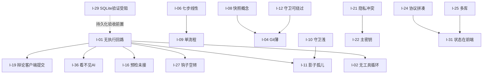
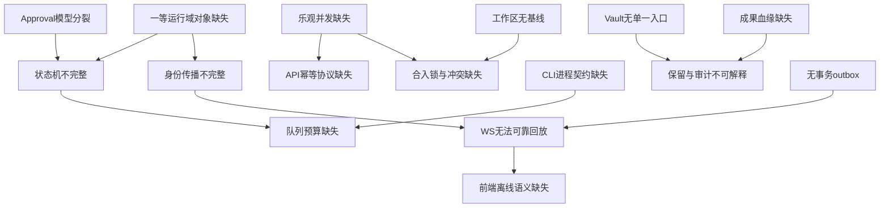

# CodeFlow 项目问题详解（2026-09 全面评审）

> 状态：Active（评审结论）  
> 创建：2026-09-03  
> 范围：产品定位、功能完整度、架构设计、工程卫生、文档流程  
> 依据：现行设计与计划、`backend/internal/*` 与 `apps/workbench/src/*` 可读工作树；早期记录中的 92 文件是当时快照，不能视为当前改动数量。  
> 配套：同目录下的 [codeflow-3.0-redesign.md](codeflow-3.0-redesign.md) 与 [2026-09-03-codeflow-3.0-implementation-plan.md](2026-09-03-codeflow-3.0-implementation-plan.md)  
> 约定：每一条问题都写清「现象 / 证据 / 影响 / 根因 / 处置方向」。凡是根据代码核实的写「已核实」，凡是推断的写「推断」。
> 复审同步：2026-09-06，逐条裁定和证据入口见实施计划 §26.2；72 张任务卡、216 个步骤及依赖/派发模板见 §28–§30。缺口、收窄、设计选择、合并修复分开记录；编写计划不代表完成代码或测试。

---

## 0. 总结论

CodeFlow 已经建成一套相当完整的**治理外围**：流程状态机、关卡、守卫、审计链、双轨记忆、辩论、快照、密钥边界、项目绑定。工程纪律（文档 SSOT、ADR、契约检查、fail-closed 默认）在同类项目里属于上游水平。

但**产品最中间的那个东西是空的**：没有一个能"读文件 → 搜代码 → 改文件 → 跑命令 → 看结果 → 再改"的 AI 执行回路。聊天是模拟数据，Agent 运行时只有 trace/stop/retry 而没有"发一条消息真正调模型"的入口，工具循环不存在。

这个根本缺口向外辐射出三类问题：

1. **接线缺口**：钩子、记忆预检、AST、隔离等已有局部调用或基础接口，仍未组成可验证的 Run 旅程；旧 shadow 的索引能力需另行接入。不能把所有外围模块一概认定为无调用或已完整实现。
2. **外围假设未经验证**：守卫假设"AI 会通过工作区接口写文件"，关卡假设"阶段有成果"，审计假设"所有敏感操作都经过后端"——这些假设在真 Agent 接上之后大概率要改。
3. **建设顺序反了**：先造城墙后造城。继续往外围加功能，边际价值趋近于零。

本文其余部分逐条展开。问题按层分组，编号 `I-xx`，供设计文档与计划文档引用。

---

## 1. 核心回路层

### I-01 AI 不能"干活"，只能"聊天"（且聊天还是模拟的）

- **现象**：右侧 Agent 伴侣可以输入、可以看到流式回复，但回复来自前端 DEV 模式下的本地模拟生成器。生产环境会探测一次聊天端点，缺失则报"服务不可用（实验性）"。
- **证据（已核实）**：后端路由表里没有任何聊天/执行入口；前端聊天桥模块注释明确写着"后端没有聊天 HTTP 端点，本模块 mock-first"；`PRODUCT.md` 把这条写成"产品事实不是缺陷"。
- **影响**：产品的全部主张（流程驱动、阶段人设、守卫拦截、记忆注入、辩论、审计）都无法被用户体验到；演示时只能"看骨架"。
- **根因**：Agent 运行时被设计成"管理已存在的 Agent 状态"（trace/stop/retry），而不是"执行一次 Agent 任务"。适配器只提供单次请求/流式响应，没有工具调用循环。
- **处置方向**：不自研工具循环。把"执行"外包给成熟的 CLI Agent（Codex app-server、Claude Code、Gemini CLI），CodeFlow 只保留"不动手"角色（追问、写文档、批评、辩论、记忆抽取）的直连模型适配器。见新设计 §4。

### I-02 没有工具循环：读、搜、跑、测全部缺席

- **现象**：即便聊天接通，Agent 也拿不到"读文件""搜索代码""执行命令""跑测试"这些工具。
- **证据（已核实）**：适配器主要处理消息请求；hooks 已在 workspace 写入、输入和 planner 路径有触发，但没有贯穿外部执行器的 Run 工具观察/审批协议。需要补调用链而非重写钩子总线。
- **影响**：审查阶段设计要看"测试结果"，但没有谁跑测试；编码阶段的"任务卡 ↔ 变更关联"无从谈起。
- **根因**：同 I-01。
- **处置方向**：同 I-01。工具循环由外部执行后端提供；CodeFlow 通过钩子/协议观察与拦截。

### I-03 没有终端 / 命令执行能力

- **现象**：底部面板设计有"终端"页，实际后端只有"启动/停止 dev server"一种进程能力。
- **证据（已核实）**：工作区路由里进程相关只有 scripts 探测与 dev-servers 启停/日志。
- **影响**：用户和 Agent 都不能在产品内执行命令；用户必然切回外部终端，工作流断裂。
- **处置方向**：提供受策略管控的通用命令执行（PTY 会话、超时、预算、审计），并复用现有 dev-server 的进程管理（环形日志、进程树击杀）。

### I-04 Git 能力过薄

- **现象（复审收窄）**：`git/manager.go` 已有 ListBranches/CreateBranch/DiffBetween/GetConflicts；缺 Run 的 dirty 基线、worktree 生命周期、可恢复发布和 PR/CI 用户闭环。
- **影响**：已有分支/diff 方法仍不足以支持自动提交分组和并行 Run 合入；影子副本（见 I-11/I-12）需要明确所有权与回收。
- **处置方向**：Git 作为一等公民：worktree 管理、分支、diff 基线、commit 分组、可选推送/建 MR。

### I-05 编辑器能力未定义

- **现象**：编码画布有文件树、多 Tab、暂存、diff，但对 LSP、跳转定义、补全、诊断没有任何设计。
- **影响**：编码是七步之一，若编辑体验低于 VS Code，用户会跳出产品，流程随之断裂。
- **处置方向**：明确编辑器定位为"审阅与小改"而不是"主力编辑"，重心放在 diff 审阅、任务关联、守卫反馈；同时接入 LSP 诊断只读展示。大改交给外部执行后端或用户的 IDE。

---

## 2. 流程模型层

### I-06 七步线性流程与真实开发节奏不匹配

- **现象**：内置只有"新建项目""导入项目"两个模板，都是完整七步（想法→设计→规划→调研→编码→审查→提交）。
- **证据（已核实）**：模板定义中两条模板、每阶段均为 auto exit gate。
- **影响**：修一个错别字也要走七步；用户会被流程绑架，最终只用编码画布，产品与普通 IDE 无差别。
- **根因**：流程被设计为"项目级唯一大流程"，缺少"任务级短流程"的概念。
- **处置方向**：流程分两级：项目流（长周期、可选）与任务流（短周期、默认）；一个项目可并行多条任务流；提供 Bug 修复、小改、重构、文档等短模板。见新设计 §5。

### I-07 阶段关卡是空的：空流程可以一路点到提交

- **现象**：所有内置阶段的退出关卡都是"自动通过"；推进时当前阶段的 draft 成果被无条件改成 approved。
- **证据（已核实）**：模板每阶段 `autoExitGate`；后端硬化计划 P-05 明确记录此事实；B6 尚未开始。
- **影响**："阶段完成 = 真实交付"的核心承诺不成立。
- **处置方向**：B6 阶段契约（已在计划中），但要按新的两级流程模型重做：任务流的契约轻（有变更 + 测试通过 + 守卫通过），项目流的契约重。

### I-08 快照的"三位一体回滚"概念站不住

- **现象**：设计要求代码、对话、向量记忆、图谱一起打快照、一起恢复。
- **证据（已核实）**：快照服务在主程序中仍是内存实现，重启即丢；git 恢复靠环境变量开关；对话/向量/图谱的"真恢复"已实现但没有产品级 UX。
- **影响**：
  - 回滚对话和记忆是反直觉的：用户与 AI 讨论半天，回退一下讨论就消失。
  - git 硬回滚管不了未跟踪文件、数据库迁移、依赖安装。
  - 投入巨大（55+ 测试）却不可用。
- **根因**：把"回到过去的状态"当成目标，而正确目标是"从过去某一点开一条新路"。
- **处置方向**：书签固定 manifest、来源版本与分支可见集，从书签开新流程，旧路可比较；非 Git 用固定 blob 集。仅按时间过滤不足以隔离兄弟分支记忆；日志保留和隐私撤回独立处理，不能承诺所有内容永不删除。旧恢复入口在兼容迁移完成后退役。见新设计 §7。

### I-09 多流程在工作台没有明确选择与执行闭环

- **现象（复审收窄）**：后端允许多 Flow，工作台仍容易取第一个 active/default Flow；缺独立任务流选择、工作副本和并行执行状态。
- **影响**：不能同时做两个功能；不能暂停一条、去做另一条；不能克隆一条流程做实验。
- **处置方向**：项目下多条流程并行；每条流程有自己的 worktree（可选）、任务、成果、预算；共享记忆、守卫、审计。

---

## 3. 守卫层

### I-10 守卫只做"表层规则"，没有语义能力

- **现象**：守卫拦截的是：堆叠命名（`_v2/_new/utils2`）、禁写/废弃路径、文件过大、可执行扩展名、顶层符号同名。
- **证据（已核实）**：规则评估函数逐条即上述六类；符号索引只比对名字与种类。
- **影响**：
  - 改个名字即可绕过重名检测；复制一段代码小改完全看不出来。
  - 设计文档承诺的"签名 + 语义向量双重比对"没有做。
  - 不跑 lint、不跑类型检查、不跑测试。"影子对照全量检查通过才合入"是空话。
- **根因**：M3.2 只做了最小实现；M3.3"与 shadow 串联"从未开始。
- **处置方向**：分规则/结构/项目检查/向量/AI 五层，结构使用真实 parser；向量层由新增 T9.05 补齐，当前 `memory/embedding.go` 是词频向量，不能当语义能力。仅疑似项按预算升级，模型调用比例须实测，不能将 95% 设成已验证事实。见新设计 §8。

### I-11 影子系统成为孤儿

- **现象**：早期设计的影子系统（API 注册表防重复接口、模型词典防重复数据结构、`.codeflow` 脚手架、语义索引、上下文聚焦加载器）在后端有完整实现。
- **证据（已核实）**：`internal/shadow` 五个文件存在；全仓库无任何其他包引用它；无路由暴露；守卫未使用。
- **影响**：最有价值的两个想法（接口级、数据模型级去重）被遗忘；守卫只剩函数名级去重。
- **处置方向**：旧 `internal/shadow` 的 API 注册表/模型词典迁到版本化代码索引并复用；新 `internal/runworkspace` 专管工作副本、diff 和所有权。不能直接把旧 shadow 目录覆盖成另一个用途。

### I-12 守卫可被 shell 绕过

- **现象**：守卫挂在"通过工作区接口写文件"这个点上。一旦接入外部 CLI，模型可以用 `echo >`、`sed -i`、`git apply` 直接写盘。
- **影响**：守卫形同虚设。
- **处置方向**：CLI 写入 intent 经钩子/策略，合入前对完整候选 diff 再检查；任意 shell 的文件/网络副作用另需实际沙箱约束。worktree 与合入锁不能防止执行期间读取宿主秘密或网络外传。

### I-13 审批疲劳没有被当作设计起点

- **现象**：每一步关卡、每次写文件守卫、破例申请、辩论终裁……用户面临高频弹窗。
- **影响**：用户很快麻木，全部点通过，安全体系失效。
- **处置方向**：按具体能力与效果分级，测试/安装也可能执行任意代码；复用已有豁免，持续授权限制主体/项目/资产修订/路径/操作/期限/次数。批量逐项验指纹，批准后执行前仍需重验。

---

## 4. 记忆层

### I-14 记忆写入没有质量关

- **现象（复审收窄）**：`samg.Triple` 已有 Source/Confidence，memory ingest 也保留部分来源；缺 Run/event/artifact 修订关联、pending/confirmed/rejected 和拒绝去重闭环。
- **影响**：图谱越长越脏；AI 检索到错误记忆比没有记忆更糟。
- **处置方向**：复用已有字段，补不可变来源版本与候选状态；拒绝按来源修订+抽取器版本+候选 hash 去重。低置信度待确认，用户可修订/归档；派生索引未清理前检索仍须过滤权威状态。

### I-15 记忆对用户不可见、不可管

- **现象**：没有"AI 记住了我什么"的视图；没有删除、纠正入口（导入流的理解报告除外）。
- **处置方向**：记忆浏览器页面：按项目/时间/类型查看、搜索、删除、纠正、导出。

### I-16 记忆预检/渐进披露后端有、前端无

- **证据（已核实）**：后端有 preflight 路由；前端 Agent 伴侣未接。
- **处置方向**：并入执行回路的"用户提交前"钩子。

---

## 5. Agent 层

### I-17 Agent 分配只按阶段一维匹配

- **现象**：Agent 打"适用阶段"标签，切阶段时按标签过滤、按评分/使用次数排序取前五。
- **证据（已核实）**：推荐函数即上述逻辑；五个内置 Agent 分别标注 planning/coding/review/research 等。
- **影响**：同为编码阶段，"写新模块""修 bug""重构""写测试"需要不同模型和提示词；同为审查，"安全审查"和"性能审查"应用不同批评者。评分是全局一个数，不反映"在这个项目的这类任务上好不好"。
- **处置方向**：阶段 × 任务类型 × 项目上下文三维分配；主脑 + 专家调度；推荐带依据；评分按项目+任务类型累积；项目级覆盖；Agent 内置模型分层（简单任务用便宜模型）。见新设计 §9。

### I-18 两套配置模型打架

- **现象**：老设计"全局/会话/角色三级继承 + 主脑/编码员/子任务三角色"与新设计"Agent 资产各自绑模型/渠道"同时存在，覆盖关系未定义。
- **证据（已核实）**：启动时按三角色注册配置 Agent；Agent Registry 又有独立的 binding 字段。
- **处置方向**：Agent 资产是唯一配置单位；"角色"退化为内置 Agent 的分类标签；三级继承退化为"项目可覆盖 Agent 默认模型"。

### I-19 辩论由客户端提交轮次内容

- **证据（已核实）**：下一轮接口接收客户端提交的 generator_output 与 critic_feedback；服务端只做关键词冲突检测和持久化。
- **影响**：辩论结果取决于客户端是否诚实。
- **处置方向**：B9（已在计划），改为服务端按每方绑定调用执行后端。

### I-20 Agent 运行时与 Agent 资产脱节

- **证据（已核实）**：运行时 Agent 表与 Registry 资产表是两套，没有"按资产版本解析出运行配置"的路径。
- **处置方向**：运行时只认资产 ID + 版本；执行记录引用资产版本。

---

## 6. 安全与隐私层

### I-21 隐私脱敏与"AI 需要看代码"冲突

- **现象**：隐私服务按 PII 模式检测后遮盖，是有损、不可逆的。代码里满是像密钥的字符串（配置、测试数据、日志格式）。
- **影响**：遮了模型看不懂；不遮违背设计。
- **根因**：把"密钥"和"个人信息"混在一个服务里，用同一种手段处理。
- **处置方向**：区分 PII、secret store、出站过滤与 CredentialBroker；占位符不自动解密，Agent CLI 不持有项目 secret。仅授权可信 runner 最小注入并隔离副作用，实际 provider 输入与文件/网络探针共同验收。见新设计 §10。

### I-22 隐私主密钥只是一个环境变量

- **证据（已核实）**：启动硬性要求 `CODEFLOW_PRIVACY_MASTER_KEY`，缺失即退出。
- **影响**：丢了主密钥 = 所有加密数据作废；桌面用户不可能自己管环境变量。
- **处置方向**：桌面壳生成并存入系统钥匙串；提供导出/恢复口令；首启向导接管。

### I-23 用户画像与架构矛盾

- **现象**：目标用户含"团队技术负责人"（关心审批、审计、权限），但架构是单机、单用户、本机 sidecar，无账号、无共享；审批者与写代码者是同一人。
- **处置方向**：现阶段明确为个人工具；RBAC/隔离角色收起；团队协作作为后续独立里程碑，先用"导出审计包 / 项目包"满足汇报需求。

---

## 7. 架构与工程层

### I-24 通信协议是拼出来的

- **现象**：HTTP 一套、WebSocket 按资源主题一套、规划中 SSE 又一套；事件类型没有统一 schema。
- **影响**：前端要猜；接入外部 CLI 的事件流后会有第四种格式。
- **处置方向**：统一事件 envelope 和 run.queued/run.started/run.delta/tool.requested/tool.completed/approval.required/merge.completed 等类型，状态枚举与事件类型分开；CLI 仅产 observation，服务端验证身份并分配序号。

### I-25 状态散落在十几个 SQLite 文件

- **证据（已核实）**：config / planner / project / sessions / raw_archive / memory / atomic_memory / atomic_vectors / samg / context / floweng / skills / guard_exemptions / debates / agents 各一个库。
- **影响**：跨库无事务，被迫用 saga 日志补偿；备份、导出、迁移复杂十倍。
- **处置方向**：新运行库先收运行事实，旧域逐域冻结/复制/校验/切换；同一 SQLite 文件内使用事务，向量/文件审计等副作用用可重放回执。不能把 ATTACH 多文件或单库方案描述为所有外部资源一起原子提交。

### I-26 面太宽，大量子系统没有用户

- **证据（已核实）**：黑板、投票、隔离容器、角色权限、PAPI、集成、mapagent、披露、shadow、blackboard——有路由无界面，或无路由无调用。
- **影响**：维护负担，认知负担，测试负担。
- **处置方向**：冻结/删除清单见计划文档 §2。

### I-27 钩子总线空转

- **证据（已核实）**：13 种钩子在启动时启用，但没有执行器触发。
- **处置方向**：钩子总线保留为 CodeFlow 内部事件机制，其触发点改为"执行后端事件适配层"。

### I-28 单进程后端管所有项目

- **影响**：一个项目的 CLI 跑飞、守卫索引卡住，拖累其他项目。接外部 CLI 后风险更大。
- **处置方向**：按项目隔离资源（并发上限、进程组、超时）；长期考虑每项目一个工作进程。

### I-29 SQLite 验证链受 CGO 环境限制

- **证据（已核实）**：多份计划文档记录"当前 Windows 无 gcc，SQLite 全量测试留待 B11"。
- **影响（复审收窄）**：CGO=0 时 go-sqlite3 的持久化行为可能报错或被测试 skip；不能据此推断全部非数据库测试无效，也不能把退出 0 当成 SQLite 已验证。
- **处置方向**：T0.01 逐连接核查 DSN/pragma/事务并默认迁 modernc；如保留原驱动需明确工具链。普通 SQLite 测试在无 gcc Windows 验证，race 仍需要 CGO/C 编译器支持；记录实际测试/skip 数。

### I-30 前端两套服务层并存、类型手写

- **证据（已核实）**：`services/` 与 `src/services-bridge/` 同时存在；有 OpenAPI 生成脚本但类型基本手写。
- **处置方向**：收口为单一 bridge；类型从 OpenAPI 生成并 CI 校验。

### I-31 执行状态部分在前端

- **现象**：聊天状态部分在前端 store。
- **影响**：刷新/关窗任务丢失；接 CLI 后任务可能跑十几分钟，必须完全后端持有。
- **处置方向**：执行状态 100% 后端；前端只是观察者，可断线重连回放。

### I-32 时间与离线未考虑

- **现象**：无队列、无重试策略、无"断网能做什么"。
- **处置方向**：执行队列 + 重试策略 + 离线只读模式。

---

## 8. 外部连接层

### I-33 没有 GitHub/GitLab/Issue 集成

- **影响**：不能拉 issue 当任务、不能开 PR、不能读 PR 评论、CI 结果不回流。
- **处置方向**：Git 托管平台适配器（先 GitHub）；issue → 任务流；提交阶段可建 PR；CI 状态回流审查阶段。

### I-34 MCP 停留在文档

- **现象**：到处写"挂 MCP"，未见真正连接 MCP 服务器并把工具给 Agent 用的实现。
- **处置方向**：两向 MCP：作为客户端把外部 MCP 工具给执行后端；作为服务器把"查记忆/查图谱/查阶段成果/查守卫规则"暴露给外部 CLI。

---

## 9. 前端体验层

### I-35 任务层是空的

- **现象**：规划阶段产出任务清单，但任务不能被领取、执行、标完成；无后台任务、无并行、无通知。
- **处置方向**：任务成为一等公民；任务可派给 Agent 后台运行；通知中心。

### I-36 看不见 AI 在干什么

- **现象**：无执行轨迹视图；"嵌套子对话渲染"未做；无"撤销上一次 AI 操作"。
- **处置方向**：运行详情页 = 事件时间线 + 文件变更 + 工具调用 + 费用；单次运行可整体撤销（基于影子副本）。

### I-37 上下文控制弱

- **现象**：只能勾文件。
- **处置方向**：按符号选、自动依赖扩展、项目规则文件（`.codeflow/rules.md`）、"本次发给模型的内容"预览。

### I-38 全局搜索缺失

- **现象**：Cmd+K 无代码/符号/对话搜索；后端有混合检索，前端未接。

### I-39 文档类成果编辑器弱

- **现象**：想法/设计文档无 Markdown 预览、无 Mermaid 渲染（设计画布承诺双栏架构图）。

### I-40 日常小项

通知中心、快捷键体系、会话导出/分享、多语言、画布撤销/重做、首启向导。

---

## 10. 文档与流程层

### I-41 文档中存在过期依赖图

- **证据（已核实）**：`DIRECTORY_STRUCTURE.md` 称 workbench 依赖 `@codeflow/core`；实际 `apps/workbench/package.json` 不依赖任何 `packages/*`。
- **处置方向**：更正；`packages/*` 标记为遗留资产。

### I-42 手机端与插件市场过早出现在路线图

- **处置方向**：明确后置到核心回路稳定之后。

### I-43 里程碑以"模块落地"而非"用户能做什么"计量

- **现象**：对等矩阵按模块打 ✅/⚠️；进度记录按 PR 罗列。
- **影响**：模块全 ⚠️ 但用户什么都做不了。
- **处置方向**：新计划以"用户旅程"为验收单位。

---

## 11. 孤儿模块清单（有代码、无调用或无入口）

| 模块 | 状态 | 处置 |
|---|---|---|
| `internal/shadow` | 无任何引用 | 拆用：API 注册表 / 模型词典 → 守卫第二层；目录概念 → 影子工作副本 |
| `internal/blackboard` | 有路由无 Agent 读写 | 冻结；多 Agent 协调改由执行编排器承担 |
| `internal/hooks` | 13 钩子无触发者 | 保留为内部事件机制；触发点接执行事件适配层 |
| `internal/isolation` | 容器/角色接口无执行 | 冻结 RBAC；沙箱职责交给执行后端 + 影子副本 + 策略层 |
| `internal/hotswap` | 无运行中任务可切 | 保留概念；落到"新运行读取新配置" |
| `internal/mapagent` | 未见入口 | 评估后删除或并入记忆 |
| `internal/disclosure` / memory preflight | 后端有前端无 | 并入执行回路"提交前"钩子 |
| `internal/ast` | 仅被守卫抓符号名 | 升级为守卫结构指纹 + 上下文构建器依赖扩展的共享服务 |
| votes / integrations 路由 | 无界面 | 冻结 |
| `packages/core|cli|gui|ui-components|shared` | 主前端不依赖 | 标记遗留；不再维护 |

---

## 12. 问题之间的依赖关系

阅读方式：箭头指向"被拖累的问题"。`I-29` 是唯一的硬阻塞——在它解决前，任何后端改动都无法被验证。`I-01` 是根源——它解决后，一半的孤儿模块自动有了归属。

---

## 13. 保留的优点（不要在重构中丢掉）

- 文档 SSOT 与 ADR 惯例；"未实现不得写成已实现"的诚实原则。
- 项目权威绑定与前向 saga 日志的思路（虽然单库后可简化）。
- 密钥独立加密存储、配置读写模型分离。
- 守卫"豁免有代价、走审计"的机制设计。
- 关卡 `on_fail = escalate_to_debate` 的想法。
- 审计文件哈希链与启动校验。
- 前端 mock 层的 DEV-only 编译剔除做法。
- 黑白简约、浅色默认、禁紫、渐变只做签名色的视觉纪律。

---

## 14. 进一步深挖的问题（I-44 至 I-70）

本节只记录前面没有展开、但会直接影响 3.0 落地的跨模块问题。判断依据是当前工作树中的实际类型、存储、路由和前端服务；“已核实”表示代码中已经能定位到证据，“推断”表示需要在实现阶段用测试验证。

### I-44 Sidecar 握手不是可恢复的信任建立流程

- **现象（复审收窄）**：Go 已输出 CODEFLOW_HANDSHAKE，Tauri 仍只解析 CODEFLOW_PORT；握手生产者与桌面消费者没有接通，未知 stdout 还可能进入日志。
- **证据（已核实）**：`backend/internal/api/router.go` 的握手输出与 `apps/workbench/src-tauri/src/lib.rs` 的 stdout 解析分支不匹配。
- **影响**：sidecar 重启或端口被复用时，旧页面可能继续持有失效连接；客户端无法区分“服务尚未就绪”“令牌失效”“协议版本不兼容”。
- **处置方向**：复用受信任父子进程管道，有界结构化解析协议/端口/token/启动 ID，敏感握手行不写日志；终止清空连接并重新配对。nonce 不是单独认证依据，不新增公开领取 token 接口。

### I-45 认证令牌生命周期和撤销语义不完整

- **现象**：当前认证主要是静态进程令牌匹配，没有短期 token、刷新、撤销和泄漏后的轮换记录。
- **证据（已核实）**：`AccessPolicy` 保存单个 token，WebSocket 只验证请求是否匹配；没有 token ID、issued_at、expires_at 或 revoke endpoint。
- **影响**：令牌被日志、浏览器扩展或错误转发后，无法只撤销一个客户端；更新配置需要重启整个服务。
- **处置方向**：当前先完成进程令牌的客户端消费、重启失效及缓存清理；单客户端撤销/复杂 refresh 需要独立需求与 ADR，不作为接通 S1 的默认重写前置。

### I-46 HTTP/WS 的前端凭据消费尚未统一接通

- **现象**：HTTP、WS URL/header、`Sec-WebSocket-Protocol` 各有一套传递方式，错误响应和浏览器兼容策略不统一。
- **证据（复审收窄）**：服务端 AccessTokenMatches 已复用 bearer/WS 子协议验证；缺口主要在 `apps/workbench/api.ts` 与 ws bridge 的生产连接消费和错误分类，不能称服务端完全没有共享验证。
- **影响**：某些客户端 HTTP 已认证但 WS 失败，或把 token 放进 URL 导致历史记录泄漏；前端只能把所有失败显示为离线。
- **处置方向**：HTTP 发送 bearer，浏览器 WS 使用稳定协议+token 子协议且只回显稳定协议；浏览器 WebSocket 不能自行加 Authorization header。禁止 URL token、跨 origin 转发和日志持久化，错误分类与缓存身份一致。

### I-47 WebSocket 主题授权与资源授权存在脱节

- **现象**：连接建立时按 scope 设置允许主题，但主题订阅表和具体 project/run 资源没有统一授权检查。
- **证据（已核实）**：`HandleScopedWebSocket` 接收 `scopeID` 和 `allowedTopics`；Hub 以字符串 topic 管理订阅，消息本身主要依赖 SessionID。
- **影响**：新增 topic 或映射错误时可能把项目事件广播给不应看到的连接；审计无法说明一次订阅依据了哪条授权。
- **处置方向**：topic 使用结构化 `resource_type/resource_id`，每次 subscribe 由授权器返回 grant ID；广播按 grant 过滤而不是只按字符串 fan-out。

### I-48 工作区仍需防范校验后的根目录与链接目标变化

- **现象（复审收窄）**：`workspace.Resolve` 已处理 symlink 与 irregular reparse；仍需在 Run 创建/派发/合入时重验 root identity 与路径祖先，防止检查后目录被替换。
- **证据（已核实）**：`project/workspace_binding.go` 与 `workspace.Resolve` 分别做根目录和相对路径校验；未见 Run 级 realpath/device identity 锁定。
- **影响**：检查通过后路径指向被替换，写操作可能落到根目录外；多项目绑定同一 junction 时审计归属不清。
- **处置方向**：复用已有路径解析并保存 volume/file identity，三个执行边界重验；根变化拒绝发布并进入恢复/取消，不假设任何 CLI 都支持暂停。

### I-49 策略缺失时的兼容模式容易被误带入生产

- **现象**：策略层为轻量单元测试提供“未安装策略时允许”的 compatibility mode，同时生产 bootstrap 才开启 fail-closed。
- **证据（已核实）**：`EvaluateBoundary` 在没有 evaluator 且未启用 enforcement 时返回 allowed；`BootstrapEvaluator` 依赖启动路径安装全局策略。
- **影响**：新执行入口若绕过 bootstrap 或在桌面迁移模式启动，可能默认为放行；测试通过不能证明真实宿主已受策略保护。
- **处置方向**：新执行服务显式注入非空 policy evaluator，生产 enforcement 缺失构造失败；旧测试兼容行为保留，不能靠全局 allow-all 修新入口。无需为此重写所有旧策略调用。

### I-50 策略和审计的 Actor 类型不足以表达真实操作者

- **现象**：策略审计将未空的 AgentID/ActorID 统一记录为 agent，无法区分用户、Agent、系统恢复器和外部集成。
- **证据（已核实）**：`policy.recordDecision` 使用固定 `Actor.Type: "agent"`；请求虽有 ActorID，但没有 ActorType 或 Run identity。
- **影响**：审批责任、自动恢复和外部 webhook 的责任边界混在一起；审计导出无法准确还原谁做了决定。
- **处置方向**：统一 actor type/id/source，策略、审批、审计和事件共享；系统动作必须带 reason 和触发事件，不能伪装成 Agent。

### I-51 事件通知失败不会反馈给状态提交者

- **现象**：Flow/Workspace 等模块通过可选 notifier 或内存 Hub 广播；通知失败、Hub 关闭或缓冲区满不影响状态写入，也不产生补偿任务。
- **证据（已核实）**：`EventNotifier` 是可选接口；`websocket.Hub` 满队列时跳过发送；状态存储和广播不在同一 durable transaction。
- **影响**：后端已经完成而客户端永远看不到事件，重连也无法判断需要从哪里补；运行详情与审计时间线分叉。
- **处置方向**：所有状态事件先写 outbox，dispatcher 记录投递次数和最后错误；通知仅是可重建的派生物，绝不承担事实存储。

### I-52 Agent 资产持久化缺少不可变版本和运行引用

- **现象**：Agent registry、运行时 Agent、配置服务各有模型；编辑 Agent 后，历史运行无法确定当时使用的 prompt/model/backend。
- **证据（已核实）**：路由同时暴露 `/agents` 和 `/agents/registry`；现有运行/会话接口以 AgentID 或 SessionID 为主，没有 asset version 快照。
- **影响**：审计不可复现，评分和失败归因会被后续编辑污染；辩论参与方可能在中途读取到不同配置。
- **处置方向**：Agent 资产采用 append-only version；Run 创建时锁定版本和解析后的 model policy，编辑只创建新版本，历史版本可导出但不可修改。

### I-53 项目创建 Saga 的幂等记录与实际资源状态可能暂时不一致

- **现象**：项目、默认 Flow、默认 Session 的创建通过协调器和 operation 记录恢复，但跨存储失败时仍需根据 state 推断哪一步已完成。
- **证据（已核实）**：`project_operations` 记录 create_project 状态并有恢复测试；Project/Flow/Session 仍由不同服务和数据库保存。
- **影响**：重启恢复或重复请求可能留下孤立 Flow/Session；用户看到项目已存在但默认运行资源未就绪。
- **处置方向**：将创建拆为显式步骤和资源引用，operation 状态只允许单向迁移；每步有 reconcile 检查，最终以 `ready/degraded/failed` 暴露，而不是仅返回 project。

### I-54 Readiness 缺少按项目和执行后端的可执行能力验证

- **现象**：服务有 health/ready 路由，但执行后端、SQLite 驱动、策略、Vault、事件 dispatcher 和 workspace capability 没有统一 readiness contract。
- **证据（复审收窄）**：`handlers/common.go:ReadinessCheck` 已检查必要/可选服务的 HasService，不能称只看进程；缺实际依赖探测和 per-project/per-backend 的执行前验证。
- **影响**：前端收到 ready 后立即创建 Run，随后才因 backend 未安装、策略未加载或事件存储不可用失败，用户无法判断是配置问题还是任务问题。
- **处置方向**：readiness 返回依赖项清单、版本、能力和 remediation；只读可用与可执行可用分开，Run API 在 capability 不足时快速返回稳定错误。

### I-55 运行域对象没有成为一等实体

- **现象**：`Flow` 将 stages、artifacts、events 作为嵌套数组整体持久化；项目规划里虽有 Task，但没有贯穿项目、流程、执行、审计的统一 Task/Run/Approval/Bookmark 实体。
- **证据（已核实）**：`backend/internal/floweng/types.go` 的 `Flow` 直接包含 `[]Stage`、`[]Artifact`、`[]FlowEvent`；路由有 flow 和 conversation，但没有统一 `/runs`、`/approvals`、`/bookmarks` 资源。
- **影响**：无法可靠查询“某个任务的所有运行”“一次审批影响了哪些工具调用”“某个书签对应哪些成果”；只能从 JSON 文档和多个旧服务拼接。
- **处置方向**：建立规范化实体及外键关系，JSON 只作为不可查询的扩展字段；Run、Attempt、Approval、ArtifactVersion、Bookmark、Event 都必须能独立查询和审计。

### I-56 状态机缺少失败、取消、重试和恢复语义

- **现象**：Flow 只有 active/completed/aborted，Stage 只有 pending/active/waiting_gate/done/skipped；没有 Run/Task 的 failed、cancel_requested、cancelled、retrying、stalled 等状态。
- **证据（已核实）**：`floweng` 状态枚举没有失败或取消终态；`Gate` 只有 `Passed bool`，没有拒绝原因、决策者、过期时间和策略版本。
- **影响**：进程崩溃、网络中断、外部 CLI 自己退出时，系统无法区分“可安全重试”“需要人工处理”“已经产生部分变更”；重启后容易把运行误显示为进行中。
- **处置方向**：Run.completed 只表示执行完成，MergeOperation.applied 表示合入完成；S1 一个 Run 一个 Attempt，重试新建 Run 引用原 Run，保留事件/费用且不复制审批。取消确认进程树结束后终止，无法确认则 recovering。

### I-57 写操作没有统一的乐观并发控制

- **现象**：Flow advance 只校验 `ExpectedStageID`，项目更新没有版本条件；多个窗口或自动化任务可以覆盖彼此的最新状态。
- **证据（已核实）**：`AdvanceRequest` 没有 revision/ETag；`ProjectUpdateRequest` 也没有 expected version；SQLite flow store 以整份 JSON `Put` 保存。
- **影响**：双击推进、断线重试、并行任务回写可能产生 lost update；用户看到的阶段、成果和审计顺序不一致。
- **处置方向**：可变实体带 revision，HTTP If-Match 不成立返回 412，业务版本/状态冲突返回 409；header/body revision 不一致返回 422。同一 command key 只在请求指纹一致时复用结果。

### I-58 工作区绑定缺少不可变身份和基线版本

- **现象**：项目保存规范化后的 `workspace_root`，但没有 workspace binding ID、绑定版本、Git HEAD、文件系统设备标识和变更时间点。
- **证据（已核实）**：`Project` 只有 `WorkspaceRoot` 与 `BindingState`；`workspace` 服务以 root/path 执行读写，未形成 Run 级基线快照。
- **影响**：目录被移动、重用或切换分支后，旧 Run 仍可能指向同一路径；合入时无法确认 diff 是基于哪个提交或哪个文件版本产生的。
- **处置方向**：建立 `WorkspaceBinding`，记录 canonical root、git repository ID、base ref/commit、capability 和 binding revision；Run 创建时冻结 base，合入前再次验证 base 未漂移。

### I-59 项目、流程、任务、Agent、审计之间的身份传播不完整

- **现象**：策略请求可携带 project/agent/plugin ID，但没有 RunID、TaskID、FlowID、AttemptID；现有 trace 不能唯一串起一次执行。
- **证据（已核实）**：`policy.Request` 只定义 ProjectID、AgentID、PluginID 等字段；WebSocket `Message` 主要依赖 SessionID；Agent 资产与运行时记录分离。
- **影响**：同一 Agent 并发多个 Run 时，审批、工具输出、费用和审计难以准确归属；发生越界写入时无法回答“是哪一次运行、哪一个任务、哪一个资产版本”。
- **处置方向**：定义不可变 `ExecutionIdentity`，在 HTTP、WS、子进程环境、hook payload、audit details 中统一传递，并在边界处拒绝缺失或互相矛盾的身份。

### I-60 API 没有统一的幂等、版本和错误协议

- **现象**：只有项目创建等少数操作有幂等记录；flow advance、gate decide、promote、conversation retry 等写接口没有统一幂等键和请求指纹。
- **证据（已核实）**：幂等实现集中在 `project_operations`；路由同时存在实验性 flow/workspace/conversation 资源，响应 envelope 和错误文本不统一。
- **影响**：浏览器重试、桌面端断线重放、用户双击可能重复创建成果、重复审批或重复合入；前端只能按字符串判断错误。
- **处置方向**：所有改变状态的 POST 支持 `Idempotency-Key`；响应统一 `{data,error,meta}`，错误包含 `code/message/retryable/current_revision`; OpenAPI 与 JSON Schema 共同生成类型。

### I-61 WebSocket 事件是易失广播，无法保证回放

- **现象**：Hub 的 `Send` 队列满时直接丢弃消息；消息没有全局或 Run 级序号，客户端重连只能重新订阅，不能按游标补齐。
- **证据（已核实）**：`backend/internal/websocket/hub.go` 多处 `default: // 缓冲区满，跳过`；`Message` 没有 event_id/sequence；前端 WS 服务只做指数退避重连。
- **影响**：运行日志、审批提示和文件变更可能静默缺失；用户看到的时间线与审计、后端事实不一致。
- **处置方向**：事件先写 durable event/outbox，再广播；每个 project/run 维护单调 sequence；订阅请求携带 `after` 游标，服务端返回 gap/replay/retention 状态，前端按 sequence 去重并检测缺口。

### I-62 没有可执行的队列、并发、预算和超时模型

- **现象**：已有 dev-server 管理和局部 retry 配置，但没有 Task → Run 队列、项目并发上限、全局资源池、token/时间/磁盘预算。
- **证据（已核实）**：API 路由中没有 runs/queue/budget 资源；前端只保存查询缓存，未见后端任务调度状态。
- **影响**：多个项目同时启动 CLI 时会互相争抢 CPU、内存和端口；失控运行无法自动暂停，成本和用户等待时间不可预测。
- **处置方向**：调度器按项目、Agent backend、资源类别限流；预算在 Run 和 Attempt 层累计，超过阈值发事件并进入 pause/approval；超时采用优雅取消后强制回收。

### I-63 外部 CLI 的进程树、背压和孤儿回收未定义

- **现象**：现有工作区进程能力主要围绕 dev-server；执行后端尚未规定 PTY、stdout/stderr 背压、子进程组和重启恢复。
- **证据（已核实）**：`workspace/devserver.go` 处理的是按 root/script 的服务实例；没有 Run 级进程组、心跳、退出原因和 orphan sweep 契约。
- **影响**：CLI 卡住或输出过快时可能阻塞读写；后端重启后留下孤儿进程继续改写影子目录；Windows 下普通 kill 不能可靠终止整棵进程树。
- **处置方向**：每个 Attempt 使用独立 process group/job object、限长环形日志和背压策略；记录 pid/启动时间/退出码；启动扫描 orphan marker，取消路径先发信号再强制终止并审计。

### I-64 合入缺少真实根锁、三方冲突检查和发布恢复日志

- **现象**：工作区 `PromoteAll` 逐文件执行并“尽量继续”；没有把 Run 的 base tree、当前工作树和目标 diff 作为一次事务处理。
- **证据（已核实）**：`workspace/service.go` 的 PromoteAll 遇到单文件错误会继续；接口没有 base hash、merge lock 或冲突结果类型。
- **影响**：一次合入可能只写入半套修改；并行 Run 合入时可能覆盖用户新改动；失败后无法自动恢复到合入前状态。
- **处置方向**：按真实 root/repository identity 加锁，base/current/result 构建候选；Guard/check/Approval 绑定 candidate hash。逐文件发布前写备份和 journal，失败只恢复仍属本操作的文件，遇外部新改动进入 needs_recovery；不承诺普通文件系统多文件事务。

### I-65 Vault、PII、策略和日志遮盖没有单一入口

- **现象**：策略可以审计资源，隐私服务可以脱敏，但模型上下文、事件 delta、工具输出、任务文件和子进程环境尚未经过一个强制的 secret boundary。
- **证据（已核实）**：当前 `policy` 与 `privacy` 是独立包；路由和 WebSocket 可直接传递 Content/Data；未见统一 `RedactOutbound/RestoreInbound` 门面。
- **影响**：一个新执行后端或新 WebSocket 路径就可能绕过密钥占位符，导致审计、记忆或日志泄漏真值。
- **处置方向**：SecretStore、Redactor、CredentialBroker 分责，模型生成占位符不获得解密权限；Agent CLI 无项目 secret，可信运行器按授权注入并隔离副作用。canary 覆盖实际 provider 输入和宿主读取/网络探针，不能只扫描可见日志。

### I-66 多库与整文档持久化缺少事务边界和 outbox

- **现象**：配置、flow、memory、audit、agent 等域使用多个 SQLite 文件，flow store 又以整份 JSON 替换；跨域事件靠内存 notifier。
- **证据（已核实）**：`storage`、`floweng`、memory 等各自初始化数据库；`FlowStore.Put` 写入 payload，WebSocket notifier 在内存中广播。
- **影响**：状态已提交但事件未发出，或事件已发出但状态回滚时，重启后无法重建事实；跨域删除和迁移只能靠手写补偿。
- **处置方向**：S1 新运行事实进入 codeflow.db；旧域各自保证本库状态/outbox，Flow 在 S3 逐域迁移，S12 收剩余域。冻结/复制/校验/切单一写入者，禁止跨 SQLite 文件原子双写的承诺；审计文件链异步幂等投递。

### I-67 前端缓存策略没有按数据语义区分在线、离线和失效

- **现象**：React Query 全局默认 `retry: 0`，多个查询固定 staleTime；离线 store 只有布尔标记，没有“可读缓存/待发送命令/事件缺口”状态。
- **证据（已核实）**：`apps/workbench/src/AppRoot.tsx` 和 `src/lib/queries.ts` 采用全局不重试与分散 staleTime；`services/websocket.ts` 没有游标回放 API。
- **影响**：短暂断网会把正常页面显示成失败；恢复后缓存与后端状态可能静默过期；用户无法知道某个操作是否已提交。
- **处置方向**：命令用客户端发送前生成的 command_id 对账，request_id 仅作 HTTP trace。客户端状态为 draft/submitting/accepted/applied/rejected/unknown，服务端可为 reconciling；恢复先查命令，再 snapshot/replay，最后失效查询并恢复可写。

### I-68 阶段 Gate 与运行时 Approval 是两套不可互认的模型

- **现象**：Flow Gate 负责阶段进入/退出，策略层负责操作放行，但没有统一 Approval 记录和“审批对象”定义。
- **证据（已核实）**：`Gate` 没有 resource/risk/decision metadata；策略返回 `Decision`，未引用 Flow、Task 或 Run；API 没有 approvals 资源。
- **影响**：用户批准了“这一次删除配置”的操作，系统无法判断是否能覆盖同类操作；阶段通过也不能证明其中所有高风险操作都已批准。
- **处置方向**：统一 Approval：subject（gate/tool/merge）、risk、scope、request fingerprint、decision、actor、expires_at、policy_version；持续授权必须限制在 project + agent asset + operation class 范围。

### I-69 Artifact、Bookmark 与来源版本之间没有可验证的血缘

- **现象**：Artifact 只有 stage、type、version、contentRef；Bookmark 仍停留在设计概念，未记录事件游标、Run、工作树和记忆截面。
- **证据（已核实）**：`floweng.Artifact` 没有 `run_id`、`parent_version`、content hash；现有 snapshot/checkpoint 模型与新书签模型并存。
- **影响**：审查者无法确认成果来自哪个执行；同名成果被覆盖时无法追溯；从书签开新路后无法稳定比较记忆和文档版本。
- **处置方向**：ArtifactVersion 内容不可变，人工成果可无 Run，同内容可属于不同成果；Bookmark 固定来源/版本/分支可见集及游标并 pin 引用，Git ref 可空，非 Git 使用 manifest/blob。

### I-70 资源限制、可观测性和数据保留没有产品级契约

- **现象**：费用、token、输出大小、日志保留、审计保留、事件压缩和删除策略散落在各模块；没有 Run 级 usage ledger 与 retention policy。
- **证据（已核实）**：现有 Agent/API 适配器有局部 retry/usage 字段，但没有统一 Run usage、预算告警和清理任务；WebSocket 也没有事件保留窗口。
- **影响**：长时间运行的项目会无限增长日志和事件；用户不能解释费用来源；合规导出与删除会遗漏某个独立数据库。
- **处置方向**：Run 记录 token、wall time、CPU、磁盘和网络计量；项目策略声明预算与保留期；清理只删除可重建的派生数据，审计和成果按法律/项目策略保留并可导出校验。

### 14.1 新问题的依赖关系

### 14.2 验证记录（新增）

| 检查项 | 结果 | 结论 |
|---|---|---|
| Flow/Stage/Artifact/Event 类型 | 已核实 | 当前以嵌套 JSON 为主，缺 Task/Run/Approval/Bookmark 统一实体 |
| WebSocket Hub | 已核实 | 队列满时丢弃，消息无 sequence/cursor |
| Workspace PromoteAll | 已核实 | 逐文件 best-effort，缺少候选一致性预检、失败补偿和可恢复发布 |
| Policy / privacy 边界 | 已核实 | 存在两个独立入口，尚无强制 Vault gateway |
| 前端查询与重连 | 已核实 | 有退避和缓存，但无事件游标回放与命令确认态 |
| 项目创建幂等 | 已核实 | 仅覆盖创建协调器，不能代表全 API 幂等 |

## 15. 复审结论如何进入编码计划

I-01 至 I-70 的编号保持不变；逐条“缺口/收窄/设计/合并”裁定、代码入口与关闭责任卡集中在 [实施计划](2026-09-03-codeflow-3.0-implementation-plan.md) §26.2，避免三份文件各维护不同版本的实施状态。当前只是完成审查和任务设计，问题不因新增任务卡而关闭。

| 复审重点 | 计划中的具体约束 | 关闭证据 |
|---|---|---|
| 复用已有能力 | T0.07/T0.08 复用 handshake/auth；T1.08/T1.10 复用进程/路径规则；T3.03 复用 planner；T9.02 迁旧 shadow 索引 | 新入口已接通且旧行为回归通过 |
| 执行与交付分离 | Run completed、Task waiting_review、MergeOperation applied 分别保存 | 执行成功但合入失败时状态及主树正确 |
| 凭据边界 | T2.04–T2.06 的隔离视图、可信 runner、钥匙串；不自动入站还原 | 模型接收器和文件/网络探针均无项目 secret |
| 可派发粒度 | 每张卡 a/b/c，合计 72 卡/216 步；§29 给前置/锁/回收，§30 给完整提示和分组 | 每个步骤有实际文件、接口、断言及验证回执 |
| 可执行验证 | workbench test discovery、SQLite 实测、适用环境的 race、fake/真实 provider 分开 | 实际测试数量、skip 原因和平台证据 |

原版三文件继续保存在 `docs/archive/codeflow-3.0-original-2026-09-05/`，本次细化前副本在 `docs/archive/codeflow-3.0-plan-before-dispatch-review-2026-09-06/`；修改只发生在当前文档目录。
