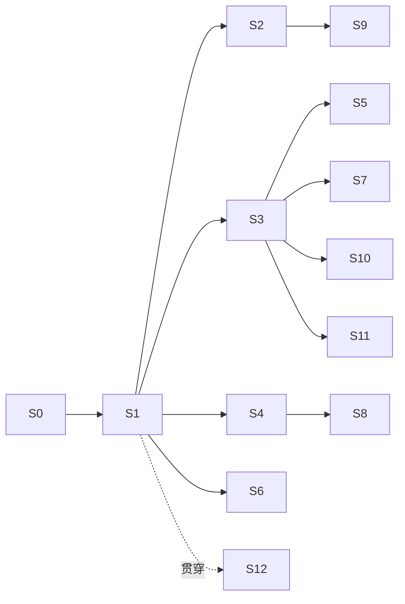

# CodeFlow 3.0 实施计划

> 状态：Active（提议，待接受）  
> 创建：2026-09-03  
> 依据：`docs/design/2026-09-03-project-issues-deep-dive.md`（I-xx）、`docs/design/codeflow-3.0-redesign.md`（§x）  
> 关系：本计划接管 `2026-08-18-backend-product-hardening-plan.md` 中未完成的 B6–B11，将其重排进新阶段；`2026-07-11` 的 2.0 计划中 M2–M7 按本计划重新解释  
> 验收原则：**每个阶段的验收单位是"用户能完成一条旅程"**，不是"模块落地"（I-43）

---

## 1. 总览

| 阶段 | 名称 | 用户能做到什么 | 依赖 |
|---|---|---|---|
| S0 | 解除阻塞 | 开发者能跑全部后端测试 | — |
| S1 | 第一条真实 Run | 在一个项目里让 Claude Code 完成一个小任务，看到过程，合入结果 | S0 |
| S2 | 双锁守卫 + 密钥库 | AI 写的东西经守卫、密钥不泄露 | S1 |
| S3 | 任务流 + 契约 + 审批 | 用任务流模板派活、审批、合入；一个项目多条并行 | S1 |
| S4 | 第二、第三执行后端 | 同一任务可选 Codex / Gemini CLI；Agent 资产绑后端 | S1 |
| S5 | 运行详情 + 首页待办 + 通知 | 看得见 AI 在干什么；批量审批 | S1, S3 |
| S6 | 记忆闭环 + MCP 服务器 | AI 主动查项目记忆；用户能管记忆 | S1 |
| S7 | 书签与分支 | 从任一书签开新路，并排比较 | S3 |
| S8 | Agent 分配与辩论 | 主脑+专家；三维推荐；服务端辩论 | S4 |
| S9 | 守卫深层 | 结构指纹、API 注册表、模型词典、项目检查 | S2 |
| S10 | 项目流 + 文档画布 | 七步长流程可用；Mermaid/Markdown | S3, S7 |
| S11 | 外部连接 | GitHub issue → 任务，提交 → PR，CI 回流 | S3 |
| S12 | 收口 | 单库、协议统一、前端服务层收口、文档同步 | 贯穿 |

依赖图：

S2、S3、S4、S6 可以在 S1 之后并行；其余按箭头。

---

## 2. 冻结与删除清单（S0 期间执行）

| 对象 | 动作 | 说明 |
|---|---|---|
| `internal/blackboard`、`/api/v1/blackboard` | 冻结（路由保留，标 deprecated，不再改） | I-26 |
| `internal/isolation` 的 RBAC / 角色路由 | 冻结 | I-23；沙箱职责移交策略层 + 影子副本 |
| `/api/v1/votes`、`/api/v1/integrations` | 冻结 | 无界面 |
| `internal/mapagent` | 评估后删除或并入 memory | 需先确认无引用 |
| `internal/snapshot` 破坏性 git 恢复 | 删除 | §7 |
| `packages/core|cli|gui|ui-components|shared` | 标 legacy；从 Nx 默认目标移除 | I-41 |
| `apps/workbench/services/`（旧服务层） | 逐步迁入 `services-bridge`，S12 删除 | I-30 |
| 路线图中 M7 手机端、M6 插件市场 | 后置，移出主计划 | I-42 |

冻结 = 不再投入、不再写入对等矩阵、路由标 deprecated；删除必须先 ADR。

---

## 3. 各阶段详细

### S0 解除阻塞（1 周）

**用户结果**：无（开发者结果）。

**做什么**
- ADR 0009：SQLite 驱动决策。建议迁 `modernc.org/sqlite`（纯 Go），消除 CGO 环境依赖（I-29）。若保留 go-sqlite3，则本机安装 MSYS2 并在 CI 固定镜像。
- 跑通全部后端测试（含 SQLite 相关），把失败清零。
- 执行 §2 冻结清单第一批（标 deprecated，不删代码）。
- 更正 `DIRECTORY_STRUCTURE.md` 依赖图。

**验收**：`go test ./...` 本机与 CI 全绿；对等矩阵新增"冻结"图例。

---

### S1 第一条真实 Run（3 周）

**用户结果**：在一个已绑定的项目里，输入"给 X 函数加单元测试"，选择 Claude Code，看到实时事件，结束后看到 diff，点"合入"，文件真的变了，审计里有记录。

**做什么**
- 新包 `internal/run`：Run 模型、状态机、事件存储（追加表 + 序号）、断线回放。
- 新包 `internal/execbackend`：抽象接口；第一个实现 `claudecode`（SDK 非交互 + stream-json + 钩子配置生成与校验）。
- 新包 `internal/shadow`（重用包名，替换旧内容）：影子副本 = git worktree（无 git 则临时目录复制）；创建、diff、合入、丢弃。
- 任务文件生成器：阶段/任务/契约/记忆摘要/规则 → `CLAUDE.md`。
- 统一执行事件 schema（JSON Schema 入库，I-24）：`queued running delta tool_call file_change approval_required approved rejected completed failed cancelled`。
- WS：单连接、按 `run:{id}` 与 `project:{id}` 订阅；带序号回放。
- HTTP：`POST /runs`、`GET /runs/:id`、`GET /runs/:id/events?since=`、`POST /runs/:id/approve`、`POST /runs/:id/cancel`、`POST /runs/:id/merge`、`POST /runs/:id/discard`。
- 前端：Agent 伴侣的"发送"改为创建 Run；最小运行视图（事件列表 + diff + 合入/丢弃）。
- 钩子：PreToolUse 先只做审计 + 越界路径拒绝；PostToolUse 审计。

**不做**：守卫五层、密钥库、多后端（留给后续）。

**验收（E2E）**：fake backend 与真实 Claude Code 各一条；断开 WS 再连能回放；合入后 git diff 与运行详情一致；审计链验证通过。

---

### S2 双锁守卫 + 密钥库（3 周，与 S3/S4 并行）

**用户结果**：AI 试图创建 `utils_v2.go` 被拦并自动改正；`.env` 里的密钥在模型看到的任何内容里都是 `«SECRET:...»`，但测试照样跑通。

**做什么**
- 守卫接入钩子锁：PreToolUse 写文件/打补丁 → `guard.Evaluate`，拒绝时返回结构化原因。
- 守卫接入合入锁：`merge` 前逐文件 Evaluate；任一 error 阻止合入并展示。
- Vault：`internal/vault`：登记（手动 / 文件规则 / 高熵发现待确认）、替换器（出站）、还原器（入站）、进程注入、日志遮盖。
- 出站接入点：任务文件生成、MCP 响应、stream 事件 delta 内容、工具输出回传。
- 入站接入点：合入写盘、命令执行。
- 主密钥：Tauri 壳生成并存钥匙串；后端从壳握手获得；首启向导页面。
- 隐私服务拆分：PII 脱敏保留；密钥相关逻辑移交 Vault。

**验收**：绕过测试（shell 写文件被合入锁拦）；密钥值在 Run 事件、审计、任务文件、日志全文扫描为零；子进程环境变量拿到真值。

---

### S3 任务流 + 契约 + 审批（3 周）

**用户结果**：从"新功能"模板开一条任务流；拆解阶段产出 3 个任务；每个任务派给 Agent 后台跑；等待审批的操作在首页出现；审阅阶段看到变更集；合入。同一项目再开第二条任务流并行。

**做什么**
- floweng：Flow 加 `kind`、`worktree`；模板增加五个任务流模板；一个项目多 Flow。
- 阶段契约：`Contract` 声明 + `advance` 返回 `advanced|blocked|waiting_gate` + `missing/stale/next`（接管 B6）。
- 风险分级策略：`internal/policy` 加风险表与持续授权；PreToolUse 按风险决定放行/审批。
- Task：模型、队列（按项目并发上限）、派发为 Run、状态回写。
- 前端：流程页（阶段 + 任务列表 + 派活）；审批弹层；多流程切换。

**验收**：空流程不能合入；两条流程并行各自影子副本；持续授权后同类操作不再弹窗；审批记录进审计。

---

### S4 第二、第三执行后端（2 周）

**用户结果**：同一任务可选 Codex 或 Gemini CLI 执行；Agent 资产里能指定后端。

**做什么**
- `execbackend/codex`：app-server JSON-RPC 子进程；审批请求映射到 Run approval；事件映射。
- `execbackend/gemini`：非交互 + 钩子 + JSON 输出。
- `execbackend/custom`：约定协议。
- Agent 资产加 `backend`、`model_policy`、`purpose`、`fit`；运行时按资产版本解析（I-20）。
- 设置页：执行后端检测（已安装/版本/登录状态）。

**验收**：三后端各跑通 S1 的 E2E；缺失后端时给出可执行的安装指引。

---

### S5 运行详情 + 首页待办 + 通知（2 周）

**用户结果**：打开任一 Run 看到时间线（读了什么、调了什么、改了什么、花了多少）；首页有"等你审批 3 / 失败 1 / 完成 5"；可批量审批；可整体撤销一次 Run 的合入。

**做什么**
- 运行详情页：事件时间线、文件变更 diff、工具调用折叠、审批记录、费用；"撤销合入"= 反向应用 diff 生成新 Run。
- 首页：待办卡（审批/失败/完成）、运行中、最近项目、用量。
- 通知中心：后端事件 → 通知表 → 前端角标；桌面通知（Tauri）。
- 批量审批接口。

**验收**：撤销后工作副本恢复且审计有记录；批量审批 10 条一次通过。

---

### S6 记忆闭环 + MCP 服务器（3 周）

**用户结果**：AI 执行时会主动查"这个项目以前怎么处理过 X"；Run 结束后自动沉淀记忆并让我确认；我能在记忆页看、删、改。

**做什么**
- 记忆模型加来源 Run、置信度、类型、待确认状态。
- 记忆抽取 Agent（API 直连、便宜模型）在 Run 结束后运行；低置信度进待确认。
- MCP 服务器：`search_memory / query_graph / get_artifact / get_guard_rules / check_write`；各执行后端启动时挂载。
- 记忆预检接入"用户提交前"钩子（I-16）。
- 记忆浏览器页。

**验收**：fake backend 通过 MCP 查到记忆；抽取的记忆可被用户拒绝且不再出现；跨 Run 记忆生效的 E2E。

---

### S7 书签与分支（2 周）

**用户结果**：每个阶段完成自动打书签；从任一书签"开新路"得到一条新流程（独立 worktree）；两条路并排比较成果与 diff。

**做什么**
- `internal/bookmark`：书签模型（git ref + 对话位置 + 成果版本集）。
- 从书签创建 Flow（worktree）。
- 比较视图。
- snapshot 模块：删除破坏性恢复；conversation/vector/graph 恢复代码改为按书签时间过滤。
- ADR 0010：快照 → 书签。

**验收**：开新路不影响旧路；记忆检索按书签过滤正确。

---

### S8 Agent 分配与辩论（3 周）

**用户结果**：派任务时系统推荐 Agent 并说明理由；主脑自动拆分并召唤专家；审查关卡失败自动开一场三方辩论，结论回流成成果。

**做什么**
- 三维推荐（阶段 × 任务类型 × 项目上下文）；评分按 (project, task_type)。
- 主脑 + 专家编排：conductor Agent 通过 API 直连产出计划，编排器按计划创建子 Run。
- 辩论服务端执行（接管 B9）：每方 API 直连；仲裁/投票/终裁；结论 Artifact。
- 配置模型收口：删除三角色启动注册；三级继承退化为项目覆盖（I-18）。
- Agent 页：编辑、评分、后端与模型策略。

**验收**：fake 三方不同模型辩论 E2E；推荐依据可解释；批评者与生成者模型不同的约束被强制。

---

### S9 守卫深层（3 周）

**用户结果**：AI 把已有函数复制改名被拦；AI 新建了一个和现有接口重复的路由被拦；合入前自动跑 lint/typecheck/受影响测试。

**做什么**
- 结构指纹：函数级 AST 归一化哈希 + 编辑距离。
- API 注册表与模型词典：从旧 shadow 迁入，改为从代码索引自动构建，作为规则接入。
- 项目检查：读取项目 lint/typecheck/test 命令（可配置），合入前批量执行。
- 向量层：函数级嵌入，仅对可疑项。
- AI 复审：可选，用户开启。
- 守卫页：拦截记录、豁免申请/审批、规则开关。

**验收**：改名复制被拦；重复路由被拦；合入前检查失败阻止合入并给出定位。

---

### S10 项目流 + 文档画布（3 周）

**用户结果**：新项目走七步；想法/设计画布有 Markdown 预览与 Mermaid 渲染；编码阶段展开为多条任务流。

**做什么**
- 项目流模板（七步）与任务流嵌套。
- 想法/设计/审查画布：Markdown + Mermaid；成果版本与 stale 展示。
- 导入流：理解报告基于代码索引与记忆。

---

### S11 外部连接（2 周）

**用户结果**：从 GitHub issue 一键开任务流；合入后可建 PR；CI 状态回到审阅阶段。

**做什么**
- GitHub 适配器（issue 读取、PR 创建、检查状态读取）。
- 提交阶段：commit 分组建议 + 推送 + 建 PR。

---

### S12 收口（贯穿，最后 2 周集中）

- 单 SQLite（ADR 0011；逐域迁移，向量库独立）（I-25）。
- 协议统一：所有 WS/HTTP 事件走执行事件 schema；OpenAPI + JSON Schema 生成 TS 类型并 CI 校验（I-30）。
- 删除旧前端服务层；删除冻结清单中确认无引用的包。
- 文档：对等矩阵重排为"用户旅程"维度；相关设计文档标 Superseded。

---

## 4. 里程碑验收路径（全量 E2E）

1. 首启向导：生成主密钥、绑定目录、检测执行后端、填一个模型渠道。
2. 新建项目 → 开"Bug 修复"任务流 → 派给 Claude Code → 看事件 → 审批一次高风险操作 → 合入 → 审计验证。
3. 同项目并行开第二条任务流用 Codex → 两个影子副本互不影响 → 合入顺序处理。
4. 密钥扫描：所有 Run 事件、任务文件、日志无真值。
5. 守卫：改名复制 / 重复路由 / 堆叠命名各被拦一次并自动改正。
6. 记忆：第二条流程通过 MCP 查到第一条沉淀的教训。
7. 书签：从阶段书签开新路，并排比较。
8. 辩论：审查关卡失败 → 三方辩论 → 结论成果。
9. 撤销：撤销一次合入，工作副本恢复。
10. 重启：以上所有状态重启后仍在。

---

## 5. 风险与对策

| 风险 | 对策 |
|---|---|
| 外部 CLI 协议变动 | 锁版本；适配层隔离；每个后端有 fake 实现供测试 |
| Windows 下 Codex 沙箱弱 | 影子副本 + 合入锁兜底；高风险命令默认审批 |
| 钩子被模型/用户改掉 | 每次启动重新生成并校验哈希；合入锁兜底 |
| 单库迁移中断 | 逐域迁移、双写过渡、迁移脚本可重跑 |
| 密钥替换漏通道 | 所有进模型的内容只允许经过一个入口函数；CI 全文扫描测试 |
| 范围再次膨胀 | 每阶段验收只认用户旅程；新需求进 backlog 不插队 |

---

## 6. 与旧计划的对照

| 旧 | 新 |
|---|---|
| B6 阶段契约 | S3 |
| B7 快照持久化 | S7（改为书签） |
| B8 真实 Agent Runtime | S1 + S4（改为外部执行后端） |
| B9 服务端辩论 | S8 |
| B10 插件生命周期 | 后置 |
| B11 全量验收 | §4 |
| M3 编码画布/守卫 | S2 + S9 |
| M4 辩论/广场 | S8 |
| M5 DeepSearch/配置中心 | S6（记忆/MCP）+ S4（后端设置） |
| M6 插件/Live Preview | 后置 |
| M7 多端 | 后置 |

---

## 7. 进度记录

| 日期 | 阶段 | 状态 | 证据 |
|---|---|---|---|
| 2026-09-03 | 问题详解 / 新设计 / 本计划 | ✅ 文档完成 | 本文与两份 design 文档 |
| — | S0 | ⏳ | |
