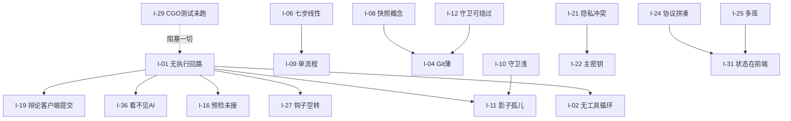
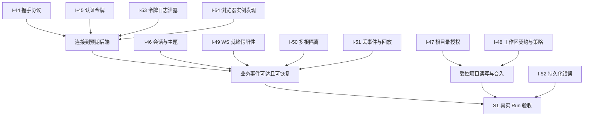

# CodeFlow 项目问题详解（2026-09 全面评审）

> 状态：Active（评审结论）  
> 创建：2026-09-03  
> 范围：产品定位、功能完整度、架构设计、工程卫生、文档流程  
> 依据：`docs/` 全部现行文档、`backend/internal/*` 与 `apps/workbench/src/*` 实际代码、工作树未提交改动（92 文件）  
> 配套：新设计见 `docs/design/codeflow-3.0-redesign.md`；实施计划见 `docs/plans/2026-09-03-codeflow-3.0-implementation-plan.md`  
> 约定：每一条问题都写清「现象 / 证据 / 影响 / 根因 / 处置方向」。凡是根据代码核实的写「已核实」，凡是推断的写「推断」。

---

## 0. 总结论

CodeFlow 已经建成一套相当完整的**治理外围**：流程状态机、关卡、守卫、审计链、双轨记忆、辩论、快照、密钥边界、项目绑定。工程纪律（文档 SSOT、ADR、契约检查、fail-closed 默认）在同类项目里属于上游水平。

但**产品最中间的那个东西是空的**：没有一个能"读文件 → 搜代码 → 改文件 → 跑命令 → 看结果 → 再改"的 AI 执行回路。聊天是模拟数据，Agent 运行时只有 trace/stop/retry 而没有"发一条消息真正调模型"的入口，工具循环不存在。

这个根本缺口向外辐射出三类问题：

1. **孤儿模块**：钩子总线、黑板、隔离沙箱、影子系统、热切换、记忆预检、AST 服务——每一个都建好了，但因为没有执行回路去触发/消费它们，全部处于"有接口、无调用"的状态。
2. **外围假设未经验证**：守卫假设"AI 会通过工作区接口写文件"，关卡假设"阶段有成果"，审计假设"所有敏感操作都经过后端"——这些假设在真 Agent 接上之后大概率要改。
3. **建设顺序反了**：先造城墙后造城。继续往外围加功能，边际价值趋近于零。

本文其余部分逐条展开。问题按层分组，编号 `I-xx`，供设计文档与计划文档引用。

---

## 1. 核心回路层

### I-01 AI 不能"干活"，只能"聊天"（且聊天还是模拟的）

- **现象**：右侧 Agent 伴侣可以输入、可以看到流式回复，但回复来自前端 DEV 模式下的本地模拟生成器。生产环境会探测一次聊天端点，缺失则报"服务不可用（实验性）"。
- **证据（已核实）**：后端路由表里没有任何聊天/执行入口；前端聊天桥模块注释明确写着"后端没有聊天 HTTP 端点，本模块 mock-first"；`PRODUCT.md` 把这条写成"产品事实不是缺陷"。
- **影响**：产品的全部主张（流程驱动、阶段人设、守卫拦截、记忆注入、辩论、审计）都无法被用户体验到；演示时只能"看骨架"。
- **根因**：Agent 运行时被设计成"管理已存在的 Agent 状态"（trace/stop/retry），而不是"执行一次 Agent 任务"。适配器只提供单次请求/流式响应，没有工具调用循环。
- **处置方向**：不自研工具循环。把"执行"外包给成熟的 CLI Agent（Codex app-server、Claude Code、Gemini CLI），CodeFlow 只保留"不动手"角色（追问、写文档、批评、辩论、记忆抽取）的直连模型适配器。见新设计 §4。

### I-02 没有工具循环：读、搜、跑、测全部缺席

- **现象**：即便聊天接通，Agent 也拿不到"读文件""搜索代码""执行命令""跑测试"这些工具。
- **证据（已核实）**：适配器接口只有消息进出；hooks 定义了 13 种钩子（含 before_task_execute / after_exec 等），但没有任何执行器去触发它们。
- **影响**：审查阶段设计要看"测试结果"，但没有谁跑测试；编码阶段的"任务卡 ↔ 变更关联"无从谈起。
- **根因**：同 I-01。
- **处置方向**：同 I-01。工具循环由外部执行后端提供；CodeFlow 通过钩子/协议观察与拦截。

### I-03 没有终端 / 命令执行能力

- **现象**：底部面板设计有"终端"页，实际后端只有"启动/停止 dev server"一种进程能力。
- **证据（已核实）**：工作区路由里进程相关只有 scripts 探测与 dev-servers 启停/日志。
- **影响**：用户和 Agent 都不能在产品内执行命令；用户必然切回外部终端，工作流断裂。
- **处置方向**：提供受策略管控的通用命令执行（PTY 会话、超时、预算、审计），并复用现有 dev-server 的进程管理（环形日志、进程树击杀）。

### I-04 Git 能力过薄

- **现象**：只有基础的 git 管理器；没有分支、没有与基线比对、没有 PR/MR、没有冲突处理、没有 worktree。
- **影响**：提交阶段"变更集自动分组为多个 commit"无法实现；"实验分支"无法实现；影子副本（见 I-14）无处落地。
- **处置方向**：Git 作为一等公民：worktree 管理、分支、diff 基线、commit 分组、可选推送/建 MR。

### I-05 编辑器能力未定义

- **现象**：编码画布有文件树、多 Tab、暂存、diff，但对 LSP、跳转定义、补全、诊断没有任何设计。
- **影响**：编码是七步之一，若编辑体验低于 VS Code，用户会跳出产品，流程随之断裂。
- **处置方向**：明确编辑器定位为"审阅与小改"而不是"主力编辑"，重心放在 diff 审阅、任务关联、守卫反馈；同时接入 LSP 诊断只读展示。大改交给外部执行后端或用户的 IDE。

---

## 2. 流程模型层

### I-06 七步线性流程与真实开发节奏不匹配

- **现象**：内置只有"新建项目""导入项目"两个模板，都是完整七步（想法→设计→规划→调研→编码→审查→提交）。
- **证据（已核实）**：模板定义中两条模板、每阶段均为 auto exit gate。
- **影响**：修一个错别字也要走七步；用户会被流程绑架，最终只用编码画布，产品与普通 IDE 无差别。
- **根因**：流程被设计为"项目级唯一大流程"，缺少"任务级短流程"的概念。
- **处置方向**：流程分两级：项目流（长周期、可选）与任务流（短周期、默认）；一个项目可并行多条任务流；提供 Bug 修复、小改、重构、文档等短模板。见新设计 §5。

### I-07 阶段关卡是空的：空流程可以一路点到提交

- **现象**：所有内置阶段的退出关卡都是"自动通过"；推进时当前阶段的 draft 成果被无条件改成 approved。
- **证据（已核实）**：模板每阶段 `autoExitGate`；后端硬化计划 P-05 明确记录此事实；B6 尚未开始。
- **影响**："阶段完成 = 真实交付"的核心承诺不成立。
- **处置方向**：B6 阶段契约（已在计划中），但要按新的两级流程模型重做：任务流的契约轻（有变更 + 测试通过 + 守卫通过），项目流的契约重。

### I-08 快照的"三位一体回滚"概念站不住

- **现象**：设计要求代码、对话、向量记忆、图谱一起打快照、一起恢复。
- **证据（已核实）**：快照服务在主程序中仍是内存实现，重启即丢；git 恢复靠环境变量开关；对话/向量/图谱的"真恢复"已实现但没有产品级 UX。
- **影响**：
  - 回滚对话和记忆是反直觉的：用户与 AI 讨论半天，回退一下讨论就消失。
  - git 硬回滚管不了未跟踪文件、数据库迁移、依赖安装。
  - 投入巨大（55+ 测试）却不可用。
- **根因**：把"回到过去的状态"当成目标，而正确目标是"从过去某一点开一条新路"。
- **处置方向**：改为**书签 + 分支**模型：历史只追加不删除；快照只是书签；"回退"= 从书签开一条新任务流（git worktree/branch），旧路保留可比较。向量/图谱不回滚，只按书签打时间标签供过滤。见新设计 §7。

### I-09 一个项目只有一条流程

- **现象**：项目绑定"默认 Flow"，工作台按项目+阶段路由。
- **影响**：不能同时做两个功能；不能暂停一条、去做另一条；不能克隆一条流程做实验。
- **处置方向**：项目下多条流程并行；每条流程有自己的 worktree（可选）、任务、成果、预算；共享记忆、守卫、审计。

---

## 3. 守卫层

### I-10 守卫只做"表层规则"，没有语义能力

- **现象**：守卫拦截的是：堆叠命名（`_v2/_new/utils2`）、禁写/废弃路径、文件过大、可执行扩展名、顶层符号同名。
- **证据（已核实）**：规则评估函数逐条即上述六类；符号索引只比对名字与种类。
- **影响**：
  - 改个名字即可绕过重名检测；复制一段代码小改完全看不出来。
  - 设计文档承诺的"签名 + 语义向量双重比对"没有做。
  - 不跑 lint、不跑类型检查、不跑测试。"影子对照全量检查通过才合入"是空话。
- **根因**：M3.2 只做了最小实现；M3.3"与 shadow 串联"从未开始。
- **处置方向**：分五层算法（规则 → 结构指纹 → 项目自带检查 → 向量相似 → AI 复审），95% 的写入不碰模型。见新设计 §8。

### I-11 影子系统成为孤儿

- **现象**：早期设计的影子系统（API 注册表防重复接口、模型词典防重复数据结构、`.codeflow` 脚手架、语义索引、上下文聚焦加载器）在后端有完整实现。
- **证据（已核实）**：`internal/shadow` 五个文件存在；全仓库无任何其他包引用它；无路由暴露；守卫未使用。
- **影响**：最有价值的两个想法（接口级、数据模型级去重）被遗忘；守卫只剩函数名级去重。
- **处置方向**：把 API 注册表与模型词典改造成守卫第二层的两条规则；影子目录概念升级为"影子工作副本"（git worktree），承载外部 CLI 的写入。

### I-12 守卫可被 shell 绕过

- **现象**：守卫挂在"通过工作区接口写文件"这个点上。一旦接入外部 CLI，模型可以用 `echo >`、`sed -i`、`git apply` 直接写盘。
- **影响**：守卫形同虚设。
- **处置方向**：双锁——CLI 钩子拦"写文件"工具（第一道），影子副本合入前对整个 diff 逐文件过守卫（第二道）。

### I-13 审批疲劳没有被当作设计起点

- **现象**：每一步关卡、每次写文件守卫、破例申请、辩论终裁……用户面临高频弹窗。
- **影响**：用户很快麻木，全部点通过，安全体系失效。
- **处置方向**：风险分级默认放行低风险（事后可查），只拦高风险；批量审批；"信任此 Agent 在此项目做此类操作"的持续授权。

---

## 4. 记忆层

### I-14 记忆写入没有质量关

- **现象**：设计为"每轮对话后自动抽三元组进图谱"，无置信度、无来源、无审核、难修改。
- **影响**：图谱越长越脏；AI 检索到错误记忆比没有记忆更糟。
- **处置方向**：三元组带来源与置信度；低置信度进"待确认"区；用户可在界面删改；周期性一致性清理；记忆按项目隔离并可导出。

### I-15 记忆对用户不可见、不可管

- **现象**：没有"AI 记住了我什么"的视图；没有删除、纠正入口（导入流的理解报告除外）。
- **处置方向**：记忆浏览器页面：按项目/时间/类型查看、搜索、删除、纠正、导出。

### I-16 记忆预检/渐进披露后端有、前端无

- **证据（已核实）**：后端有 preflight 路由；前端 Agent 伴侣未接。
- **处置方向**：并入执行回路的"用户提交前"钩子。

---

## 5. Agent 层

### I-17 Agent 分配只按阶段一维匹配

- **现象**：Agent 打"适用阶段"标签，切阶段时按标签过滤、按评分/使用次数排序取前五。
- **证据（已核实）**：推荐函数即上述逻辑；五个内置 Agent 分别标注 planning/coding/review/research 等。
- **影响**：同为编码阶段，"写新模块""修 bug""重构""写测试"需要不同模型和提示词；同为审查，"安全审查"和"性能审查"应用不同批评者。评分是全局一个数，不反映"在这个项目的这类任务上好不好"。
- **处置方向**：阶段 × 任务类型 × 项目上下文三维分配；主脑 + 专家调度；推荐带依据；评分按项目+任务类型累积；项目级覆盖；Agent 内置模型分层（简单任务用便宜模型）。见新设计 §9。

### I-18 两套配置模型打架

- **现象**：老设计"全局/会话/角色三级继承 + 主脑/编码员/子任务三角色"与新设计"Agent 资产各自绑模型/渠道"同时存在，覆盖关系未定义。
- **证据（已核实）**：启动时按三角色注册配置 Agent；Agent Registry 又有独立的 binding 字段。
- **处置方向**：Agent 资产是唯一配置单位；"角色"退化为内置 Agent 的分类标签；三级继承退化为"项目可覆盖 Agent 默认模型"。

### I-19 辩论由客户端提交轮次内容

- **证据（已核实）**：下一轮接口接收客户端提交的 generator_output 与 critic_feedback；服务端只做关键词冲突检测和持久化。
- **影响**：辩论结果取决于客户端是否诚实。
- **处置方向**：B9（已在计划），改为服务端按每方绑定调用执行后端。

### I-20 Agent 运行时与 Agent 资产脱节

- **证据（已核实）**：运行时 Agent 表与 Registry 资产表是两套，没有"按资产版本解析出运行配置"的路径。
- **处置方向**：运行时只认资产 ID + 版本；执行记录引用资产版本。

---

## 6. 安全与隐私层

### I-21 隐私脱敏与"AI 需要看代码"冲突

- **现象**：隐私服务按 PII 模式检测后遮盖，是有损、不可逆的。代码里满是像密钥的字符串（配置、测试数据、日志格式）。
- **影响**：遮了模型看不懂；不遮违背设计。
- **根因**：把"密钥"和"个人信息"混在一个服务里，用同一种手段处理。
- **处置方向**：拆成两类。密钥走 **Jenkins 式凭据绑定**：登记 → 出站替换为稳定占位符 → 入站落盘/执行时还原 → 子进程以环境变量注入；个人信息才用脱敏。见新设计 §10。

### I-22 隐私主密钥只是一个环境变量

- **证据（已核实）**：启动硬性要求 `CODEFLOW_PRIVACY_MASTER_KEY`，缺失即退出。
- **影响**：丢了主密钥 = 所有加密数据作废；桌面用户不可能自己管环境变量。
- **处置方向**：桌面壳生成并存入系统钥匙串；提供导出/恢复口令；首启向导接管。

### I-23 用户画像与架构矛盾

- **现象**：目标用户含"团队技术负责人"（关心审批、审计、权限），但架构是单机、单用户、本机 sidecar，无账号、无共享；审批者与写代码者是同一人。
- **处置方向**：现阶段明确为个人工具；RBAC/隔离角色收起；团队协作作为后续独立里程碑，先用"导出审计包 / 项目包"满足汇报需求。

---

## 7. 架构与工程层

### I-24 通信协议是拼出来的

- **现象**：HTTP 一套、WebSocket 按资源主题一套、规划中 SSE 又一套；事件类型没有统一 schema。
- **影响**：前端要猜；接入外部 CLI 的事件流后会有第四种格式。
- **处置方向**：定义统一"执行事件"schema（queued/running/delta/tool_call/file_change/approval_required/completed/failed/cancelled），HTTP、WS、CLI 流全部收敛到它。

### I-25 状态散落在十几个 SQLite 文件

- **证据（已核实）**：config / planner / project / sessions / raw_archive / memory / atomic_memory / atomic_vectors / samg / context / floweng / skills / guard_exemptions / debates / agents 各一个库。
- **影响**：跨库无事务，被迫用 saga 日志补偿；备份、导出、迁移复杂十倍。
- **处置方向**：单库多表（可分 schema），一个事务解决跨域一致性；向量库可单独。

### I-26 面太宽，大量子系统没有用户

- **证据（已核实）**：黑板、投票、隔离容器、角色权限、PAPI、集成、mapagent、披露、shadow、blackboard——有路由无界面，或无路由无调用。
- **影响**：维护负担，认知负担，测试负担。
- **处置方向**：冻结/删除清单见计划文档 §2。

### I-27 钩子总线空转

- **证据（已核实）**：13 种钩子在启动时启用，但没有执行器触发。
- **处置方向**：钩子总线保留为 CodeFlow 内部事件机制，其触发点改为"执行后端事件适配层"。

### I-28 单进程后端管所有项目

- **影响**：一个项目的 CLI 跑飞、守卫索引卡住，拖累其他项目。接外部 CLI 后风险更大。
- **处置方向**：按项目隔离资源（并发上限、进程组、超时）；长期考虑每项目一个工作进程。

### I-29 SQLite 运行验证未闭环

- **证据（已核实）**：多份计划文档记录"当前 Windows 无 gcc，SQLite 全量测试留待 B11"。2026-09-05 本轮仍为 `CGO_ENABLED=0` 且未发现 gcc，相关 SQLite 用例失败或跳过，详见 §16。
- **影响**：B1–B5 涉及 SQLite 的持久化和跨模块集成缺少当前环境中的有效运行验证；非 SQLite 认证、策略等测试仍可执行，不能笼统认定全部后端都未经测试。
- **处置方向**：安装 MSYS2/MinGW 使 CGO 可用，或经驱动迁移评估改用纯 Go 实现；随后补齐 SQLite 全量运行、重启恢复和故障注入验证。

### I-30 前端两套服务层并存、类型手写

- **证据（已核实）**：`services/` 与 `src/services-bridge/` 同时存在；有 OpenAPI 生成脚本但类型基本手写。
- **处置方向**：收口为单一 bridge；类型从 OpenAPI 生成并 CI 校验。

### I-31 执行状态部分在前端

- **现象**：聊天状态部分在前端 store。
- **影响**：刷新/关窗任务丢失；接 CLI 后任务可能跑十几分钟，必须完全后端持有。
- **处置方向**：执行状态 100% 后端；前端只是观察者，可断线重连回放。

### I-32 时间与离线未考虑

- **现象**：无队列、无重试策略、无"断网能做什么"。
- **处置方向**：执行队列 + 重试策略 + 离线只读模式。

---

## 8. 外部连接层

### I-33 没有 GitHub/GitLab/Issue 集成

- **影响**：不能拉 issue 当任务、不能开 PR、不能读 PR 评论、CI 结果不回流。
- **处置方向**：Git 托管平台适配器（先 GitHub）；issue → 任务流；提交阶段可建 PR；CI 状态回流审查阶段。

### I-34 MCP 停留在文档

- **现象**：到处写"挂 MCP"，未见真正连接 MCP 服务器并把工具给 Agent 用的实现。
- **处置方向**：两向 MCP：作为客户端把外部 MCP 工具给执行后端；作为服务器把"查记忆/查图谱/查阶段成果/查守卫规则"暴露给外部 CLI。

---

## 9. 前端体验层

### I-35 任务层是空的

- **现象**：规划阶段产出任务清单，但任务不能被领取、执行、标完成；无后台任务、无并行、无通知。
- **处置方向**：任务成为一等公民；任务可派给 Agent 后台运行；通知中心。

### I-36 看不见 AI 在干什么

- **现象**：无执行轨迹视图；"嵌套子对话渲染"未做；无"撤销上一次 AI 操作"。
- **处置方向**：运行详情页 = 事件时间线 + 文件变更 + 工具调用 + 费用；单次运行可整体撤销（基于影子副本）。

### I-37 上下文控制弱

- **现象**：只能勾文件。
- **处置方向**：按符号选、自动依赖扩展、项目规则文件（`.codeflow/rules.md`）、"本次发给模型的内容"预览。

### I-38 全局搜索缺失

- **现象**：Cmd+K 无代码/符号/对话搜索；后端有混合检索，前端未接。

### I-39 文档类成果编辑器弱

- **现象**：想法/设计文档无 Markdown 预览、无 Mermaid 渲染（设计画布承诺双栏架构图）。

### I-40 日常小项

通知中心、快捷键体系、会话导出/分享、多语言、画布撤销/重做、首启向导。

---

## 10. 文档与流程层

### I-41 文档中存在过期依赖图

- **证据（已核实）**：`DIRECTORY_STRUCTURE.md` 称 workbench 依赖 `@codeflow/core`；实际 `apps/workbench/package.json` 不依赖任何 `packages/*`。
- **处置方向**：更正；`packages/*` 标记为遗留资产。

### I-42 手机端与插件市场过早出现在路线图

- **处置方向**：明确后置到核心回路稳定之后。

### I-43 里程碑以"模块落地"而非"用户能做什么"计量

- **现象**：对等矩阵按模块打 ✅/⚠️；进度记录按 PR 罗列。
- **影响**：模块全 ⚠️ 但用户什么都做不了。
- **处置方向**：新计划以"用户旅程"为验收单位。

---

## 11. 孤儿模块清单（有代码、无调用或无入口）

| 模块 | 状态 | 处置 |
|---|---|---|
| `internal/shadow` | 无任何引用 | 拆用：API 注册表 / 模型词典 → 守卫第二层；目录概念 → 影子工作副本 |
| `internal/blackboard` | 有路由无 Agent 读写 | 冻结；多 Agent 协调改由执行编排器承担 |
| `internal/hooks` | 13 钩子无触发者 | 保留为内部事件机制；触发点接执行事件适配层 |
| `internal/isolation` | 容器/角色接口无执行 | 冻结 RBAC；沙箱职责交给执行后端 + 影子副本 + 策略层 |
| `internal/hotswap` | 无运行中任务可切 | 保留概念；落到"新运行读取新配置" |
| `internal/mapagent` | 未见入口 | 评估后删除或并入记忆 |
| `internal/disclosure` / memory preflight | 后端有前端无 | 并入执行回路"提交前"钩子 |
| `internal/ast` | 仅被守卫抓符号名 | 升级为守卫结构指纹 + 上下文构建器依赖扩展的共享服务 |
| votes / integrations 路由 | 无界面 | 冻结 |
| `packages/core|cli|gui|ui-components|shared` | 主前端不依赖 | 标记遗留；不再维护 |

---

## 12. 问题之间的依赖关系

阅读方式：箭头指向"被拖累的问题"。`I-29` 阻断 SQLite 持久化及其集成链路的运行验证，非 SQLite 包仍可验证；本轮新增的桌面连接阻断见 §15。`I-01` 是执行能力的根本缺口，解决后可为多个孤儿模块提供实际调用者。

---

## 13. 保留的优点（不要在重构中丢掉）

- 文档 SSOT 与 ADR 惯例；"未实现不得写成已实现"的诚实原则。
- 项目权威绑定与前向 saga 日志的思路（虽然单库后可简化）。
- 密钥独立加密存储、配置读写模型分离。
- 守卫"豁免有代价、走审计"的机制设计。
- 关卡 `on_fail = escalate_to_debate` 的想法。
- 审计文件哈希链与启动校验。
- 前端 mock 层的 DEV-only 编译剔除做法。
- 黑白简约、浅色默认、禁紫、渐变只做签名色的视觉纪律。

---

## 14. 本轮补充：运行时接线与信任边界

复核日期：2026-09-05。以下依据当前工作树，包含已有未提交代码；设计和计划中的目标作为对照材料，未作为本轮的实施指令。除特别注明的触发条件外，“已核实”表示调用路径已逐段对齐，不表示已运行完整桌面 E2E。

### I-44 Sidecar 握手协议与桌面端解析不一致

- **现象**：后端实际监听随机端口时输出 `CODEFLOW_HANDSHAKE:{protocol_version,host,port,token,...}`；Tauri sidecar 只识别旧的 `CODEFLOW_PORT:` 前缀。
- **证据（已核实）**：[router.go:601](D:/Project/Codeflow/backend/internal/api/router.go:601) 输出 `CODEFLOW_HANDSHAKE`；[lib.rs:43](D:/Project/Codeflow/apps/workbench/src-tauri/src/lib.rs:43) 只解析 `CODEFLOW_PORT`；[api.ts:105](D:/Project/Codeflow/apps/workbench/api.ts:105) 在 10 秒轮询失败后回退 8080。[main.go:56](D:/Project/Codeflow/backend/cmd/codeflow-server/main.go:56) 默认 `PORT` 为 `0`。
- **影响**：桌面端拿不到实际端口，通常连接到错误的 8080；同时握手里的 token 没有进入前端状态，后续认证也无法完成。I-44、I-45、I-46 共同阻断桌面端真实启动回路。
- **根因**：启动协议已在后端和 ADR 0004 升级，但 Rust 壳和前端仍按旧的端口单字段协议实现。
- **处置方向**：以一个版本化握手 schema 为唯一协议；Tauri 解析并暂存 host、port、token、protocol version，前端只从内存态读取；解析失败或协议版本不兼容时明确失败，不回退到猜测端口。补充 sidecar 启动、端口占用和重启 E2E。

### I-45 前端 HTTP、Ready 与 WebSocket 都没有接入 sidecar token

- **现象**：前端公共 HTTP 客户端只设置 `Content-Type`；`/ready` 的原始 fetch 也没有认证头；WebSocket 构造函数没有发送 Bearer 或 token 子协议。
- **证据（已核实）**：[api.ts:188](D:/Project/Codeflow/apps/workbench/api.ts:188) 未设置 `Authorization`；[readiness.ts:45](D:/Project/Codeflow/apps/workbench/src/services-bridge/readiness.ts:45) 直接请求 `/ready`；[ws.ts:84](D:/Project/Codeflow/apps/workbench/src/services-bridge/ws.ts:84) 只拼接 URL。后端 [router.go:139](D:/Project/Codeflow/backend/internal/api/router.go:139) 和 [API 分组:154](D:/Project/Codeflow/backend/internal/api/router.go:154) 要求认证；[hub.go:365](D:/Project/Codeflow/backend/internal/websocket/hub.go:365) 再验 WS token/子协议。
- **影响**：生产前端的启动检查拿到 401 并进入失败/离线路径；即使绕过启动页，项目、工作区、流程请求仍全部 401，WebSocket 升级也会被拒绝。
- **根因**：认证令牌只存在于后端握手输出，前端 API 层没有凭据注入接口，浏览器 WebSocket 又必须使用 `codeflow.v1` 与 `codeflow.token.<token>` 子协议。
- **处置方向**：启动握手成功后建立进程内 token provider；所有 HTTP 请求统一注入 Bearer；浏览器 WS 使用约定子协议并只在连接握手中传递；禁止把 token 写入持久化、普通日志或错误信息。为 `/ready`、普通 API、WS 各加一条真实 sidecar 集成测试。

### I-46 WebSocket 使用不存在的会话 ID，且有效会话也没有可订阅主题

- **现象**：前端单例生成随机 `wb-*` client ID，并把它当作 `/conversations/:sessionId/stream` 的会话 ID；服务端先查该会话的 trace，不存在就返回 404。即使改成已有会话，路由调用 `HandleScopedWebSocket` 时没有传 `allowedTopics`，客户端随后发送的主题订阅会全部被 `topicAllowed` 拒绝。
- **证据（已核实）**：[ws.ts:30](D:/Project/Codeflow/apps/workbench/src/services-bridge/ws.ts:30) 生成 `wb-*`；[agents.go:225](D:/Project/Codeflow/backend/internal/api/handlers/agents.go:225) 查 trace 后升级且未传允许主题；[service.go:335](D:/Project/Codeflow/backend/internal/agent/service.go:335) 对未知会话返回 `nil`；[hub.go:488](D:/Project/Codeflow/backend/internal/websocket/hub.go:488) 只接受 allowlist 中的主题。
- **影响**：实时聊天、流程事件、工作区变更和辩论更新都无法通过当前单例连接到达前端；重连只会重复失败，界面上的“在线”状态没有可靠业务含义。
- **根因**：客户端把“连接标识”和“资源会话”混为一物；后端资源 scope 设计为会话/项目专属，前端却按全局事件总线使用，且没有创建或绑定真实 Run/Conversation 的生命周期。
- **处置方向**：由服务端创建并返回真实 session/run ID，按运行订阅；或提供单独的、明确 allowlist 的全局事件端点。为每种主题定义服务端授权范围，并覆盖“新建会话、重连、会话不存在、取消后重连”的测试。

### I-47 工作区根目录仍可由请求头直接指定

- **现象**：即使项目 ID 缺失、无效或查询失败，处理器仍接受 `X-Codeflow-Workspace-Root`，把它当作工作区根目录；该路径不要求对应已绑定项目。
- **证据（已核实）**：[workspace.go:21](D:/Project/Codeflow/backend/internal/api/handlers/workspace.go:21) 在项目解析失败后无条件接受请求头；[service.go:21](D:/Project/Codeflow/backend/internal/workspace/service.go:21) 把空 `allowedRoots` 定义为 unrestricted；[main.go:204](D:/Project/Codeflow/backend/cmd/codeflow-server/main.go:204) 仅在 `CODEFLOW_WORKSPACE_ROOTS` 非空时设置限制。
- **影响**：默认未配置 roots 限制时，持有有效 token 的请求可越过项目绑定，读取或监听当前系统用户可访问的任意目录。写入仍受 I-48 的独立策略限制；启用本地允许策略后，写入同样缺少项目根约束。限制相对路径不能弥补客户端自行选择 root 的问题。
- **根因**：项目权威绑定和旧桌面迁移输入并存，兼容 header 没有像 body/query 一样受显式迁移开关控制；默认空 allowlist 又被解释成无限制。
- **处置方向**：生产请求必须解析出已绑定项目并由服务端反查 root；移除或彻底隔离客户端 root header/body；空 allowlist 在生产直接拒绝绑定和文件操作。保留迁移开关时，必须带显式开发标记并在审计中标明。

### I-48 工作区前端仍用旧 root 契约，生产读写和合入被阻断

- **现象**：前端 list/read/write/promote 只在 query/body 中传 root，不传 `project_id`，而服务端默认禁用这两种旧 root 输入。即使通过迁移开关让 root 可解析，生产 evaluator 仍要求项目身份且默认没有允许操作；`Promote` 内部创建 `WriteRequest` 时也丢失项目身份。
- **证据（已核实）**：[workspace bridge:32](D:/Project/Codeflow/apps/workbench/src/services-bridge/workspace.ts:32)、[写入:69](D:/Project/Codeflow/apps/workbench/src/services-bridge/workspace.ts:69) 和 [合入:101](D:/Project/Codeflow/apps/workbench/src/services-bridge/workspace.ts:101) 使用旧字段；[根解析:34](D:/Project/Codeflow/backend/internal/api/handlers/workspace.go:34) 默认拒绝 body/query root；[policy.go:257](D:/Project/Codeflow/backend/internal/policy/policy.go:257) 安装空操作 allowlist 并要求项目身份；[Write:277](D:/Project/Codeflow/backend/internal/workspace/service.go:277) 执行策略；[Promote:393](D:/Project/Codeflow/backend/internal/workspace/service.go:393) 未传 `ProjectID`；[trace.go:81](D:/Project/Codeflow/backend/internal/api/middleware/trace.go:81) 也没有把项目头写入 audit trace。
- **影响**：认证修复后，当前 bridge 请求通常先得到 `400 root is required`，文件树和编辑器仍不可用。让 root 可解析后，缺失项目身份的写入会被拒绝，且 write 处理器把策略拒绝映射为 500、promote 映射为 400，用户仍无法完成“编辑→审阅→合入”。仅给前端补字段不能修好 promote 的服务层身份丢失。
- **根因**：策略已下沉到最低执行边界，但项目身份没有贯穿 HTTP DTO、request trace、workspace service 和 promote 链路；fail-closed 只完成了拒绝，没有配套可用的生产授权配置。
- **处置方向**：所有 workspace mutation 统一使用 project ID，由服务端根据项目反查 root，并把身份传入 direct/stage/promote/discard/watch；生产策略需要显式配置允许的操作。增加“非本地开发模式下完整写入和合入”的 E2E，而不是只测单元服务。

### I-49 启动检查把 HTTP Ready 当成 WebSocket 已就绪

- **现象**：启动页的 WebSocket 步骤只检查 `/ready` 返回的 `status === ready`；readiness 模块从未建立 WebSocket，也没有等待 WS 认证或升级成功。
- **证据（已核实）**：[StartupGate.tsx:22](D:/Project/Codeflow/apps/workbench/src/startup/StartupGate.tsx:22) 将 `ws` 步骤映射为 readiness status；[readiness.ts:45](D:/Project/Codeflow/apps/workbench/src/services-bridge/readiness.ts:45) 只有 HTTP fetch。
- **影响与触发条件**：I-44/I-45 修复到 `/ready` 能成功后，I-46 仍可阻断实际 WS，而启动页会把 WebSocket 标为完成；用户进入实时面板后才发现事件不更新。当前尚有认证阻断，不能据此宣称已经实测到启动页假阳性。
- **根因**：健康、就绪、实时通道三个状态被压成一个后端 readiness 状态，启动门没有订阅 WebSocket 客户端的真实状态。
- **处置方向**：把 WS 探针或实际单例连接纳入启动状态；只有收到成功升级并完成认证后才标记通过；失败时展示可区分的端口、认证、会话错误，并允许独立重连。

### I-50 多根工作区订阅会串线

- **现象**：前端对任意 `workspace:root:*` 主题都把所有 `workspace_event` 视为匹配，没有比较事件中的 `data.root` 或事件 topic。一个 socket 同时订阅多个根目录时，根 A 的变更会触发根 B 的处理器。
- **证据（已核实）**：[ws.ts:44](D:/Project/Codeflow/apps/workbench/src/services-bridge/ws.ts:44) 对所有 workspace root 主题只检查事件类型；[ws_notifier.go:33](D:/Project/Codeflow/backend/internal/workspace/ws_notifier.go:33) 只在 data 中携带 root；[CodingCanvas.tsx:92](D:/Project/Codeflow/apps/workbench/src/stages/CodingCanvas.tsx:92) 的订阅回调也没有校验 root。
- **影响与触发条件**：这是同一连接存在两个 root 订阅时的潜在隔离缺陷，目前工作台只使用一个 active watch，且 I-46 尚阻断主题订阅。扩展到多工作区或多个并行 Run 后，根 A 的事件会触发根 B 缓存失效并产生错误活动提示，不能沿用目前的分发假设。
- **根因**：协议没有把 topic 作为事件字段保留，前端又依赖内容重算路由；代码注释声称“处理器会过滤 root”，但当前 handler 分发层没有实现该过滤。
- **处置方向**：事件携带规范化 root 或服务端 topic，客户端按 canonical root 精确匹配；全局主题与根主题使用不同事件 envelope。增加双根订阅的隔离测试。

### I-51 WebSocket 满载时静默丢事件，且没有回放能力

- **现象**：Hub 向客户端发送缓冲区写入使用 `default` 分支，缓冲区满时直接跳过；事件没有持久化序号，也没有按游标补发的 HTTP/WS API。
- **证据（已核实）**：[hub.go:181](D:/Project/Codeflow/backend/internal/websocket/hub.go:181) 和 [topic 广播:259](D:/Project/Codeflow/backend/internal/websocket/hub.go:259) 在发送缓冲满时静默丢弃；[ws.ts:91](D:/Project/Codeflow/apps/workbench/src/services-bridge/ws.ts:91) 重连时仅重放订阅表。
- **影响**：当前文件/流程事件在慢客户端下可能丢失，重连只能继续接收新消息；刷新 HTTP 状态可恢复部分资源，但事件顺序无法恢复。3.0 执行事件与审批接入时必须补齐此能力，才能满足 S1 的“带序号回放”验收；不能把重放订阅表视为已实现事件回放。
- **根因**：当前 Hub 只承担内存 fan-out，没有执行事件存储和客户端游标协议；背压策略被简化成丢弃而未通知消费者。
- **处置方向**：事件先追加到持久化事件表并分配单调序号；客户端带 `since`/cursor 连接或调用回放接口；无法跟上时明确断开并要求重放，而不是静默成功。将回放纳入 Run 详情和审计 E2E。

### I-52 Agent 运行时持久化错误被吞掉

- **现象**：Agent 注册、状态更新、日志追加、trace 开始和结束等路径调用 `persistLocked` 后直接丢弃错误；这些方法的接口也没有返回错误，API 仍可能返回成功。
- **证据（已核实）**：[CreateAgent:230](D:/Project/Codeflow/backend/internal/agent/service.go:230) 调用无错误返回的 `RegisterAgent` 后直接返回成功；[注册持久化:441](D:/Project/Codeflow/backend/internal/agent/service.go:441)、[日志:479](D:/Project/Codeflow/backend/internal/agent/service.go:479)、[trace:516](D:/Project/Codeflow/backend/internal/agent/service.go:516) 丢弃保存错误；[sqlite_service.go:129](D:/Project/Codeflow/backend/internal/agent/sqlite_service.go:129) 的 `Save` 返回编码、事务及提交错误；[main.go:143](D:/Project/Codeflow/backend/cmd/codeflow-server/main.go:143) 启用该持久化服务。
- **影响**：磁盘满、数据库锁定或损坏时，内存状态继续前进但重启后丢失 Agent、日志、会话 trace；用户看到的运行结果与可恢复状态不一致，审计和“重启后仍在”验收也会失真。
- **根因**：兼容的 InMemory 接口沿用无错误的内部方法签名，持久化被当作旁路副作用；没有定义“内存已变更但 durable save 失败”时的状态转移。
- **处置方向**：将所有会改变 durable runtime 的操作改为返回错误或进入显式 `persistence_failed` 状态；写入失败时阻止成功响应并告警，或使用可靠队列重试；关闭服务时继续保留最后一次 flush 错误。补充磁盘/锁故障注入测试。

### I-53 握手令牌会被 Tauri 当作普通后端日志回显

- **现象**：后端把包含 token 的握手行写到 stdout；Tauri 只识别 `CODEFLOW_PORT:`，因此把 `CODEFLOW_HANDSHAKE:{...token...}` 走普通日志分支打印。
- **证据（已核实）**：[router.go:603](D:/Project/Codeflow/backend/internal/api/router.go:603) 将 token 放进握手 JSON；[lib.rs:53](D:/Project/Codeflow/apps/workbench/src-tauri/src/lib.rs:53) 对未识别的行执行 `println!("[Go Backend] {}", text)`；[ADR 0004:14](D:/Project/Codeflow/docs/adr/0004-sidecar-trust-boundary.md:14) 要求令牌不进入普通日志。
- **影响**：sidecar 日志、桌面调试输出或日志收集器可能记录可直接访问本机 API 的进程令牌；即使功能最终连通，也破坏了本机信任边界。
- **根因**：受控协议行未被消费，协议解析和日志转发共用同一分支。
- **处置方向**：先解析并消费握手行，再转发其他 stdout；日志分支对协议前缀做显式脱敏；增加测试断言日志中不出现 token，并验证日志级别和崩溃收集路径。

### I-54 浏览器端只按“健康”挑后端，未绑定进程身份

- **现象**：浏览器模式依次探测 same-origin、环境变量、8080/18080 等候选地址，只要 `/health` 返回 `healthy` 就选中，没有校验握手 token、进程 nonce 或目标项目。
- **证据（已核实）**：[api.ts:32](D:/Project/Codeflow/apps/workbench/api.ts:32) 定义候选地址；[识别:50](D:/Project/Codeflow/apps/workbench/api.ts:50) 只检查 `/health` 的状态/服务文本；[common.go:44](D:/Project/Codeflow/backend/internal/api/handlers/common.go:44) 的健康响应没有实例标识。
- **影响**：机器上存在旧进程、另一份 CodeFlow 或端口残留时，前端可能连接到错误实例；由于 token 按进程生成，随后表现为随机 401/Ready 失败，调试时难以区分“后端不可用”和“接错后端”。
- **根因**：服务发现和信任建立被合并成无认证健康探测；浏览器没有可验证的 sidecar 握手来源。
- **处置方向**：浏览器开发模式使用显式 API base 与 token 配置，生产/桌面模式使用受控握手或同源注入的实例 nonce；健康探测只做连通性，不承担身份选择。增加“两个健康后端同时存在”的发现测试。

## 15. 本轮问题的依赖关系

下图箭头表示右侧验收依赖左侧问题得到处理；并列问题需要分别验证，并不互为根因。

优先处理 I-44/I-45/I-46/I-48 的主旅程阻断，以及 I-47/I-53 的信任边界缺口。I-51/I-52 必须在运行事件接入前定义可靠交付语义；I-49/I-50/I-54 需要随对应场景验收。S0/S1 应增加桌面握手、认证、项目读写和事件恢复验收，不能仅凭后端单包通过或启动页变绿宣告完成。

## 16. 本轮验证记录

| 检查 | 2026-09-05 结果 | 结论边界 |
|---|---|---|
| `go test ./internal/api/middleware ./internal/policy ./internal/websocket ./internal/workspace ./internal/agent -count=1` | 通过 | 当前 `CGO_ENABLED=0`；Agent 的 SQLite 重启用例会 skip，不能作为持久化验证通过的证据 |
| `go test ./internal/api -run 'Test.*(Security|Handshake|Auth|WebSocket)' -count=1` | 通过 | 聚焦 API 认证/握手；未覆盖 Rust 壳、真实前端或全部 API 用例 |
| API/handlers 等相关包整组测试 | 未通过 | SQLite 用例报 go-sqlite3 requires cgo；本机无 gcc。PAPI 性能测试忽略初始化错误后发生空指针，见 [papi_bench_test.go:125](D:/Project/Codeflow/backend/internal/api/handlers/papi_bench_test.go:125) |
| `TestIntegrationWorkflowAPI` 单独重跑 | 失败，invoke 返回 500 | [integrations_test.go:250](D:/Project/Codeflow/backend/internal/api/handlers/integrations_test.go:250)。fixture 只初始化 snapshot/audit/integration/hooks，而默认 snapshot 现在要求 agent/memory/samg 服务；属于测试依赖装配未同步，未据此另报生产缺陷 |
| `pnpm exec tsc --noEmit -p apps/workbench/tsconfig.json` | 未通过，3 条诊断 | [App.tsx:1158](D:/Project/Codeflow/apps/workbench/App.tsx:1158) 的 CallTrace/ConversationTraceResponse 不匹配；[App.tsx:2194](D:/Project/Codeflow/apps/workbench/App.tsx:2194) 的 wiki action 数据和回调类型不匹配。均为当前工作树已有问题，本轮未改源码 |
| Markdown 编号检查 | 通过 | I-01 至 I-54 连续且无重复；Prettier 检查报告格式差异，本轮保留既有排版，未做全文格式化 |

本轮仅更新本评审文档。完整桌面启动、SQLite 故障注入及浏览器双实例场景尚未运行；新增条目提供了待覆盖的触发条件和源码证据，不能替代这些集成验收。
