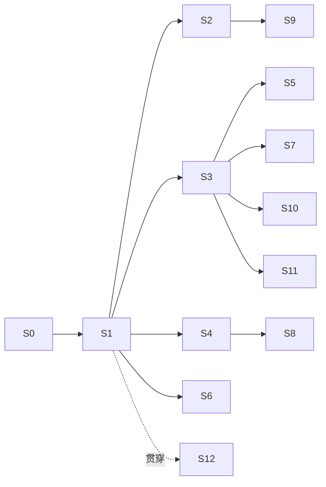

# CodeFlow 3.0 实施计划

> 状态：Active（提议，待接受）  
> 创建：2026-09-03  
> 依据：同目录下的 [2026-09-03-project-issues-deep-dive.md](2026-09-03-project-issues-deep-dive.md)（I-xx）、[codeflow-3.0-redesign.md](codeflow-3.0-redesign.md)（§x）  
> 关系：本计划接管 [2026-08-18-backend-product-hardening-plan.md](../../plans/2026-08-18-backend-product-hardening-plan.md) 中未完成的 B6–B11，将其重排进新阶段；[2026-07-11-codeflow-2.0-implementation-and-hardening-plan.md](../../plans/2026-07-11-codeflow-2.0-implementation-and-hardening-plan.md) 的 M2–M7 按本计划重新解释  
> 验收原则：**每个阶段的验收单位是"用户能完成一条旅程"**，不是"模块落地"（I-43）

---

## 1. 总览

| 阶段 | 名称 | 用户能做到什么 | 依赖 |
|---|---|---|---|
| S0 | 解除阻塞 | 开发者能跑全部后端测试 | — |
| S1 | 第一条真实 Run | 在一个项目里让 Claude Code 完成一个小任务，看到过程，合入结果 | S0 |
| S2 | 双锁守卫 + 密钥库 | AI 写的东西经守卫、密钥不泄露 | S1 |
| S3 | 任务流 + 契约 + 审批 | 用任务流模板派活、审批、合入；一个项目多条并行 | S1 |
| S4 | 第二、第三执行后端 | 同一任务可选 Codex / Gemini CLI；Agent 资产绑后端 | S1 |
| S5 | 运行详情 + 首页待办 + 通知 | 看得见 AI 在干什么；批量审批 | S1, S3 |
| S6 | 记忆闭环 + MCP 服务器 | AI 主动查项目记忆；用户能管记忆 | S1 |
| S7 | 书签与分支 | 从任一书签开新路，并排比较 | S3 |
| S8 | Agent 分配与辩论 | 主脑+专家；三维推荐；服务端辩论 | S4 |
| S9 | 守卫深层 | 结构指纹、API 注册表、模型词典、项目检查 | S2 |
| S10 | 项目流 + 文档画布 | 七步长流程可用；Mermaid/Markdown | S3, S7 |
| S11 | 外部连接 | GitHub issue → 任务，提交 → PR，CI 回流 | S3 |
| S12 | 收口 | 单库、协议统一、前端服务层收口、文档同步 | 贯穿 |

依赖图：



S2、S3、S4、S6 可以在 S1 之后并行；其余按箭头。

---

## 2. 冻结与删除清单（S0 期间执行）

| 对象 | 动作 | 说明 |
|---|---|---|
| `internal/blackboard`、`/api/v1/blackboard` | 冻结（路由保留，标 deprecated，不再改） | I-26 |
| `internal/isolation` 的 RBAC / 角色路由 | 冻结 | I-23；沙箱职责移交策略层 + 影子副本 |
| `/api/v1/votes`、`/api/v1/integrations` | 冻结 | 无界面 |
| `internal/mapagent` | 评估后删除或并入 memory | 需先确认无引用 |
| `internal/snapshot` 破坏性 git 恢复 | 删除 | §7 |
| `packages/core|cli|gui|ui-components|shared` | 标 legacy；从 Nx 默认目标移除 | I-41 |
| `apps/workbench/services/`（旧服务层） | 逐步迁入 `services-bridge`，S12 删除 | I-30 |
| 路线图中 M7 手机端、M6 插件市场 | 后置，移出主计划 | I-42 |

冻结 = 不再投入、不再写入对等矩阵、路由标 deprecated；删除必须先 ADR。

---

## 3. 各阶段详细

### S0 解除阻塞（1 周）

**用户结果**：无（开发者结果）。

**做什么**
- ADR 0009：SQLite 驱动决策。建议迁 `modernc.org/sqlite`（纯 Go），消除 CGO 环境依赖（I-29）。若保留 go-sqlite3，则本机安装 MSYS2 并在 CI 固定镜像。
- 跑通全部后端测试（含 SQLite 相关），把失败清零。
- 执行 §2 冻结清单第一批（标 deprecated，不删代码）。
- 更正 `DIRECTORY_STRUCTURE.md` 依赖图。

**验收**：`go test ./...` 本机与 CI 全绿；对等矩阵新增"冻结"图例。

---

### S1 第一条真实 Run（3 周）

**用户结果**：在一个已绑定的项目里，输入"给 X 函数加单元测试"，选择 Claude Code，看到实时事件，结束后看到 diff，点"合入"，文件真的变了，审计里有记录。

**做什么**
- 新包 `internal/run`：Run 模型、状态机、事件存储（追加表 + 序号）、断线回放。
- 新包 `internal/execbackend`：抽象接口；第一个实现 `claudecode`（SDK 非交互 + stream-json + 钩子配置生成与校验）。
- 新包 `internal/shadow`（重用包名，替换旧内容）：影子副本 = git worktree（无 git 则临时目录复制）；创建、diff、合入、丢弃。
- 任务文件生成器：阶段/任务/契约/记忆摘要/规则 → `CLAUDE.md`。
- 统一执行事件 schema（JSON Schema 入库，I-24）：`queued running delta tool_call file_change approval_required approved rejected completed failed cancelled`。
- WS：单连接、按 `run:{id}` 与 `project:{id}` 订阅；带序号回放。
- HTTP：`POST /runs`、`GET /runs/:id`、`GET /runs/:id/events?since=`、`POST /runs/:id/approve`、`POST /runs/:id/cancel`、`POST /runs/:id/merge`、`POST /runs/:id/discard`。
- 前端：Agent 伴侣的"发送"改为创建 Run；最小运行视图（事件列表 + diff + 合入/丢弃）。
- 钩子：PreToolUse 先只做审计 + 越界路径拒绝；PostToolUse 审计。

**不做**：守卫五层、密钥库、多后端（留给后续）。

**验收（E2E）**：fake backend 与真实 Claude Code 各一条；断开 WS 再连能回放；合入后 git diff 与运行详情一致；审计链验证通过。

---

### S2 双锁守卫 + 密钥库（3 周，与 S3/S4 并行）

**用户结果**：AI 试图创建 `utils_v2.go` 被拦并自动改正；`.env` 里的密钥在模型看到的任何内容里都是 `«SECRET:...»`，但测试照样跑通。

**做什么**
- 守卫接入钩子锁：PreToolUse 写文件/打补丁 → `guard.Evaluate`，拒绝时返回结构化原因。
- 守卫接入合入锁：`merge` 前逐文件 Evaluate；任一 error 阻止合入并展示。
- Vault：`internal/vault`：登记（手动 / 文件规则 / 高熵发现待确认）、替换器（出站）、还原器（入站）、进程注入、日志遮盖。
- 出站接入点：任务文件生成、MCP 响应、stream 事件 delta 内容、工具输出回传。
- 入站接入点：合入写盘、命令执行。
- 主密钥：Tauri 壳生成并存钥匙串；后端从壳握手获得；首启向导页面。
- 隐私服务拆分：PII 脱敏保留；密钥相关逻辑移交 Vault。

**验收**：绕过测试（shell 写文件被合入锁拦）；密钥值在 Run 事件、审计、任务文件、日志全文扫描为零；子进程环境变量拿到真值。

---

### S3 任务流 + 契约 + 审批（3 周）

**用户结果**：从"新功能"模板开一条任务流；拆解阶段产出 3 个任务；每个任务派给 Agent 后台跑；等待审批的操作在首页出现；审阅阶段看到变更集；合入。同一项目再开第二条任务流并行。

**做什么**
- floweng：Flow 加 `kind`、`worktree`；模板增加五个任务流模板；一个项目多 Flow。
- 阶段契约：`Contract` 声明 + `advance` 返回 `advanced|blocked|waiting_gate` + `missing/stale/next`（接管 B6）。
- 风险分级策略：`internal/policy` 加风险表与持续授权；PreToolUse 按风险决定放行/审批。
- Task：模型、队列（按项目并发上限）、派发为 Run、状态回写。
- 前端：流程页（阶段 + 任务列表 + 派活）；审批弹层；多流程切换。

**验收**：空流程不能合入；两条流程并行各自影子副本；持续授权后同类操作不再弹窗；审批记录进审计。

---

### S4 第二、第三执行后端（2 周）

**用户结果**：同一任务可选 Codex 或 Gemini CLI 执行；Agent 资产里能指定后端。

**做什么**
- `execbackend/codex`：app-server JSON-RPC 子进程；审批请求映射到 Run approval；事件映射。
- `execbackend/gemini`：非交互 + 钩子 + JSON 输出。
- `execbackend/custom`：约定协议。
- Agent 资产加 `backend`、`model_policy`、`purpose`、`fit`；运行时按资产版本解析（I-20）。
- 设置页：执行后端检测（已安装/版本/登录状态）。

**验收**：三后端各跑通 S1 的 E2E；缺失后端时给出可执行的安装指引。

---

### S5 运行详情 + 首页待办 + 通知（2 周）

**用户结果**：打开任一 Run 看到时间线（读了什么、调了什么、改了什么、花了多少）；首页有"等你审批 3 / 失败 1 / 完成 5"；可批量审批；可整体撤销一次 Run 的合入。

**做什么**
- 运行详情页：事件时间线、文件变更 diff、工具调用折叠、审批记录、费用；"撤销合入"= 反向应用 diff 生成新 Run。
- 首页：待办卡（审批/失败/完成）、运行中、最近项目、用量。
- 通知中心：后端事件 → 通知表 → 前端角标；桌面通知（Tauri）。
- 批量审批接口。

**验收**：撤销后工作副本恢复且审计有记录；批量审批 10 条一次通过。

---

### S6 记忆闭环 + MCP 服务器（3 周）

**用户结果**：AI 执行时会主动查"这个项目以前怎么处理过 X"；Run 结束后自动沉淀记忆并让我确认；我能在记忆页看、删、改。

**做什么**
- 记忆模型加来源 Run、置信度、类型、待确认状态。
- 记忆抽取 Agent（API 直连、便宜模型）在 Run 结束后运行；低置信度进待确认。
- MCP 服务器：`search_memory / query_graph / get_artifact / get_guard_rules / check_write`；各执行后端启动时挂载。
- 记忆预检接入"用户提交前"钩子（I-16）。
- 记忆浏览器页。

**验收**：fake backend 通过 MCP 查到记忆；抽取的记忆可被用户拒绝且不再出现；跨 Run 记忆生效的 E2E。

---

### S7 书签与分支（2 周）

**用户结果**：每个阶段完成自动打书签；从任一书签"开新路"得到一条新流程（独立 worktree）；两条路并排比较成果与 diff。

**做什么**
- `internal/bookmark`：书签模型（git ref + 对话位置 + 成果版本集）。
- 从书签创建 Flow（worktree）。
- 比较视图。
- snapshot 模块：删除破坏性恢复；conversation/vector/graph 恢复代码改为按书签时间过滤。
- ADR 0010：快照 → 书签。

**验收**：开新路不影响旧路；记忆检索按书签过滤正确。

---

### S8 Agent 分配与辩论（3 周）

**用户结果**：派任务时系统推荐 Agent 并说明理由；主脑自动拆分并召唤专家；审查关卡失败自动开一场三方辩论，结论回流成成果。

**做什么**
- 三维推荐（阶段 × 任务类型 × 项目上下文）；评分按 (project, task_type)。
- 主脑 + 专家编排：conductor Agent 通过 API 直连产出计划，编排器按计划创建子 Run。
- 辩论服务端执行（接管 B9）：每方 API 直连；仲裁/投票/终裁；结论 Artifact。
- 配置模型收口：删除三角色启动注册；三级继承退化为项目覆盖（I-18）。
- Agent 页：编辑、评分、后端与模型策略。

**验收**：fake 三方不同模型辩论 E2E；推荐依据可解释；批评者与生成者模型不同的约束被强制。

---

### S9 守卫深层（3 周）

**用户结果**：AI 把已有函数复制改名被拦；AI 新建了一个和现有接口重复的路由被拦；合入前自动跑 lint/typecheck/受影响测试。

**做什么**
- 结构指纹：函数级 AST 归一化哈希 + 编辑距离。
- API 注册表与模型词典：从旧 shadow 迁入，改为从代码索引自动构建，作为规则接入。
- 项目检查：读取项目 lint/typecheck/test 命令（可配置），合入前批量执行。
- 向量层：函数级嵌入，仅对可疑项。
- AI 复审：可选，用户开启。
- 守卫页：拦截记录、豁免申请/审批、规则开关。

**验收**：改名复制被拦；重复路由被拦；合入前检查失败阻止合入并给出定位。

---

### S10 项目流 + 文档画布（3 周）

**用户结果**：新项目走七步；想法/设计画布有 Markdown 预览与 Mermaid 渲染；编码阶段展开为多条任务流。

**做什么**
- 项目流模板（七步）与任务流嵌套。
- 想法/设计/审查画布：Markdown + Mermaid；成果版本与 stale 展示。
- 导入流：理解报告基于代码索引与记忆。

---

### S11 外部连接（2 周）

**用户结果**：从 GitHub issue 一键开任务流；合入后可建 PR；CI 状态回到审阅阶段。

**做什么**
- GitHub 适配器（issue 读取、PR 创建、检查状态读取）。
- 提交阶段：commit 分组建议 + 推送 + 建 PR。

---

### S12 收口（贯穿，最后 2 周集中）

- 单 SQLite（ADR 0011；逐域迁移，向量库独立）（I-25）。
- 协议统一：所有 WS/HTTP 事件走执行事件 schema；OpenAPI + JSON Schema 生成 TS 类型并 CI 校验（I-30）。
- 删除旧前端服务层；删除冻结清单中确认无引用的包。
- 文档：对等矩阵重排为"用户旅程"维度；相关设计文档标 Superseded。

---

## 4. 里程碑验收路径（全量 E2E）

1. 首启向导：生成主密钥、绑定目录、检测执行后端、填一个模型渠道。
2. 新建项目 → 开"Bug 修复"任务流 → 派给 Claude Code → 看事件 → 审批一次高风险操作 → 合入 → 审计验证。
3. 同项目并行开第二条任务流用 Codex → 两个影子副本互不影响 → 合入顺序处理。
4. 密钥扫描：所有 Run 事件、任务文件、日志无真值。
5. 守卫：改名复制 / 重复路由 / 堆叠命名各被拦一次并自动改正。
6. 记忆：第二条流程通过 MCP 查到第一条沉淀的教训。
7. 书签：从阶段书签开新路，并排比较。
8. 辩论：审查关卡失败 → 三方辩论 → 结论成果。
9. 撤销：撤销一次合入，工作副本恢复。
10. 重启：以上所有状态重启后仍在。

---

## 5. 风险与对策

| 风险 | 对策 |
|---|---|
| 外部 CLI 协议变动 | 锁版本；适配层隔离；每个后端有 fake 实现供测试 |
| Windows 下 Codex 沙箱弱 | 影子副本 + 合入锁兜底；高风险命令默认审批 |
| 钩子被模型/用户改掉 | 每次启动重新生成并校验哈希；合入锁兜底 |
| 单库迁移中断 | 逐域迁移、双写过渡、迁移脚本可重跑 |
| 密钥替换漏通道 | 所有进模型的内容只允许经过一个入口函数；CI 全文扫描测试 |
| 范围再次膨胀 | 每阶段验收只认用户旅程；新需求进 backlog 不插队 |

---

## 6. 与旧计划的对照

| 旧 | 新 |
|---|---|
| B6 阶段契约 | S3 |
| B7 快照持久化 | S7（改为书签） |
| B8 真实 Agent Runtime | S1 + S4（改为外部执行后端） |
| B9 服务端辩论 | S8 |
| B10 插件生命周期 | 后置 |
| B11 全量验收 | §4 |
| M3 编码画布/守卫 | S2 + S9 |
| M4 辩论/广场 | S8 |
| M5 DeepSearch/配置中心 | S6（记忆/MCP）+ S4（后端设置） |
| M6 插件/Live Preview | 后置 |
| M7 多端 | 后置 |

---

## 7. 进度记录

| 日期 | 阶段 | 状态 | 证据 |
|---|---|---|---|
| 2026-09-03 | 问题详解 / 新设计 / 本计划 | ✅ 文档完成 | 本文与两份 design 文档 |
| 2026-09-06 | I-44–I-70 功能细化与契约整合 | ✅ 文档完成 | 三份文档已集中到 `docs/design/codeflow-3.0/`；原版备份已校验 |
| — | S0 | ⏳ | |

---

## 8. 跨阶段交付拆解（对应 I-55 至 I-70）

本节把用户旅程拆成可以独立评审的交付包。每个交付包都必须有数据库迁移、HTTP/WS 契约、后端单测、前端错误态和至少一条故障路径；只完成类型或路由不算完成。

| 交付包 | 归属阶段 | 主要产物 | 完成证据 |
|---|---|---|---|
| 领域实体与身份链 | S1 | Project/Binding/Flow/Stage/Task/Run/Attempt/Approval/Event/Artifact/Bookmark schema；ExecutionIdentity | 任一工具调用可由 audit 反查到 Run 和资产版本 |
| Run 状态机与恢复 | S1 | 状态迁移表、retry/cancel/expired、启动恢复器 | kill -9、重启、重复 cancel 后状态可解释且无永久 running |
| 事件 outbox 与游标 | S1/S12 | event 表、outbox、sequence、replay API、WS gap | 断线 10 秒后按 after 游标完整恢复，广播失败可重试 |
| API 幂等与并发 | S1/S3 | Idempotency-Key、expected_revision、统一错误 envelope | 双击/超时重试只产生一个副作用，冲突返回 409 |
| 队列预算与进程边界 | S1/S3 | scheduler、项目并发、预算、process group/job object、环形日志 | 超时和慢消费者不会拖垮其他项目，孤儿进程被清理 |
| 双锁 Guard 与 Approval | S2/S3 | PreToolUse、merge lock、风险分级、持续授权、审批记录 | shell 绕过仍在合入锁被拦，审批指纹变更后不能复用 |
| Vault gateway | S2 | 出站替换、入站还原、日志遮盖、进程注入、主密钥 | canary 真值在所有事件/审计/日志中为零，测试进程仍拿到环境变量 |
| 三方合入 | S1/S3 | base/current/result diff、临时索引、冲突 hunk、原子 commit | 并行 Run 不覆盖用户改动，冲突不产生半套文件 |
| 成果和书签血缘 | S7/S10 | immutable ArtifactVersion、Bookmark cursor、memory cutoff | 从书签分叉后旧流不变，成果可追溯到 Run/sequence |
| 前端在线语义 | S5/S12 | query freshness、命令确认态、event gap、离线只读 | 断网时不误报成功，恢复后按 request ID 得到最终状态 |
| 用量与保留 | S5/S12 | usage ledger、预算告警、保留策略、导出校验 | 可解释单次费用，清理不删除审计和成果必需证据 |

## 9. 统一契约实施清单

### 9.1 Schema 与迁移顺序

按以下顺序迁移，避免先改前端再猜后端语义：

1. 建立 `schema_versions`、`projects.revision`、`workspace_bindings` 和 `agent_assets` 的稳定 ID 与唯一约束。
2. 建立 `flows`、`stages`、`tasks`、`runs`、`attempts`，把现有 Flow JSON 作为 `legacy_payload` 双写。
3. 建立 `events`、`outbox`、`approvals`、`artifact_versions`、`bookmarks`；状态变更和事件在同一事务提交。
4. 回填父级 ID、content hash、base commit、sequence；校验失败的记录进入迁移报告，不静默丢弃。
5. 只读接口切换到规范化表，稳定一轮后关闭 legacy JSON 写入；最后删除旧库或保留只读归档。

每个迁移脚本具备：版本号、前置检查、事务边界、重入安全、行数/哈希校验、失败恢复说明。单库迁移前保留原库只读备份；向量库可独立，但必须保存来源 Run 和 embedding model version。

### 9.2 状态和命令矩阵

| 命令 | 前置状态 | 成功状态 | 重复调用 | 不可重试错误 |
|---|---|---|---|---|
| create Run | Task ready、Binding active | queued | 返回原 Run | identity 缺失、策略拒绝 |
| start Attempt | Run queued/starting | running | 返回原 Attempt | backend 未安装、预算已耗尽 |
| approve | Approval pending | approved/rejected | 返回原 decision | fingerprint 不同、已过期 |
| cancel | queued/running/paused | cancelling/cancelled | 返回当前状态 | 已完成/已合入 |
| merge | Run completed、checks pass | merged | 返回原 merge result | base 漂移、冲突、Guard error |
| retry | Run failed 且 retryable | 新 Run queued | 同 key 返回新 Run | policy denied、contract invalid |
| fork bookmark | Bookmark immutable | 新 Flow/Binding | 同 key 返回原 Flow | ref 不存在、项目 archived |

### 9.3 事件与 WS 测试要求

- 每个 scope 的 sequence 从 1 递增，事务回滚不消耗序号。
- 事件 payload 先经过 Vault gateway；测试用 canary 检查 JSON、日志、审计和导出包。
- outbox dispatcher 至少支持指数退避、最大尝试次数、dead-letter 状态和人工重放。
- WS 订阅必须校验 project/run 权限；非法 scope 不回显其他项目事件。
- 客户端收到 sequence gap 时先拉快照，快照 revision 与最后事件 sequence 一并确认后再继续订阅。

## 10. 各阶段 Definition of Done 补充

### S0

- [ ] ADR 0009 选定 SQLite 驱动并在 Windows/CI 运行含 SQLite 的完整测试。
- [ ] 冻结清单、目录结构和文档链接完成；不删除仍被引用的包。
- [ ] 建立迁移脚手架、备份/恢复演练和测试报告归档位置。

### S1

- [ ] Run/Attempt/ExecutionIdentity/Event/Outbox 表和状态机完成。
- [ ] Claude Code fake + 真后端各跑一条小任务；事件、工具、文件变更、审计可回放。
- [ ] cancel、timeout、backend exit、server restart、duplicate request 五条故障测试通过。
- [ ] shadow 合入具备 base commit、merge lock、三方 diff 和全有或全无结果。

### S2

- [ ] PreToolUse 和 merge 两道锁均调用同一 Guard Decision；shell/直接写盘绕过测试通过。
- [ ] Vault gateway 覆盖任务文件、MCP、delta、工具输出、日志、审计、子进程环境。
- [ ] 主密钥首次启动、恢复口令、钥匙串不可用时的错误态均有 E2E。

### S3

- [ ] Task 队列按项目和资源类别限流；项目并发、Run 预算、超时策略可配置且可审计。
- [ ] Gate 与 Approval 统一记录 fingerprint、scope、actor、policy version、expires_at。
- [ ] expected_revision 冲突、幂等 key 复用、两条 Flow 并行合入均有测试。

### S4

- [ ] Codex/Gemini/custom 适配器输出完全转换为统一事件；不允许后端私有事件直接进 UI。
- [ ] backend 检测显示安装、版本、登录和不可用原因；缺失后端不创建 queued Run。
- [ ] 三后端都覆盖审批、取消、超时、日志背压和孤儿回收。

### S5

- [ ] 运行详情由事件和查询聚合渲染，刷新不依赖前端内存。
- [ ] 首页待办、批量审批、通知和撤销合入均使用 request ID 并可查询最终结果。
- [ ] usage ledger 能解释 token、wall time、费用和预算告警来源。

### S6

- [ ] MCP 工具调用携带 ExecutionIdentity，按 project/binding/bookmark cutoff 隔离。
- [ ] 低置信度记忆进入待确认；拒绝后同一来源不会再次注入。
- [ ] 记忆、图谱和 artifact 查询均可回溯来源 Run/sequence。

### S7

- [ ] Bookmark 固定 git ref、workspace revision、event cursor、memory cutoff、artifact set。
- [ ] fork 生成独立 Flow/Binding/worktree；旧流和旧记忆只读不变。
- [ ] compare 视图能显示三方 diff 和成果版本差异，冲突路径可继续创建新 Attempt。

### S8

- [ ] 推荐结果按阶段、任务类型、项目上下文给出可解释依据和数据时间窗。
- [ ] conductor 只创建子任务/Run，不直接写工作区；批评者与生成者模型约束被强制。
- [ ] 辩论每轮服务端执行并写事件、Artifact 和审计，客户端不能伪造贡献。

### S9

- [ ] 结构指纹、API 注册表、模型词典和项目检查都输出统一 Decision。
- [ ] 向量/AI 复审只接收净化后的代码上下文并受预算限制。
- [ ] Guard 规则版本、豁免范围、过期时间和影响文件均显示在运行详情。

### S10

- [ ] 项目流与任务流共享实体和事件，不复制两套阶段状态机。
- [ ] Markdown/Mermaid 产物有版本、hash、stale 原因和审阅记录。
- [ ] 导入流生成的理解报告可以从代码索引和记忆来源逐项回溯。

### S11

- [ ] GitHub issue、PR、CI 状态均有 provider request ID、重试和限流记录。
- [ ] 外部评论进入 Artifact/Task 前经过 Vault、PII 和大小限制。
- [ ] 推送/建 PR 前必须通过本地合入锁和项目检查；CI 失败回到明确的审阅状态。

### S12

- [ ] 单库切换后跨域事务、outbox、备份、恢复、导出、保留策略通过演练。
- [ ] OpenAPI、JSON Schema、TypeScript 类型和事件文档由 CI 校验一致。
- [ ] 删除旧服务层和冻结模块前有引用扫描、迁移报告和回滚标签。
- [ ] 全量 E2E 在冷启动、重启、断网、并发、Windows 路径和无 Git 项目上通过。

## 11. 测试矩阵与证据格式

| 维度 | 最小覆盖 |
|---|---|
| 状态 | 每个状态迁移、终态拒绝、重复命令、revision 冲突 |
| 事件 | 顺序、回放、gap、重复、outbox 重试、保留下界 |
| 身份 | project/flow/task/run/attempt/agent 交叉错配均拒绝 |
| 安全 | 越界路径、shell 写盘、策略缺失、审批指纹篡改、secret canary |
| 进程 | 正常退出、非零退出、超时、取消、SIGKILL、孤儿、慢消费者 |
| 文件 | 新建/修改/删除/重命名/二进制/生成文件/用户并行修改 |
| 前端 | 首次加载、刷新、断网、恢复、event gap、未知命令结果 |
| 数据 | 迁移重入、部分失败恢复、备份恢复、导出导入、保留清理 |

每个测试记录 `request_id`、输入 fixture 版本、数据库 schema version、事件最后 sequence、审计链校验结果。E2E 失败时保留 shadow diff、事件 JSON、进程退出信息和脱敏日志；不得把真实密钥写入 fixture。

## 12. 发布闸门与回滚

发布前按顺序执行：迁移预演 → 只读兼容窗口 → 双写校验 → 事件回放校验 → 用户旅程 E2E → 性能和磁盘增长检查。任一阶段失败时停止推进，保留旧读路径和迁移备份；回滚只回退代码版本，不对已追加的事件、审计和成果做破坏性删除。

每个 S 阶段的评审包必须包含：变更的契约文件、迁移说明、验收旅程录屏或日志、自动化测试结果、已知限制、后续 ADR。只有当用户结果、失败恢复和重启结果都可复现，阶段才从“实现中”改为“完成”。

---

## 13. 使用方式：把本计划交给编码子 Agent

本计划中的任务卡是最小可派发单位。一次只派一张卡给一个编码 Agent；卡片没有标记“并行”前，不要让多个 Agent 同时修改同一文件。一个 Agent 完成后，主 Agent 必须先检查 diff、运行卡片中的测试，再派发下一张卡。

### 13.1 派发前固定上下文

派发者必须把以下上下文原样附在任务提示中：

```text
仓库：D:\Project\Codeflow
目标阶段：<S0-S12>
任务卡：<Txx.xx>
依赖任务：<已完成任务编号>
允许修改：<卡片列出的文件/目录>
禁止修改：与本任务无关的源码、用户已有未提交改动、docs/archive 下的原版备份
环境：Windows；CGO_ENABLED=0；不得假设 gcc 已安装
完成标准：卡片中的实现步骤、测试命令、验收断言全部满足
输出：变更文件、测试命令及结果、未解决问题、后续建议
```

如果任务需要新增文件，Agent 必须先在任务结果中列出新增路径和它所属的包；如果发现卡片要求与现有代码冲突，停止扩大范围，只报告冲突和最小修正建议。

### 13.2 每张卡的固定执行顺序

1. 阅读卡片列出的现有文件和相邻测试，确认真实接口，不根据旧文档猜 API。
2. 运行任务前置测试，记录基线失败；基线失败不能被伪装成任务结果。
3. 先写或更新契约和失败测试，再实现代码；跨模块改动必须先确定父级 ID、revision 和事件 sequence。
4. 只修改允许路径；格式化新增代码；运行卡片规定的最小测试和 `go test -race`（适用时）。
5. 输出变更摘要、测试结果、剩余风险。未通过的测试必须给出完整失败原因和复现命令。

### 13.3 子 Agent 回收格式

```markdown
任务：Txx.xx
状态：完成 / 部分完成 / 阻塞
修改：
- <绝对路径>：<一句话>
测试：
- `<命令>`：通过 / 失败（<原因>）
契约影响：<HTTP、WS、DB、TS 类型或无>
未解决：<没有则写“无”>
下一步：<明确的任务编号，不要写泛化建议>
```

### 13.4 不允许的完成表述

- “类型已定义”不等于实体可用：必须有持久化、状态迁移和查询测试。
- “接口已注册”不等于旅程完成：必须有成功、失败、重试、重启和权限测试。
- “本地通过”不等于 Windows 可用：涉及进程、路径、SQLite、Tauri 的卡片必须说明环境限制。
- “事件已发送”不等于事件可靠：必须能用 `after` 游标回放并检测 gap。

## 14. I-01 至 I-70 逐条审查与执行映射

下表是每条问题的执行入口。审查结论描述当前代码事实，任务编号指向第 15 节的原子卡；同一问题可由多个卡片完成，但只能有一个卡片负责最终验收。

| 问题 | 当前缺口与代码证据 | 首个任务 | 最终验收断言 |
|---|---|---|---|
| I-01 | 后端没有统一聊天/执行入口；Agent 服务主要维护 trace/stop/retry | T1.01 | 创建 Run 后外部后端真实执行并产生完成事件 |
| I-02 | 适配器只有消息进出；hooks 没有工具循环调用者 | T1.06 | read/search/write/command/test 至少各有一类工具事件 |
| I-03 | workspace 仅支持文件和 dev-server，未提供受控通用命令 | T1.08 | 命令有 PTY、超时、退出码、审计和取消 |
| I-04 | Git manager 缺 worktree、基线 diff、冲突和提交分组 | T1.09 | 两个 Run 可独立 worktree，合入冲突不覆盖用户改动 |
| I-05 | 编辑器设计没有 LSP/诊断边界 | T5.06 | 文件审阅、diff、诊断显示不承担主力 IDE 写入 |
| I-06 | 内置模板偏项目级七步，无任务级短流 | T3.01 | bugfix/test/docs/refactor 模板可独立创建并结束 |
| I-07 | Flow 当前阶段 gate/成果契约不足 | T3.02 | 没有成果、测试或 guard 失败时不能 advance/merge |
| I-08 | snapshot 是恢复概念，缺书签分叉 | T7.01 | 从书签开新 Flow，历史对话/记忆保持追加不变 |
| I-09 | 项目与 Flow 关系没有并行任务流约束 | T3.03 | 同项目两个 active task flow 状态和 worktree 完全隔离 |
| I-10 | guard 主要是规则级检查，无结构/API/模型语义层 | T9.01 | 结构指纹、API 注册表、模型词典产生统一 Decision |
| I-11 | `internal/shadow` 无有效调用 | T1.09 | shadow 成为 Run 工作副本，旧注册表能力迁入 T9.02 |
| I-12 | shell 直写可能绕过 workspace guard | T2.01 | PreToolUse 和 merge lock 双锁均能拦截 shell 写入 |
| I-13 | 审批没有风险分级、批量和持续授权统一模型 | T3.04 | 低风险自动放行，高风险 fingerprint 变更必须重新审批 |
| I-14 | 记忆写入无来源/置信度/待确认闭环 | T6.01 | 低置信度记忆不自动注入，来源 Run 可追溯 |
| I-15 | 前端没有可管理记忆浏览器 | T6.05 | 用户能搜索、编辑、拒绝、删除、导出记忆 |
| I-16 | preflight 后端存在，前端提交前未接入 | T6.04 | 提交前显示相关记忆和风险，拒绝后不创建 Run |
| I-17 | Agent 推荐只按阶段和全局评分 | T8.01 | 推荐输入包含阶段、任务类型、语言/框架/规模和可解释依据 |
| I-18 | registry、runtime、角色配置覆盖关系未收口 | T4.04 | Run 锁定 Agent asset version 和最终 model policy |
| I-19 | debate 下一轮内容由客户端提交 | T8.03 | 服务端按参与方资产执行，客户端不能伪造 round output |
| I-20 | Agent 资产与运行时记录脱节 | T1.03/T4.04 | 任一审计事件可读取当时资产版本和解析配置 |
| I-21 | PII 脱敏和 secret 保护混为一体 | T2.04 | PII 有损脱敏与 secret 可逆占位符走不同 API |
| I-22 | 主密钥依赖环境变量 | T2.06 | 首启钥匙串、恢复口令、轮换和不可用错误态可演练 |
| I-23 | 单机单用户却暴露团队 RBAC 概念 | T0.04 | RBAC/隔离冻结，导出审计包成为当前团队协作边界 |
| I-24 | HTTP/WS/SSE/CLI 事件格式不统一 | T0.03/T1.05 | 所有事件符合同一 JSON Schema 和 envelope |
| I-25 | 多个 SQLite 文件跨域无事务 | T12.01 | 状态变更、事件、outbox 在单库同一事务提交 |
| I-26 | 大量模块无 UI 或调用者 | T0.05 | 冻结清单有 deprecated 标记、引用扫描和删除前 ADR |
| I-27 | 13 类 hooks 无执行触发点 | T1.07 | 每个保留 hook 有唯一触发点和失败策略 |
| I-28 | 单进程承担所有项目资源 | T3.05 | 项目并发、backend 并发和进程组资源隔离生效 |
| I-29 | CGO 环境无法运行 SQLite 集成测试 | T0.01 | 本机/CI 完整 `go test ./...`，或迁移后不再依赖 CGO |
| I-30 | 前端旧 services 与 bridge 并存、类型手写 | T12.03 | 只保留 bridge，OpenAPI/Schema 生成 TS 类型并校验 |
| I-31 | 执行状态部分留在前端 store | T1.02 | 刷新、关窗、重启后 Run 状态由后端恢复 |
| I-32 | 无队列、统一重试和离线行为 | T3.05/T5.04 | 网络、backend、策略错误按 retryable 分类处理 |
| I-33 | 无 GitHub/GitLab issue/PR/CI 回流 | T11.01 | issue→Task、merge→PR、CI→review 状态可追踪 |
| I-34 | MCP 只有规划，没有服务器/客户端连接 | T6.03 | 执行后端能调用 CodeFlow MCP 并携带 identity |
| I-35 | Task 没有领取、派发、完成闭环 | T3.03 | Task 状态由 Run 事件可靠回写，支持并行和失败重试 |
| I-36 | 无 Run 详情、工具轨迹和整体撤销 | T5.01/T5.03 | Run 页面可按 sequence 展示并生成反向 Run |
| I-37 | 上下文只能勾选文件 | T6.02 | 符号依赖、规则文件和发送前预览能解释输入集合 |
| I-38 | 全局搜索未接混合检索 | T5.07 | 代码、符号、对话、成果可搜索并返回来源 |
| I-39 | 文档画布缺 Markdown/Mermaid 预览 | T10.02 | 设计成果有双栏预览、Mermaid 错误定位和版本 hash |
| I-40 | 通知、快捷键、导出、多语言等碎片化 | T5.04/T12.04 | 只纳入与 Run 旅程直接相关的通知和导出，其余有 backlog 状态 |
| I-41 | `DIRECTORY_STRUCTURE.md` 依赖图过期 | T0.04 | 依赖图与 package.json、实际 import 一致 |
| I-42 | 手机端/插件市场抢占主路线 | T0.05 | 路线图标为后置，不进入 S0-S12 阻塞路径 |
| I-43 | 里程碑按模块，不按用户旅程 | T0.06 | 每个阶段有可复现用户旅程和失败路径 |
| I-44 | sidecar 握手缺 nonce/版本/重启状态 | T0.07 | handshake session、capability、启动 ID 可校验和重建 |
| I-45 | token 无短期生命周期、撤销和轮换 | T0.08 | 单客户端撤销立即关闭 WS，轮换期间双 key 可控 |
| I-46 | HTTP 与 WS auth 传递不一致 | T0.08 | query token 被拒绝，错误 code 区分过期/协议不匹配 |
| I-47 | topic 字符串与资源授权脱节 | T1.12 | subscribe 只能获得授权 scope 内的结构化 topic |
| I-48 | junction/symlink/root identity 未锁定 | T1.10 | root identity 变化暂停 Run，不能越界写入 |
| I-49 | policy compatibility mode 可能进入生产 | T0.09 | 生产执行入口无 evaluator 时必拒绝 |
| I-50 | Actor 固定写成 agent | T0.10 | user/agent/system/integration 在 policy/audit 中可区分 |
| I-51 | notifier 失败无 outbox 补偿 | T1.05 | 广播失败不丢事实，dispatcher 可重试/死信/重放 |
| I-52 | Agent 资产无不可变版本 | T1.03/T4.04 | 历史 Run 不受后续 Agent 编辑影响 |
| I-53 | project create Saga 与资源状态可能不一致 | T0.11 | reconcile 后只返回 ready/degraded/failed，不留孤儿资源 |
| I-54 | readiness 只代表进程存活 | T0.12 | readiness 返回 backend/policy/vault/event/workspace 能力明细 |
| I-55 | Flow 嵌套 JSON，缺一等 Run/Task/Approval 等实体 | T1.01/T12.01 | 领域实体可独立查询并以外键连接 |
| I-56 | Flow/Stage 状态缺 failed/cancelled/retry/expired | T1.04 | 状态图、终态不可逆、重试新 Attempt 全有测试 |
| I-57 | advance/update 无统一 revision/ETag | T1.02 | 并发写冲突返回 409，不发生 lost update |
| I-58 | workspace 只有 root，无 binding/base revision | T1.10 | Run 冻结 base commit/binding revision，合入前检查漂移 |
| I-59 | policy/trace/WS 缺 Run/Attempt/Task identity | T1.02 | 任一边界事件完整携带 ExecutionIdentity |
| I-60 | 写 API 幂等和错误 envelope 不统一 | T1.11 | 同 key 同 body 复用结果，不同 body 稳定拒绝 |
| I-61 | Hub 满队列静默丢消息、无 sequence | T1.05/T1.12 | after 游标回放无缺口；gap 被明确报告 |
| I-62 | 无队列、项目并发、token/时间/磁盘预算 | T3.05 | 超 soft/hard budget 产生告警并 pause/cancel |
| I-63 | CLI 进程树、背压、孤儿回收未定义 | T1.08 | Windows job object/process group 和 orphan sweep 可测试 |
| I-64 | PromoteAll 部分成功，无三方合入 | T1.09 | 合入全有或全无；冲突返回 hunk，不写目标树 |
| I-65 | Vault/PII/策略/日志没有强制单一入口 | T2.04/T2.05 | 所有模型输入和持久化输出经过 gateway |
| I-66 | 多库与 notifier 无事务/outbox | T12.01 | 状态和事件同事务，dispatcher 崩溃可恢复 |
| I-67 | 前端缓存无 freshness/offline/unknown 命令态 | T5.04/T12.04 | 断网不误报成功，恢复后按 request ID 对账 |
| I-68 | Gate 与操作 Approval 不互认 | T3.04 | gate/tool/merge 共用 Approval schema 和 scope |
| I-69 | Artifact/Bookmark 缺 Run/sequence/content hash 血缘 | T7.01/T7.02 | 成果和书签可追溯、不可变、可比较 |
| I-70 | usage/retention/可观测性散落 | T5.05/T12.02 | 费用可解释，清理不删除审计/成果证据 |

## 15. 原子任务卡

以下卡片可以直接复制给编码 Agent。卡片中的“允许修改”是硬边界；测试文件可以在对应包内新增。

### S0：基线、协议和宿主安全

#### T0.01 SQLite 驱动与全量测试基线

**目标**：解决 I-29，确定 SQLite 驱动策略并让本机和 CI 的测试结果可解释。

**允许修改**：`backend/go.mod`、`backend/go.sum`、`backend/internal/storage/`、`backend/internal/*/*_test.go`、`.github/` 或现有 CI 配置、`docs/adr/0009-*.md`。

**步骤**：

1. 运行 `go env CGO_ENABLED`、`go test ./...`，保存失败包清单；不要把失败标成任务缺陷。
2. 比较 `go-sqlite3` 与 `modernc.org/sqlite` 的 driver API、事务行为、WAL、busy timeout 和 Windows 支持；在 ADR 0009 写明选择和迁移成本。
3. 如果迁移 modernc，先在 `internal/storage` 建 driver factory，保持现有 `database/sql` 调用不变，再逐包替换空白导入；禁止同时保留两个默认 driver。
4. 为内存 DB、文件 DB、并发写、迁移失败各补测试；明确 `foreign_keys=on`、WAL 和 busy timeout 的等价配置。
5. 更新 CI 使用固定 Go 版本和 SQLite 测试命令；输出本机与 CI 的差异。

**验收命令**：`go test ./...`、`go test -race ./internal/storage/... ./internal/floweng/... ./internal/project/...`。

**验收断言**：无 gcc 的 Windows 环境仍能运行 SQLite 集成测试；失败时错误指出 driver、schema 或测试原因。

#### T0.02 代码和文档基线快照

**目标**：让后续 Agent 能区分基线失败和自己的回归。

**允许修改**：`docs/design/codeflow-3.0/` 下新增 `execution-baseline-2026-09.md`；不修改源码。

**步骤**：记录 `git status --short`、Go/Node/pnpm 版本、`go test`、前端 typecheck/build、现有未提交文件数量；列出已知失败及复现命令；记录原版备份目录和 SHA-256。

**验收断言**：基线文档能让另一个 Agent 在同一工作树复现相同失败集合。

#### T0.03 统一 Schema、错误和事件契约

**目标**：解决 I-24、I-46、I-60 的公共依赖，先固定机器可读契约。

**允许修改**：`backend/schemas/`（新增）、`backend/docs/openapi.yaml`、`apps/workbench/src/generated/`（新增）、`scripts/check-api-contracts.mjs`、对应测试。

**步骤**：

1. 新增 `execution-event.schema.json`、`execution-identity.schema.json`、`error.schema.json`、`response.schema.json`。
2. 固定 event 必填字段：`id/scope/project_id/sequence/type/schema_version/occurred_at/identity/payload`；禁止客户端自定义 sequence。
3. 固定 error code：`unauthorized/auth_expired/protocol_mismatch/forbidden/invalid_request/conflict/idempotency_key_reused/event_gap/policy_denied/backend_unavailable/base_changed/merge_conflict/budget_exceeded`。
4. 在 OpenAPI 中只声明 envelope 和 schema 引用；为旧路由标 deprecated；禁止手写一套不同字段的 TS 类型。
5. 扩展契约检查脚本，检查 OpenAPI schema、JSON Schema、生成 TS 类型字段一致。

**验收命令**：`node scripts/check-api-contracts.mjs`，并运行 schema 校验测试。

**验收断言**：任一新增事件或错误字段缺失会让 CI 失败，错误文本不是 UI 判断依据。

#### T0.04 宿主与路径引用收口

**目标**：解决 I-23、I-41，固定单机个人工具边界并修正文档路径。

**允许修改**：`docs/README.md`、`docs/adr/README.md`、`DIRECTORY_STRUCTURE.md`、`docs/design/codeflow-3.0/`。

**步骤**：更新目录依赖图，以实际 package import 和 package.json 为准；给 RBAC、votes、integrations、blackboard、手机端、插件市场标记冻结或后置；为三份 3.0 文档建立相对链接；不得修改 `docs/archive/`。

**验收断言**：引用扫描无旧路径；文档明确当前为单机单用户，团队协作只通过导出审计包/项目包。

#### T0.05 冻结孤儿模块并生成删除前检查表

**目标**：解决 I-26、I-42，避免 Agent 擅自删除代码。

**允许修改**：`docs/design/codeflow-3.0/`、相关模块 README 或 deprecated 注释。

**步骤**：对 `internal/blackboard`、`isolation`、`mapagent`、`snapshot`、`packages/*`、旧 services、votes/integrations 做 `rg` 引用扫描；每个模块填写调用者、路由、UI、测试、迁移风险；只有无引用且有 ADR 才允许未来删除。

**验收断言**：生成的清单可以直接判断“冻结/迁移/删除”，不以文件名猜结论。

#### T0.06 用户旅程验收骨架

**目标**：解决 I-43，建立各阶段的统一验收目录。

**允许修改**：`backend/internal/e2e/`（新增或现有测试目录）、`docs/design/codeflow-3.0/`。

**步骤**：为首启、创建项目、创建 Task、创建 Run、审批、合入、重启、断网、记忆、书签、辩论建立 fixture 名称和测试 ID；先写 pending 测试表，不伪造通过。

**验收断言**：每个 S 阶段有成功路径和至少一条失败恢复路径。

#### T0.07 Sidecar handshake 与 readiness 能力报告

**目标**：解决 I-44、I-54。

**允许修改**：`backend/internal/api/`、`backend/internal/bootstrap/`、`backend/internal/websocket/`、`apps/workbench/src/startup/`、契约文件。

**步骤**：定义 `HandshakeSession{session_id, process_start_id, nonce, protocol_version, capabilities, expires_at}`；新增握手 endpoint；ready 返回 `read_only` 与 `execution` 能力及每个依赖项状态；WS/HTTP 请求校验 handshake session；sidecar 重启后旧 session 全部失效。

**测试**：nonce 重放、版本不兼容、sidecar 重启、backend 未安装、policy/vault/outbox 未就绪。

**验收断言**：前端不会因单纯进程存活就显示可执行，错误可区分 `backend_unavailable`、`auth_expired`、`protocol_mismatch`。

#### T0.08 Token 生命周期和认证统一

**目标**：解决 I-45、I-46。

**允许修改**：`backend/internal/api/middleware/`、`backend/internal/websocket/`、`apps/workbench/src/services-bridge/`、契约和测试。

**步骤**：实现 key id、issued/expires、撤销表、轮换双 key；HTTP 和 WS 共用 AuthContext；禁止 query token；WS 子协议只作为 header token 的兼容传递，不重复实现校验；撤销时关闭关联连接并写审计。

**验收断言**：旧 token 不能访问新请求；撤销一个 token 不影响另一个；所有认证失败都返回统一 error code。

#### T0.09 生产策略 fail-closed

**目标**：解决 I-49。

**允许修改**：`backend/internal/policy/`、`backend/internal/bootstrap/`、相关测试。

**步骤**：把 compatibility mode 限制到显式测试构造器；生产 `Run/merge/process/write` 入口必须持有 `PolicySession`；缺 evaluator、缺 project identity、缺 policy version 统一拒绝；审计记录 actor 和 request id。

**验收断言**：直接调用执行入口而不经过 bootstrap 仍无法获得放行；现有单元测试通过专用测试 helper 显式启用兼容模式。

#### T0.10 Actor 类型和审计字段

**目标**：解决 I-50。

**允许修改**：`backend/internal/audit/`、`backend/internal/policy/`、`backend/internal/api/middleware/`、测试。

**步骤**：新增 `Actor{type,id,source}`，type 固定 `user/agent/system/integration`；policy Request/Decision 增加 request_id、run_id、attempt_id、risk、approval_id、fingerprint；所有审计详情经过 secret redaction。

**验收断言**：用户审批、Agent 写入、系统恢复、GitHub webhook 在审计中可区分。

#### T0.11 Project creation reconcile

**目标**：解决 I-53。

**允许修改**：`backend/internal/project/creation.go`、`backend/internal/project/service.go`、相关测试。

**步骤**：把 create operation 拆成 project/flow/session/binding 步骤；每一步记录资源 ID、attempt、错误；重启后 reconcile 缺失资源；同 key 同 body 复用 operation，不同 body 拒绝；最终状态为 ready/degraded/failed。

**验收断言**：在每个步骤注入失败后重试不会创建重复资源或孤儿资源；API 能解释 degraded 原因。

#### T0.12 Readiness 依赖检查和启动诊断

**目标**：把 I-54 从“有 health/ready 路由”落实为可阻止错误执行的能力检查。

**允许修改**：`backend/internal/bootstrap/`、`backend/internal/api/handlers/`、`backend/internal/api/router.go`、`backend/internal/config/`、`apps/workbench/src/startup/`、契约文件和对应测试。

**步骤**：

1. 定义依赖项枚举：`database`、`migrations`、`policy`、`vault`、`event_store`、`outbox_dispatcher`、`workspace`、`exec_backend:<name>`、`frontend_protocol`。
2. 每个依赖返回 `state=ready|degraded|failed|not_configured`、版本/能力、检查时间、阻塞原因和 remediation code；检查函数必须是只读且有超时。
3. 将 `/health` 限定为进程存活，将 `/ready` 返回 `read_only`、`execution`、`merge` 三个能力集合；只有 execution 能力为 ready 时才允许 `POST /runs`。
4. 前端 StartupGate 根据能力集合显示“可浏览”“可创建 Run”“可合入”三种状态；不要把任一依赖失败统一显示为 offline。
5. 为 backend 未安装、迁移未完成、Vault locked、outbox 不可用、workspace root 不存在分别提供 remediation code；修复依赖后可重新检查，不需要重启前端。

**测试**：每个依赖单独注入失败；ready 到 degraded 的运行期变化；执行请求在 capability 不足时快速失败；read-only 页面在 execution 不可用时仍可打开。

**验收断言**：`/ready` 的 execution 能力与 Run API 行为一致；前端不会在后端未准备好时显示“运行中”或创建 queued Run。

### S1：真实 Run、事件和影子工作区

#### T1.01 Run 领域模型与数据库表

**目标**：解决 I-01、I-20、I-55。

**允许修改**：新增 `backend/internal/run/`、`backend/internal/storage/` 迁移、schema 文件、测试。

**步骤**：定义 Project/WorkspaceBinding/Flow/Stage/Task/Run/Attempt/Approval/Event/ArtifactVersion/Bookmark 的最小 Go 类型；Run 必须有 task_id、binding_revision、base_commit、agent_asset_id/version、status、revision、budget、created/updated；建立外键和唯一约束；legacy Flow JSON 只双写不作为新查询源。

**验收断言**：Run、Attempt、Event 可单独查询；错误父级 ID 不能插入；Run 终态不能被更新。

#### T1.02 ExecutionIdentity、revision 和状态迁移

**目标**：解决 I-31、I-56、I-57、I-59。

**允许修改**：`backend/internal/run/`、`backend/internal/audit/record.go`、`backend/internal/policy/`、测试。

**步骤**：实现 identity context；定义 Run 状态图 `queued/starting/running/waiting_approval/paused/cancelling/completed/failed/cancelled/expired`；所有写操作带 expected_revision；冲突返回结构化 409；retry 创建新 Run/Attempt；重启恢复扫描 running 状态。

**验收测试**：双写冲突、重复 cancel、终态 advance、kill -9 后恢复、retry 不复制 approval。

#### T1.03 Agent asset version snapshot

**目标**：解决 I-20、I-52。

**允许修改**：`backend/internal/agent/registry_types.go`、`registry.go`、`sqlite_registry.go`、新增测试。

**步骤**：AgentAsset 增加 immutable version；编辑创建新版本；Run 创建时保存解析后的 backend/model_policy/prompt hash；删除只停用，不删除被历史 Run 引用的版本。

**验收断言**：修改 Agent 后旧 Run 读取到的 prompt/model/backend 不变；同一 Run 的 debate participant version 不变。

#### T1.04 Run command service

**目标**：为 S1 API 提供不重复副作用的命令服务。

**允许修改**：`backend/internal/run/`、`backend/internal/api/handlers/runs.go`（新增）、`router.go`、测试。

**步骤**：实现 create/start/cancel/retry/get/list commands；每个命令检查父级状态、identity、policy、expected_revision；把副作用交给 orchestrator，不在 handler 直接启动进程；所有成功和失败写事件。

**验收断言**：handler 只负责解码、鉴权、调用 service、统一响应；同一命令逻辑可被 E2E 和后台调度复用。

#### T1.05 Event store、outbox 和 replay

**目标**：解决 I-24、I-51、I-61、I-66 的运行时部分。

**允许修改**：`backend/internal/run/events.go`（新增）、`backend/internal/storage/`、`backend/internal/websocket/`、测试。

**步骤**：事件和 outbox 同事务写入；scope 内 sequence 在事务提交时递增；dispatcher 有 retry_count、next_attempt_at、dead_letter；`GET /runs/:id/events?after=&limit=` 返回 next_after、retention_floor；广播失败不影响 event；支持人工 replay。

**验收测试**：事务回滚不消耗 sequence、dispatcher 重启、发送队列满、after 回放、过期游标 event_gap。

#### T1.06 ExecBackend 接口与 fake backend

**目标**：为 I-01、I-02、I-27 建立可测试执行边界。

**允许修改**：新增 `backend/internal/execbackend/`、fake 测试、契约。

**步骤**：定义 `Prepare/Start/Events/Approve/Cancel/Wait/Close` 生命周期；事件输入统一为 event envelope；工具事件至少覆盖 read/search/write/command/test；backend 不直接写主工作树；fake 支持延迟、审批、失败、输出洪峰和非零退出。

**验收断言**：不安装真实 CLI 也能完整测试 Run 状态、事件、审批、取消和合入前置条件。

#### T1.07 Hook adapter

**目标**：解决 I-27。

**允许修改**：`backend/internal/hooks/`、`backend/internal/execbackend/`、测试。

**步骤**：列出保留 hook 的唯一触发点；PreToolUse 在工具请求进入 Guard 前触发；PostToolUse 在结果净化后触发；失败策略按 hook 类型声明 reject/warn/retry；payload 必须包含 ExecutionIdentity 和 request fingerprint。

**验收断言**：一个事件只有一个触发记录；hook 异常不会绕过策略，也不会重复执行写操作。

#### T1.08 外部进程和命令执行器

**目标**：解决 I-03、I-28、I-32、I-63。

**允许修改**：新增 `backend/internal/process/`、`backend/internal/execbackend/claudecode/`、`backend/internal/workspace/command.go`、测试。

**步骤**：Windows 使用 Job Object，其他平台使用 process group；设置 cwd、环境白名单、超时、grace period、最大输出；stdout/stderr 写环形日志和 artifact 引用；记录 pid/start/exit/signal/timeout/orphaned；启动时扫描 marker 回收孤儿。

**验收测试**：子进程树、输出背压、超时、取消、SIGKILL、后端重启、命令注入和越界 cwd。

#### T1.09 Shadow workspace、基线锁和原子合入

**目标**：解决 I-04、I-11、I-64。

**允许修改**：重构 `backend/internal/shadow/`、`backend/internal/git/`、新增 `backend/internal/merge/`、workspace 测试。

**步骤**：Run 创建时记录 base commit/binding revision；Git 项目创建 worktree，非 Git 项目创建受控临时复制；所有写入只进 shadow；合入获取 project lock，做 base/current/result 三方 diff，在临时索引中完整应用并执行 Guard/check；成功一次性更新或 commit，失败不写主树；冲突返回 hunk。

**验收测试**：新建/修改/删除/重命名/二进制、用户并行修改、两个 Run 顺序合入、Guard 中途失败、进程崩溃后 discard。

#### T1.10 WorkspaceBinding 与路径身份

**目标**：解决 I-48、I-58。

**允许修改**：`backend/internal/project/workspace_binding.go`、`backend/internal/workspace/`、测试。

**步骤**：新增 binding ID/revision、canonical realpath、repo ID、volume/file identity、base ref、link policy；每次高风险访问重新解析 ancestry；发现 junction/symlink/root identity 变化暂停 Run；禁止跨项目复用 active binding。

**验收断言**：路径替换、junction 指向变化、目录移动、不同项目同一 root 都能被拒绝或明确提示。

#### T1.11 通用写 API 幂等和冲突

**目标**：解决 I-57、I-60。

**允许修改**：`backend/internal/api/middleware/`、`backend/internal/run/`、`backend/internal/workspace/`、测试。

**步骤**：实现 Idempotency-Key 存储（key、body hash、route、response、expires）；所有状态 POST 接入；同 key 不同 body 返回 `idempotency_key_reused`；expected_revision 不匹配返回 409；Promote/approve/cancel 不能只靠前端去重。

**验收测试**：网络超时重试、双击、并发请求、key 过期、不同 body 复用 key。

#### T1.12 Scoped WebSocket 与统一认证

**目标**：解决 I-46、I-47、I-61。

**允许修改**：`backend/internal/websocket/hub.go`、新增 `backend/internal/websocket/replay.go`、`apps/workbench/src/services-bridge/ws.ts`、测试。

**步骤**：连接先校验 AuthContext 和 handshake；订阅使用 `resource_type/resource_id/after`，授权器返回 grant；回放与实时共用 sequence；队列满时施加背压或断开并要求回放，不得跳过；前端按 scope+sequence 去重和检测 gap。

**验收断言**：项目 A 连接无法订阅项目 B；断线期间事件全可回放；gap 明确进入快照恢复流程。

#### T1.13 Claude Code adapter

**目标**：完成第一条真实 Run。

**允许修改**：新增 `backend/internal/execbackend/claudecode/`、配置检测、fake/集成测试。

**步骤**：固定 CLI/SDK 版本和启动参数；生成临时任务文件和 hook 配置；校验配置 hash；将 stream-json 转换为统一事件；所有路径经过 Vault/Policy/Identity；退出码映射 retryable；不可用时创建 Run 前快速失败。

**验收断言**：真实 Claude Code 能在 shadow 中完成一个测试任务，事件、diff、审计、取消、重启恢复均可验证。

#### T1.14 Run 前端最小闭环

**目标**：解决 I-31、I-36 的最小可用部分。

**允许修改**：`apps/workbench/src/workbench/AgentCompanion.tsx`、新增 `src/services-bridge/runs.ts`、`src/workbench/RunPanel.tsx`、`src/stores/runs.ts`、路由和测试。

**步骤**：发送动作改为 create Run；显示 queued/running/waiting/cancelled/failed/completed；按 after 游标加载事件；显示工具摘要、文件 diff、审计链接；merge/discard 使用 request ID 并显示 unknown 状态。

**验收测试**：刷新/关闭窗口/断网/恢复/事件 gap/重复点击。

### S2：双锁 Guard、Vault 和密钥边界

#### T2.01 PreToolUse Guard 双锁接入

**目标**：解决 I-10、I-12。

**允许修改**：`backend/internal/guard/`、`backend/internal/hooks/`、`backend/internal/execbackend/`、测试。

**步骤**：工具写/补丁/命令请求统一转为 Guard Request；返回 `Decision{allowed,violations,suggestions,rule_version,fingerprint}`；拒绝事件反馈后端；merge 再次逐文件评估；不能通过修改 tool 名绕过。

**验收断言**：workspace API、shell、git apply、外部 CLI hook 四种写法都走同一拒绝逻辑。

#### T2.02 风险分类和持续授权

**目标**：解决 I-13、I-68。

**允许修改**：`backend/internal/policy/`、新增 `backend/internal/approval/`、API/测试。

**步骤**：固定 low/medium/high/forbidden 规则；Approval 记录 subject、scope、risk、fingerprint、actor、expires、policy version；持续授权限制 project+agent asset+operation class；审批决策幂等且过期不可用。

**验收测试**：低风险不弹窗、高风险弹窗、参数变化重新审批、批量审批部分失败、过期授权拒绝。

#### T2.03 Merge lock 接入和回滚

**目标**：确保第二道锁真正覆盖主树。

**允许修改**：`backend/internal/merge/`、`backend/internal/guard/`、`backend/internal/audit/`、测试。

**步骤**：merge lock 获取后冻结目标 binding；对完整 diff 做 Guard/check；失败释放锁且主树 hash 不变；撤销合入创建反向 Run，不直接删除历史事件。

**验收断言**：任一文件 Guard error 都不会出现部分合入；audit 能看到 lock、decision、result。

#### T2.04 Vault gateway

**目标**：解决 I-21、I-65。

**允许修改**：新增 `backend/internal/vault/`、`backend/internal/privacy/` 适配、所有模型输入输出调用点、测试。

**步骤**：实现 register/discover/confirm；出站替换稳定占位符；入站仅在写盘/执行时还原；日志、event、audit、memory 全部保存净化值；PII 仍走单独脱敏器；禁止执行后端绕过 gateway 直接发送 Content。

**验收测试**：文件、用户消息、工具输出、stream delta、MCP、错误堆栈、审计、导出包全文 canary 扫描。

#### T2.05 进程注入和日志遮盖

**目标**：验证 secret 可用但不泄漏。

**允许修改**：`backend/internal/vault/`、`backend/internal/process/`、`backend/internal/workspace/devserver.go`、测试。

**步骤**：子进程只通过环境白名单获得 secret；命令 argv 不放真值；环形日志和崩溃信息实时遮盖；未登记高熵值只标 pending，不自动当作 secret。

**验收断言**：测试进程读取到 secret 环境变量；所有持久化输出没有真值；命令历史和审计不含 argv secret。

#### T2.06 主密钥和首启向导

**目标**：解决 I-22。

**允许修改**：`apps/workbench/src/startup/`、Tauri 壳相关目录、`backend/internal/vault/`、测试。

**步骤**：桌面壳生成 key 并写系统钥匙串；握手传递短期解锁会话，不传 master key 到 UI；提供恢复口令和轮换；钥匙串不可用时进入明确 setup/locked 状态。

**验收断言**：首次启动、重启、钥匙串缺失、恢复、轮换、错误口令均有可复现 UI 和后端状态。

### S3：任务流、契约、调度与审批

#### T3.01 两级 Flow 模型和任务模板

**目标**：解决 I-06、I-09。

**允许修改**：`backend/internal/floweng/types.go`、`templates.go`、`templates_io.go`、API、前端 Flows 页、测试。

**步骤**：Flow 增加 `kind=project|task`、template_version、binding/worktree；新增 bugfix/test/refactor/docs/feature-short 模板；一个 project 允许多个 active task flow；project flow 只控制长周期 stage。

**验收断言**：短任务不必经过全部七步；项目流与任务流事件和任务列表相互链接但不共享 active stage。

#### T3.02 Stage Contract 和 gate 聚合

**目标**：解决 I-07、I-68。

**允许修改**：`backend/internal/floweng/`、`backend/internal/approval/`、测试。

**步骤**：Contract 声明 inputs/checks/approvals/on_fail；advance 返回 `advanced/blocked/waiting_gate` 加 missing/stale/next；Gate 只聚合结果，不直接写 Artifact；阶段成果必须有 status/hash/source。

**验收测试**：空流程、stale 成果、测试失败、guard error、未决 approval、debate escalation。

#### T3.03 Task service、队列和 Run 回写

**目标**：解决 I-35。

**允许修改**：新增 `backend/internal/task/`、`backend/internal/queue/`、Run service、planner 适配、API、前端流程页、测试。

**步骤**：Task 状态 `ready/queued/running/waiting_review/completed/failed/cancelled`; claim 使用 lease；派发创建 Run；Run terminal event 原子回写 Task；lease 超时可恢复；支持手动、Agent、子任务三种来源。

**验收断言**：重复 claim 不产生两个 active Run；失败 Task 可按 retry policy 创建新 Run；并行 Task 不共享 shadow。

#### T3.04 Approval service 和批量决策

**目标**：解决 I-13、I-68。

**允许修改**：`backend/internal/approval/`、首页待办 API、审计、前端审批组件、测试。

**步骤**：实现 list pending、decide one、decide batch；batch 逐项校验 fingerprint/scope，部分失败返回每项结果；批准只消费对应 subject，不改变其他审批；审计保存 reason。

**验收断言**：10 条同类低风险批准一次完成；其中一条 fingerprint 变化不会误批准其余项。

#### T3.05 Scheduler、预算和资源池

**目标**：解决 I-28、I-32、I-62。

**允许修改**：新增 `backend/internal/scheduler/`、`backend/internal/usage/`、配置 schema、Run/Task API、测试。

**步骤**：按 project/backend/resource_class 建队列；配置 project/global/agent 并发；预算包括 wall time/token/cost/output/disk/network；soft limit 发事件，hard limit pause/cancel；退避只对 retryable 错误；策略拒绝不重试。

**验收测试**：两个项目并发、同项目排队、预算超限、慢任务、backend 429/5xx、policy denied。

### S4：多执行后端和 Agent 资产

#### T4.01 Codex app-server adapter

**目标**：接入第二执行后端，复用 T1.06 事件契约。

**允许修改**：新增 `backend/internal/execbackend/codex/`、配置检测、测试。

**步骤**：启动 JSON-RPC 子进程；映射 tool/approval/delta/exit；继承 identity、shadow cwd、Vault env；协议错误和后端缺失返回稳定 code；支持 cancel/timeout/orphan recovery。

**验收断言**：T1.13 的最小任务在 Codex 上通过，UI 不出现 Codex 私有事件类型。

#### T4.02 Gemini CLI adapter

**目标**：接入第三执行后端。

**允许修改**：新增 `backend/internal/execbackend/gemini/`、检测和测试。

**步骤**：固定非交互参数和 JSON 输出；映射事件；处理登录缺失、速率限制、非零退出；不允许把原始 stdout 直接持久化。

**验收断言**：缺失 CLI 时 Run 不进入 queued；安装后 fake/真实 smoke 通过。

#### T4.03 Custom backend protocol

**目标**：为未来执行器规定最小接入协议。

**允许修改**：`backend/internal/execbackend/custom/`、协议 schema、示例测试。

**步骤**：定义启动、事件、审批、取消、退出和能力声明；校验 schema_version、identity、sequence ownership；第三方 backend 不能写主树或伪造 audit。

**验收断言**：示例 custom backend 可运行 fake Run，并能触发所有公共失败路径。

#### T4.04 Agent 分配与配置收口

**目标**：解决 I-17、I-18、I-20。

**允许修改**：`backend/internal/agent/`、`backend/internal/config/`、scheduler、Agents UI、测试。

**步骤**：Agent asset 增加 purpose/backend/model_policy/fit/stats；项目覆盖只允许覆盖 model_policy；推荐按 stage/task_type/project context；返回 score、sample size、last updated、reason；删除三角色启动注册的隐式覆盖。

**验收断言**：推荐理由可解释；不同项目/任务类型评分隔离；Run 保存最终解析配置。

### S5：运行详情、通知、费用和前端在线语义

#### T5.01 Run detail API 和时间线聚合

**目标**：解决 I-36。

**允许修改**：`backend/internal/run/` handlers、`apps/workbench/src/workbench/RunDetail.tsx`、services、测试。

**步骤**：服务端聚合 run/attempt/event/artifact/approval/usage；分页事件按 sequence；文件变更读取 artifact/diff 引用；工具调用默认折叠；所有数据刷新可重建。

**验收断言**：刷新后时间线、费用、审批和 diff 与后端一致；不依赖前端内存。

#### T5.02 Home todo、通知和批量审批入口

**目标**：为 I-13、I-40 提供用户入口。

**允许修改**：`backend/internal/notification/`、Dashboard、通知组件、路由、测试。

**步骤**：将 approval.required/run.failed/run.completed/budget.warning 转通知表；按用户/project 去重；提供 unread、mark read、batch approval 深链；桌面通知失败不影响后端事实。

**验收断言**：重启后待办仍存在；同一 event 不生成重复通知；批量审批结果逐项可查。

#### T5.03 Undo merge as reverse Run

**目标**：解决 I-36 的撤销承诺。

**允许修改**：merge service、Run API、前端 Run detail、测试。

**步骤**：读取 merge manifest 和 pre-merge hash；创建 reverse Run；再次获取 merge lock 和 Guard；用户新改动导致冲突时只返回 conflict，不强制覆盖。

**验收断言**：撤销有完整 audit/event，原 merge 记录不变，冲突不会删除用户新改动。

#### T5.04 前端命令确认态和离线模式

**目标**：解决 I-32、I-67。

**允许修改**：`apps/workbench/src/lib/queries.ts`、`src/stores/shell.ts`、新增命令状态 store、`services-bridge/ws.ts`、测试。

**步骤**：命令状态 `draft/submitting/accepted/applied/rejected/unknown`; request ID 持久化在 session；网络恢复先查询 request，再 replay events，再 invalidate queries；认证/策略/校验错误不自动重试。

**验收断言**：断网后 UI 不显示成功；恢复后同一 request 得到最终状态；离线只读不能发起 merge/approve。

#### T5.05 Usage ledger、预算告警和保留

**目标**：解决 I-70。

**允许修改**：新增 `backend/internal/usage/`、Run detail、配置和清理任务、测试。

**步骤**：Attempt 记录 token、wall、CPU、disk、network、cost；Run 聚合不可手写覆盖；项目配置 soft/hard budget 与 retention；清理只删除可重建日志/派生索引，保留 audit/artifact/event 证据。

**验收断言**：费用能按 Attempt 汇总到 Run；预算事件可回放；清理演练不会破坏血缘查询。

#### T5.06 编辑器审阅和上下文预览

**目标**：解决 I-05、I-37。

**允许修改**：`apps/workbench/src/workbench/EditorPane.tsx`、`FileTree.tsx`、新增 context preview、backend context API、测试。

**步骤**：编辑器定位为审阅/小改；显示 LSP 诊断（只读）；支持符号选择、依赖扩展、`.codeflow/rules.md`；发送前展示文件、符号、规则、token 估算和 secret redaction 状态。

**验收断言**：用户能解释模型收到的上下文；越过项目根和未允许文件在预览阶段被拒绝。

#### T5.07 全局搜索

**目标**：解决 I-38。

**允许修改**：搜索 service bridge、CommandPalette、搜索页面、对应 API/测试。

**步骤**：统一代码全文、符号、对话、Artifact、Memory 搜索结果 envelope；每项带 project/source/id/score/snippet；按权限和当前 project 过滤；查询超时返回 partial + warning。

**验收断言**：同一关键字可定位文件、函数、Run 事件和记忆来源；结果不跨项目泄漏。

### S6：记忆和 MCP

#### T6.01 记忆来源、置信度和待确认状态

**目标**：解决 I-14。

**允许修改**：`backend/internal/memory/`、`samg/`、SQLite schema、测试。

**步骤**：记忆增加 memory_type/source_run_id/source_event_sequence/confidence/confirmation_status/project_id/bookmark_cutoff；Run 完成后抽取；低置信度 pending；拒绝记录 reason，防止同来源重复注入。

**验收断言**：记忆可反查 Run/event；拒绝后的同一候选不会再次自动注入；跨项目检索隔离。

#### T6.02 上下文构建器和渐进披露

**目标**：解决 I-16、I-37。

**允许修改**：`backend/internal/context/`、memory preflight、Run create、前端 context preview、测试。

**步骤**：Run 创建前返回候选记忆、相关成果、规则和 token 预算；分层加载摘要→符号→文件；用户可展开；所有内容先 Vault outbound；preflight refusal 阻止 Run 创建。

**验收断言**：UI 显示为何注入某条记忆/文件；超预算给出可操作缩减建议。

#### T6.03 CodeFlow MCP server/client

**目标**：解决 I-34。

**允许修改**：新增 `backend/internal/mcp/`、各 execbackend 启动配置、schema、测试。

**步骤**：实现 `search_memory/query_graph/get_artifact/get_guard_rules/check_write`；每个请求校验 identity/project/run；响应经 Vault；外部 MCP 工具作为受策略控制的 client 挂载，记录 tool source 和 approval。

**验收断言**：fake backend 能查到记忆和 artifact；跨 project/run 的 MCP 请求被拒绝；原始 secret 不出响应。

#### T6.04 提交前 memory preflight

**目标**：完成 I-16 用户路径。

**允许修改**：`backend/internal/memory/preflight_service.go`、Run handlers、前端 AgentCompanion/Run create、测试。

**步骤**：用户提交 prompt 时先调用 preflight；返回相关历史、潜在冲突、需确认记忆；用户确认后创建 Run；拒绝或超时不产生副作用。

**验收断言**：没有前端确认不会发送执行后端请求；审计记录 preflight decision。

#### T6.05 Memory browser

**目标**：解决 I-15。

**允许修改**：memory handlers、`apps/workbench/src/shell/pages/Memory.tsx`（新增）、services/types、测试。

**步骤**：按 project/time/type/status 搜索；编辑创建新 revision；删除走 archive；导出含来源和 hash；页面显示 pending/confirmed/rejected 和注入历史。

**验收断言**：用户能定位、修正和撤回一条错误记忆；旧版本和审计仍可追溯。

### S7：书签、Artifact 血缘和分支

#### T7.01 Bookmark service

**目标**：解决 I-08、I-69。

**允许修改**：新增 `backend/internal/bookmark/`、schema、floweng/snapshot 适配、测试。

**步骤**：Bookmark 保存 project/flow/git_ref/workspace_binding_revision/event_cursor/memory_cutoff/artifact_version_ids；创建后不可修改；阶段完成可自动创建；snapshot restore 改为过滤查询，不删除历史。

**验收断言**：书签内容 hash 稳定；从书签 fork 不改旧 flow、事件和记忆。

#### T7.02 Fork/compare flow

**目标**：提供书签用户旅程。

**允许修改**：bookmark/flow/shadow/merge、API、前端 compare 页面、测试。

**步骤**：从 bookmark 创建新 Flow 和 Binding/worktree；复制任务输入快照，不复制 active Run/Approval；compare 显示三方 diff、Artifact version、memory cutoff；冲突生成新 MergeAttempt。

**验收断言**：两条路并行修改互不影响；比较结果可从 event cursor 和 content hash 重建。

### S8：分配、编排和辩论

#### T8.01 三维 Agent 推荐

**目标**：解决 I-17。

**允许修改**：`backend/internal/agent/`、`scheduler/`、API、Agents UI、测试。

**步骤**：输入 stage/task_type/project language/framework/size；评分按 `(project, task_type, agent_asset_version)`；输出依据、样本量、时间窗和失败率；没有样本时明确 cold start。

**验收断言**：推荐排序可复现；同一 Agent 在不同项目/任务类型的统计不混淆。

#### T8.02 Conductor 编排

**目标**：实现主脑+专家而不破坏身份边界。

**允许修改**：新增 `backend/internal/orchestrator/`、task/run、agent、测试。

**步骤**：conductor 只通过 API 直连生成拆分计划；计划 schema 包含子任务、依赖、agent asset version、预算；编排器验证计划后创建 Task/Run；conductor 不获得 workspace write capability。

**验收断言**：无效计划不创建部分子 Run；子 Run 继承 project/binding 但拥有独立 attempt/approval。

#### T8.03 服务端 Debate

**目标**：解决 I-19。

**允许修改**：`backend/internal/debate/`、execbackend API adapters、floweng gate escalation、测试。

**步骤**：每个 participant 固定 asset version；服务端创建 round、调用后端、净化和存储贡献；critic 与 generator 不得同模型；仲裁/投票/用户终裁写 Approval/Event/Artifact。

**验收断言**：篡改客户端 round payload 不影响服务端事实；审查 gate 失败可自动创建 debate 并回流结论。

### S9：深层守卫与项目检查

#### T9.01 AST 结构指纹

**目标**：解决 I-10。

**允许修改**：`backend/internal/ast/`、`backend/internal/guard/`、测试。

**步骤**：解析语言文件；函数级 AST 去标识符归一化；计算 hash/edit distance；输出定位、相似源、阈值、rule version；解析失败返回 unknown，不得默许高风险合入。

**验收断言**：改名复制函数被标为 violation；格式变化不产生误报；解析失败有明确 warning。

#### T9.02 API 注册表和模型词典迁移

**目标**：消化旧 shadow 孤儿能力。

**允许修改**：`backend/internal/shadow/`、`guard/`、代码索引、测试。

**步骤**：从代码索引自动构建路由方法/path 注册表和 struct field 词典；增量更新；比较新增/修改项；输出建议和冲突定位；不再由 shadow 包独立维护第二份事实。

**验收断言**：重复路由和高度相似模型字段在写入/合入时被检测，注册表可从代码重建。

#### T9.03 项目 lint/typecheck/test 检查器

**目标**：解决 I-07 深层验收。

**允许修改**：新增 `backend/internal/checks/`、project config、merge、测试。

**步骤**：读取项目允许的命令白名单；计算受影响文件/包；在 shadow 中执行，记录命令 hash、退出码、日志 artifact；超时/命令未知按 policy 处理；结果进入 Contract 和 Run event。

**验收断言**：lint/typecheck/受影响测试失败阻止 merge，并给出文件/行定位。

#### T9.04 Guard UI、豁免和 AI 复审

**目标**：让守卫结果可处理。

**允许修改**：guard handlers、`apps/workbench/src/shell/pages/Guard.tsx`（新增）、Run detail、测试。

**步骤**：显示 violations/suggestions/rule version/fingerprint；豁免必须有 scope、reason、expires；AI 复审只能接收净化上下文且受预算限制；所有决定写 audit。

**验收断言**：用户能批准一次有限豁免；范围外文件仍被拦；过期豁免不自动生效。

### S10：项目流、文档画布和导入

#### T10.01 项目流嵌套任务流

**目标**：解决 I-06、I-09 的长短流协作。

**允许修改**：floweng、project、task、前端 Flows 页面、测试。

**步骤**：项目流编码阶段只持有任务流索引和汇总 Contract；任务流完成时提交 ArtifactVersion/summary event；项目流 stage 读取汇总而不复制 Task 状态；stale 传播有原因。

**验收断言**：一个项目流可包含多个任务流；一个任务流失败不会让其他任务流状态回退。

#### T10.02 Markdown/Mermaid 文档画布

**目标**：解决 I-39。

**允许修改**：`apps/workbench/src/stages/`、文档 artifact API、测试。

**步骤**：Markdown source 与 rendered preview 分离保存；Mermaid 渲染错误显示行号；保存生成 content hash 和 ArtifactVersion；编辑后旧版本 stale；禁止把渲染结果当 source。

**验收断言**：设计成果可预览、版本比较、定位 Mermaid 错误，并能回溯创建 Run/用户。

#### T10.03 Import comprehension flow

**目标**：让导入项目得到可验证理解报告。

**允许修改**：project import handlers、context/index、memory、floweng、测试。

**步骤**：扫描代码索引和配置，生成 comprehension Artifact；每个结论附文件/符号来源；敏感值先 Vault；用户批准后才写入项目记忆。

**验收断言**：导入报告每条结论都有来源；低置信度结论不能自动成为规则或记忆。

### S11：外部连接

#### T11.01 GitHub issue/PR/CI adapter

**目标**：解决 I-33。

**允许修改**：新增 `backend/internal/integrations/github/`、integration policy、Task/merge handlers、测试。

**步骤**：读取 issue 映射 Task；保存 provider/request ID 和外部 URL；合入后按 Approval/Policy 创建 PR；轮询或 webhook 接收 CI；限流、重试、权限和 secret 经 Vault。

**验收断言**：重复 webhook 不重复建 Task/PR；CI failure 回到 review Contract；外部 token 不进入事件和日志。

#### T11.02 Commit 分组和发布检查

**目标**：完善 I-04 提交旅程。

**允许修改**：git/merge、submit stage、前端 submit 页面、测试。

**步骤**：按 Task/Artifact 建议 commit 分组；显示待提交文件和 base；push/PR 前执行 checks/Guard；失败保持 shadow 和 pending 状态，不丢变更。

**验收断言**：用户能从一次或多次 Run 生成可解释 commit/PR；冲突和 CI 失败均可继续处理。

### S12：单库、协议和服务层收口

#### T12.01 单 SQLite 多表迁移

**目标**：解决 I-25、I-66。

**允许修改**：`backend/internal/storage/`、各域 store、迁移目录、备份恢复测试、ADR 0011。

**步骤**：建立 migration runner 和 schema version；按 project/flow/run/event/approval/memory/agent/audit 顺序迁移；双写校验；跨域事务包含 outbox；失败留下报告并可重入；向量库保留来源和 model version。

**验收断言**：迁移重跑不重复数据；状态+event+outbox 原子；备份恢复后所有父子关系和 sequence 保持。

#### T12.02 Retention、导出和恢复演练

**目标**：完成 I-70 的数据生命周期。

**允许修改**：storage/export、audit、event cleanup、CLI/handler、测试和文档。

**步骤**：定义项目级 retention；区分事实数据、派生数据、日志、向量；导出包含 manifest/hash/schema version；恢复先校验 manifest 再导入；删除只按策略和审计执行。

**验收断言**：导出可校验、可恢复；清理不会破坏审计链、ArtifactVersion、Bookmark 和 Run 血缘。

#### T12.03 前端 services bridge 和类型生成收口

**目标**：解决 I-30。

**允许修改**：`apps/workbench/services/`、`apps/workbench/src/services-bridge/`、`src/generated/`、OpenAPI 脚本和测试。

**步骤**：列出旧 services 调用者；逐模块迁入 bridge；所有新 API 类型从 schema 生成；删除旧服务前运行 import 扫描；保留 mock 仅在 DEV 编译路径。

**验收断言**：生产构建不包含 mock；没有重复 endpoint client；契约变化会让前端类型检查失败。

#### T12.04 最终协议、性能和全量回归

**目标**：完成 S12 和 I-43 的发布闸门。

**允许修改**：测试、CI、文档，不改变已冻结的原版备份。

**步骤**：运行冷启动、重启、断网、并发、Windows 路径、无 Git、backend 不可用、secret canary、WS gap、migration restore 全量 E2E；测事件吞吐、磁盘增长、队列延迟、merge 锁等待；更新限制和已知问题。

**验收断言**：第 4 节十条全量 E2E 均通过；失败能定位到任务卡、request ID、最后 sequence 和审计校验结果。

## 16. 任务依赖和派发顺序

### 16.1 必须串行的主链

```text
T0.01 -> T0.03 -> T1.01 -> T1.02 -> T1.05 -> T1.06
                                      ├-> T1.08 -> T1.13 -> T1.14
                                      ├-> T1.09 -> T2.03
                                      └-> T1.11 -> T1.12
T1.01/T1.02 -> T3.01 -> T3.02 -> T3.03 -> T3.04 -> T3.05
T1.03 -> T4.04 -> T8.01 -> T8.02 -> T8.03
T1.05 -> T5.01 -> T5.02 -> T5.04
T2.01/T2.02 -> T2.04 -> T2.05 -> T2.06
T3.02/T3.03 -> T7.01 -> T7.02 -> T10.01
T12.01 -> T12.02 -> T12.03 -> T12.04
```

### 16.2 可以并行的任务组

只有完成 T0.03 后，以下任务才可并行，且每组修改边界不能重叠：

- `T0.07–T0.12`：宿主安全和项目创建恢复；
- `T1.03` 与 `T1.06`：Agent 版本与 fake backend；
- `T1.10` 与 `T1.12`：工作区身份与 WS 授权；
- `T2.04–T2.06`：Vault 核心、进程注入、首启 UI；
- `T5.06–T5.07`：编辑器审阅与搜索；
- `T6.01–T6.05`：记忆模型、MCP、前端记忆管理；
- `T9.01–T9.04`：语义 Guard 各层；
- `T11.01–T11.02`：外部平台与提交页。

并行任务如果要修改公共类型、OpenAPI 或数据库迁移，必须先把变更拆成单独卡片，由一个 Agent 合并公共契约，其他 Agent 只能基于已合并版本开发。

## 17. 阶段交接清单

阶段完成时，主 Agent 必须逐项填写并把结果链接到进度记录：

| 项目 | 必须提供 |
|---|---|
| 代码 | 变更文件列表、公共 API/类型变化、迁移版本 |
| 测试 | 单测、race、E2E 命令和结果；基线失败单独列出 |
| 数据 | 新旧 schema、回填行数、hash 校验、备份位置 |
| 安全 | policy decision、Approval、Vault canary、审计链结果 |
| 运行 | 进程退出、超时、取消、重启恢复和 orphan sweep 证据 |
| 前端 | 在线、断线、unknown、event gap、权限错误截图或日志 |
| 旅程 | 本阶段用户旅程成功和失败路径的 request ID/sequence |
| 风险 | 未完成项对应 I-xx、阻塞原因、下一张任务卡 |

任何一项缺失，阶段状态只能写“部分完成”，不能写“完成”。

## 18. 进度记录（详细计划版）

| 日期 | 计划版本 | 状态 | 说明 |
|---|---|---|---|
| 2026-09-06 | v3.0-detailed-1 | ✅ 已编写 | 增加 I-01–I-70 逐条执行映射与 T0.01–T12.04 原子任务卡 |
| — | v3.0-detailed-2 | ⏳ 待执行 | 完成 T0.01 后记录真实测试基线和 SQLite 决策 |

---

## 19. 数据库级实施契约

本节是 T1.01、T12.01 的字段级基线。Agent 可以把它转换为迁移文件，但不得删减必填列、唯一约束或外键；需要新增字段时先更新本节和 schema，再写代码。

### 19.1 核心表

| 表 | 必填字段 | 约束与索引 | 写入者 |
|---|---|---|---|
| `projects` | `id`, `title`, `status`, `revision`, `created_at`, `updated_at` | `id` 唯一；`status` 枚举；`revision >= 1`；`status != archived` 时允许新 Flow | project service |
| `workspace_bindings` | `id`, `project_id`, `canonical_root`, `root_identity`, `binding_revision`, `state`, `base_ref`, `created_at` | 同 project 最多一个 active；`(project_id,binding_revision)` 唯一；canonical root 唯一性只在 active 状态检查 | project/workspace |
| `flows` | `id`, `project_id`, `kind`, `template_id`, `template_version`, `status`, `revision`, `binding_id`, `created_at` | project 外键；active task flow 可多条；project flow 按 policy 最多一条 | floweng |
| `stages` | `id`, `flow_id`, `type`, `status`, `stage_order`, `contract_version`, `revision` | `(flow_id,stage_order)` 唯一；同 flow 只能一个 active/waiting stage | floweng |
| `tasks` | `id`, `flow_id`, `stage_id`, `status`, `priority`, `lease_owner`, `lease_until`, `revision` | `(flow_id,id)` 唯一；lease 过期可重新 claim；completed/failed/cancelled 不允许重新写输入 | task service |
| `runs` | `id`, `task_id`, `project_id`, `binding_id`, `binding_revision`, `base_commit`, `agent_asset_id`, `agent_asset_version`, `status`, `revision`, `retry_of_run_id`, `idempotency_key`, `created_at`, `updated_at` | `id` 唯一；`(project_id,idempotency_key)` 唯一；终态不可逆；所有父级外键必填 | run service |
| `attempts` | `id`, `run_id`, `attempt_no`, `backend`, `backend_version`, `status`, `pid`, `process_start_id`, `started_at`, `finished_at`, `exit_code`, `exit_reason` | `(run_id,attempt_no)` 唯一；一个 run 最多一个 active attempt | scheduler/backend |
| `events` | `id`, `scope`, `sequence`, `project_id`, `run_id`, `attempt_id`, `type`, `schema_version`, `occurred_at`, `payload_json`, `payload_hash` | `(scope,sequence)` 唯一；`(run_id,sequence)` 索引；payload hash 校验 | event store |
| `outbox` | `id`, `event_id`, `destination`, `state`, `attempt_count`, `next_attempt_at`, `last_error`, `created_at` | `(event_id,destination)` 唯一；pending 索引；dead-letter 不删除 | dispatcher |
| `approvals` | `id`, `project_id`, `run_id`, `subject_type`, `subject_id`, `risk`, `scope_json`, `fingerprint`, `status`, `decided_by`, `expires_at`, `policy_version`, `revision` | fingerprint 与 subject 绑定；approved/rejected/expired 终态不可逆 | approval service |
| `artifact_versions` | `id`, `artifact_id`, `stage_id`, `run_id`, `attempt_id`, `content_hash`, `content_ref`, `status`, `parent_version_id`, `created_at` | content hash 唯一；版本只追加；source Run 必须存在 | artifact service |
| `bookmarks` | `id`, `project_id`, `flow_id`, `binding_id`, `git_ref`, `base_commit`, `event_cursor`, `memory_cutoff`, `artifact_set_json`, `content_hash`, `created_at` | immutable；content hash 覆盖所有指向字段；不能更新旧 bookmark | bookmark service |

### 19.2 支撑表

| 表 | 用途 | 最低要求 |
|---|---|---|
| `idempotency_records` | 统一 POST 幂等 | 保存 route、key、request_hash、response_json、status_code、expires_at；同 key 不同 hash 拒绝 |
| `agent_asset_versions` | Agent 资产不可变版本 | 保存 prompt hash、model policy、backend、fit、published_at；删除只撤销 active |
| `usage_ledger` | Attempt/Run 用量 | 记录 metric、value、unit、source、occurred_at；聚合不可手写覆盖 |
| `notifications` | 首页待办与桌面通知 | `(user_or_actor,event_id)` 去重；read 状态不影响事实事件 |
| `retention_jobs` | 清理任务 | 保存 policy version、范围、计划、结果、审计 ID；失败可重跑 |
| `migration_runs` | 迁移回执 | 保存 schema from/to、开始/结束、行数、hash、错误和恢复状态 |

### 19.3 事务边界

以下操作必须在同一个数据库事务内完成：

1. Run 状态迁移 + 状态事件 + outbox 行。
2. Approval 决策 + approval.decided 事件 + 审计引用。
3. ArtifactVersion 写入 + stage Contract 检查结果 + artifact 事件。
4. Merge manifest 写入 + merge.completed 事件；主工作树的文件替换在事务外，但必须有 lock、precondition hash 和失败补偿。
5. Project/Flow/Session 创建 operation 的一步状态和资源引用。

事务外的副作用必须使用 outbox 或可重放 command；禁止在数据库提交前广播“成功”事件，禁止在广播成功后才写事实状态。

### 19.4 迁移脚本验收

每个迁移文件必须有四类测试：

- 空数据库从零执行；
- 已有旧 schema 执行并校验回填行数；
- 同一迁移执行两次不重复、不覆盖用户数据；
- 在每个关键步骤注入错误后重新执行可以继续或安全回滚。

迁移输出必须包含 `migration_run_id`、旧/新 schema version、每表行数、关键 hash 和失败行主键；任何数据丢失只能终止迁移，不能静默跳过。

## 20. HTTP 和 WebSocket 线协议示例

这些示例是子 Agent 写 handler 和前端 client 时的固定目标。字段顺序不重要，字段含义和错误 code 不得改变。

### 20.1 创建 Run

请求：

```http
POST /api/v1/projects/p_123/runs HTTP/1.1
Authorization: Bearer <access-token>
Idempotency-Key: req_01JRUN_CREATE_001
If-Match: "project-revision-7"
Content-Type: application/json

{
  "task_id": "task_21",
  "agent_asset_id": "agent_claude_bugfix",
  "agent_asset_version": 12,
  "prompt": "给 X 函数增加单元测试",
  "budget": {"wall_time_seconds": 1800, "tokens": 50000}
}
```

成功：

```json
{
  "data": {
    "id": "run_88",
    "status": "queued",
    "project_id": "p_123",
    "task_id": "task_21",
    "binding_revision": 7,
    "base_commit": "abc123",
    "agent_asset_version": 12
  },
  "meta": {"request_id": "rq_1", "revision": 1}
}
```

失败：

```json
{
  "error": {
    "code": "base_changed",
    "message": "workspace base changed since task was prepared",
    "retryable": true,
    "details": {"expected_commit": "abc123", "current_commit": "def456"}
  },
  "meta": {"request_id": "rq_1"}
}
```

### 20.2 事件回放

```http
GET /api/v1/runs/run_88/events?after=41&limit=200
```

响应：

```json
{
  "data": {
    "events": [
      {
        "id": "evt_42",
        "scope": "run:run_88",
        "sequence": 42,
        "type": "tool.requested",
        "schema_version": 1,
        "identity": {"run_id": "run_88", "attempt_id": "att_1", "agent_asset_version": 12},
        "payload": {"tool": "read_file", "path": "src/x.go"}
      }
    ],
    "next_after": 42,
    "has_more": false,
    "retention_floor": 1
  },
  "meta": {"request_id": "rq_2"}
}
```

游标早于 `retention_floor` 时返回 `event_gap`，并提供 `snapshot_url`；前端必须先读取 snapshot，再从 snapshot 返回的 sequence 继续订阅。

### 20.3 WebSocket 订阅

客户端首帧：

```json
{
  "type": "subscribe",
  "data": {
    "resource_type": "run",
    "resource_id": "run_88",
    "after": 41,
    "client_request_id": "sub_1"
  }
}
```

服务端顺序：`subscribed` → `replay_started` → 0 个或多个事件 → `replay_finished` → 实时事件。任何实时事件都必须拥有高于已回放事件的 sequence。非法资源返回 `forbidden`，不得返回资源是否存在以外的敏感信息。

### 20.4 命令未知态查询

客户端请求超时后不得换新 key 重发；调用：

```http
GET /api/v1/requests/rq_1
```

服务端返回 `accepted/applied/rejected/unknown`。只有 `rejected` 且明确可重试时，前端才允许重新提交；`unknown` 必须显示“正在确认”，不能显示成功或失败。

## 21. 状态迁移和测试夹具

### 21.1 Run 状态迁移表

| 当前 | 命令/事件 | 目标 | 条件 | 失败 code |
|---|---|---|---|---|
| queued | scheduler.claimed | starting | lease 有效、backend capability 存在 | backend_unavailable |
| starting | process.started | running | pid/process_start_id 已记录 | process_start_failed |
| running | approval.required | waiting_approval | approval pending 且 fingerprint 已持久化 | approval_persist_failed |
| waiting_approval | approval.approved | running | fingerprint/scope/expiry 通过 | approval_invalid |
| running | budget.soft_exceeded | paused | policy 允许暂停 | budget_exceeded |
| paused | run.resume | running | 新 revision、预算仍足够 | conflict |
| running | process.exited(0) | completed | Contract/check 未阻塞 | contract_blocked |
| running | process.exited(!=0) | failed | 记录 exit_reason/retryable | — |
| running | run.cancel | cancelling | actor 有权限 | forbidden |
| cancelling | process.terminated | cancelled | grace/force 记录齐全 | process_kill_failed |
| running | timeout | expired | wall time 超过 hard limit | — |
| completed | merge | merged | base/current/result 三方检查通过 | base_changed/merge_conflict/guard_blocked |

### 21.2 固定测试夹具

所有 Run/E2E Agent 必须复用下列 fixture 名称，避免每个 Agent 自造一套：

| fixture | 内容 |
|---|---|
| `project-go-small` | Go 小项目，含一个可测试函数、一个重复命名候选和 `go test ./...` |
| `project-node-small` | Node 项目，含 lint/typecheck/test 三条命令和 `.env.example` |
| `project-no-git` | 无 Git 临时目录，验证复制型 shadow |
| `project-junction` | Windows junction/symlink 路径，验证 root identity |
| `run-tool-sequence` | read→search→write→command→test→approval 的固定 fake 事件序列 |
| `run-output-flood` | 快速输出超过环形日志上限，验证背压和 artifact 引用 |
| `run-crash-restart` | 在 running、waiting_approval、cancelling 各状态 kill server |
| `run-secret-canary` | 注册 `CF_TEST_SECRET_9f3...`，扫描事件、日志、审计、记忆和导出 |
| `run-merge-conflict` | 用户在 Run 期间修改同一行，验证三方冲突不写主树 |
| `memory-low-confidence` | 低置信度候选、用户拒绝和后续检索 |

### 21.3 固定测试命令

Agent 不得只运行单个成功测试。按任务类型至少执行：

```text
Go 包逻辑：go test ./backend/internal/<package>/...
并发/Hub/Store：go test -race ./backend/internal/<package>/...
后端全量：go test ./backend/...
API 契约：node scripts/check-api-contracts.mjs
前端单测：pnpm --dir apps/workbench test --run <相关测试>
前端类型：pnpm --dir apps/workbench typecheck
前端构建：pnpm --dir apps/workbench build
全量旅程：go test ./backend/internal/e2e/... -run 'TestJourney_'
```

若仓库实际脚本名称不同，Agent 必须先读取 `package.json`、`go.mod` 和 CI 配置，记录替代命令；不得因为命令不存在就跳过验证。

## 22. 分层代码审查清单

主 Agent 回收子 Agent 结果时，按变更层执行清单。任一“否”都退回原任务，不开新任务掩盖问题。

### 22.1 数据层

- 是否所有新表都有 schema version、主键、外键、唯一约束和必要索引？
- 是否把状态更新、事件和 outbox 放在同一事务？
- 是否处理重复执行、迁移中断、旧数据回填和时区？
- 是否保存不可变来源 hash，而不是只保存可变路径？
- 是否有备份、恢复和清理策略测试？

### 22.2 服务层

- 是否先校验 project/binding/flow/task/run/attempt 的父子关系？
- 是否检查 expected_revision 和 Idempotency-Key？
- 是否将终态设为不可逆，并为 retry 创建新实体？
- 是否把外部副作用放在 outbox/command，而不是事务中直接调用？
- 是否把错误转换为稳定 code 和 retryable，而不是比较错误文本？

### 22.3 安全层

- 是否携带完整 ExecutionIdentity 和 actor type？
- 是否经过 PolicySession、Guard 和 VaultGateway？
- 是否有 request fingerprint，审批参数变化会失效？
- 是否禁止 query token、跨 project topic、跨 root path？
- 是否做 secret canary 扫描，且测试 fixture 不含真实凭据？

### 22.4 进程层

- 是否设置 cwd、环境白名单、超时、输出上限和 process group/job object？
- 是否记录启动 ID、PID、退出码、signal、timeout、orphaned？
- 是否能在 backend/server 重启后 attach 或明确失败？
- 是否能取消整棵子进程树，并在失败时保留 shadow 供重试？
- 是否对慢消费者施加背压，而不是静默丢输出？

### 22.5 前端层

- 是否以 server revision/sequence 为事实，不把本地 store 当状态源？
- 是否显示 loading/empty/error/offline/unknown/event_gap 六类状态？
- 是否用 request ID 对账，不在超时后盲目创建第二个命令？
- 是否禁止在离线或未确认时显示 merged/approved？
- 是否从生成 schema 导入类型，没有复制手写接口？

## 23. 失败分流和停止规则

编码 Agent 遇到以下情况必须停止修改并报告，不得自行“顺手修复”：

1. 需要修改 `docs/archive/`、用户已有未提交文件或任务卡未授权目录。
2. 需要改变公共事件字段、状态名、数据库主键或错误 code，但本计划和 schema 尚未更新。
3. 发现同一 ID 在多个项目、Flow 或 Agent 资产版本中复用。
4. 测试失败原因来自基线，但无法证明本任务没有新增回归。
5. 需要关闭 fail-closed、绕过 Guard/Vault、放宽 workspace root 或复用过期 Approval 才能让测试通过。
6. 迁移发现数据丢失、hash 不一致、外键无法回填或无法安全重入。
7. 外部 CLI 协议与适配器假设不一致，且无法用 fake backend 隔离。
8. Windows 路径、权限、进程树行为与其他平台不同，任务卡没有给出决策。

报告必须包含：触发的停止规则编号、已读文件、复现命令、最小冲突描述和建议新增的任务卡；主 Agent 只有在更新计划或明确决策后才能继续。

## 24. 建议的派发批次

按批次派发可以让低智能 Agent 在每个阶段只面对有限上下文：

| 批次 | 任务 | 交接条件 |
|---|---|---|
| B0 基线 | T0.01–T0.06 | 测试基线、Schema 初稿、冻结清单可复现 |
| B1 宿主安全 | T0.07–T0.12 | handshake、认证、策略、reconcile、readiness 可独立测试 |
| B2 Run 核心 | T1.01–T1.06 | fake Run 能持久化、迁移状态、产生事件和回放 |
| B3 外部执行 | T1.07–T1.14 | fake + Claude Code 完成一条 shadow→diff→merge 旅程 |
| B4 安全合入 | T2.01–T2.06 | shell 绕过、secret canary、审批 fingerprint 全通过 |
| B5 任务调度 | T3.01–T3.05 | 两条任务流并行，预算/lease/审批行为可观察 |
| B6 多后端 | T4.01–T4.04 | Codex/Gemini/custom 公共事件和错误完全一致 |
| B7 可观察性 | T5.01–T5.07 | Run detail、首页待办、离线恢复、搜索可用 |
| B8 记忆分支 | T6.01–T7.02 | MCP、记忆确认、书签 fork/compare 可用 |
| B9 编排守卫 | T8.01–T9.04 | 推荐、辩论、结构守卫、项目检查可回溯 |
| B10 项目与外部 | T10.01–T11.02 | 项目流、文档画布、GitHub issue/PR/CI 旅程通过 |
| B11 收口 | T12.01–T12.04 | 单库迁移、导出恢复、类型收口、全量回归通过 |

每批次只在交接条件全部满足后进入下一批次；未完成任务可以继续修复，但不得让依赖任务假定其已经完成。

## 25. 计划文件维护规则

- 新增问题必须使用下一个 `I-xx`，并在问题文档、设计映射表和本计划同步引用。
- 新增任务必须使用下一个 `T阶段.序号`，写明允许修改、前置依赖、测试、验收和停止规则。
- 修改公共 schema、状态或错误 code 时，必须同时更新本节、设计文档 §15 和 OpenAPI/JSON Schema。
- 阶段完成后只追加进度记录，不删除失败证据；原版备份永远不修改。
- 任何“暂不实现”必须注明归属阶段、冻结原因和重新开启条件，不能只写 TODO。
