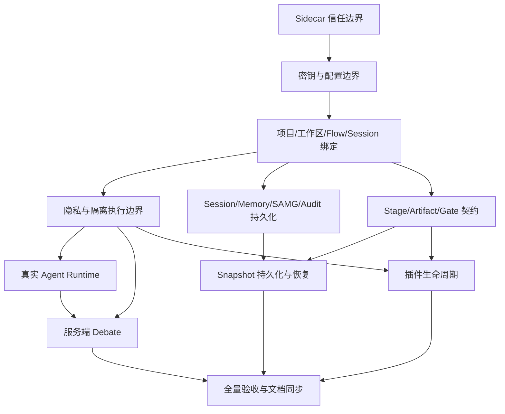

# CodeFlow 后端用户功能闭环问题清单与串行实施计划

> 创建：2026-08-18  
> 状态：Active  
> 范围：后端产品能力、数据一致性、安全边界、运行时；本轮不修改前端源码。  
> 依据：`docs/PROJECT_OVERVIEW.md`、`docs/design/2026-06-12-overall-roadmap.md`、`docs/design/flow-engine.md`、`docs/design/agent-quality-system.md`、`docs/design/plugin-system.md`、`docs/design/feature-parity-matrix.md`、`docs/plans/2026-07-11-codeflow-2.0-implementation-and-hardening-plan.md`、`docs/adr/0003-sqlite-cgo.md`。

## 1. 这份计划解决什么

CodeFlow 的设计目标不是“有一组 API”，而是让用户可以放心完成一条完整工作：

1. 启动桌面端后，只有本机的 CodeFlow 客户端能访问这个 sidecar。
2. 用户配置模型后，密钥不会在配置页面、普通数据库、日志或错误响应中泄露。
3. 用户创建或导入项目后，项目、工作目录、默认 Flow、会话和后续产物属于同一个可恢复的项目。
4. 用户必须交付当前阶段真正需要的结果，才能推进；回跳会明确哪些结果仍然有效、哪些已经过期。
5. 重启应用或回到历史检查点后，用户看到的是原来的对话、记忆、图谱和代码状态，而不是一个“恢复成功”的提示。
6. 用户创建的自定义 Agent 会真的使用自己的模型、提示词、Skill 和 MCP，而不是只出现在列表里。
7. 发起辩论后，服务端真正调用参与方 Agent；用户不需要把 Generator/Critic 的答案伪装成服务端执行结果。
8. 插件的安装、启用、停用和卸载与它贡献的模板、守卫和 Skill 同步，失败时不会留下半套能力。
9. 文件写入、外部发送、进程启动和敏感信息处理都有同一套可解释的权限和审计结果。

当前代码已经有不少底座，但这些用户结果尚未形成一条可信的后端闭环。本计划把“看起来已实现”和“用户可以依赖”分开，并按依赖顺序逐项补齐。

## 2. 当前事实与用户影响

下表只记录已在当前工作树中核对到的事实。状态描述不把目标态文档当成实现证据。

| 编号 | 当前事实 | 用户实际感受 | 优先级 |
|---|---|---|---|
| P-01 | `cmd/codeflow-server/main.go` 默认端口为动态端口；`api.Server.RunContext` 使用 `":" + port` 监听所有网卡。CORS 的 `AllowOriginFunc` 和 WebSocket `CheckOrigin` 都无条件返回 `true`。没有启动令牌或 API 鉴权中间件。 | 同一局域网中的程序可以探测、调用或订阅本地 CodeFlow。 | P0 |
| P-02 | `config.APIChannel.APIKey` 带有 JSON/YAML 字段；配置 handler 将完整配置直接响应；SQLite `config_json` 直接保存配置对象。 | API Key 可能出现在响应、数据库备份、错误转储和调试日志中。 | P0 |
| P-03 | workspace handler 每次从 query/body/header 接收 `root`；`CODEFLOW_WORKSPACE_ROOTS` 未配置时默认不限制根目录。 | 客户端可以把工作目录换成任意路径，项目和文件操作没有服务端权威归属。 | P0 |
| P-04 | project 表没有 workspace root、默认 flow、默认 session 的正式字段；项目创建通过两个 SQLite 服务做补偿式创建，崩溃窗口仍可能留下孤立 Flow。 | 重启、迁移目录或并发创建时，项目列表、Flow 和会话可能互相对不上。 | P0 |
| P-05 | `floweng.Advance` 只检查 Gate；内置阶段使用 auto exit gate。当前阶段的 draft artifact 会在完成时自动改成 approved，阶段没有按类型要求的产物契约。 | 用户可以在没有 idea/design/plan/review 等结果时一路点到提交。 | P0 |
| P-06 | Flow 已有 SQLite JSON 存储，但主程序使用 `NewInMemorySnapshotService`；默认 snapshot provider 的 Git 根目录是 `"."`，Git restore 仍由环境变量决定，且成功结果可代表“未执行破坏性恢复”。 | 回跳依赖进程内数据，重启后快照消失；恢复的 Git 语义不直观。 | P0 |
| P-07 | `agent` 运行时服务是内存实现；路由只有 trace/stop/retry/stream，stream 只升级 WebSocket，没有接收消息并调用 adapter 的聊天入口。Agent Registry 的资产与运行时 Agent 没有绑定。 | 自定义 Agent 可以创建和编辑，但不能作为真正的工作 Agent 使用。 | P0 |
| P-08 | `debate.NextRound` 接收客户端提交的 `generator_output` 和 `critic_feedback`；服务端只做冲突关键词检测和持久化。 | 辩论结果取决于客户端是否诚实提交文本，而不是参与方 Agent 的执行。 | P1 |
| P-09 | `privacy` 与 `isolation` 没有接入 `main` 的生产 bootstrap；隐私服务的标准加密仍是 AES-CBC；外发、文件写入、进程启动没有一条强制的统一策略链。 | “隐私/沙箱”页面可能有接口，但正常启动后不可用或无法覆盖真实路径。 | P0 |
| P-10 | Plugin `Service.Install/Toggle` 管理 integration/hook；`ContributionRegistry` 是内存对象，未与安装/启停/卸载事务绑定，stage type 和 gate validator 仍不存在。 | 插件显示已安装，不代表它的模板/规则/Skill 已注册；停用后贡献可能仍在。 | P1 |
| P-11 | 普通 memory 和 SAMG 默认可懒加载为内存服务；部分全局 Get/Set 未同步或未在启动时显式注入。Audit 有文件哈希链，但不是所有敏感操作都强制记录，轮转后的链连续性和保留策略没有产品语义。 | 重启后记忆可能丢失；用户无法完整回答“谁在何时以什么权限做了什么”。 | P1 |
| P-12 | OpenAPI、feature parity 与旧的 overview 文档分别记录过不同时间点的状态；新建项目、Agent 编排等上一轮成果尚未全部转成后端用户契约和状态说明。 | 前端或第三方调用方只能猜哪些状态可信，错误恢复也没有统一约定。 | P1 |

## 3. 目标用户闭环

### 3.1 新建、导入与恢复项目

用户选择一个目录或导入来源后，服务端完成以下关系：

```text
Project
 ├─ authoritative workspace root
 ├─ default Flow (template + immutable template version)
 ├─ default Session / conversation
 ├─ stage artifacts and approvals
 ├─ snapshots / restore operations
 └─ audit chain and policy decisions
```

项目 API 不再接受一个可以随意替换的“当前工作目录”。目录由项目绑定，所有 workspace、Git、snapshot、dev-server 和 Agent 写入都从项目 ID 解析。

导入已有目录、从 Git URL 导入、重新打开旧项目、复制项目为实验分支、归档和删除都必须有明确状态；本轮优先完成已有目录绑定和重启恢复，Git clone/远程凭据属于后续扩展。

### 3.2 阶段推进与回跳

阶段完成不是一个按钮状态，而是一个可验证的交付契约：

| 阶段 | 最低后端结果 | 推进前必须确认 |
|---|---|---|
| Idea | 当前 Flow 的 `idea` artifact，包含目标、约束和成功标准 | 内容存在、版本有效、未 stale |
| Design | `design` artifact，可关联 ADR/决策 | Idea 未过期，设计产物可读 |
| Planning | 项目 Plan/Task 引用及版本 | 计划属于当前项目，关键任务有状态 |
| Research | 可选；若启用则需要研究报告和证据引用 | 报告与当前目标关联 |
| Coding | 变更集或明确的无代码变更说明 | workspace 写入已通过守卫，变更可追踪 |
| Review | review report、测试/检查结果或明确豁免 | 未解决的阻断问题为零，豁免已审批 |
| Submit | 提交/归档报告与最终快照引用 | 所有上游产物新鲜，审计记录完整 |

缺少结果时返回结构化的 `stage_blocked`，列出缺什么、谁可以补、补齐后如何重试。上游回跳会增加版本并标记下游 artifact stale，不能默默沿用旧结果。

### 3.3 自定义 Agent 与流程编排

用户创建 Agent 资产后，选择模型/渠道、提示词、Skill、MCP、阶段标签和预算；将它绑定到模板阶段或运行中的阶段。运行时必须按绑定解析配置，停用或删除时明确回退到哪个 Agent，并将回退写入审计。

每次聊天、阶段任务、重试和辩论都产生一个可查询的执行记录：输入、采用的 Agent 版本、模型/渠道、工具调用、输出、费用/Token、停止原因和最终状态。客户端只负责发起意图和显示事件，不负责伪造执行结果。

### 3.4 安全、隐私与可解释性

默认拒绝外部访问、未授权 workspace、未知插件贡献和未经审批的危险操作。用户可以在明确的安全页面查看：当前 sidecar 身份、项目根、外发策略、Agent 权限、插件权限、豁免和审计记录。错误信息要能告诉用户下一步，而不是暴露密钥或内部堆栈。

## 4. 本轮范围与明确不做

### 本轮要做

- 只修改 `backend/`、后端测试、OpenAPI、ADR、`docs/plans` 和必要的设计状态文档。
- 把上述用户闭环落成服务端权威模型、持久化、权限边界和测试。
- 为未来前端写清请求、响应、状态、事件和错误契约，但不改 `apps/workbench`。
- 每个阶段完成后更新旧实施计划和 feature parity matrix，状态以测试和重启验证为准。

### 本轮不做

- 不修改 React/Tauri 页面、组件、stores、适配器或视觉设计。
- 不为了“兼容所有旧调用”保留明显错误的安全默认值；兼容层必须有明确的过渡期限。
- 不在本轮迁移 `modernc.org/sqlite`；遵守 ADR 0003 的 `go-sqlite3 + CGO_ENABLED=1` 基线。
- 不实现完整手机端、Live Preview UI、插件市场 UI 或模型供应商的新 SDK；只提供它们真正需要的后端契约。

## 5. 后端串行实施阶段

执行纪律：一次只派一个子代理；代理交付后由主代理检查 diff、运行聚焦测试和必要的重启/E2E 验证；验证通过才派下一阶段。两个已恢复的原始子代理轮流承接阶段，不再启用后启动的 retry 线程。

### B1：Sidecar 信任边界

**用户结果**：本地服务只在 loopback 工作；请求需要本次启动的令牌；浏览器 Origin 精确匹配；WebSocket 与 HTTP 使用同一身份和主题权限。

**修改范围**：`backend/cmd/codeflow-server/main.go`、`backend/internal/api`、`backend/internal/api/middleware`、`backend/internal/websocket`、启动协议测试、必要 ADR（建议 `docs/adr/0004-sidecar-trust-boundary.md`）。

**要求**：

- 默认监听 `127.0.0.1`，显式远程模式必须单独配置并拒绝使用 sidecar 默认令牌。
- 启动时生成或接收高熵 token；通过 sidecar 启动输出/受控握手交给未来客户端，不放进普通 API 响应。
- 除健康检查和明确的启动握手外，HTTP API 缺少 token 返回 401；错误响应不包含 token。
- CORS 只允许配置中的精确 Origin，禁止 `*` 与任意回调。
- WebSocket 必须验证 token、Origin、session/project topic 权限；不能只依赖 `CheckOrigin`。
- 增加认证、Origin、WebSocket、监听地址和失效 token 测试；开发测试 router 可以显式注入测试 token。

**未来前端契约**：启动握手返回 `port`、`token`、过期时间和协议版本；HTTP 使用 `Authorization: Bearer`；WebSocket 使用受支持的子协议或短期 ticket；客户端不把长期 token 写入 localStorage。

**完成门禁**：未授权 HTTP/WS 全部拒绝；loopback 外部绑定测试失败；精确允许的桌面 Origin 仍可用；重启后旧 token 失效。

### B2：密钥与配置边界

**用户结果**：用户可以保存和切换模型渠道，但任何读取配置的接口只返回脱敏信息；API Key 不进入普通配置 JSON、日志、审计详情或错误堆栈。

**修改范围**：`backend/internal/config`、`backend/internal/api/handlers/config.go`、PAPI/adapter 构造链、迁移工具、测试、ADR（如需要）。

**要求**：

- 引入明确的 `SecretStore` 接口；优先使用系统钥匙串，无法使用时使用独立的加密 secrets store，不能把明文重新写回 `config_json`。
- 配置 DTO 分为写入模型、内部解析模型、公开读取模型；读取响应只给 `configured`、掩码、更新时间和引用 ID。
- 启动迁移旧配置中的 API Key：成功迁移后清除明文字段；失败则拒绝把旧明文继续当作可用配置并给出修复提示。
- adapter 只从 SecretStore 取当前 key；禁止在日志、审计和 panic 文本中记录 key。
- 更新/删除/轮换 SecretStore 记录是幂等操作并写审计；密钥轮换不影响正在运行的请求。

**未来前端契约**：读取返回 `secret_status` 和 `masked_value`；写入可以只提交新 secret；旧 secret 不回显；配置热切换返回版本号和健康检查结果。

**完成门禁**：响应、数据库、日志扫描均无明文 key；重启后仍能使用已保存的 secret；迁移失败为 fail-closed。

### B3：Project / Workspace / Flow / Session 权威绑定

Implementation note (2026-08-19): creation is a forward-only durable saga;
archive and restore use a separate lifecycle journal. Startup resumes incomplete
steps, stops process-local workspace runtimes during archive, retains Session and
Flow history, and creates a fresh runnable default Flow when restoring a project
whose prior default Flow is terminal. New workspace roots fail closed without
`CODEFLOW_WORKSPACE_ROOTS`, unless the explicit
`CODEFLOW_ALLOW_UNRESTRICTED_WORKSPACE_BINDING=1` migration switch is set.

**用户结果**：打开项目即可恢复上次工作目录、Flow 和会话；所有文件、Git、快照和 Agent 任务都指向同一个项目根。

**修改范围**：`backend/internal/project`、`backend/internal/workspace`、`backend/internal/floweng`、session/agent 存储、项目 handler、数据库迁移和启动恢复。

**要求**：

- Project 增加规范化后的 workspace root、默认 flow ID、默认 session ID 和绑定状态；路径在服务端 canonicalize 并检查允许根。
- workspace API 改为 `project_id + relative_path` 为主；保留旧 root 参数仅作短期迁移并默认拒绝任意新根。
- 创建、删除、恢复项目使用可恢复的 operation/journal；跨 SQLite 服务崩溃后启动时能完成或回滚 saga，不留下用户看不见的 Flow。
- 新建项目自动创建一个默认 session；创建响应包含 Flow/Session 的真实状态，重复请求使用幂等键。
- 项目删除先进入可恢复的 archived/deleting 状态，确认后才清理 Flow、workspace watcher、dev-server 和 session 引用。
- 增加“绑定现有目录”的后端能力；Git clone、远程凭据和目录选择 UI 留给后续前端契约。

**未来前端契约**：创建/打开返回 `workspace_binding`、`flow_id`、`session_id`、`recovery_state`；目录错误返回可执行原因（不存在、超出允许根、已被其他项目绑定）。

**完成门禁**：请求不能越过项目根；服务重启后项目、Flow、Session 一致；模拟进程中断后无孤儿或重复默认资源。

### B4：统一隐私、外发与隔离执行边界

**状态（2026-08-19）**：✅ 已完成。实现证据见 ADR 0007 与
`docs/plans/2026-08-19-b4-unified-execution-boundary-completion.md`。

**用户结果**：聊天发送、文件写入、程序启动和插件调用都经过同一套可查询策略；没有配置好的隐私/隔离服务时，危险操作拒绝而不是悄悄放行。

**修改范围**：`backend/internal/privacy`、`backend/internal/isolation`、`backend/internal/adapters`、`workspace`、`hooks`、`plugin`、bootstrap/main、相关 handler。

**要求**：

- 在生产 bootstrap 显式初始化 privacy/isolation，并让所有外发、响应接收、workspace 写入、dev-server/进程启动和插件运行时调用经过策略检查。
- 默认策略是项目级、可审计、fail-closed；测试和明确的本地开发模式可以注入 fake policy。
- 将新加密数据迁移到 AEAD（AES-GCM 或同等方案）；保留旧 CBC 只读解密和一次性迁移，禁止继续产生 CBC 新数据。
- 策略决定包含 allow/deny、原因、规则版本、项目/Agent/插件身份和审计 ID；不在错误中暴露原文 secret。
- 移除只有 handler 可调用、实际路径可绕过的“展示型检查”。

**未来前端契约**：每次被拦截操作返回可读原因、所需权限和审批 ID；策略更新返回版本；不要求前端理解具体加密算法。

**完成门禁**：未初始化服务不会返回成功；adapter、workspace、进程和插件的绕过测试全部失败；CBC 新写入为零；拒绝决策可在审计中追踪。

### B5：持久化 Session、Memory、SAMG 与审计基础

**用户结果**：重启后对话、记忆、图谱和审计记录仍在；服务不会因为懒加载顺序而换成另一套空内存数据。

**修改范围**：`backend/internal/agent`、`memory`、`samg`、`audit`、`bootstrap`、`cmd/codeflow-server/main.go`、数据库迁移。

**要求**：

- Session、conversation、message/trace 使用明确的 SQLite 持久化接口；停止、重试和删除有真实状态。
- 主程序显式注入持久化 memory vector store 与 SAMG store；去掉生产默认的隐式内存 fallback。测试使用显式 in-memory 实现。
- 全局 Get/Set 只保留有期限的兼容层；初始化一次、并发安全且可观测，不能无锁 lazy singleton。
- Audit 成为所有状态改变的权威链：配置/secret、项目绑定、Flow、Agent、workspace、外发、插件、审批、快照都记录 actor、资源、结果和版本。
- 设计保留/删除语义：敏感内容可删除或脱敏，但链上保留不可逆的删除事件；日志轮转不能让现存链验证失去明确语义。

**完成门禁**：停止并重启服务后能读回会话/记忆/图谱；并发初始化只有一个实例；关键 API 的成功和失败都有审计记录；审计验证和保留策略测试通过。

**B5 completion (2026-08-19)**: production now explicitly injects durable Session/message, conversation/trace, Memory/Atomic/vector/Raw Archive, and SAMG graph/access stores. Compatibility getters do not create empty in-memory state. Audit startup fails closed on corruption, rotation persists a retained-chain anchor, and every authenticated mutation emits a baseline success/failure record. `CGO_ENABLED=0 go test ./... -run '^$'` passes; SQLite runtime specifications remain for the B11 CGO runner because this Windows host has no `gcc`. See ADR 0008.

### B6：Stage / Artifact / Gate 完成契约

**用户结果**：阶段推进反映真实交付，而不是只改变状态字段；用户能知道缺什么和如何补齐。

**修改范围**：`backend/internal/floweng`、`project/planner` 集成、artifact 存储/读取、Flow handlers、OpenAPI、测试。

**要求**：

- 为内置七阶段定义服务端完成契约和版本，模板可覆盖但不能删除最低安全条件。
- `Advance/Skip/Loop` 统一执行：项目绑定、active stage、enter/exit gate、artifact 新鲜度、workspace/guard 状态、执行锁和审计。
- 删除“所有 draft 在 Advance 时自动 approved”的无条件行为；只有通过阶段契约和审批才可批准。
- Artifact 绑定 project/flow/stage/session、作者、版本、content ref、digest、状态和 stale 原因；重复上传幂等。
- Gate 返回结构化 blocked 清单；人工审批、Agent 检查、自动检查各有来源和证据引用。
- Loop 只允许模板声明的边；上游回跳生成新的阶段版本并使下游产物 stale。

**未来前端契约**：`advance` 返回 `status: advanced|blocked|waiting_gate`、`missing_requirements`、`stale_artifacts`、`next_stage` 和 `audit_id`；不通过时不需要解析错误字符串。

**完成门禁**：空 Flow 不能直接完成；七阶段正向流程、可选调研、Gate 拒绝/批准、上游回跳和重复请求均有测试。

### B7：持久化 Snapshot 与可恢复回滚

**用户结果**：用户可以在重启后查看检查点、预检差异并恢复；危险 Git 操作明确确认且不会伪装成成功。

**修改范围**：`backend/internal/snapshot`、`floweng` snapshot hook/restorer、`git`、项目绑定、数据库、API、测试。

**要求**：

- Snapshot 记录 project/flow/stage/session/workspace binding、schema version、可恢复 payload/blob、digest、创建者和保留策略；不能只存在内存。
- conversation/vector/graph 使用持久化引用；恢复是事务/操作记录，可查询进度、失败原因和一致性校验结果。
- Git 根目录来自项目绑定；默认只做预检和非破坏恢复。`AllowDestructiveGit` 必须是一次性明确选项，检查 dirty tree、执行锁、审计和二次确认。
- 恢复失败时报告每个子状态，不把“未启用 Git restore”报告为 Git 已恢复；支持重试或回滚操作本身。
- Flow loop 使用目标阶段快照；服务重启后仍能完成 loop restore，并发恢复互斥。

**未来前端契约**：提供快照列表、预检 diff、restore operation、逐项结果和 `flow.restored` 事件；前端不直接拼接 Git 命令。

**完成门禁**：创建→修改→重启→恢复→重新 capture 的 digest 一致；中断恢复可重试；dirty tree 和越权根目录被拒绝；旧 digest-only token 明确不可恢复。

### B8：真实 Agent Runtime 与自定义 Agent 生效

**用户结果**：用户发送一条消息，指定的 Agent 真正调用绑定的模型/渠道；可以流式查看、停止、重试、查看历史和预算。

**修改范围**：`backend/internal/agent`、`adapters`、`commander`、`agent registry`、`skill`、MCP/isolation、API/WS、持久化执行记录。

**要求**：

- 增加真实的 chat/execute 服务和流式事件协议；adapter 生命周期由服务管理，不能每次启动后立刻关闭或只保存模型名称。
- 根据优先级解析 Agent：项目阶段绑定 > 用户本次选择 > 默认阶段推荐 > 明确的安全回退；被停用/删除时返回回退原因。
- 运行时加载 Agent 版本、SystemPrompt、模型/渠道、Temperature/Token、Skill/MCP 挂载和策略版本；配置热切换只影响新执行。
- Stop 是可取消的 context/adapter 操作；Retry 生成新的 attempt 并引用原 attempt；历史保留输入、输出、工具、费用、错误和取消原因。
- 设定项目/会话/Agent 的预算和并发；达到上限返回可恢复的 `budget_exceeded`，不静默换模型。
- 每次执行增加 usage、审计和 trace；输出经 privacy policy 后才能写入 memory/artifact。

**未来前端契约**：`POST /api/v1/agents/chat` 返回 execution ID；SSE/WS 事件包含 `queued|running|delta|tool_call|completed|failed|cancelled`；GET execution 可在断线后恢复。

**完成门禁**：fake adapter 可证明选择的 Agent/model/channel；真实 adapter smoke 能收到一条消息；断线、停止、重试、历史、预算和安全拦截均有测试。

### B9：服务端多方 Debate 执行

**用户结果**：创建辩论只提交议题和参与者，服务端按每方绑定执行多轮；结论能回流到当前 Flow 的 artifact。

**修改范围**：`backend/internal/debate`、Agent Runtime、Flow/artifact、API/WS、持久化和测试。

**要求**：

- Parties 为 2..N，每方绑定 Agent 资产版本、模型/渠道和策略；服务端产生每方 contribution，不接受客户端冒充最终输出。
- 轮次、超时、取消、预算和失败转移有状态；单方失败不能把整场标成成功。
- 共识策略可选仲裁、投票或用户终裁；resolution artifact 绑定发起的 flow/stage，并写入 SAMG/审计（经隐私策略）。
- Gate `escalate_to_debate` 使用同一 runtime，不再固定两个 builtin 字符串。
- 保留旧 API 读兼容，但旧的“直接提交 generator/critic 文本”进入过渡状态并给出弃用记录。

**完成门禁**：三方不同模型 fake runtime 的端到端执行、部分失败、用户终裁、Gate 升级和 resolution artifact 均有测试。

### B10：插件完整生命周期与贡献点事务

**用户结果**：发现、验证、安装、启用、停用、卸载插件时，贡献能力与插件状态一致；权限不匹配或运行失败会自动回滚并隔离插件。

**修改范围**：`backend/internal/plugin`、`integration`、`floweng`、`guard`、`skill`、`isolation`、持久化、API、OpenAPI、测试。

**要求**：

- 实现 `discover → validate → register → enable/disable → unregister` 的真实闭环；ContributionRegistry 持久化并按 plugin/version 记录。
- install 与贡献注册是同一可恢复操作；失败时撤销已注册模板、规则、Skill 和 hook；uninstall 反向执行并留下审计。
- `stage_type`、`gate_validator` 采用注册表，运行时 handler 在 isolation 中执行；未知贡献类型拒绝而不忽略。
- 权限清单覆盖贡献类型和操作范围；插件只能访问它声明且策略允许的项目资源；签名/验证状态进入决策。
- 停用插件会停止新执行、取消或隔离正在运行的任务，并明确现有 Flow 使用的模板版本不被悄悄改变。

**未来前端契约**：安装预览返回权限/贡献/迁移清单；每一步有 operation ID；失败返回已回滚项和需人工处理项；模板版本可比较。

**完成门禁**：示例插件的安装、启停、贡献查询、故障回滚、重启恢复和沙箱越权测试通过。

### B11：全量后端验收与文档同步

**用户结果**：从新建项目到提交、回跳、辩论和重启恢复的路径可重复；接口和状态文档不再超前或滞后于实现。

**范围**：后端真实 E2E、重启脚本、OpenAPI、WS schema、旧计划、feature parity、相关 ADR。

**验收路径**：

1. 启动 sidecar，验证 loopback、token、Origin 和 WS 主题权限。
2. 创建项目并绑定临时 workspace；重启后读取同一 Flow/Session。
3. Idea → Design → Planning →（可选 Research）→ Coding → Review → Submit；每阶段缺产物时确认结构化阻塞。
4. 用自定义 Agent 执行一条消息、停止一次、重试一次，验证模型/Skill/MCP/预算/审计。
5. 触发 Review Gate 辩论，服务端执行 3 方 fake Agent，产出 resolution artifact。
6. 创建快照、修改文件/记忆/图谱、重启、预检并恢复；验证 stale 与 digest。
7. 安装示例插件、启用/停用/卸载，确认贡献点和审计一致。
8. 运行 CGO=1 的后端单测、集成测、竞态测试、OpenAPI/WS 契约检查和仓库卫生检查。

## 6. 阶段依赖



如果某阶段验证失败，不跳过它去做后续阶段；先修复或记录明确的外部阻塞。不同阶段可以在代码上共用抽象，但派发和验收仍然串行。

## 7. 子代理派发格式

每次交给 Sol `xhigh` 子代理的任务必须自包含，包含以下内容：

```text
你负责 Bx，不改前端。
用户结果：...
当前事实：引用本计划中的 P-xx 和真实文件/符号。
必须实现：...
必须保留：OpenAPI 路径、CGO/SQLite 基线、未提交用户文件。
必须测试：列出聚焦单测、集成测、重启/E2E 或安全测试。
交付报告：改动文件、用户行为、测试输出、已知剩余风险、下一阶段前置条件。
```

主代理的复核顺序固定为：

1. `git diff --check`、读取所有改动文件和测试；确认没有修改 `apps/workbench`。
2. 运行该阶段聚焦测试，再运行受影响的后端契约检查；需要时使用 `CGO_ENABLED=1`。
3. 检查数据库迁移、重启恢复、错误状态和审计证据，不把“返回 200”当成闭环证明。
4. 更新本计划的阶段状态、`docs/plans/2026-07-11-codeflow-2.0-implementation-and-hardening-plan.md`、`docs/design/feature-parity-matrix.md` 和相关 ADR。
5. 只有门禁全部通过，才唤醒下一个已恢复的原始子代理。

## 8. 未来前端需要的统一契约（只记录，不实现）

| 领域 | 前端需要读取/发送 | 关键状态/事件 |
|---|---|---|
| 启动 | sidecar handshake、token、protocol version | `ready`, `auth_expired`, `server_restarting` |
| 项目 | project ID、workspace binding、flow/session、recovery state | `binding_failed`, `recovery_required` |
| Flow | stage contract、artifact、gate、missing requirements、stale reason | `stage.blocked`, `stage.active`, `artifact.stale`, `flow.restored` |
| Agent | asset version、effective binding、execution ID、history | `queued`, `delta`, `tool_call`, `completed`, `cancelled`, `budget_exceeded` |
| Debate | parties、per-party model/channel、round contributions、consensus | `round.started`, `contribution`, `conflict`, `resolution` |
| Workspace | project-relative path、guard decision、staging/promote result | `write.allowed`, `write.blocked`, `watch.changed` |
| Plugin | manifest、permissions、contribution preview、operation | `install.step`, `rollback`, `quarantined` |
| Privacy/Audit | policy decision、approval ID、audit ID、masked secrets | `policy.denied`, `approval.pending`, `audit.appended` |

前端后续只需要依赖这些稳定的业务状态，不应再从错误字符串、任意 workspace root 或客户端生成的 Agent 文本推断后端真相。

## 9. 值得加入的后续产品能力

这些想法不阻塞 B1-B11，但应保留在路线图中：

- **实验分支**：从任意快照复制一个实验 Flow，比较两次 Agent 执行和产物差异，选择结果合并回主 Flow。
- **可携带项目包**：导出项目描述、Flow、产物、审计摘要和脱敏记忆；在另一台机器导入后继续工作。
- **Agent 试验场**：在临时 workspace 中用固定预算和只读数据运行自定义 Agent，展示工具调用和失败原因后再发布。
- **成本与时间预算**：按项目、阶段、Agent、插件设置预算，提供预计消耗和超限后的用户选择，而不是静默降级模型。
- **离线私密模式**：禁用联网 Provider，只允许本地模型和本地索引，明确哪些能力因此不可用。
- **批量审批与定时运行**：用户可以一次审批一组低风险 Gate，或在明确窗口运行夜间调研/测试，并保留可撤销的操作队列。
- **可解释回放**：按用户视角重放“输入 → Agent → 工具 → 文件 → Gate → 产物”的因果链，而不是仅显示日志列表。

这些能力必须复用本计划中的项目绑定、执行记录、策略和快照，不另起一套隐含状态。

## 10. 回滚与风险

- 数据库迁移采用向前兼容 schema 版本；每阶段保留旧读路径直到重启/E2E 通过，再删除错误的写路径。
- 安全边界、secret store、workspace 绑定和 snapshot 恢复都提供明确的 migration/rollback 命令或操作记录；禁止用 `git reset --hard` 或删除用户目录作为回滚。
- 跨服务事务优先使用 operation journal + 补偿动作；恢复失败留在可查询的 `failed` 状态，不假装已完成。
- 任何兼容开关必须记录默认值、启用条件和移除日期；不以“开发方便”为理由把生产默认改回任意 Origin、无 token 或任意 workspace。
- 当前工作树未提交的前端改动、`outputs/*.html` 和 `.tmp/` 均不属于本计划的清理对象。

## 11. 进度记录

| 日期 | 阶段 | 状态 | 证据 |
|---|---|---|---|
| 2026-08-18 | 问题清单与计划 | ✅ 文档完成 | 本文；已核对启动链、配置、项目、Flow、Snapshot、Agent、Debate、Privacy、Isolation、Plugin、Memory、Audit |
| 2026-08-18 | B1 Sidecar 信任边界 | ✅ 已完成 | 默认 loopback；256-bit 进程令牌与启动握手；HTTP/WS 认证；精确 Origin；会话/辩论/项目 scope；聚焦测试通过；ADR 0004 |
| 2026-08-19 | B2 密钥与配置边界 | ✅ 已完成 | SecretStore（Windows DPAPI，非 Windows 使用外部 master key 的 AES-256-GCM）；公开/写入 DTO 分离；旧 `config_json.api_key` 启动迁移并 fail-closed；OpenAPI writeOnly；配置、迁移、轮换/删除和运行时解析测试通过；ADR 0005 |
| 2026-08-19 | B3 Project / Workspace / Flow / Session 绑定 | ✅ 已完成 | 权威项目绑定、前向创建恢复日志、可恢复归档/恢复和运行时清理；ADR 0006 |
| 2026-08-19 | B4 隐私、外发与隔离执行边界 | ✅ 已完成 | 统一版本化策略覆盖 adapter/workspace/process/hook/plugin；拒绝可审计；AES-256-GCM 新写入与 CBC 只读迁移；ADR 0007 |
| 2026-08-19 | B5 Session / Memory / SAMG / Audit 持久化 | ✅ 已完成 | 显式 durable bootstrap；无隐式内存 fallback；重启/并发/分页/损坏规格；审计轮转锚点；ADR 0008 |
| 2026-08-19 | B6-B11 | ⏳ 待处理 | 必须按依赖顺序推进 |

B1 验收证据：

- `go test ./internal/api/middleware ./internal/websocket ./internal/api ./cmd/codeflow-server -run 'Test(AccessToken|WebSocket|Sidecar|GeneratedToken|RunContext|TopicSubscribe|LoadTrustConfig|ProposeSolutionRoute|CreateDebateWithOneParty)' -count=1` 通过。
- 旧 API 测试请求通过测试侧显式 Bearer 包装继续通过；生产 `Config` 中不存在无鉴权测试开关。
- `node scripts/check-api-contracts.mjs` 与 `node scripts/check-backend-routes.mjs` 通过；OpenAPI YAML 完整解析通过。
- 当前 Windows 环境没有 `gcc`，因此未把依赖 SQLite 的全量 `CGO_ENABLED=1` 测试冒充为已运行；B1 聚焦测试不依赖 SQLite，完整后端验收仍按 ADR 0003 在 B11 执行。

B2 验收证据：

- SecretStore 将凭据保存在独立加密文件；`APIChannel.APIKey` 为写入专用的瞬态字段，公开配置、解析配置和 `config_json` 只保留 `secret_ref`、状态、掩码和版本元数据。
- 启动会校验引用的 secret，并迁移旧 `config_json.api_key`；迁移、读取或元数据校验失败时拒绝继续使用旧明文（fail-closed），并清理孤儿引用。
- 启动和运行时解析同时执行 SecretStore `Get` + `Metadata`，校验引用、状态、版本和掩码一致性；配置管理器返回深拷贝，删除不存在的通道返回结构化错误。
- `go test ./internal/config ./internal/commander ./internal/api/handlers -run 'TestEncryptedFileSecretStore|TestConfigManagerStoresOnlySecretReference|TestSecretUpdateAndDeleteAreIdempotent|TestBuildAgentFromResolved|TestGlobalConfigAPI' -count=1` 通过；SQLite 相关测试因当前 Windows 环境没有 `gcc` 未运行。
- `backend/docs/openapi.yaml` 的全局配置 PUT 使用 `GlobalConfigWrite`，读取与响应使用 `GlobalConfigEnvelope`；`api_key` 标记为 `writeOnly`。

## 12. 相关文档同步责任

实现阶段完成时必须同步：

- `docs/plans/2026-07-11-codeflow-2.0-implementation-and-hardening-plan.md`：进度看板、对应里程碑和修订记录。
- `docs/design/feature-parity-matrix.md`：只把有用户可验证证据的能力从 `❌/⚠️` 改为 `✅`。
- `backend/docs/openapi.yaml`：所有新/变更 HTTP 契约的唯一源。
- `docs/adr/`：监听边界、secret store、项目绑定、恢复语义、加密迁移等重大取舍先记录再实现。
- 未来前端契约只写在本文和相关设计文档，不以修改 `apps/workbench` 代替后端完成。
